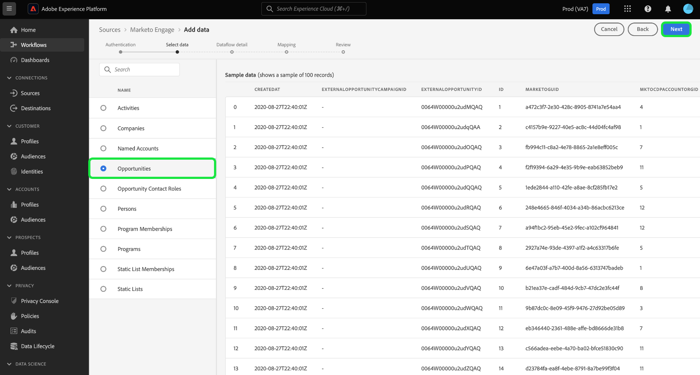
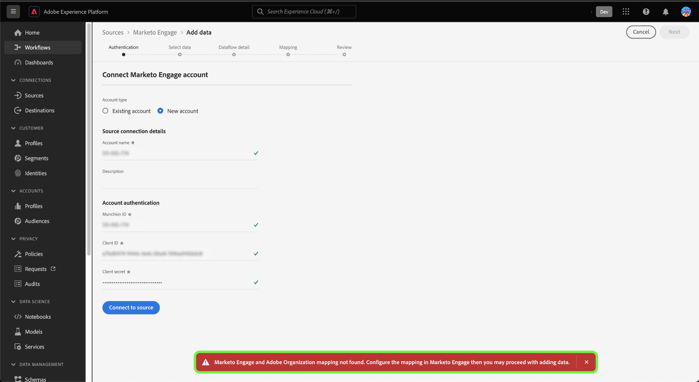

# Skapa en [!DNL Marketo Engage]-källanslutning och ett dataflöde i användargränssnittet

>[!IMPORTANT]
>
>Innan du skapar en [!DNL Marketo Engage]-källanslutning och ett dataflöde måste du först kontrollera att du har [mappat ditt Adobe-organisations-ID](https://experienceleague.adobe.com/docs/marketo/using/product-docs/core-marketo-concepts/miscellaneous/set-up-adobe-organization-mapping.html?lang=sv-SE) i [!DNL Marketo]. Dessutom måste du se till att du har fyllt i [B2B-namnutrymmen och scheman ](../../../../connectors/adobe-applications/marketo/marketo-namespaces.md) automatiskt innan du skapar en källanslutning och ett dataflöde. [!DNL Marketo] 

I den här självstudiekursen beskrivs hur du skapar en [!DNL Marketo Engage]-källkoppling (kallas nedan [!DNL Marketo]) i användargränssnittet för att hämta B2B-data till Adobe Experience Platform.

## Kom igång

Den här självstudiekursen kräver en fungerande förståelse av följande komponenter i Adobe Experience Platform:

* [Verktyget för automatisk generering av B2B-namnutrymmen och scheman](../../../../connectors/adobe-applications/marketo/marketo-namespaces.md): Med verktyget för automatisk generering av B2B-namnutrymmen och scheman kan du använda [!DNL Postman] för att automatiskt generera värden för B2B-namnutrymmen och scheman. Du måste slutföra B2B-namnutrymmen och scheman först innan du skapar en [!DNL Marketo]-källanslutning och ett dataflöde.
* [Källor](../../../../home.md): Med Experience Platform kan data hämtas från olika källor samtidigt som du kan strukturera, etikettera och förbättra inkommande data med hjälp av Experience Platform tjänster.
* [Experience Data Model (XDM)](../../../../../xdm/home.md): Det standardiserade ramverk som Experience Platform organiserar kundupplevelsedata med.
   * [Skapa och redigera scheman i användargränssnittet](../../../../../xdm/ui/resources/schemas.md): Lär dig hur du skapar och redigerar scheman i användargränssnittet.
* [Identitetsnamnutrymmen](../../../../../identity-service/features/namespaces.md): Identitetsnamnutrymmen är en komponent i [!DNL Identity Service] som fungerar som indikatorer för det sammanhang som en identitet relateras till. En fullständigt kvalificerad identitet innehåller ett ID-värde och ett namnutrymme.
* [[!DNL Real-Time Customer Profile]](/help/profile/home.md): Tillhandahåller en enhetlig konsumentprofil i realtid baserad på aggregerade data från flera källor.
* [Sandlådor](../../../../../sandboxes/home.md): Experience Platform tillhandahåller virtuella sandlådor som partitionerar en enda Experience Platform-instans till separata virtuella miljöer för att utveckla och utveckla program för digitala upplevelser.

### Samla in nödvändiga inloggningsuppgifter

Du måste ange följande värden för att komma åt ditt [!DNL Marketo]-konto på Experience Platform:

| Autentiseringsuppgifter | Beskrivning |
| ---- | ---- |
| `munchkinId` | Munchkin-id:t är den unika identifieraren för en specifik [!DNL Marketo]-instans. |
| `clientId` | Det unika klient-ID:t för din [!DNL Marketo]-instans. |
| `clientSecret` | Den unika klienthemligheten för din [!DNL Marketo]-instans. |

Mer information om hur du hämtar dessa värden finns i [[!DNL Marketo] autentiseringsguiden](../../../../connectors/adobe-applications/marketo/marketo-auth.md).

När du har samlat in dina inloggningsuppgifter kan du följa stegen i nästa avsnitt.

## Anslut ditt [!DNL Marketo]-konto

I Experience Platform-gränssnittet väljer du **[!UICONTROL Sources]** i den vänstra navigeringen för att komma åt arbetsytan i [!UICONTROL Sources]. Du kan välja lämplig kategori i katalogen till vänster på skärmen. Du kan också hitta den källa du vill arbeta med med med sökalternativet.

Under kategorin *Adobe-program* väljer du **[!UICONTROL Marketo Engage]** och sedan **[!UICONTROL Add data]**.

>[!TIP]
>
>Källor i källkatalogen visar alternativet **[!UICONTROL Set up]** när en angiven källa ännu inte har något autentiserat konto. När det finns ett autentiserat konto ändras det här alternativet till **[!UICONTROL Add data]**.

Sidan **[!UICONTROL Connect Marketo Engage account]** visas. På den här sidan kan du antingen använda ett nytt konto eller komma åt ett befintligt konto.

>[!BEGINTABS]

>[!TAB Skapa ett nytt konto]

Om du vill skapa ett nytt konto väljer du **[!UICONTROL New account]** och anger ett namn, en valfri beskrivning och dina autentiseringsuppgifter.

När du är klar väljer du **[!UICONTROL Connect to source]** och tillåt sedan lite tid för att upprätta den nya anslutningen.

>[!TAB Använd ett befintligt konto]

Om du vill använda ett befintligt konto väljer du **[!UICONTROL Existing account]** och sedan det konto som du vill använda i den befintliga kontokatalogen.

Välj **[!UICONTROL Next]** om du vill fortsätta.

>[!ENDTABS]

## Välj en datauppsättning

När du har skapat ditt [!DNL Marketo]-konto får du i nästa steg ett gränssnitt där du kan utforska [!DNL Marketo]-datauppsättningar.

Den vänstra halvan av gränssnittet är en katalogwebbläsare som visar datauppsättningarna på 10 [!DNL Marketo]. En fullt fungerande [!DNL Marketo]-källanslutning kräver att de nio olika datauppsättningarna matas in. Om du även använder kontobaserad marknadsföring [!DNL Marketo] (ABM) måste du också skapa ett 10:e dataflöde för att kunna importera [!UICONTROL Named Accounts]-datauppsättningen.

>[!NOTE]
>
>I följande självstudie används [!UICONTROL Opportunities] som exempel, men stegen som beskrivs nedan gäller för alla 10 [!DNL Marketo]-datauppsättningar.

Markera den datauppsättning som du vill importera. Detta uppdaterar gränssnittet så att en förhandsgranskning av datauppsättningen visas. När du är klar väljer du **[!UICONTROL Next]**.

## Ange information om datauppsättning och dataflöde {#provide-dataset-and-dataflow-details}

Därefter måste du ange information om datauppsättningen och dataflödet.

### Information om datauppsättning {#dataset-details}

En datauppsättning är en lagrings- och hanteringskonstruktion för en datamängd, vanligtvis en tabell, som innehåller ett schema (kolumner) och fält (rader). Data som har importerats till Experience Platform lagras i datasjön som datauppsättningar. Under det här steget kan du skapa en ny datauppsättning eller använda en befintlig datauppsättning.

>[!BEGINTABS]

>[!TAB Använd en ny datauppsättning]

Om du vill använda en ny datauppsättning väljer du **[!UICONTROL New dataset]** och anger sedan ett namn och en valfri beskrivning för datauppsättningen. Du måste också välja ett XDM-schema (Experience Data Model) som datauppsättningen följer.

>[!TAB Använd en befintlig datamängd]

Om du redan har en befintlig datauppsättning väljer du **[!UICONTROL Existing dataset]** och använder sedan alternativet **[!UICONTROL Advanced search]** för att visa ett fönster med alla datauppsättningar i organisationen, inklusive deras respektive information, t.ex. om de har aktiverats för förtäring i kundprofilen i realtid eller inte.

>[!ENDTABS]

### Dataflödeskonfigurationer {#dataflow-configurations}

>[!IMPORTANT]
>
>Källan [!DNL Marketo] använder batchinmatning för att importera alla historikposter och använder direktuppspelningsinmatning för realtidsuppdateringar. Detta gör att källan kan fortsätta direktuppspelningen samtidigt som felaktiga poster hämtas. Aktivera växlingsknappen **[!UICONTROL Partial ingestion]** och ange sedan [!UICONTROL Error threshold %] som maximalt för att förhindra att dataflödet misslyckas.

Om din datauppsättning är aktiverad för kundprofil i realtid kan du under det här steget växla **[!UICONTROL Profile dataset]** för att aktivera dina data för profilinmatning. Du kan också använda det här steget för att aktivera **[!UICONTROL Error diagnostics]** och **[!UICONTROL Partial ingestion]**.

* **[!UICONTROL Error diagnostics]**: Välj **[!UICONTROL Error diagnostics]** om du vill instruera källan att skapa feldiagnostik som du kan referera till senare när du övervakar datauppsättningsaktiviteten och dataflödesstatusen.
* **[!UICONTROL Partial ingestion]**: [Delvis gruppinmatning](../../../../../ingestion/batch-ingestion/partial.md) är möjligheten att importera data som innehåller fel, upp till ett visst konfigurerbart tröskelvärde. Med den här funktionen kan du importera alla korrekta data till Experience Platform, medan alla felaktiga data batchas separat med information om varför de är ogiltiga.

Under det här steget kan du aktivera **[!UICONTROL Sample dataflow]** för att begränsa datainmatningen och undvika extra kostnader som uppstår när alla historiska data hämtas, inklusive personidentiteter.

>[!BEGINSHADEBOX]

**Snabbguide om hur du använder exempeldataflöde**

Exempeldataflöde är en konfiguration som du kan ställa in för [!DNL Marketo]-dataflödet för att begränsa din inmatningsfrekvens och sedan testa Experience Platform-funktioner utan att behöva importera stora mängder data.

* Aktivera exempeldataflöde för att begränsa historiska data genom att importera upp till 100 kB (från det största post-ID:t) eller upp till de sista 10 dagarna i aktivitet under backfill-jobbet.
* När du använder exempeldataflödeskonfigurationen för alla B2B-entiteter måste du tänka på att det är möjligt att vissa relaterade poster saknas eftersom hela källdatahistoriken inte hämtas.

>[!ENDSHADEBOX]

Om du dessutom matar in data från företagsdatauppsättningen kan du aktivera **[!UICONTROL Exclude unclaimed accounts]** för att utesluta konton som inte tagits i anspråk från importen.

När enskilda fyller i ett formulär skapar [!DNL Marketo] en post för skenobjektskonto baserat på företagsnamnet som inte innehåller några andra data. För nya dataflöden är alternativet för att exkludera ej ianspråktagna konton aktiverat som standard. För befintliga dataflöden kan du aktivera eller inaktivera funktionen, med ändringar som gäller för nyinmatade data och inte befintliga data.

## Mappa dina [!DNL Marketo]-datakällfält till mål-XDM-fält

Steg [!UICONTROL Mapping] visas, och du får ett gränssnitt för att mappa källfälten från källschemat till rätt mål-XDM-fält i målschemat.

Varje [!DNL Marketo]-datauppsättning har sina egna specifika mappningsregler att följa. Mer information om hur du mappar [!DNL Marketo] datauppsättningar till XDM finns i följande:

* [Aktiviteter](../../../../connectors/adobe-applications/mapping/marketo.md#activities)
* [Program](../../../../connectors/adobe-applications/mapping/marketo.md#programs)
* [Programmedlemskap](../../../../connectors/adobe-applications/mapping/marketo.md#program-memberships)
* [Företag](../../../../connectors/adobe-applications/mapping/marketo.md#companies)
* [Statiska listor](../../../../connectors/adobe-applications/mapping/marketo.md#static-lists)
* [Statiska listmedlemskap](../../../../connectors/adobe-applications/mapping/marketo.md#static-list-memberships)
* [Namngivna konton](../../../../connectors/adobe-applications/mapping/marketo.md#named-accounts)
* [Möjligheter](../../../../connectors/adobe-applications/mapping/marketo.md#opportunities)
* [Kontaktroller för affärsmöjlighet](../../../../connectors/adobe-applications/mapping/marketo.md#opportunity-contact-roles)
* [Personer](../../../../connectors/adobe-applications/mapping/marketo.md#persons)

Beroende på dina behov kan du välja att mappa fält direkt eller använda förinställningsfunktioner för data för att omvandla källdata för att härleda beräknade eller beräknade värden. Mer information om hur du använder mappningsgränssnittet finns i [Användargränssnittshandboken för dataförberedelser](../../../../../data-prep/ui/mapping.md).

När mappningsuppsättningarna är klara väljer du **[!UICONTROL Next]** och tillåt en stund för att skapa det nya dataflödet.

## Granska ditt dataflöde

Steg **[!UICONTROL Review]** visas, så att du kan granska det nya dataflödet innan det skapas. Informationen är grupperad i följande kategorier:

* **[!UICONTROL Connection]**: Visar källtypen, den relevanta sökvägen för den valda källentiteten och mängden kolumner i källentiteten.
* **[!UICONTROL Assign dataset & map fields]**: Visar vilka data som källdata hämtas till, inklusive det schema som datauppsättningen följer.

När du har granskat dataflödet väljer du **[!UICONTROL Save & ingest]** och tillåt en tid innan dataflödet skapas.

## Övervaka dataflödet

När dataflödet har skapats kan du övervaka de data som importeras genom det för att se information om hur mycket data som har intagits, hur bra de är och vilka fel som har uppstått. Mer information om hur du övervakar dataflöden finns i självstudiekursen [Övervaka dataflöden i användargränssnittet](../../../../../dataflows/ui/monitor-sources.md).

## Ta bort dina attribut

Anpassade attribut i datauppsättningar kan inte döljas eller tas bort retroaktivt. Om du vill dölja eller ta bort ett anpassat attribut från en befintlig datauppsättning måste du skapa en ny datauppsättning utan det här anpassade attributet, ett nytt XDM-schema och konfigurera ett nytt dataflöde för den nya datauppsättningen som du skapar. Du måste också inaktivera eller ta bort det ursprungliga dataflöde som består av datauppsättningen med det anpassade attribut som du vill dölja eller ta bort.

## Ta bort ditt dataflöde

Du kan ta bort dataflöden som inte längre är nödvändiga eller som har skapats felaktigt med funktionen **[!UICONTROL Delete]** som finns på arbetsytan i [!UICONTROL Dataflows]. Mer information om hur du tar bort dataflöden finns i självstudiekursen om att [ta bort dataflöden i användargränssnittet](../../delete.md).

## Nästa steg

Genom att följa den här självstudiekursen har du skapat ett dataflöde för att importera B2B-data från din [!DNL Marketo Engage]-källa till Experience Platform.

## Bilaga {#appendix}

Följande avsnitt innehåller ytterligare riktlinjer som du kan följa när du använder källan [!DNL Marketo].

### Felmeddelanden i användargränssnittet {#error-messages}

Följande felmeddelanden visas i användargränssnittet när Experience Platform upptäcker problem med installationen:

#### [!DNL Munchkin ID] är inte mappad till rätt organisation

Autentisering nekas om din [!DNL Munchkin ID] inte är mappad till den Experience Platform-organisation som du använder. Konfigurera mappningen mellan din [!DNL Munchkin ID] och din organisation med [[!DNL Marketo] gränssnittet](https://app-sjint.marketo.com/#MM0A1).

#### Primär identitet saknas

Ett dataflöde kan inte sparas och importeras om en primär identitet saknas. Kontrollera att [en primär identitet finns i XDM-schemat](../../../../../xdm/tutorials/create-schema-ui.md) innan du försöker konfigurera ett dataflöde.

