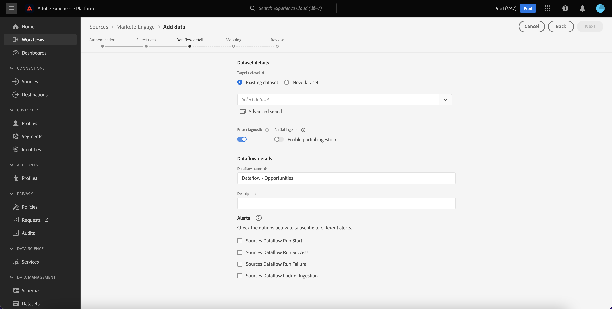

# Skapa en [!DNL Marketo Engage] källanslutning och dataflöde i användargränssnittet

>[!IMPORTANT]
>
>Innan du skapar [!DNL Marketo Engage] källanslutning och ett dataflöde måste du först se till att du har [mappade ditt organisations-ID i Adobe](https://experienceleague.adobe.com/docs/marketo/using/product-docs/core-marketo-concepts/miscellaneous/set-up-adobe-organization-mapping.html) in [!DNL Marketo]. Dessutom måste du se till att du har slutfört [automatiskt fylla i [!DNL Marketo] B2B-namnutrymmen och scheman](../../../../connectors/adobe-applications/marketo/marketo-namespaces.md) innan du skapar en källanslutning och ett dataflöde.

Den här självstudiekursen innehåller steg för att skapa en [!DNL Marketo Engage] (nedan kallad[!DNL Marketo]&quot;) i användargränssnittet för att hämta B2B-data till Adobe Experience Platform.

## Komma igång

Den här självstudiekursen kräver en fungerande förståelse av följande komponenter i Adobe Experience Platform:

* [B2B-namnutrymmen och automatisk schemagenerering](../../../../connectors/adobe-applications/marketo/marketo-namespaces.md): Med B2B-namnutrymmen och automatisk schemagenerering kan du använda [!DNL Postman] för att automatiskt generera värden för B2B-namnutrymmen och scheman. Du måste fylla i B2B-namnutrymmen och scheman innan du skapar en [!DNL Marketo] källanslutning och dataflöde.
* [Källor](../../../../home.md): Experience Platform tillåter att data kan hämtas från olika källor samtidigt som du kan strukturera, märka och förbättra inkommande data med hjälp av plattformstjänster.
* [Experience Data Model (XDM)](../../../../../xdm/home.md): Det standardiserade ramverk som Experience Platform använder för att ordna kundupplevelsedata.
   * [Skapa och redigera scheman i användargränssnittet](../../../../../xdm/ui/resources/schemas.md): Lär dig hur du skapar och redigerar scheman i gränssnittet.
* [Identitetsnamnutrymmen](../../../../../identity-service/features/namespaces.md): Identitetsnamnutrymmen är en komponent i [!DNL Identity Service] som fungerar som indikatorer för det sammanhang som en identitet hör till. En fullständigt kvalificerad identitet innehåller ett ID-värde och ett namnutrymme.
* [[!DNL Real-Time Customer Profile]](/help/profile/home.md): Ger en enhetlig konsumentprofil i realtid baserad på aggregerade data från flera källor.
* [Sandlådor](../../../../../sandboxes/home.md): Experience Platform tillhandahåller virtuella sandlådor som partitionerar en enda plattformsinstans i separata virtuella miljöer för att utveckla och utveckla program för digitala upplevelser.

### Samla in nödvändiga inloggningsuppgifter

För att få åtkomst till [!DNL Marketo] på Platform måste du ange följande värden:

| Autentiseringsuppgifter | Beskrivning |
| ---------- | ----------- |
| `munchkinId` | Munchkin-ID är den unika identifieraren för en specifik [!DNL Marketo] -instans. |
| `clientId` | Ditt unika klient-ID [!DNL Marketo] -instans. |
| `clientSecret` | Den unika klienthemligheten hos [!DNL Marketo] -instans. |

Mer information om hur du hämtar dessa värden finns i [[!DNL Marketo] autentiseringsguide](../../../../connectors/adobe-applications/marketo/marketo-auth.md).

När du har samlat in dina inloggningsuppgifter kan du följa stegen i nästa avsnitt.

## Koppla samman [!DNL Marketo] konto

Välj **[!UICONTROL Sources]** från det vänstra navigeringsfältet för att komma åt [!UICONTROL Sources] arbetsyta. The [!UICONTROL Catalog] visas en mängd olika källor som du kan använda för att skapa ett konto.

Du kan välja lämplig kategori i katalogen till vänster på skärmen. Du kan också använda sökfältet till att hitta den källa du vill arbeta med.

Under [!UICONTROL Adobe applications] kategori, välj **[!UICONTROL Marketo Engage]**. Välj sedan **[!UICONTROL Add data]** för att skapa en ny [!DNL Marketo] dataflöde.

The **[!UICONTROL Connect Marketo Engage account]** visas. På den här sidan kan du antingen använda ett nytt konto eller komma åt ett befintligt konto.

### Befintligt konto

Om du vill skapa ett dataflöde med ett befintligt konto väljer du **[!UICONTROL Existing account]** och sedan väljer [!DNL Marketo] konto som du vill använda. Välj **[!UICONTROL Next]** för att fortsätta.

### Nytt konto

Om du skapar ett nytt konto väljer du **[!UICONTROL New account]**. Ange ett kontonamn, en valfri beskrivning och ditt [!DNL Marketo] autentiseringsuppgifter. När du är klar väljer du **[!UICONTROL Connect to source]** och tillåt sedan lite tid för att upprätta den nya anslutningen.

## Välj en datauppsättning

När du har skapat [!DNL Marketo] kommer nästa steg att ge dig ett gränssnitt att utforska [!DNL Marketo] datauppsättningar.

Den vänstra halvan av gränssnittet är en katalogwebbläsare som visar de 10 [!DNL Marketo] datauppsättningar. En fullt fungerande [!DNL Marketo] källanslutningen kräver att de nio olika datauppsättningarna matas in. Om du även använder [!DNL Marketo] kontobaserad marknadsföring (ABM) måste du också skapa ett 10:e dataflöde för att kunna importera [!UICONTROL Named Accounts] datauppsättning.

>[!NOTE]
>
>Följande självstudiekurser används för att arbeta snabbt [!UICONTROL Opportunities] som ett exempel, men stegen som beskrivs nedan gäller för någon av de 10 [!DNL Marketo] datauppsättningar.

Markera den datauppsättning som du vill importera först och välj sedan **[!UICONTROL Next]**.

## Ange information om dataflöde {#provide-dataflow-details}

The [!UICONTROL Dataflow detail] kan du välja om du vill använda en befintlig datamängd eller en ny datamängd. Under den här processen kan du även konfigurera inställningar för [!UICONTROL Profile dataset], [!UICONTROL Error diagnostics], [!UICONTROL Partial ingestion]och [!UICONTROL Alerts].

>[!BEGINTABS]

>[!TAB Använd en befintlig datamängd]

Om du vill importera data till en befintlig datauppsättning väljer du **[!UICONTROL Existing dataset]**. Du kan antingen hämta en befintlig datauppsättning med [!UICONTROL Advanced search] eller genom att bläddra igenom listan med befintliga datauppsättningar i listrutan. När du har valt en datauppsättning anger du ett namn och en beskrivning för dataflödet.

>[!TAB Använd en ny datauppsättning]

Om du vill importera till en ny datauppsättning väljer du **[!UICONTROL New dataset]** och ange sedan ett namn och en valfri beskrivning för utdatauppsättningen. Välj sedan ett schema att mappa till med [!UICONTROL Advanced search] eller genom att bläddra igenom listan med befintliga scheman i listrutan. När du har valt ett schema anger du ett namn och en beskrivning för dataflödet.

>[!ENDTABS]

### Aktivera [!DNL Profile] och feldiagnostik

Nästa steg är att välja **[!UICONTROL Profile dataset]** växla för att aktivera datauppsättningen för [!DNL Profile]. På så sätt kan du skapa en helhetsbild av en enhets attribut och beteenden. Data från alla [!DNL Profile]-aktiverade datauppsättningar kommer att inkluderas i [!DNL Profile] och ändringarna tillämpas när du sparar dataflödet.

[!UICONTROL Error diagnostics] möjliggör detaljerad generering av felmeddelanden för alla felaktiga poster som inträffar i dataflödet, medan [!UICONTROL Partial ingestion] gör att du kan importera data som innehåller fel, upp till ett visst tröskelvärde som du manuellt anger. Se [partiell batchingång - översikt](../../../../../ingestion/batch-ingestion/partial.md) för mer information.

>[!IMPORTANT]
>
>The [!DNL Marketo] I källan används batchinmatning för att importera alla historikposter och direktuppspelning används för realtidsuppdateringar. Detta gör att källan kan fortsätta direktuppspelningen samtidigt som felaktiga poster hämtas. Aktivera **[!UICONTROL Partial ingestion]** växla och ange sedan [!UICONTROL Error threshold %] till maximum för att förhindra att dataflödet misslyckas.

### Aktivera aviseringar

Du kan aktivera varningar för att få meddelanden om status för ditt dataflöde. Välj en avisering i listan om du vill prenumerera och få meddelanden om statusen för ditt dataflöde. Mer information om varningar finns i guiden på [prenumerera på källvarningar med användargränssnittet](../../alerts.md).

När du är klar med informationen om dataflödet väljer du **[!UICONTROL Next]**.

### Hoppa över ej ianspråktagna konton när företagsdata importeras

När du skapar ett dataflöde för att importera data från företagsdatauppsättningen kan du konfigurera [!UICONTROL Exclude unclaimed accounts] att antingen utesluta eller ta med ej ianspråktagna konton från intagandet.

När enskilda fyller i ett formulär, [!DNL Marketo] skapar en post för ett skenkonto baserat på företagsnamnet som inte innehåller några andra data. För nya dataflöden är alternativet för att exkludera ej ianspråktagna konton aktiverat som standard. För befintliga dataflöden kan du aktivera eller inaktivera funktionen, med ändringar som gäller för nyinmatade data och inte befintliga data.

## Kartlägg [!DNL Marketo] datakällfält för mål-XDM-fält

The [!UICONTROL Mapping] visas med ett gränssnitt för att mappa källfälten från källschemat till rätt mål-XDM-fält i målschemat.

Varje [!DNL Marketo] datauppsättningen har sina egna specifika mappningsregler att följa. Se följande för mer information om hur du mappar [!DNL Marketo] datauppsättningar till XDM:

* [Aktiviteter](../../../../connectors/adobe-applications/mapping/marketo.md#activities)
* [Program](../../../../connectors/adobe-applications/mapping/marketo.md#programs)
* [Programmedlemskap](../../../../connectors/adobe-applications/mapping/marketo.md#program-memberships)
* [Företag](../../../../connectors/adobe-applications/mapping/marketo.md#companies)
* [Statiska listor](../../../../connectors/adobe-applications/mapping/marketo.md#static-lists)
* [Statiska listmedlemskap](../../../../connectors/adobe-applications/mapping/marketo.md#static-list-memberships)
* [Namngivna konton](../../../../connectors/adobe-applications/mapping/marketo.md#named-accounts)
* [Möjligheter](../../../../connectors/adobe-applications/mapping/marketo.md#opportunities)
* [Kontaktroller för affärsmöjlighet](../../../../connectors/adobe-applications/mapping/marketo.md#opportunity-contact-roles)
* [Personer](../../../../connectors/adobe-applications/mapping/marketo.md#persons)

Beroende på dina behov kan du välja att mappa fält direkt eller använda förinställningsfunktioner för data för att omvandla källdata för att härleda beräknade eller beräknade värden. Mer information om hur du använder mappningsgränssnittet finns i [Användargränssnittsguide för dataprep](../../../../../data-prep/ui/mapping.md).

När mappningsuppsättningarna är klara väljer du **[!UICONTROL Next]** och kan ta en stund innan det nya dataflödet skapas.

## Granska ditt dataflöde

The **[!UICONTROL Review]** visas så att du kan granska det nya dataflödet innan det skapas. Informationen är grupperad i följande kategorier:

* **[!UICONTROL Connection]**: Visar källtypen, den relevanta sökvägen för den valda källentiteten och mängden kolumner i källentiteten.
* **[!UICONTROL Assign dataset & map fields]**: Visar vilken datauppsättning källdata hämtas till, inklusive det schema som datauppsättningen följer.

När du har granskat dataflödet väljer du **[!UICONTROL Save & ingest]** så att dataflödet kan skapas.

## Övervaka dataflödet

När dataflödet har skapats kan du övervaka de data som importeras genom det för att se information om hur mycket data som har intagits, hur bra de är och vilka fel som har uppstått. Mer information om hur du övervakar dataflöden finns i självstudiekursen om [övervaka dataflöden i användargränssnittet](../../../../../dataflows/ui/monitor-sources.md).

## Ta bort dina attribut

Anpassade attribut i datauppsättningar kan inte döljas eller tas bort retroaktivt. Om du vill dölja eller ta bort ett anpassat attribut från en befintlig datauppsättning måste du skapa en ny datauppsättning utan det här anpassade attributet, ett nytt XDM-schema och konfigurera ett nytt dataflöde för den nya datauppsättningen som du skapar. Du måste också inaktivera eller ta bort det ursprungliga dataflöde som består av datauppsättningen med det anpassade attribut som du vill dölja eller ta bort.

## Ta bort ditt dataflöde

Du kan ta bort dataflöden som inte längre är nödvändiga eller som har skapats felaktigt med **[!UICONTROL Delete]** finns i [!UICONTROL Dataflows] arbetsyta. Mer information om hur du tar bort dataflöden finns i självstudiekursen om [ta bort dataflöden i användargränssnittet](../../delete.md).

## Nästa steg

Genom att följa den här självstudiekursen har du skapat ett dataflöde som du kan använda [!DNL Marketo] data. Inkommande data kan nu användas av plattformstjänster längre fram i kedjan som [!DNL Real-Time Customer Profile] och [!DNL Data Science Workspace]. Mer information finns i följande dokument:

* [[!DNL Real-Time Customer Profile] översikt](/help/profile/home.md)
* [[!DNL Data Science Workspace] översikt](/help/data-science-workspace/home.md)

## Bilaga {#appendix}

Följande avsnitt innehåller ytterligare riktlinjer som du kan följa när du använder [!DNL Marketo] källa.

### Felmeddelanden i användargränssnittet {#error-messages}

Följande felmeddelanden visas i användargränssnittet när Platform upptäcker problem med konfigurationen:

#### [!DNL Munchkin ID] är inte mappad till rätt organisation

Autentisering nekas om din [!DNL Munchkin ID] är inte mappad till den plattformsorganisation som du använder. Konfigurera mappningen mellan [!DNL Munchkin ID] och din organisation med [[!DNL Marketo] gränssnitt](https://app-sjint.marketo.com/#MM0A1).

#### Primär identitet saknas

Ett dataflöde kan inte sparas och importeras om en primär identitet saknas. Se till att [en primär identitet finns i XDM-schemat](../../../../../xdm/tutorials/create-schema-ui.md)innan du försöker konfigurera ett dataflöde.

