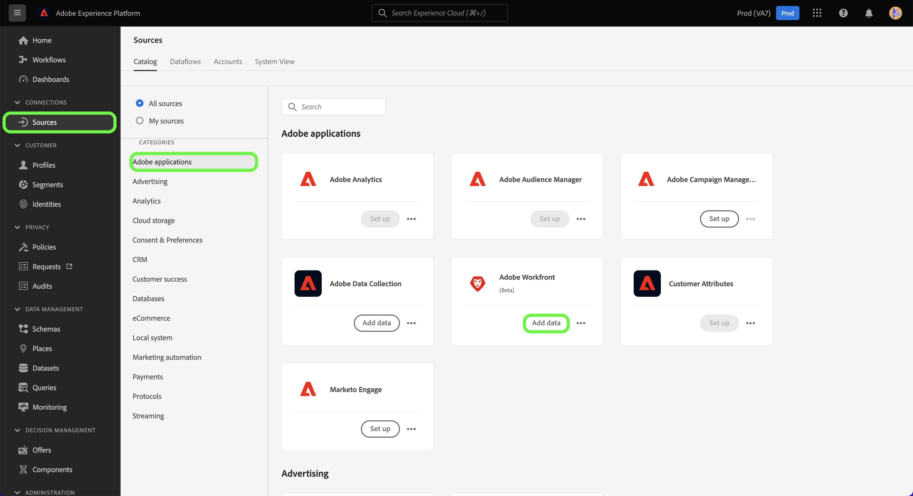

# (Beta) Skapa en Adobe Workfront-källanslutning i användargränssnittet

>[!NOTE]
>
>Adobe Workfront-källan är i betaversion. Se [källöversikt](../../../../home.md#terms-and-conditions) om du vill ha mer information om hur du använder betamärkta källor.

I den här självstudiekursen beskrivs hur du skapar en Adobe Workfront-källanslutning för att överföra dina Workfront-data till Adobe Experience Platform med användargränssnittet.

## Komma igång

>[!IMPORTANT]
>
>Du måste vara konfigurerad som administratör i Adobe Admin Console för att få åtkomst till Workfront-källan.

Den här självstudiekursen kräver en fungerande förståelse av följande komponenter i Experience Platform:

* [Experience Data Model (XDM) System](../../../../../xdm/home.md): Det standardiserade ramverk som Experience Platform använder för att ordna kundupplevelsedata.
* [Kundprofil i realtid](../../../../../profile/home.md): Ger en enhetlig konsumentprofil i realtid baserad på aggregerade data från flera källor.
* [Sandlådor](../../../../../sandboxes/home.md): Experience Platform tillhandahåller virtuella sandlådor som partitionerar en enda plattformsinstans i separata virtuella miljöer för att utveckla och utveckla program för digitala upplevelser.

## Skapa en Workfront-källanslutning i användargränssnittet

Välj **[!UICONTROL Sources]** från vänster navigering för att komma åt [!UICONTROL Sources] arbetsyta. The [!UICONTROL Catalog] I visas en mängd olika källor som kan användas för att skapa ett konto.

Du kan välja lämplig kategori i katalogen till vänster på skärmen. Du kan också använda sökfältet för att begränsa vilka källor som visas.

Under **[!UICONTROL Adobe applications]** kategori, välj **[!UICONTROL Adobe Workfront]** och sedan markera **[!UICONTROL Add data]**.

## Markera data

The [!UICONTROL Select data] visas. Här måste du ange värden för din Workfront-underdomän och Datalane. Din Workfront-underdomän är samma URL som du använder för att komma åt din Workfront-instans, till exempel `https://acme.workfront.com/`, medan datalanen representerar arbetsmiljön som du vill använda.

När du har lagt till din underdomän och ditt datalane väljer du **[!UICONTROL Next]**.

## Ange information om dataflöde

I dataflödesdetaljsteget kan du ange ett namn och en valfri beskrivning av dataflödet. Under det här steget kan du även prenumerera på aviseringar för att få meddelanden om status för ditt dataflöde. Mer information om varningar finns i självstudiekursen om [prenumerera på aviseringar i källans användargränssnitt](../../alerts.md).

När du har angett dataflödesinformation och konfigurerat dina aviseringsinställningar väljer du **[!UICONTROL Next]**.

## Granska

The **[!UICONTROL Review]** visas så att du kan granska det nya dataflödet innan det skapas. Informationen är grupperad i följande kategorier:

* **[!UICONTROL Connection]**: Visar källtypen, den relevanta sökvägen för den valda källfilen och mängden kolumner i källfilen.
* **[!UICONTROL Assign dataset & map fields]**: Visar vilken datauppsättning källdata hämtas till, inklusive det schema som datauppsättningen följer.

När du har granskat dataflödet väljer du **[!UICONTROL Finish]** så att dataflödet kan skapas.

## Bilaga

I följande avsnitt finns ytterligare information om Workfront-källan.

### Workfront Change Event Schema

Workfront data in Platform representeras som postdata för tidsserier, där varje rad i data har en tidsstämpel som visar när händelsen inträffade och de attribut som är relaterade till händelsen.

Under installationen skapas ett schema med namnet Workfront Change Events from Flow.

| Schemafält | Beskrivning |
| --- | --- |
| `timestamp` | Den tidpunkt då den valda händelsen inträffade. Tidsstämpeln visas i GTM-tidszonen. |
| `_workfront.objectType` | Objekttypen. Tillgängliga värden kan innehålla `project`, `task`, `portfolio`och andra, beroende på vilket objekt som har ändrats eller skapats. |
| `_workfront.objectID` | Det ID som motsvarar objekttypen. |
| `_workfront.created` | Värdet är inställt på `1` om händelsen representerar ett objekt. |
| `_workfront.deleted` | Värdet är inställt på `1` om objektet tas bort. |
| `_worfkront.updated` | Värdet är inställt på `1` om objektet uppdateras. |
| `_workfront.completed` | Värdet är inställt på `1` om objektet är markerat som slutfört. |
| `_workfront.parentObjectType` | (Valfritt) Den objekttyp som motsvarar objektets överordnade. |
| `_workfront.parentID` | ID för det överordnade objektet. |
| `_workfront.customData` | En karta över alla anpassade formulärfält och värden som fyllts i under händelsen. |

>[!IMPORTANT]
>
>Endast attribut som har ändrats eller skapats som en del av en händelse fylls i. Om du till exempel bara ändrar namnet på objektet är de enda fälten som fylls i:<ul><li>`timestamp`</li><li>`_workfront.update (=1)`</li><li>`_workfront.objectType`</li><li>`_workfront.objectID`</li><li>`_workfront.objectName`</li></ul>

## Nästa steg

Genom att följa den här självstudiekursen har du nu skapat ett dataflöde som hämtar data från Workfront till Experience Platform. Du kan nu använda tjänster som [Frågetjänst](../../../../../query-service/home.md) för att göra ytterligare analyser av era data. Mer information om Workfront finns i [Workfront - översikt](../../../../connectors/adobe-applications/workfront.md).
