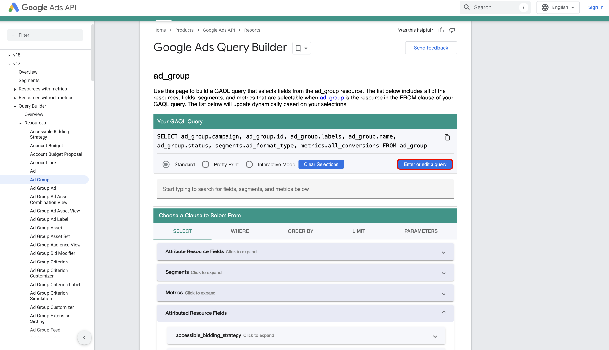

# Anslut [!DNL Google Ads] till Experience Platform med användargränssnittet

>[!WARNING]
>
>[!DNL Google Ads]-källan är för närvarande inte tillgänglig i användargränssnittet. Du kan fortsätta att importera dina [!DNL Google Ads]-data till Experience Platform [med API:t](../../../api/create/advertising/ads.md).

>[!NOTE]
>
>Källan [!DNL Google Ads] är i betaversion. Se [Källöversikt](../../../../home.md#terms-and-conditions) om du vill ha mer information om hur du använder betatecknade källor.

Läs den här vägledningen när du vill lära dig hur du ansluter ditt [!DNL Google Ads]-konto till Adobe Experience Platform med hjälp av källarbetsytan i Experience Platform användargränssnitt.

## Kom igång

Den här självstudiekursen kräver en fungerande förståelse av följande komponenter i Experience Platform:

* [[!DNL Experience Data Model (XDM)] System](../../../../../xdm/home.md): Det standardiserade ramverk som Experience Platform använder för att ordna kundupplevelsedata.
   * [Grundläggande om schemakomposition](../../../../../xdm/schema/composition.md): Lär dig mer om grundstenarna i XDM-scheman, inklusive nyckelprinciper och bästa metoder för schemakomposition.
   * [Schemaredigeraren, självstudiekurs](../../../../../xdm/tutorials/create-schema-ui.md): Lär dig hur du skapar anpassade scheman med hjälp av gränssnittet för Schemaredigeraren.
* [[!DNL Real-Time Customer Profile]](../../../../../profile/home.md): Tillhandahåller en enhetlig konsumentprofil i realtid baserad på aggregerade data från flera källor.

Om du redan har en giltig [!DNL Google Ads]-anslutning kan du hoppa över resten av det här dokumentet och gå vidare till självstudiekursen [Konfigurera ett dataflöde](../../dataflow/advertising.md)

### Samla in nödvändiga inloggningsuppgifter

Mer information om autentisering finns i [[!DNL Google Ads] källöversikten](../../../../connectors/advertising/ads.md).

## Anslut ditt Google Ads-konto

I Experience Platform-gränssnittet väljer du **[!UICONTROL Sources]** i den vänstra navigeringen för att komma åt arbetsytan i *[!UICONTROL Sources]*. Du kan välja lämplig kategori på panelen *[!UICONTROL Categories]*. Du kan också använda sökfältet för att navigera till den specifika källa som du vill använda.

Om du vill använda [!DNL Google Ads] väljer du **[!UICONTROL Google Ads]**-källkortet under *[!UICONTROL Advertising]* och sedan **[!UICONTROL Add data]**.

.

### Befintligt konto

Om du vill använda ett befintligt konto väljer du **[!UICONTROL Existing account]** och sedan det konto som du vill använda i listan över konton i gränssnittet.

När du har valt ditt konto väljer du **[!UICONTROL Next]** för att fortsätta till nästa steg.

.

### Nytt konto

Om du inte har något befintligt konto måste du skapa ett nytt konto genom att ange de autentiseringsuppgifter som motsvarar källan.

Om du vill skapa ett nytt konto väljer du **[!UICONTROL New account]** och anger sedan ett kontonamn och eventuellt en beskrivning av din kontoinformation. Ange sedan lämpliga autentiseringsvärden för att autentisera källan mot Experience Platform:

* **Klientens kund-ID**: Klientens kund-ID är det kontonummer som motsvarar det [!DNL Google Ads]-klientkonto som du vill hantera med [!DNL Google Ads] API. Detta ID följer mallen för `123-456-7890`.
* **Inloggningskund-ID**: Inloggningskund-ID är det kontonummer som motsvarar ditt [!DNL Google Ads]-hanterarkonto och används för att hämta rapportdata från en viss operativkund. Mer information om användar-ID för inloggning finns i [[!DNL Google Ads] API-dokumentationen](https://developers.google.com/search-ads/reporting/concepts/login-customer-id).
* **Utvecklartoken**: Med utvecklartoken får du åtkomst till API:t [!DNL Google Ads]. Du kan använda samma utvecklartoken för att göra förfrågningar mot alla dina [!DNL Google Ads]-konton. Hämta din utvecklartoken genom att [logga in på ditt chefskonto](https://ads.google.com/home/tools/manager-accounts/) och sedan navigera till API-centersidan.
* **Uppdateringstoken**: Uppdateringstoken är en del av [!DNL OAuth2]-autentiseringen. Med denna token kan du återskapa dina åtkomsttoken när de har upphört att gälla.
* **Klient-ID**: Klient-ID används tillsammans med klienthemligheten som en del av [!DNL OAuth2]-autentiseringen. Tillsammans gör klient-ID och klienthemlighet det möjligt för programmet att agera för ditt kontos räkning genom att identifiera ditt program för [!DNL Google].
* **Klienthemlighet**: Klienthemligheten används tillsammans med klient-ID som en del av [!DNL OAuth2]-autentiseringen. Tillsammans gör klient-ID och klienthemlighet det möjligt för programmet att agera för ditt kontos räkning genom att identifiera ditt program för [!DNL Google].
* **[!DNL Google Ads]API-version**: Den aktuella API-versionen stöds av [!DNL Google Ads]. Den senaste versionen är `v18`, men den senaste versionen som stöds på Experience Platform är `v17`.

När du har angett dina autentiseringsuppgifter väljer du **[!UICONTROL Connect to source]** och tillåt en stund så att anslutningen kan bearbetas. När du är klar väljer du **[!UICONTROL Next]**.

.

## Markera data {#select-data}

Med [!DNL Google Ads] måste du ange en lista med attribut för inmatning under arbetsflödets dataurvalsfas. För att kunna hämta dessa attribut måste du använda [[!DNL Google Ads Query Builder]](https://developers.google.com/google-ads/api/fields/v17/overview_query_builder).

I [!DNL Google Ads Query Builder] navigerar du till den resurstyp som du vill använda och använder sedan attributväljaren för att välja dina attribut, segment och mått.

De attribut du väljer fyller i panelen [!DNL Google Ads Query Language]. Kontrollera att du använder läget [!DNL Standard] och välj sedan **[!DNL Enter or edit a query]**.

Välj sedan **[!DNL Validate Query]** för att validera din [!DNL Google Ads]-fråga.

Om det lyckas returnerar [!DNL Google Ads Query Builder] ett meddelande som anger att din fråga är giltig. Kopiera sedan **endast attributen** från frågan.

Gå tillbaka till källarbetsflödets dataurvalsfas i Experience Platform-användargränssnittet och klistra sedan in attributen på panelen *[!UICONTROL List attributes]*.

Välj **[!UICONTROL Preview]** om du vill förhandsgranska data och välj sedan **[!UICONTROL Next]** om du vill fortsätta.

## Skapa ett dataflöde för att importera annonsdata

Genom att följa den här självstudiekursen har du upprättat en anslutning till ditt Google Ads-konto. Du kan nu fortsätta med nästa självstudiekurs och [konfigurera ett dataflöde för att hämta annonsdata till Experience Platform](../../dataflow/advertising.md).
