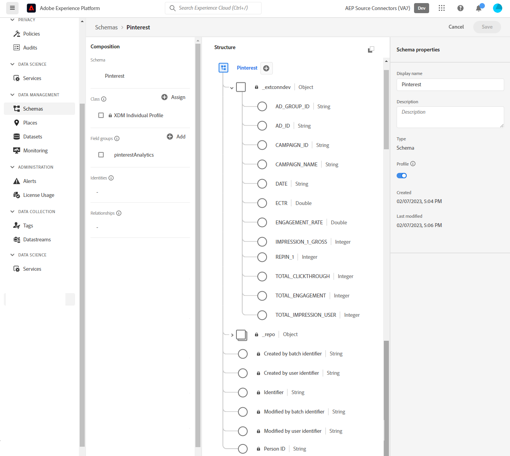
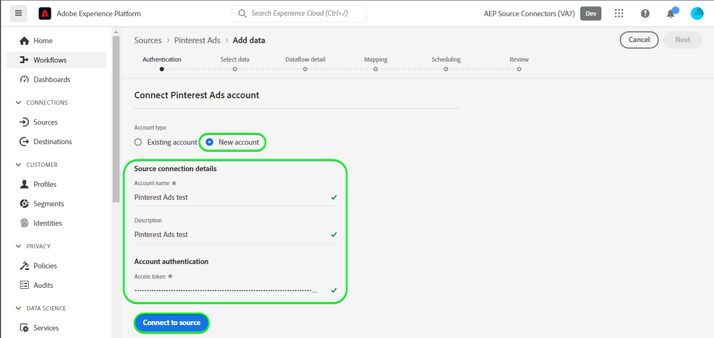

# Skapa en [!DNL Pinterest Ads] källanslutning i användargränssnittet

>[!NOTE]
>
>The [!DNL Pinterest Ads] källan är i betaversion. Läs [källöversikt](../../../../home.md#terms-and-conditions) om du vill ha mer information om hur du använder betamärkta källor.

Den här självstudiekursen innehåller steg för att skapa en [!DNL Pinterest Ads] källanslutning med Adobe Experience Platform användargränssnitt.

## Komma igång {#getting-started}

Den här självstudiekursen kräver en fungerande förståelse av följande komponenter i Experience Platform:

* [[!DNL Experience Data Model (XDM)] System](../../../../../xdm/home.md): Det standardiserade ramverk som Experience Platform använder för att organisera kundupplevelsedata.
   * [Grunderna för schemakomposition](../../../../../xdm/schema/composition.md): Lär dig mer om de grundläggande byggstenarna i XDM-scheman, inklusive viktiga principer och bästa praxis när det gäller schemakomposition.
   * [Schemaredigeraren, genomgång](../../../../../xdm/tutorials/create-schema-ui.md): Lär dig hur du skapar anpassade scheman med hjälp av gränssnittet för Schemaredigeraren.
* [[!DNL Real-Time Customer Profile]](../../../../../profile/home.md): Ger en enhetlig konsumentprofil i realtid baserad på aggregerade data från flera källor.

## Förutsättningar {#prerequisites}

För att kunna ansluta [!DNL Pinterest Ads] till Experience Platform måste du ange värden för följande anslutningsegenskaper:

* The [!DNL Pinterest] åtkomsttoken.
* The [!DNL Pinterest] annonskonto-ID.
* En av [!DNL Pinterest] kampanj-, annonsgrupp- eller annons-ID efter behov.

Mer information om de här anslutningsegenskaperna finns i [[!DNL Pinterest Ads] översikt](../../../../connectors/advertising/pinterest-ads.md#prerequisites).

### Skapa ett plattformsschema {#create-platform-schema}

Du måste också se till att du först skapar ett plattformsschema som du kan använda för dina [!DNL Pinterst Ads] källa. Läs självstudiekursen om [skapa ett plattformsschema](../../../../../xdm/schema/composition.md) om du vill ha omfattande anvisningar om hur du skapar ett schema.



En lista över de fält som stöds av [!DNL Pinterest] kampanj-, annonsgrupp- och annonsgränssnitt, se [[!DNL Pinterest] fält](#pinterest-fields) -avsnitt.

## Koppla samman [!DNL Pinterest Ads] konto {#connect-account}

Välj **[!UICONTROL Sources]** från det vänstra navigeringsfältet för att komma åt [!UICONTROL Sources] arbetsyta. The [!UICONTROL Catalog] visas en mängd olika källor som du kan skapa ett konto med.

Du kan välja lämplig kategori i katalogen till vänster på skärmen. Du kan också hitta den källa du vill arbeta med med med sökalternativet.

Under *Reklam* kategori, välj **[!UICONTROL Pinterest Ads]** och sedan markera **[!UICONTROL Add data]**.


The **[!UICONTROL Connect Pinterest Ads account]** visas. På den här sidan kan du antingen använda nya autentiseringsuppgifter eller befintliga.

### Befintligt konto {#existing-account}

Om du vill använda ett befintligt konto väljer du [!DNL Pinterest Ads] konto som du vill skapa ett nytt dataflöde med och sedan välja **[!UICONTROL Next]** för att fortsätta.


### Nytt konto {#new-account}

Om du skapar ett nytt konto väljer du **[!UICONTROL New account]** och ange sedan ett namn, en valfri beskrivning och dina uppgifter. När du är klar väljer du **[!UICONTROL Connect to source]** och tillåt sedan lite tid för att upprätta den nya anslutningen.




## Markera data {#select-data}

The **[!UICONTROL Select data]** visas, med ett gränssnitt där du kan ange den information som skulle skickas till API:erna för att hämta de data som du vill använda för plattformen.

| Fält | Beskrivning |
| --- | --- |
| [!UICONTROL ad_account_id] | Dina [!DNL Pinterest Ads] annonskonto-ID. Se [[!DNL Pinterest] guide för att hitta ID:n i Ads Manager](https://help.pinterest.com/en/business/article/find-ids-in-ads-manager) om du behöver hjälp. |
| [!UICONTROL object_type] | Välj en av **kampanjer**, **annonstgrupper** eller **annonser** beroende på vilket av [!DNL Pinterest] Analys-API:er som du vill få information från. |
| [!UICONTROL object_ids] | Det markerade objektets ID. Navigera till [!DNL Pinterest] sida för **Pinterest Business Hub** > **Översikt över annonskonto** > **Kampanjer** / **Annonsgrupper** / **Annonser** och kopiera de ID:n som krävs precis under namnen. |

>[!TIP]
>
>Du kan ange flera `object_ids` genom att skicka kommaavgränsade värden. Det maximala antalet ID:n som du kan skicka i en enskild begäran är 100. Om felaktiga värden skickas visas följande meddelande: `The request could not be processed. Error from flow provider: Unknown error while processing request.`

När du har angett värdena väljer du **[!UICONTROL Select]**. Om de angivna värdena är giltiga fylls den högra delen av gränssnittet, förhandsgranskningsdata, i.


## Nästa steg {#next-steps}

Genom att följa den här självstudiekursen har du upprättat en anslutning till [!DNL Pinterest Ads] konto. Du kan nu fortsätta med nästa självstudiekurs och [konfigurera ett dataflöde för att hämta annonsdata till plattformen](../../dataflow/advertising.md).

## Ytterligare resurser {#additional-resources}

I avsnitten nedan finns ytterligare resurser som du kan använda när du använder [!DNL Pinterest Ads] källa.

## Schemaläggning {#scheduling}

När du schemalägger [!DNL Pinterest Ads] dataflöde för förtäring måste du välja någon av följande konfigurationer för frekvens och intervall:

| Frekvens | Intervall |
| --- | --- |
| `Day` | 1 |
| `Hour` | 24 |

Mer information om schemaläggning av [!DNL Pinterest Ads] dataflöde, läs [skyddsräckessektion på [!DNL Pinterest Ads] översikt](../../../../connectors/advertising/pinterest-ads.md#guardrails).

När du har angett värdena för schemat väljer du **[!UICONTROL Next]**.


### Validering {#validation}

För att verifiera att du har konfigurerat källan och [!DNL Pinterest Ads] data importeras, följ stegen nedan:

Välj **[!UICONTROL View Dataflows]** bredvid [!DNL Pinterest Ads] kortmenyn på katalogsidan. Du kan sedan välja [!UICONTROL Preview dataset] för att verifiera de data som har importerats.


Du kan verifiera data mot antalet som visas på [!DNL Pinterest] UI

>[!BEGINTABS]

>[!TAB Kampanjer]


>[!TAB Annonsgrupper]


>[!TAB Annonser]


>[!ENDTABS]


### [!DNL Pinterest] Fält {#pinterest-fields}

De fält som stöds av [!DNL Pinterest] API:er för kampanj, annonsgrupp och annonsering anges nedan:

+++ Visa nyttolast

```json
{
  "items": [
    {
      "name": "AD_GROUP_ID",
      "category": "ADS",
      "definition": "Unique ID for your ad group",
      "display_name": "Ad group ID"
    },
    {
      "name": "AD_ID",
      "category": "ADS",
      "definition": "Unique ID for your ad",
      "display_name": "Ad ID"
    },
    {
      "name": "CAMPAIGN_BOOKING_REFERENCE",
      "category": "ADS",
      "definition": "Campaign booking reference number",
      "display_name": "Campaign booking reference"
    },
    {
      "name": "CAMPAIGN_DAILY_SPEND_CAP",
      "category": "ADS",
      "definition": "The maximum amount you're willing to spend in one day",
      "display_name": "Daily budget"
    },
    {
      "name": "CAMPAIGN_ID",
      "category": "ADS",
      "definition": "Unique ID for your campaign",
      "display_name": "Campaign ID"
    },
    {
      "name": "CAMPAIGN_LIFETIME_SPEND_CAP",
      "category": "ADS",
      "definition": "The maximum amount you're willing to spend over the lifetime of your campaign",
      "display_name": "Lifetime budget"
    },
    {
      "name": "CAMPAIGN_NAME",
      "category": "ADS",
      "definition": "Name, objective and ID of your campaign",
      "display_name": "Campaign name"
    },
    {
      "name": "CHECKOUT_ROAS",
      "category": "ADS",
      "definition": "Average return on ad spend for checkout events. This metric may include conversions that are modeled.",
      "display_name": "ROAS (Checkout)"
    },
    {
      "name": "CLICKTHROUGH_1",
      "category": "ADS",
      "definition": "The total number of clicks on your Pin to content on or off of Pinterest",
      "display_name": "Paid Pin clicks"
    },
    {
      "name": "CLICKTHROUGH_1_GROSS",
      "category": "ADS",
      "definition": "Unfiltered number of times someone clicks your ad (paid)",
      "display_name": "Gross Pin clicks"
    },
    {
      "name": "CLICKTHROUGH_2",
      "category": "ADS",
      "definition": "Total number of Pin clicks from ads saved to another person's board",
      "display_name": "Earned Pin clicks"
    },
    {
      "name": "CPC_IN_MICRO_DOLLAR",
      "category": "ADS",
      "definition": "The cost per click in micro dollars"
    },
    {
      "name": "CPM_IN_DOLLAR",
      "category": "ADS",
      "definition": "Average cost per 1k paid impressions",
      "display_name": "CPM"
    },
    {
      "name": "CPM_IN_MICRO_DOLLAR",
      "category": "ADS",
      "definition": "Cost per thousand first-order impressions in micro dollars"
    },
    {
      "name": "CPW_IN_DOLLAR",
      "category": "ADS",
      "definition": "The cost per web session in dollars"
    },
    {
      "name": "CPW_IN_MICRO_DOLLAR",
      "category": "ADS",
      "definition": "The cost per web session in micro dollars"
    },
    {
      "name": "CTR",
      "category": "ADS",
      "definition": "Paid Pin clicks divided by paid impressions",
      "display_name": "Paid CTR"
    },
    {
      "name": "CTR_2",
      "category": "ADS",
      "definition": "Earned Pin clicks divided by earned impressions",
      "display_name": "Earned CTR"
    },
    {
      "name": "ECPCV_IN_DOLLAR",
      "category": "ADS",
      "definition": "Average cost per video view that was watched to completion",
      "display_name": "CPCV (100%)"
    },
    {
      "name": "ECPCV_P95_IN_DOLLAR",
      "category": "ADS",
      "definition": "Average cost per video that was watched until 95% of its length",
      "display_name": "CPCV (95%)"
    },
    {
      "name": "ECPC_IN_DOLLAR",
      "category": "ADS",
      "definition": "Average cost per click",
      "display_name": "CPC"
    },
    {
      "name": "ECPC_IN_MICRO_DOLLAR",
      "category": "ADS",
      "definition": "Effective CPC (including first-order and downstream clicks) in micro dollars"
    },
    {
      "name": "ECPE_IN_DOLLAR",
      "category": "ADS",
      "definition": "Cost per engagement",
      "display_name": "CPE"
    },
    {
      "name": "ECPM_IN_MICRO_DOLLAR",
      "category": "ADS",
      "definition": "Effective CPM (including first-order and downstream impressions) in micro dollars"
    },
    {
      "name": "ECPV_IN_DOLLAR",
      "category": "ADS",
      "definition": "Average cost per video view",
      "display_name": "CPV"
    },
    {
      "name": "ECTR",
      "category": "ADS",
      "definition": "Total Pin clicks divided by total impressions",
      "display_name": "CTR"
    },
    {
      "name": "EENGAGEMENT_RATE",
      "category": "ADS",
      "definition": "Total engagements divided by total impressions",
      "display_name": "Engagement rate"
    },
    {
      "name": "ENGAGEMENT",
      "category": "ORGANIC",
      "definition": "The total number of engagements on your Pins. This includes saves, Pin clicks, outbound clicks, carousel card swipes, secondary creative (collections) clicks and Idea Pin forward/backward swipes.",
      "display_name": "Engagement"
    },
    {
      "name": "ENGAGEMENT_1",
      "category": "ADS",
      "definition": "Paid actions taken as a result of your ads",
      "display_name": "Paid engagements"
    },
    {
      "name": "ENGAGEMENT_2",
      "category": "ADS",
      "definition": "Earned actions from ads saved to boards",
      "display_name": "Earned engagements"
    },
    {
      "name": "ENGAGEMENT_RATE",
      "category": "ADS",
      "definition": "Paid engagements divided by paid impressions"
    },
    {
      "name": "ENGAGEMENT_RATE",
      "category": "ORGANIC",
      "definition": "The total engagements with your Pins divided by the total number of times your Pins were seen. Engagements include saves, Pin clicks, and outbound clicks.",
      "display_name": "Engagement rate"
    },
    {
      "name": "IDEA_PIN_PAGE_BACKWARD_1",
      "category": "ADS",
      "definition": "The number of times someone goes back to a previous page within an Idea Pin you promoted"
    },
    {
      "name": "IDEA_PIN_PAGE_BACKWARD_2",
      "category": "ADS",
      "definition": "The number of times someone goes back to a previous page within your Idea Pin on someone else's board"
    },
    {
      "name": "IDEA_PIN_PAGE_FORWARD_1",
      "category": "ADS",
      "definition": "The number of times someone advances to a new page within an Idea Pin you promoted"
    },
    {
      "name": "IDEA_PIN_PAGE_FORWARD_2",
      "category": "ADS",
      "definition": "The number of times someone advances to a new page within your Idea Pin on someone else's board"
    },
    {
      "name": "IDEA_PIN_PRODUCT_TAG_VISIT_1",
      "category": "ADS",
      "definition": "The number of times someone taps on a product tagged within an Idea Pin you promoted"
    },
    {
      "name": "IDEA_PIN_PRODUCT_TAG_VISIT_2",
      "category": "ADS",
      "definition": "The number of times someone taps on a product tagged within an Idea ad saved to another person's board"
    },
    {
      "name": "IMPRESSION",
      "category": "ORGANIC",
      "definition": "The number of times your Pins were on screen.",
      "display_name": "Impressions"
    },
    {
      "name": "IMPRESSION_1",
      "category": "ADS",
      "definition": "The number of times your ad was seen",
      "display_name": "Paid impressions"
    },
    {
      "name": "IMPRESSION_1_GROSS",
      "category": "ADS",
      "definition": "Unfiltered number of times your ad was on screen (paid)",
      "display_name": "Gross impressions"
    },
    {
      "name": "IMPRESSION_2",
      "category": "ADS",
      "definition": "Total number of times your ad was viewed after being saved to another person's board",
      "display_name": "Earned impressions"
    },
    {
      "name": "INAPP_CHECKOUT_COST_PER_ACTION",
      "category": "ADS",
      "definition": "Average cost per in-app checkout event",
      "display_name": "In-app CPA (Checkout)"
    },
    {
      "name": "OUTBOUND_CLICK",
      "category": "ORGANIC",
      "definition": "The number of times people perform actions that lead them to a destination off Pinterest.",
      "display_name": "Outbound clicks"
    },
    {
      "name": "OUTBOUND_CLICK_1",
      "category": "ADS",
      "definition": "The total number of clicks to the destination URL associated with your ad",
      "display_name": "Paid outbound clicks"
    },
    {
      "name": "OUTBOUND_CLICK_2",
      "category": "ADS",
      "definition": "The total number of clicks to the destination URL associated with your ad saved to another person's board",
      "display_name": "Earned outbound clicks"
    },
    {
      "name": "OUTBOUND_CLICK_RATE",
      "category": "ORGANIC",
      "definition": "The total number of clicks to the destination URL associated with your Pin divided by the total number of times your Pins were on screen.",
      "display_name": "Outbound click rate"
    },
    {
      "name": "PAGE_VISIT_COST_PER_ACTION",
      "category": "ADS",
      "definition": "Average cost per page visit event. This metric may include conversions that are modeled.",
      "display_name": "CPA (Page visit)"
    },
    {
      "name": "PAGE_VISIT_ROAS",
      "category": "ADS",
      "definition": "Average return on ad spend for page visit events. This metric may include conversions that are modeled.",
      "display_name": "ROAS (Page visit)"
    },
    {
      "name": "PAID_IMPRESSION",
      "category": "ADS",
      "definition": "The number of impressions that you paid for",
      "display_name": "Paid Impressions"
    },
    {
      "name": "PINTEREST_CHECKOUT_COST_PER_ACTION",
      "category": "ADS",
      "definition": "Average cost per Pinterest checkout event",
      "display_name": "Pinterest CPA (Checkout)"
    },
    {
      "name": "PINTEREST_CHECKOUT_ROAS",
      "category": "ADS",
      "definition": "Average return on ad spend for Pinterest checkout events",
      "display_name": "Pinterest ROAS (Checkout)"
    },
    {
      "name": "PIN_CLICK",
      "category": "ORGANIC",
      "definition": "The total number of clicks on your Pin so it opens in closeup.",
      "display_name": "Pin click"
    },
    {
      "name": "PIN_CLICK_RATE",
      "category": "ORGANIC",
      "definition": "The total number of clicks from your Pin to content on or off Pinterest, divided by the total number of times your Pins were on screen.",
      "display_name": "Pin click rate"
    },
    {
      "name": "PIN_ID",
      "category": "ADS",
      "definition": "Thumbnail of your ad's image or video",
      "display_name": "Organic pin ID"
    },
    {
      "name": "PIN_PROMOTION_ID",
      "category": "ADS",
      "definition": "Unique ID for your ad",
      "display_name": "Ad ID"
    },
    {
      "name": "QUARTILE_95_PERCENT_VIEW",
      "category": "ORGANIC",
      "definition": "The number of times your video was viewed to 95% of its length.",
      "display_name": "Played to 95%"
    },
    {
      "name": "REPIN_1",
      "category": "ADS",
      "definition": "Total number of saves for your ad",
      "display_name": "Paid saves"
    },
    {
      "name": "REPIN_2",
      "category": "ADS",
      "definition": "Number of times your ad was saved from another person's board",
      "display_name": "Earned saves"
    },
    {
      "name": "REPIN_RATE",
      "category": "ADS",
      "definition": "Paid saves divided by paid impressions",
      "display_name": "Paid save rate"
    },
    {
      "name": "SAVE",
      "category": "ORGANIC",
      "definition": "The number of times people saved your Pin to a board.",
      "display_name": "Saves"
    },
    {
      "name": "SAVE_RATE",
      "category": "ORGANIC",
      "definition": "The total saves of your Pins divided by the total number of times your Pins were on screen.",
      "display_name": "Save rate"
    },
    {
      "name": "SPEND_IN_DOLLAR",
      "category": "ADS",
      "definition": "Total amount you've spent during the reporting time period",
      "display_name": "Spend"
    },
    {
      "name": "SPEND_IN_MICRO_DOLLAR",
      "category": "ADS",
      "definition": "The money you spend for promoted Pins, in micro dollars",
      "display_name": "Spend in account currency"
    },
    {
      "name": "SPEND_IN_MICRO_US_DOLLAR",
      "category": "ADS",
      "definition": "The money you spend for promoted Pins, in micro USD",
      "display_name": "Spend in micro USD"
    },
    {
      "name": "SPEND_IN_US_DOLLAR",
      "category": "ADS",
      "definition": "Total amount you've spent during the reporting time period (in USD)",
      "display_name": "Spend In USD"
    },
    {
      "name": "TOTAL_CHECKOUT",
      "category": "ADS",
      "definition": "Total number of checkout events that resulted from interactions with your ad. This metric may include conversions that are modeled.",
      "display_name": "Conversions (Checkout)"
    },
    {
      "name": "TOTAL_CHECKOUT_VALUE_IN_MICRO_DOLLAR",
      "category": "ADS",
      "definition": "Total value of checkout events resulting from interactions with your ad. This metric may include conversions that are modeled.",
      "display_name": "Order value (Checkout)"
    },
    {
      "name": "TOTAL_CLICKTHROUGH",
      "category": "ADS",
      "definition": "The total number of clicks on your Pin to content on or off of Pinterest (paid and earned)",
      "display_name": "Pin clicks"
    },
    {
      "name": "TOTAL_CLICK_ADD_TO_CART",
      "category": "ADS",
      "definition": "The number of add to cart events resulting from clicks on your ad. This metric may include conversions that are modeled.",
      "display_name": "Click-through conversions (Add to cart)"
    },
    {
      "name": "TOTAL_CLICK_CHECKOUT",
      "category": "ADS",
      "definition": "Total number of checkout events resulting from clicks on your ad. This metric may include conversions that are modeled.",
      "display_name": "Click-through conversions (Checkout)"
    },
    {
      "name": "TOTAL_CLICK_CHECKOUT_VALUE_IN_MICRO_DOLLAR",
      "category": "ADS",
      "definition": "Total value of checkout events resulting from clicks on your ad. This metric may include conversions that are modeled.",
      "display_name": "Click-through order value (Checkout)"
    },
    {
      "name": "TOTAL_CLICK_LEAD",
      "category": "ADS",
      "definition": "Total number of lead events resulting from clicks on your ad. This metric may include conversions that are modeled.",
      "display_name": "Click-through conversions (Lead)"
    },
    {
      "name": "TOTAL_CLICK_SIGNUP",
      "category": "ADS",
      "definition": "Number of signup events resulting from clicks on your ad. This metric may include conversions that are modeled.",
      "display_name": "Click-through conversions (Signup)"
    },
    {
      "name": "TOTAL_CLICK_SIGNUP_VALUE_IN_MICRO_DOLLAR",
      "category": "ADS",
      "definition": "Total value of signup events resulting from clicks on your ad. This metric may include conversions that are modeled.",
      "display_name": "Click-through value (Signup)"
    },
    {
      "name": "TOTAL_CONVERSIONS",
      "category": "ADS",
      "definition": "Total number of conversions for all event types using the Pinterest Tag integration after an ad interaction. This metric may include conversions that are modeled.",
      "display_name": "Conversions"
    },
    {
      "name": "TOTAL_CUSTOM",
      "category": "ADS",
      "definition": "Total number of custom events resulting from interactions with your ad. This metric may include conversions that are modeled.",
      "display_name": "Conversions (Custom)"
    },
    {
      "name": "TOTAL_ENGAGEMENT",
      "category": "ADS",
      "definition": "The total number of engagements on your ads, including clicks, saves, carousel swipes, and collections secondary saves",
      "display_name": "Engagements"
    },
    {
      "name": "TOTAL_ENGAGEMENT_CHECKOUT",
      "category": "ADS",
      "definition": "Total number of checkout events resulting from engagements with your ad. Engagements includes saves, closeups, carousel swipes, collection secondary closeups, and collection secondary saves. This metric may include conversions that are modeled.",
      "display_name": "Engagement conversions (Checkout)"
    },
    {
      "name": "TOTAL_ENGAGEMENT_CHECKOUT_VALUE_IN_MICRO_DOLLAR",
      "category": "ADS",
      "definition": "Total value of checkout events resulting from engagements with your ad. Engagements includes saves, closeups, carousel swipes, collection secondary closeups, and collection secondary saves. This metric may include conversions that are modeled.",
      "display_name": "Engagement order value (Checkout)"
    },
    {
      "name": "TOTAL_ENGAGEMENT_LEAD",
      "category": "ADS",
      "definition": "Total number of lead events resulting from engagement with your ad. Engagements includes saves, closeups, carousel swipes, collection secondary closeups, and collection secondary saves. This metric may include conversions that are modeled.",
      "display_name": "Engagement conversions (Lead)"
    },
    {
      "name": "TOTAL_ENGAGEMENT_SIGNUP",
      "category": "ADS",
      "definition": "Total number of signup events resulting from engagements with your ad. Engagements includes saves, closeups, carousel swipes, collection secondary closeups, and collection secondary saves. This metric may include conversions that are modeled.",
      "display_name": "Engagement conversions (Signup)"
    },
    {
      "name": "TOTAL_ENGAGEMENT_SIGNUP_VALUE_IN_MICRO_DOLLAR",
      "category": "ADS",
      "definition": "Total value of signup events resulting from engagements with your ad. Engagements includes saves, closeups, carousel swipes, collection secondary closeups, and collection secondary saves. This metric may include conversions that are modeled.",
      "display_name": "Engagement value (Signup)"
    },
    {
      "name": "TOTAL_IDEA_PIN_PAGE_BACKWARD",
      "category": "ADS",
      "definition": "The total number of times someone goes back to a previous page within an Idea Pin, including paid and earned",
      "display_name": "Total Idea Pin page backward"
    },
    {
      "name": "TOTAL_IDEA_PIN_PAGE_FORWARD",
      "category": "ADS",
      "definition": "The total number of times someone advances to a new page within an Idea Pin, including paid and earned",
      "display_name": "Total Idea Pin page forward"
    },
    {
      "name": "TOTAL_IDEA_PIN_PRODUCT_TAG_VISIT",
      "category": "ADS",
      "definition": "The number of times someone taps on a product tagged within an Idea Pin, paid and earned.",
      "display_name": "Total Idea Pin product tag visits"
    },
    {
      "name": "TOTAL_IMPRESSION_FREQUENCY",
      "category": "ADS",
      "definition": "The average number of times each user saw your ad.",
      "display_name": "Frequency"
    },
    {
      "name": "TOTAL_IMPRESSION_USER",
      "category": "ADS",
      "definition": "Total number of unique users who saw your ads",
      "display_name": "Reach"
    },
    {
      "name": "TOTAL_LEAD",
      "category": "ADS",
      "definition": "Total number of lead events resulting from interactions with your ad. This metric may include conversions that are modeled.",
      "display_name": "Conversions (Lead)"
    },
    {
      "name": "TOTAL_OFFLINE_CHECKOUT",
      "category": "ADS",
      "definition": "Total number of offline checkout events resulting from clicks on your ad",
      "display_name": "Offline conversions (Checkout)"
    },
    {
      "name": "TOTAL_PAGE_VISIT",
      "category": "ADS",
      "definition": "Total number of page visit events resulting from interactions with your ad. This metric may include conversions that are modeled.",
      "display_name": "Conversions (Page visit)"
    },
    {
      "name": "TOTAL_PINTEREST_CHECKOUT",
      "category": "ADS",
      "definition": "Total number of Pinterest checkout events resulting from clicks on your ad",
      "display_name": "Pinterest conversions (Checkout)"
    },
    {
      "name": "TOTAL_PINTEREST_CHECKOUT_VALUE_IN_MICRO_DOLLAR",
      "category": "ADS",
      "definition": "Total value of Pinterest checkout events resulting from interactions with your ad",
      "display_name": "Pinterest order value (Checkout)"
    },
    {
      "name": "TOTAL_REPIN_RATE",
      "category": "ADS",
      "definition": "Total saves divided by total impressions",
      "display_name": "Total save rate"
    },
    {
      "name": "TOTAL_SIGNUP",
      "category": "ADS",
      "definition": "Total number of signup events resulting from interactions with your ad. This metric may include conversions that are modeled.",
      "display_name": "Conversions (Signup)"
    },
    {
      "name": "TOTAL_SIGNUP_VALUE_IN_MICRO_DOLLAR",
      "category": "ADS",
      "definition": "Total value of signup events resulting from interactions with your ad. This metric may include conversions that are modeled.",
      "display_name": "Value (Signup)"
    },
    {
      "name": "TOTAL_VIDEO_3SEC_VIEWS",
      "category": "ADS",
      "definition": "Total number of times your video ad played continuously for at least 3 seconds while 50% visible (paid and earned)",
      "display_name": "Total 3-Second Video Views"
    },
    {
      "name": "TOTAL_VIDEO_AVG_WATCHTIME_IN_SECOND",
      "category": "ADS",
      "definition": "Averaged across all videos that begin playback, including seeks and loops. Start time triggered when video begins playback.",
      "display_name": "Average Watch Time In Seconds"
    },
    {
      "name": "TOTAL_VIDEO_MRC_VIEWS",
      "category": "ADS",
      "definition": "Total number of times your video ad played continuously for at least 2 seconds while 50% visible (paid and earned)",
      "display_name": "Video views"
    },
    {
      "name": "TOTAL_VIDEO_P0_COMBINED",
      "category": "ADS",
      "definition": "Total number of times your video ad started playing (paid and earned)",
      "display_name": "Total video starts"
    },
    {
      "name": "TOTAL_VIDEO_P100_COMPLETE",
      "category": "ADS",
      "definition": "Total number of times your video ad played 100% of its length, including views that skipped ahead to this point (paid and earned)",
      "display_name": "Total video played at 100%"
    },
    {
      "name": "TOTAL_VIDEO_P25_COMBINED",
      "category": "ADS",
      "definition": "Total number of times your video ad played 25% of its length, including views that skipped ahead to this point (paid and earned)",
      "display_name": "Total video played at 25%"
    },
    {
      "name": "TOTAL_VIDEO_P50_COMBINED",
      "category": "ADS",
      "definition": "Total number of times your video ad played 50% of its length, including views that skipped ahead to this point (paid and earned)",
      "display_name": "Total video played at 50%"
    },
    {
      "name": "TOTAL_VIDEO_P75_COMBINED",
      "category": "ADS",
      "definition": "Total number of times your video ad played 75% of its length, including views that skipped ahead to this point (paid and earned)",
      "display_name": "Total video played at 75%"
    },
    {
      "name": "TOTAL_VIDEO_P95_COMBINED",
      "category": "ADS",
      "definition": "Total number of times your video ad played 95% of its length, including views that skipped ahead to this point (paid and earned)",
      "display_name": "Total video played at 95%"
    },
    {
      "name": "TOTAL_VIEW_ADD_TO_CART",
      "category": "ADS",
      "definition": "Total number of add to cart events resulting from views of your ad. This metric may include conversions that are modeled.",
      "display_name": "View-through conversions (Add to cart)"
    },
    {
      "name": "TOTAL_VIEW_CHECKOUT",
      "category": "ADS",
      "definition": "Total number of checkout events resulting from views of your ad. This metric may include conversions that are modeled.",
      "display_name": "View-through conversions (Checkout)"
    },
    {
      "name": "TOTAL_VIEW_CHECKOUT_VALUE_IN_MICRO_DOLLAR",
      "category": "ADS",
      "definition": "Total value of checkout events resulting from views of your ad. This metric may include conversions that are modeled.",
      "display_name": "View-through order value (Checkout)"
    },
    {
      "name": "TOTAL_VIEW_LEAD",
      "category": "ADS",
      "definition": "Total number of lead events resulting from views of your ad. This metric may include conversions that are modeled.",
      "display_name": "View-through conversions (Lead)"
    },
    {
      "name": "TOTAL_VIEW_SIGNUP",
      "category": "ADS",
      "definition": "Number of signup events resulting from views of your ad. This metric may include conversions that are modeled.",
      "display_name": "View-through conversions (Signup)"
    },
    {
      "name": "TOTAL_VIEW_SIGNUP_VALUE_IN_MICRO_DOLLAR",
      "category": "ADS",
      "definition": "Total value of signup events resulting from views of your ad. This metric may include conversions that are modeled.",
      "display_name": "View-through value (Signup)"
    },
    {
      "name": "TOTAL_WEB_CHECKOUT",
      "category": "ADS",
      "definition": "Total number of web checkout events resulting from clicks on your ad. This metric may include conversions that are modeled.",
      "display_name": "Web conversions (Checkout)"
    },
    {
      "name": "TOTAL_WEB_CHECKOUT_VALUE_IN_MICRO_DOLLAR",
      "category": "ADS",
      "definition": "Total value of web checkout events resulting from interactions with your ad. This metric may include conversions that are modeled.",
      "display_name": "Web order value (Checkout)"
    },
    {
      "name": "TOTAL_WEB_CLICK_CHECKOUT",
      "category": "ADS",
      "definition": "Total number of web checkout events resulting from clicks on your ad. This metric may include conversions that are modeled.",
      "display_name": "Web click-through conversions (Checkout)"
    },
    {
      "name": "TOTAL_WEB_CLICK_CHECKOUT_VALUE_IN_MICRO_DOLLAR",
      "category": "ADS",
      "definition": "Total value of web checkout events resulting from clicks on your ad. This metric may include conversions that are modeled.",
      "display_name": "Web click-through order value (Checkout)"
    },
    {
      "name": "TOTAL_WEB_ENGAGEMENT_CHECKOUT",
      "category": "ADS",
      "definition": "Total number of web checkout events resulting from engagements with your ad (save, closeup or carousel swipe). This metric may include conversions that are modeled.",
      "display_name": "Web engagement conversions (Checkout)"
    },
    {
      "name": "TOTAL_WEB_ENGAGEMENT_CHECKOUT_VALUE_IN_MICRO_DOLLAR",
      "category": "ADS",
      "definition": "Total value of web checkout events resulting from engagements with your ad (save, closeup or carousel swipe). This metric may include conversions that are modeled.",
      "display_name": "Web engagement order value (Checkout)"
    },
    {
      "name": "TOTAL_WEB_SESSIONS",
      "category": "ADS",
      "definition": "Total number of sessions loaded in a browser",
      "display_name": "Web sessions"
    },
    {
      "name": "TOTAL_WEB_VIEW_CHECKOUT",
      "category": "ADS",
      "definition": "Total number of web checkout events resulting from views of your ad. This metric may include conversions that are modeled.",
      "display_name": "Web view-through conversions (Checkout)"
    },
    {
      "name": "TOTAL_WEB_VIEW_CHECKOUT_VALUE_IN_MICRO_DOLLAR",
      "category": "ADS",
      "definition": "Total value of web checkout events resulting from views of your ad. This metric may include conversions that are modeled.",
      "display_name": "Web view-through order value (Checkout)"
    },
    {
      "name": "VIDEO_10S_VIEW",
      "category": "ORGANIC",
      "definition": "The number of times your video was viewed for at least 10 seconds.",
      "display_name": "10-second plays"
    },
    {
      "name": "VIDEO_3SEC_VIEWS_2",
      "category": "ADS",
      "definition": "The number of times your video ad played continuously for 3 seconds while 50% in view after being saved to another person's board",
      "display_name": "Earned 3-Second Video Views"
    },
    {
      "name": "VIDEO_AVG_WATCH_TIME",
      "category": "ORGANIC",
      "definition": "The average time someone spent playing the video and static image cards included in your pin.",
      "display_name": "Average video play time"
    },
    {
      "name": "VIDEO_LENGTH",
      "category": "ADS",
      "definition": "Runtime of your video ad",
      "display_name": "Video length"
    },
    {
      "name": "VIDEO_MRC_VIEW",
      "category": "ORGANIC",
      "definition": "The amount of views for at least 2 seconds with 50% of video in view.",
      "display_name": "Video views"
    },
    {
      "name": "VIDEO_MRC_VIEWS_2",
      "category": "ADS",
      "definition": "The number of times your video ad played continuously for 2 seconds while 50% in view after being saved to another person's board",
      "display_name": "Earned video views"
    },
    {
      "name": "VIDEO_P0_COMBINED_2",
      "category": "ADS",
      "definition": "Total number of times your video ad started playing after it was saved to another person's board",
      "display_name": "Earned video starts"
    },
    {
      "name": "VIDEO_P100_COMPLETE_2",
      "category": "ADS",
      "definition": "Total number of times your video ad reached 100% of its length after it was saved to another person's board, including views that skipped ahead to this point",
      "display_name": "Earned video played at 100%"
    },
    {
      "name": "VIDEO_P25_COMBINED_2",
      "category": "ADS",
      "definition": "Total number of times your video ad reached 25% of its length after it was saved to another person's board, including views that skipped ahead to this point",
      "display_name": "Earned video played at 25%"
    },
    {
      "name": "VIDEO_P50_COMBINED_2",
      "category": "ADS",
      "definition": "Total number of times your video ad reached 50% of its length after it was saved to another person's board, including views that skipped ahead to this point",
      "display_name": "Earned video played at 50%"
    },
    {
      "name": "VIDEO_P75_COMBINED_2",
      "category": "ADS",
      "definition": "Total number of times your video ad reached 75% of its length after it was saved to another person's board, including views that skipped ahead to this point",
      "display_name": "Earned video played at 75%"
    },
    {
      "name": "VIDEO_P95_COMBINED_2",
      "category": "ADS",
      "definition": "Total number of times your video ad reached 95% of its length after it was saved to another person's board, including views that skipped ahead to this point",
      "display_name": "Earned video played at 95%"
    },
    {
      "name": "VIDEO_START",
      "category": "ORGANIC",
      "definition": "Total number of video starts."
    },
    {
      "name": "VIDEO_V50_WATCH_TIME",
      "category": "ORGANIC",
      "definition": "The total play time for your video in minutes.",
      "display_name": "Total play time (minutes)"
    },
    {
      "name": "WEB_CHECKOUT_COST_PER_ACTION",
      "category": "ADS",
      "definition": "Average cost per web checkout event. This metric may include conversions that are modeled.",
      "display_name": "Web CPA (Checkout)"
    },
    {
      "name": "WEB_CHECKOUT_ROAS",
      "category": "ADS",
      "definition": "Average return on ad spend for web checkout events. This metric may include conversions that are modeled.",
      "display_name": "Web ROAS (Checkout)"
    },
    {
      "name": "WEB_SESSIONS_1",
      "category": "ADS",
      "definition": "Number of paid sessions loaded in a browser",
      "display_name": "Paid web sessions"
    },
    {
      "name": "WEB_SESSIONS_2",
      "category": "ADS",
      "definition": "Number of earned sessions loaded in a browser",
      "display_name": "Earned web sessions"
    }
  ]
}
```

+++
