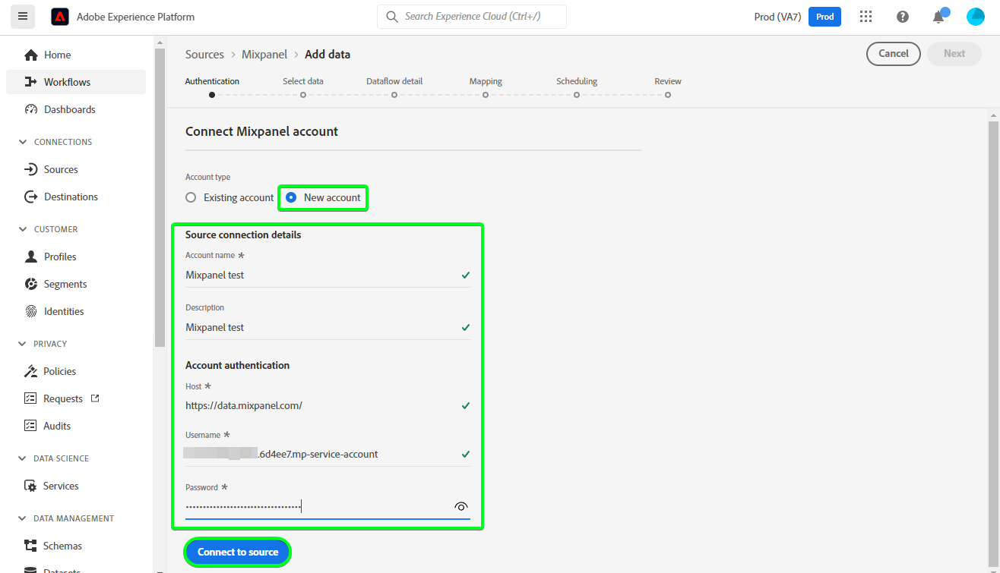

# Skapa en [!DNL Mixpanel] källanslutning i användargränssnittet

Den här självstudiekursen innehåller steg för att skapa en [!DNL Mixpanel] källanslutning med användargränssnittet i Adobe Experience Platform Platform.

## Komma igång

Den här självstudiekursen kräver en fungerande förståelse av följande komponenter i Experience Platform:

* [[!DNL Experience Data Model (XDM)] System](../../../../../xdm/home.md): Det standardiserade ramverk som [!DNL Experience Platform] organiserar kundupplevelsedata.
   * [Grunderna för schemakomposition](../../../../../xdm/schema/composition.md): Lär dig mer om de grundläggande byggstenarna i XDM-scheman, inklusive viktiga principer och bästa praxis när det gäller schemakomposition.
   * [Schemaredigeraren, genomgång](../../../../../xdm/tutorials/create-schema-ui.md): Lär dig hur du skapar anpassade scheman med hjälp av gränssnittet i Schemaredigeraren.
* [[!DNL Real-Time Customer Profile]](../../../../../profile/home.md): Ger en enhetlig konsumentprofil i realtid baserad på aggregerade data från flera källor.

### Samla in nödvändiga inloggningsuppgifter

För att kunna ansluta [!DNL Mixpanel] till Platform måste du ange värden för följande anslutningsegenskaper:

| Autentiseringsuppgifter | Beskrivning | Exempel |
| --- | --- | --- |
| Användarnamn | Användarnamnet för tjänstkontot som motsvarar ditt [!DNL Mixpanel] konto. Se [[!DNL Mixpanel] dokumentation för tjänstkonton](https://developer.mixpanel.com/reference/service-accounts#authenticating-with-a-service-account) för mer information. | `Test8.6d4ee7.mp-service-account` |
| Lösenord | Lösenordet för tjänstkontot som motsvarar ditt [!DNL Mixpanel] konto. | `dLlidiKHpCZtJhQDyN2RECKudMeTItX1` |
| Projekt-ID | Dina [!DNL Mixpanel] projekt-ID. Detta ID krävs för att skapa en källanslutning. Se [[!DNL Mixpanel] dokumentation för projektinställningar](https://help.mixpanel.com/hc/en-us/articles/115004490503-Project-Settings) och [[!DNL Mixpanel] guide för att skapa och hantera projekt](https://help.mixpanel.com/hc/en-us/articles/115004505106-Create-and-Manage-Projects) för mer information. | `2384945` |
| Tidszon | Den tidszon som motsvarar din [!DNL Mixpanel] projekt. Tidszon krävs för att skapa en källanslutning. Se [Dokumentation för projektinställningar på blandpanelen](https://help.mixpanel.com/hc/en-us/articles/115004490503-Project-Settings) för mer information. | `Pacific Standard Time` |

Mer information om hur du autentiserar [!DNL Mixpanel] -källa, se [[!DNL Mixpanel] källöversikt](../../../../connectors/analytics/mixpanel.md).

## Koppla samman [!DNL Mixpanel] konto

Välj **[!UICONTROL Sources]** från det vänstra navigeringsfältet för att komma åt [!UICONTROL Sources] arbetsyta. The [!UICONTROL Catalog] visas en mängd olika källor som du kan använda för att skapa ett konto.

Du kan välja lämplig kategori i katalogen till vänster på skärmen. Du kan också hitta den källa du vill arbeta med med med sökalternativet.

Under *Analyser* kategori, välj [!DNL Mixpanel]och sedan markera **[!UICONTROL Add data]**.

The **[!UICONTROL Connect Mixpanel account]** visas. På den här sidan kan du antingen använda nya autentiseringsuppgifter eller befintliga.

### Befintligt konto

Välj [!DNL Mixpanel] konto som du vill skapa ett nytt dataflöde med och sedan välja **[!UICONTROL Next]** för att fortsätta.

### Nytt konto

Om du skapar ett nytt konto väljer du **[!UICONTROL New account]** och ange sedan ett namn, en valfri beskrivning och dina uppgifter. När du är klar väljer du **[!UICONTROL Connect to source]** och tillåt sedan lite tid för att upprätta den nya anslutningen.

## Välj projekt-ID och tidszon {#project-id-and-timezone}

>[!CONTEXTUALHELP]
>id="platform_sources_mixpanel_timezone"
>title="Ange en tidszon för blandpanelsinmatning"
>abstract="Tidszonen måste vara densamma som tidszonsinställningen för profilen i Mixpanel, eftersom Platform använder den angivna tidszonen för projektet för att hämta relevanta data från Mixpanel. Mixpanel justerar sin tidszon så att den överensstämmer med projektets tidszon innan händelsen spelas in i ett datalager i Mixpanel."
>additional-url="https://experienceleague.adobe.com/docs/experience-platform/sources/ui-tutorials/create/analytics/mixpanel.html#project-id-and-timezone" text="Läs mer i dokumentationen"

När källan har autentiserats anger du ditt projekt-ID och tidszon och väljer sedan **[!UICONTROL Select]**.

Den tidszon som du anger innan du importerar [!DNL Mixpanel] data till plattformen måste vara samma som [!DNL Mixpanel] inställning för tidszon för profil. Ändringar i tidszonen för dina data kommer endast att tillämpas på nya händelser och gamla händelser kommer att finnas kvar i den tidszon som du angav tidigare. [!DNL Mixpanel] har plats för sommartid och anpassar tidsstämpeln för ditt intag på lämpligt sätt. Mer information om hur tidszoner påverkar dina data finns i [!DNL Mixpanel] stödlinje på [hantera tidszoner för projekt](https://help.mixpanel.com/hc/en-us/articles/115004547203-Manage-Timezones-for-Projects-in-Mixpanel).

Efter en liten stund uppdateras rätt gränssnitt till en förhandsgranskningspanel, vilket gör att du kan kontrollera schemat innan du skapar ett dataflöde. När du är klar väljer du **[!UICONTROL Next]**.

## Nästa steg

Genom att följa den här självstudien har du upprättat en anslutning till [!DNL Mixpanel] konto. Du kan nu fortsätta med nästa självstudiekurs och [konfigurera ett dataflöde för att hämta analysdata till plattformen](../../dataflow/analytics.md).

## Ytterligare resurser {#additional-resources}

Avsnitten nedan innehåller ytterligare resurser som du kan använda när du använder [!DNL Mixpanel] källa.

### Validering {#validation}

Följande instruktioner kan du utföra för att verifiera att du har anslutit dina [!DNL Mixpanel] källa och [!DNL Mixpanel] händelser hämtas till Platform.

Välj **[!UICONTROL Datasets]** från det vänstra navigeringsfältet för att komma åt [!UICONTROL Datasets] arbetsyta. The [!UICONTROL Dataset Activity] visas information om körningar.

Välj sedan det dataflödes-ID för dataflödet som du vill visa för att se specifik information om dataflödeskörningen.

Äntligen väljer du **[!UICONTROL Preview dataset]** för att visa de data som har importerats.

Du kan verifiera dessa data mot data på [!DNL Mixpanel] > [!DNL Events] sida. Se [[!DNL Mixpanel] dokument om händelser](https://help.mixpanel.com/hc/en-us/articles/4402837164948-Events-formerly-Live-View-) för mer information.

### Schema för blandpanel

Tabellen nedan visar vilka mappningar som stöds och som måste konfigureras för [!DNL Mixpanel].

>[!TIP]
>
>Se [Event Export API > Download](https://developer.mixpanel.com/reference/raw-event-export) om du vill ha mer information om API:t.

| Källa | Typ |
|---|---|
| `distinct_id` | string |
| `event_name` | string |
| `import` | boolesk |
| `insert_id` | string |
| `item_id` | string |
| `item_name` | string |
| `item_price` | string |
| `mp_api_endpoint` | string |
| `mp_api_timestamp_ms` | heltal |
| `mp_processing_time_ms` | heltal |
| `time` | heltal |

### Gränser {#limits}

* Du har högst 100 samtidiga frågor och 60 frågor per timme enligt den [Gränser för export av API-hastighet](https://help.mixpanel.com/hc/en-us/articles/115004602563-Rate-Limits-for-API-Endpoints).
