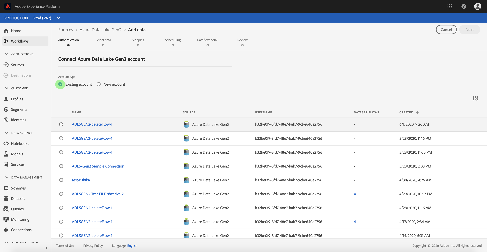

# Skapa en [!DNL Azure Data Lake Storage Gen2] källanslutning i användargränssnittet

Källkopplingar i Adobe Experience Platform gör det möjligt att importera externt källkodsdata på schemalagd basis. I den här självstudiekursen beskrivs hur du autentiserar en [!DNL Azure Data Lake Storage Gen2] (nedan kallad ADLS Gen2) källkoppling med [!DNL Platform] användargränssnittet.

## Komma igång

Den här självstudiekursen kräver en fungerande förståelse av följande komponenter i Adobe Experience Platform:

- [Experience Data Model (XDM) System](../../../../../xdm/home.md): Det standardiserade ramverket som [!DNL Experience Platform] organiserar kundupplevelsedata.
   - [Grundläggande om schemakomposition](../../../../../xdm/schema/composition.md): Lär dig mer om de grundläggande byggstenarna i XDM-scheman, inklusive viktiga principer och bästa praxis när det gäller schemakomposition.
   - [Schemaredigeraren, genomgång](../../../../../xdm/tutorials/create-schema-ui.md): Lär dig hur du skapar anpassade scheman med hjälp av gränssnittet för Schemaredigeraren.
- [Kundprofil](../../../../../profile/home.md)i realtid: Ger en enhetlig konsumentprofil i realtid baserad på aggregerade data från flera källor.

Om du redan har en ADLS Gen2-basanslutning kan du hoppa över resten av det här dokumentet och gå vidare till självstudiekursen om hur du [konfigurerar ett dataflöde](../../dataflow/batch/cloud-storage.md).

### Samla in nödvändiga inloggningsuppgifter

För att kunna autentisera ADLS Gen2-källkopplingen måste du ange värden för följande anslutningsegenskaper:

| Autentiseringsuppgifter | Beskrivning |
| ---------- | ----------- |
| `url` | Slutpunkten för ADLS Gen2. |
| `servicePrincipalId` | Programmets klient-ID. |
| `servicePrincipalKey` | Programmets nyckel. |
| `tenant` | Klientinformationen som innehåller ditt program. |

Mer information om dessa värden finns i [det här ADLS Gen2-dokumentet](https://docs.microsoft.com/en-us/azure/data-factory/connector-azure-data-lake-storage).

## Anslut ditt ADLS Gen2-konto

När du har samlat in dina inloggningsuppgifter kan du följa stegen nedan för att skapa en ny inkommande basanslutning som länkar ditt ADLS Gen2-konto till [!DNL Platform].

Logga in på [Adobe Experience Platform](https://platform.adobe.com) och välj sedan **[!UICONTROL Sources]** i det vänstra navigeringsfältet för att komma åt *[!UICONTROL Sources]* arbetsytan. På fliken *[!UICONTROL Catalog]* visas en mängd olika källor som kan användas för att skapa inkommande basanslutningar. Varje källa visar antalet befintliga basanslutningar som är kopplade till dem.

Under *[!UICONTROL Cloud Storage]* kategorin väljer du **[!UICONTROL Azure Data Lake Gen2]** att visa ett informationsfält till höger på skärmen. Informationsfältet innehåller en kort beskrivning av den valda källan samt alternativ för att ansluta till källvyn och dess dokumentation. Om du vill skapa en ny inkommande basanslutning klickar du på **[!UICONTROL Add data]**.

Dialogrutan *[!UICONTROL Connect to Azure Data Lake Gen2]* visas. På den här sidan kan du antingen använda nya autentiseringsuppgifter eller befintliga.

### Nytt konto

Om du använder nya autentiseringsuppgifter väljer du **[!UICONTROL New Account]**. På indataformuläret som visas anger du basanslutningen med ett namn, en valfri beskrivning och dina ADLS Gen2-autentiseringsuppgifter. När du är klar väljer du **[!UICONTROL Connect]** och tillåt sedan lite tid för att upprätta den nya basanslutningen.

### Befintligt konto

Om du vill ansluta ett befintligt konto väljer du det ADLS Gen2-konto som du vill ansluta till och sedan väljer du **[!UICONTROL Next]** att fortsätta.

## Nästa steg

Genom att följa den här självstudiekursen har du upprättat en basanslutning till ditt ADLS Gen2-konto. Du kan nu fortsätta med nästa självstudiekurs och [konfigurera ett dataflöde för att hämta data från ditt molnlagringsutrymme till plattformen](../../dataflow/batch/cloud-storage.md).