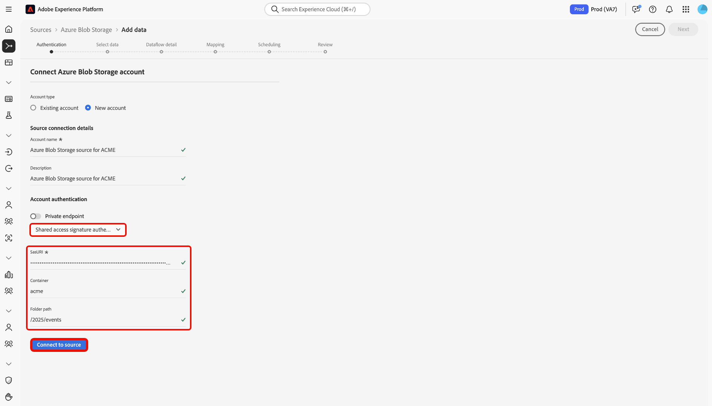

# Anslut [!DNL Azure Blob Storage] till Experience Platform med användargränssnittet

Läs den här vägledningen när du vill lära dig hur du ansluter [!DNL Azure Blob Storage]-instansen till Adobe Experience Platform med hjälp av källarbetsytan i Experience Platform användargränssnitt.

## Komma igång

Den här självstudiekursen kräver en fungerande förståelse av följande komponenter i Adobe Experience Platform:

* [[!DNL Experience Data Model (XDM)] System](../../../../../xdm/home.md): Det standardiserade ramverket för att organisera kundupplevelsedata i Experience Platform.
   * [Grundläggande om schemakomposition](../../../../../xdm/schema/composition.md): Lär dig mer om grundstenarna i XDM-scheman, inklusive nyckelprinciper och bästa metoder för schemakomposition.
   * [Schemaredigeraren, självstudiekurs](../../../../../xdm/tutorials/create-schema-ui.md): Lär dig hur du skapar anpassade scheman med hjälp av gränssnittet för Schemaredigeraren.
* [[!DNL Real-Time Customer Profile]](../../../../../profile/home.md): Tillhandahåller en enhetlig konsumentprofil i realtid baserad på aggregerade data från flera källor.

Om du redan har en giltig [!DNL Azure Blob Storage]-anslutning kan du hoppa över resten av det här dokumentet och gå vidare till självstudiekursen [Konfigurera ett dataflöde](../../dataflow/batch/cloud-storage.md).

### Filformat som stöds

Experience Platform har stöd för följande filformat som kan importeras från externa lagringsplatser:

* Avgränsaravgränsade värden (DSV): Du kan använda valfri enskild kolumnavgränsare, t.ex. tabb, komma, pipe, semikolon eller hash, för att samla in platta filer i vilket format som helst.
* JavaScript Object Notation (JSON): JSON-formaterade datafiler måste vara XDM-kompatibla.
* Apache Parquet: Parquet-formaterade datafiler måste vara XDM-kompatibla.

### Samla in nödvändiga inloggningsuppgifter

Läs [[!DNL Azure Blob Storage] översikten](../../../../connectors/cloud-storage/blob.md#authentication) om du vill ha information om autentisering.

## Navigera i källkatalogen

I Experience Platform-gränssnittet väljer du **[!UICONTROL Sources]** i den vänstra navigeringen för att komma åt arbetsytan i *[!UICONTROL Sources]*. Välj en kategori eller använd sökfältet för att hitta källan.

Om du vill ansluta till [!DNL Azure Blob Storage] går du till kategorin *[!UICONTROL Cloud storage]*, markerar **[!UICONTROL Azure Blob Storage]**-källkortet och väljer **[!UICONTROL Set up]**.

>[!TIP]
>
>Källor visar **[!UICONTROL Set up]** för nya anslutningar och **[!UICONTROL Add data]** om ett konto redan finns.

## Använd ett befintligt konto

Om du vill använda ett befintligt konto väljer du **[!UICONTROL Existing account]** och sedan det [!DNL Azure Blob Storage]-konto som du vill använda.

## Skapa ett nytt konto

Om du vill skapa ett nytt konto väljer du **[!UICONTROL New account]** och anger sedan ett namn och kan lägga till en beskrivning för ditt konto. Du kan ansluta ditt [!DNL Azure Blob Storage]-konto till Experience Platform med följande autentiseringstyper:

* **Verifiering av kontonyckel**: Lagringskontots åtkomstnyckel används för att autentisera och ansluta till ditt [!DNL Azure Blob Storage]-konto.
* **Delad åtkomstsignatur (SAS)**: Använder en SAS-URI för att ge delegerad, tidsbegränsad åtkomst till resurser i ditt [!DNL Azure Blob Storage]-konto.
* **Tjänsthuvudbaserad autentisering**: Använder ett Azure Active Directory-tjänstens huvudnamn (AAD) (klient-ID och hemlighet) för att autentisera på ditt Azure Blob Storage-konto på ett säkert sätt.

>[!BEGINTABS]

>[!TAB Autentisering av kontonyckel]

Välj **[!UICONTROL Account key authentication]** och ange din `connectionString`, `container` och `folderPath`. Välj sedan **[!UICONTROL Connect to source]** och tillåt en stund så att anslutningen kan upprättas.

>[!TAB Delad åtkomstsignatur]

Välj **[!UICONTROL Shared access signature]** och ange din `sasUri`, `container` och `folderPath`. Välj sedan **[!UICONTROL Connect to source]** och tillåt en stund så att anslutningen kan upprättas.

>[!TAB Tjänstens huvudbaserade autentisering]

Välj **[!UICONTROL Service principal based authentication]** och ange din `serviceEndpoint`, `servicePrincipalId`, `servicePrincipalKey`, `accountKind`, `tenant`, `container` och `folderPath`. Välj sedan **[!UICONTROL Connect to source]** och tillåt en stund så att anslutningen kan upprättas.

>[!ENDTABS]

## Nästa steg

Genom att följa den här självstudiekursen har du upprättat en anslutning till ditt [!DNL Azure Blob Storage]-konto. Du kan nu fortsätta till nästa självstudiekurs och [konfigurera ett dataflöde för att hämta data från ditt molnlagringsutrymme till Experience Platform](../../dataflow/batch/cloud-storage.md).
