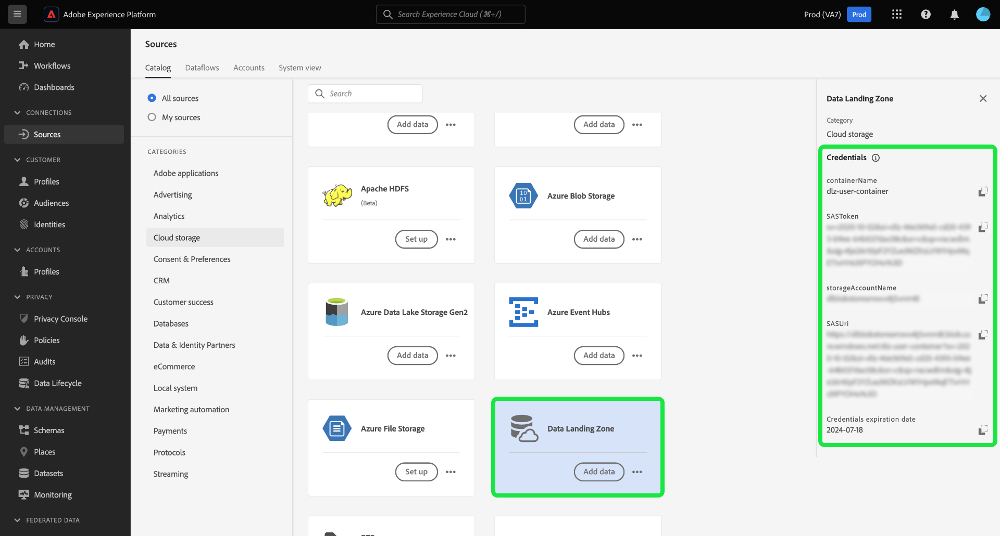

# Anslut [!DNL Data Landing Zone] till Experience Platform med användargränssnittet

>[!IMPORTANT]
>
>Den här sidan är specifik för [!DNL Data Landing Zone] *source*-anslutningen i Experience Platform. Information om hur du ansluter till [!DNL Data Landing Zone] *destination*-kopplingen finns på [[!DNL Data Landing Zone] dokumentationssidan för målet](/help/destinations/catalog/cloud-storage/data-landing-zone.md).

[!DNL Data Landing Zone] är en säker, molnbaserad fillagringsfunktion som hämtar filer till Adobe Experience Platform. Data tas automatiskt bort från [!DNL Data Landing Zone] efter sju dagar.

I den här självstudien beskrivs hur du skapar en [!DNL Data Landing Zone]-källanslutning med Experience Platform-användargränssnittet.

## Komma igång

Den här självstudiekursen kräver en fungerande förståelse av följande komponenter i Adobe Experience Platform:

* [Källor](../../../../home.md): Med Experience Platform kan data hämtas från olika källor samtidigt som du kan strukturera, etikettera och förbättra inkommande data med hjälp av Experience Platform tjänster.
* [Sandlådor](../../../../../sandboxes/home.md): Experience Platform tillhandahåller virtuella sandlådor som partitionerar en enda Experience Platform-instans till separata virtuella miljöer för att utveckla och utveckla program för digitala upplevelser.

## Hämta filer från [!DNL Data Landing Zone] till Experience Platform

>[!IMPORTANT]
>
> Om du vill ansluta till källan måste du ha åtkomstkontrollsbehörigheterna **[!UICONTROL View Sources]** och **[!UICONTROL Manage Sources]**. Läs [åtkomstkontrollsöversikten](../../../../../access-control/home.md) eller kontakta produktadministratören för att få den behörighet som krävs.

I Experience Platform-gränssnittet väljer du **[!UICONTROL Sources]** i den vänstra navigeringen för att komma åt arbetsytan i [!UICONTROL Sources]. På skärmen [!UICONTROL Catalog] visas en mängd olika källor som du kan skapa ett konto med.

Du kan välja lämplig kategori i katalogen till vänster på skärmen. Du kan också använda sökfältet till att hitta den källa du vill arbeta med.

Under kategorin [!UICONTROL cloud storage] väljer du [!DNL Data Landing Zone] och sedan **[!UICONTROL Add data]**.

[!UICONTROL Add data]-steget visas med ett gränssnitt där du kan välja och förhandsgranska data som du vill hämta till Experience Platform.

* Den vänstra delen av gränssnittet är en mappläsare som visar en lista över filer från behållaren som du sedan kan hämta till Experience Platform.
* Med den högra delen av gränssnittet kan du förhandsgranska upp till 100 rader data från en kompatibel fil.

Markera den fil som du vill hämta till Experience Platform och tillåt en stund så att rätt gränssnitt kan uppdateras till en förhandsvisningsskärm.

>[!TIP]
>
>Experience Platform identifierar automatiskt egenskapsinformation för filen som du har markerat, inklusive information om filens dataformat, angiven kolumnavgränsare och komprimeringstyp.

I förhandsvisningsgränssnittet kan du inspektera innehållet och strukturen i en fil. Som standard visas den första filen i den markerade mappen i förhandsvisningsgränssnittet.

Om du vill förhandsgranska en annan fil markerar du förhandsvisningsikonen bredvid namnet på filen som du vill inspektera.

När du är klar väljer du **[!UICONTROL Next]**.

En detaljerad steg-för-steg-guide om hur du skapar ett dataflöde för en molnlagringskälla finns i självstudiekursen [Skapa ett molnlagringsdataflöde för att hämta data till Experience Platform](../../dataflow/batch/cloud-storage.md).

## Hämta dina [!DNL Data Landing Zone]-autentiseringsuppgifter

[!DNL Data Landing Zone] är en källa som medföljer din Adobe Experience Platform Sources-licens. [!DNL Data Landing Zone] använder en SAS-URI och SAS-tokenbaserad autentisering. Du kan hämta autentiseringsuppgifter från sidan [!UICONTROL Sources catalog].

Om du vill hämta dina inloggningsuppgifter markerar du **[!UICONTROL Data Landing Zone]**-kortet och kopierar sedan dina inloggningsuppgifter från den högra listen som visas.

En pover visas med ditt behållarnamn, SAS-token, lagringskontonamn, SAS-URI och förfallodatum.

## Uppdatera dina [!DNL Data Landing Zone]-autentiseringsuppgifter

Dina [!DNL Data Landing Zone]-autentiseringsuppgifter har angetts till att automatiskt upphöra att gälla efter 90 dagar och du måste använda nya autentiseringsuppgifter för att återansluta till [!DNL Data Landing Zone] efter att de har upphört att gälla. Dina dataflöden i Experience Platform påverkas inte av att inloggningsuppgifterna har upphört att gälla och du kan fortfarande arbeta med nya och befintliga dataflöden med dina nya inloggningsuppgifter.

Det finns två sätt att uppdatera autentiseringsuppgifterna för [!DNL Data Landing Zone]:

>[!BEGINTABS]

>[!TAB Använd källkortet]

Om du vill uppdatera dina autentiseringsuppgifter från källkatalogsidan markerar du ellipserna (**`...`**) på [!DNL Data Landing Zone]-kortet och väljer sedan **[!UICONTROL Refresh credentials]**.

Ett popup-fönster visas där du uppmanas bekräfta åtgärden innan du kan fortsätta. Välj **[!UICONTROL Refresh credentials]** när du är klar.

>[!TAB Använd rätt spår]

Om du vill uppdatera dina autentiseringsuppgifter med rätt spår väljer du **[!UICONTROL Data Landing Zone]**-källkortet och sedan **[!UICONTROL More actions]**. Välj sedan **[!UICONTROL Refresh Credentials]** och bekräfta med popup-fönstret som visas.

>[!ENDTABS]

## Nästa steg

Genom att följa den här självstudiekursen har du öppnat din [!DNL Data Landing Zone]-behållare och lärt dig att hämta och uppdatera dina autentiseringsuppgifter. Du kan nu gå vidare till nästa självstudiekurs om att [skapa ett dataflöde för att hämta data från ett molnlagringsutrymme till Experience Platform](../../dataflow/batch/cloud-storage.md).
