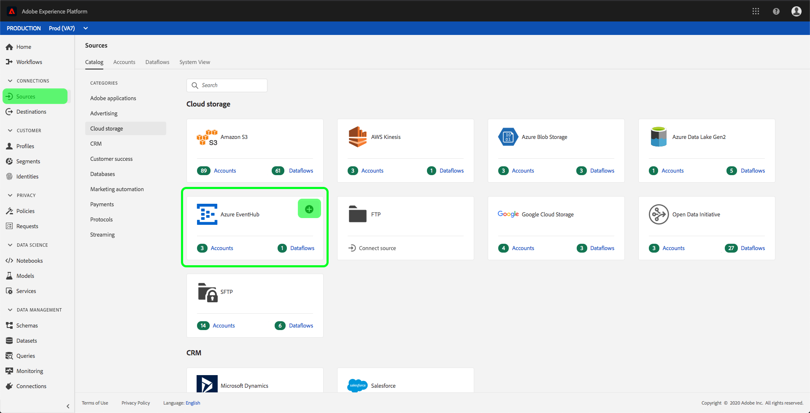

# Skapa en [!DNL Azure Event Hubs] källanslutning i användargränssnittet

>[!NOTE]
> Kopplingen [!DNL Azure Event Hubs] är i betaversion. Mer information om hur du använder betatecknade anslutningar finns i [Källor-översikten](../../../../home.md#terms-and-conditions) .

Källkopplingar i Adobe Experience Platform gör det möjligt att importera externt källkodsdata på schemalagd basis. I den här självstudiekursen beskrivs hur du autentiserar en [!DNL Azure Event Hubs] källkoppling (nedan kallad[!DNL Event Hubs]) med hjälp av [!DNL Platform] användargränssnittet.

## Komma igång

Den här självstudiekursen kräver en fungerande förståelse av följande komponenter i Adobe Experience Platform:

- [Experience Data Model (XDM) System](../../../../../xdm/home.md): Det standardiserade ramverket som [!DNL Experience Platform] organiserar kundupplevelsedata.
   - [Grundläggande om schemakomposition](../../../../../xdm/schema/composition.md): Lär dig mer om de grundläggande byggstenarna i XDM-scheman, inklusive viktiga principer och bästa praxis när det gäller schemakomposition.
   - [Schemaredigeraren, genomgång](../../../../../xdm/tutorials/create-schema-ui.md): Lär dig hur du skapar anpassade scheman med hjälp av gränssnittet för Schemaredigeraren.
- [Kundprofil](../../../../../profile/home.md)i realtid: Ger en enhetlig konsumentprofil i realtid baserad på aggregerade data från flera källor.

Om du redan har ett [!DNL Event Hubs] konto kan du hoppa över resten av det här dokumentet och gå vidare till självstudiekursen om hur du [konfigurerar ett dataflöde](../../dataflow/streaming/cloud-storage.md).

### Samla in nödvändiga inloggningsuppgifter

För att kunna autentisera [!DNL Event Hubs] källkopplingen måste du ange värden för följande anslutningsegenskaper:

| Autentiseringsuppgifter | Beskrivning |
| ---------- | ----------- |
| `sasKeyName` | Auktoriseringsregelns namn, som också kallas SAS-nyckelnamn. |
| `sasKey` | Den genererade signaturen för delad åtkomst. |
| `namespace` | Namnutrymmet för det [!DNL Event Hubs] du försöker komma åt. |

Mer information om dessa värden finns i [det här händelsehubbsdokumentet](https://docs.microsoft.com/en-us/azure/event-hubs/authenticate-shared-access-signature).

## Anslut ditt [!DNL Event Hubs] konto

När du har samlat in dina inloggningsuppgifter kan du följa stegen nedan för att länka ditt [!DNL Event Hubs] konto till [!DNL Platform].

Logga in på [Adobe Experience Platform](https://platform.adobe.com) och välj sedan **[!UICONTROL Sources]** i det vänstra navigeringsfältet för att komma åt arbetsytan *Källor* . På *[!UICONTROL Catalog]* fliken visas en mängd olika källor som du kan ansluta till [!DNL Platform]. Varje källa visar antalet befintliga konton som är kopplade till dem.

Under *[!UICONTROL Cloud Storage]* kategorin väljer du **[!UICONTROL Azure Event Hubs]** följt av **[!UICONTROL Add data]** för att skapa en ny Event Hubs-koppling.

Dialogrutan *[!UICONTROL Connect to Azure Event Hubs]* visas. På den här sidan kan du antingen använda nya autentiseringsuppgifter eller befintliga.

### Nytt konto

Om du använder nya autentiseringsuppgifter väljer du **[!UICONTROL New Account]**. Ange ett namn, en valfri beskrivning och autentiseringsuppgifter för händelsehubbar i det indataformulär som visas. När du är klar väljer du **[!UICONTROL Connect]** och tillåt sedan en tid för att upprätta den nya anslutningen.

### Befintligt konto

Om du vill ansluta ett befintligt konto väljer du det Event Hubs-konto som du vill ansluta till och väljer sedan **[!UICONTROL Next]** att fortsätta.

## Nästa steg

Genom att följa den här självstudiekursen har du kopplat ditt Event Hubs-konto till [!DNL Platform]. Du kan nu fortsätta med nästa självstudiekurs och [konfigurera ett dataflöde för att hämta data från ditt molnlagringsutrymme till plattformen](../../dataflow/streaming/cloud-storage.md).