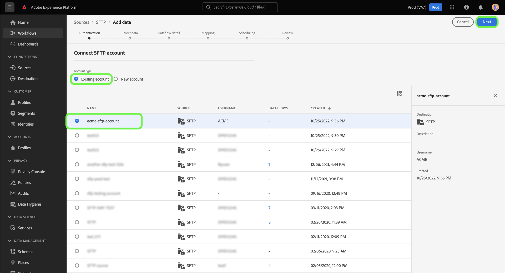

# Skapa en FTP- eller SFTP-källanslutning i användargränssnittet

>[!NOTE]
>FTP- och SFTP-anslutningarna är i betaversion. Mer information om hur du använder betatecknade anslutningar finns i [Källor-översikten](../../../../home.md#terms-and-conditions) .

Källkopplingar i Adobe Experience Platform gör det möjligt att importera externt källkodsdata på schemalagd basis. I den här självstudiekursen beskrivs hur du skapar en FTP- eller SFTP-källkoppling med [!DNL Platform] användargränssnittet.

## Komma igång

Den här självstudiekursen kräver en fungerande förståelse av följande komponenter i Adobe Experience Platform:

* [Experience Data Model (XDM) System](../../../../../xdm/home.md): Det standardiserade ramverk som Experience Platform använder för att ordna kundupplevelsedata.
   * [Grundläggande om schemakomposition](../../../../../xdm/schema/composition.md): Lär dig mer om de grundläggande byggstenarna i XDM-scheman, inklusive viktiga principer och bästa praxis när det gäller schemakomposition.
   * [Schemaredigeraren, genomgång](../../../../../xdm/tutorials/create-schema-ui.md): Lär dig hur du skapar anpassade scheman med hjälp av gränssnittet för Schemaredigeraren.
* [Kundprofil](../../../../../profile/home.md)i realtid: Ger en enhetlig konsumentprofil i realtid baserad på aggregerade data från flera källor.

Om du redan har en giltig FTP- eller SFTP-anslutning kan du hoppa över resten av det här dokumentet och gå vidare till självstudiekursen om hur du [konfigurerar ett dataflöde](../../dataflow/batch/cloud-storage.md).

### Filformat som stöds

[!DNL Experience Platform] har stöd för följande filformat som ska importeras från externa källor:

* Avgränsaravgränsade värden (DSV): Stödet för DSV-formaterade datafiler är för närvarande begränsat till kommaseparerade värden (CSV). Värdet för fältrubriker i DSV-formaterade filer får endast bestå av alfanumeriska tecken och understreck. Stöd för allmän DSV ska ges i framtiden.
* JavaScript-objektnotation (JSON): JSON-formaterade datafiler måste vara XDM-kompatibla.
* Apache Parquet: Parquet-formaterade datafiler måste vara XDM-kompatibla.

### Samla in nödvändiga inloggningsuppgifter

För att få åtkomst till FTP- eller SFTP-servern på [!DNL Platform]måste du ange serverns **värdnamn**, ett **användarnamn** och ett **lösenord**.

## Anslut till FTP- eller SFTP-servern

När du har samlat in de nödvändiga inloggningsuppgifterna kan du följa stegen nedan för att skapa ett nytt FTP- eller SFTP-konto att ansluta till [!DNL Platform].

Logga in på [Adobe Experience Platform](https://platform.adobe.com) och välj sedan **[!UICONTROL Sources]** i det vänstra navigeringsfältet för att komma åt *[!UICONTROL Sources]* arbetsytan. På *[!UICONTROL Catalog]* skärmen visas en mängd olika källor som du kan skapa ett inkommande konto för, och varje källa visar antalet befintliga konton och dataflöden som är kopplade till dem.

Du kan välja lämplig kategori i katalogen till vänster på skärmen. Du kan också hitta den källa du vill arbeta med med med sökalternativet.

Under *[!UICONTROL Databases]* kategorin väljer du **[!UICONTROL SFTP]** följt av **[!UICONTROL Add data]** för att skapa en ny FTP- eller SFTP-koppling.

Sidan visas *[!UICONTROL Connect to SFTP]* . På den här sidan kan du antingen använda nya autentiseringsuppgifter eller befintliga.

### Nytt konto

Om du använder nya autentiseringsuppgifter väljer du **[!UICONTROL New account]**. Ange ett namn, en valfri beskrivning och dina FTP- eller SFTP-autentiseringsuppgifter på det indataformulär som visas. När du är klar väljer du **[!UICONTROL Connect]** och tillåt sedan en tid för det nya kontot att upprätta.

### Befintligt konto

Om du vill ansluta ett befintligt konto markerar du det FTP- eller SFTP-konto som du vill ansluta till och väljer sedan **[!UICONTROL Next]** att fortsätta.

## Nästa steg

Genom att följa den här självstudiekursen har du upprättat en anslutning till ditt FTP- eller SFTP-konto. Du kan nu fortsätta med nästa självstudiekurs och [konfigurera ett dataflöde för att hämta data från ditt molnlagringsutrymme till plattformen](../../dataflow/batch/cloud-storage.md).