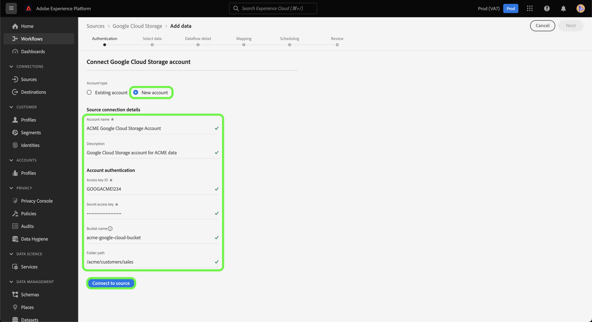

# Skapa en [!DNL Google Cloud Storage]-källanslutning i användargränssnittet

I den här självstudiekursen beskrivs hur du skapar en [!DNL Google Cloud Storage]-källanslutning med Adobe Experience Platform-gränssnittet.

## Komma igång

Den här självstudiekursen kräver en fungerande förståelse av följande komponenter i Adobe Experience Platform:

* [[!DNL Experience Data Model (XDM)] System](../../../../../xdm/home.md): Det standardiserade ramverk som Experience Platform använder för att ordna kundupplevelsedata.
   * [Grundläggande om schemakomposition](../../../../../xdm/schema/composition.md): Lär dig mer om grundstenarna i XDM-scheman, inklusive nyckelprinciper och bästa metoder för schemakomposition.
   * [Schemaredigeraren, självstudiekurs](../../../../../xdm/tutorials/create-schema-ui.md): Lär dig hur du skapar anpassade scheman med hjälp av gränssnittet för Schemaredigeraren.
* [[!DNL Real-Time Customer Profile]](../../../../../profile/home.md): Tillhandahåller en enhetlig konsumentprofil i realtid baserad på aggregerade data från flera källor.

Om du redan har en giltig [!DNL Google Cloud Storage]-anslutning kan du hoppa över resten av det här dokumentet och gå vidare till självstudiekursen [Konfigurera ett dataflöde](../../dataflow/batch/cloud-storage.md).

### Filformat som stöds

[!DNL Experience Platform] har stöd för följande filformat som ska importeras från externa lagringsplatser:

* Avgränsaravgränsade värden (DSV): Alla värden med ett tecken kan användas som avgränsare för DSV-formaterade datafiler.
* JavaScript Object Notation (JSON): JSON-formaterade datafiler måste vara XDM-kompatibla.
* Apache Parquet: Parquet-formaterade datafiler måste vara XDM-kompatibla.

### Samla in nödvändiga inloggningsuppgifter

Du måste ange följande värden för att komma åt dina [!DNL Google Cloud Storage]-data på Experience Platform:

| Autentiseringsuppgifter | Beskrivning |
| ---------- | ----------- |
| Åtkomstnyckel-ID | En alfanumerisk sträng på 61 tecken som används för att autentisera ditt [!DNL Google Cloud Storage]-konto för Experience Platform. |
| Nyckel för hemlig åtkomst | En 40-siffrig, base-64-kodad sträng som används för att autentisera ditt [!DNL Google Cloud Storage]-konto för Experience Platform. |
| Buckennamn | Namnet på din [!DNL Google Cloud Storage]-bucket. Du måste ange ett bucketnamn om du vill ge åtkomst till en viss undermapp i molnlagringen. |
| Mappsökväg | Sökvägen till mappen som du vill ge åtkomst till. |

Mer information om dessa värden finns i handboken [Google Cloud Storage HMAC keys](https://cloud.google.com/storage/docs/authentication/hmackeys#overview). Anvisningar om hur du skapar ditt eget ID för åtkomstnyckel och hemlig åtkomstnyckel finns i [[!DNL Google Cloud Storage] översikten](../../../../connectors/cloud-storage/google-cloud-storage.md).

När du har samlat in de nödvändiga inloggningsuppgifterna kan du följa stegen nedan för att länka ditt [!DNL Google Cloud Storage]-konto till Experience Platform.

## Anslut ditt [!DNL Google Cloud Storage]-konto

I Experience Platform-gränssnittet väljer du **[!UICONTROL Sources]** i det vänstra navigeringsfältet för att komma åt arbetsytan i [!UICONTROL Sources]. På skärmen [!UICONTROL Catalog] visas en mängd olika källor som du kan använda för att skapa ett konto.

Du kan välja lämplig kategori i katalogen till vänster på skärmen. Du kan också hitta den källa du vill arbeta med med med sökalternativet.

Under kategorin [!UICONTROL Cloud storage] väljer du **[!UICONTROL Google Cloud Storage]** och sedan **[!UICONTROL Add data]**.

Sidan **[!UICONTROL Connect to Google Cloud Storage]** visas. På den här sidan kan du antingen använda nya autentiseringsuppgifter eller befintliga.

### Befintligt konto

Om du vill ansluta ett befintligt konto markerar du det [!DNL Google Cloud Storage]-konto du vill ansluta till och väljer sedan **[!UICONTROL Next]** för att fortsätta.

### Nytt konto

Om du använder nya autentiseringsuppgifter väljer du **[!UICONTROL New account]**. Ange ett namn, en valfri beskrivning och dina [!DNL Google Cloud Storage]-inloggningsuppgifter på det indataformulär som visas. Under det här steget kan du även ange vilka undermappar ditt konto ska ha åtkomst till genom att definiera namnet på sökvägen till undermappen.

När du är klar väljer du **[!UICONTROL Connect to source]** och tillåt sedan lite tid för att upprätta den nya anslutningen.

## Nästa steg

Genom att följa den här självstudiekursen har du upprättat en anslutning till ditt [!DNL Google Cloud Storage]-konto. Du kan nu fortsätta till nästa självstudiekurs och [konfigurera ett dataflöde för att hämta data från ditt molnlagringsutrymme till Experience Platform](../../dataflow/batch/cloud-storage.md).
