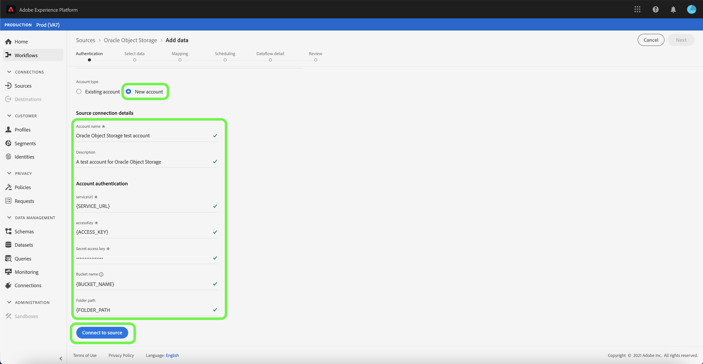

# Skapa en [!DNL Oracle Object Storage]-källanslutning i användargränssnittet

I den här självstudiekursen beskrivs hur du skapar en [!DNL Oracle Object Storage]-källanslutning med Adobe Experience Platform-gränssnittet.

## Komma igång

Den här självstudiekursen kräver en fungerande förståelse av följande komponenter i Adobe Experience Platform:

* [Källor](../../../../home.md): Experience Platform tillåter att data kan hämtas från olika källor samtidigt som du kan strukturera, märka och förbättra inkommande data med hjälp av plattformstjänster.
* [Sandlådor](../../../../../sandboxes/home.md): Experience Platform tillhandahåller virtuella sandlådor som partitionerar en enda plattformsinstans i separata virtuella miljöer för att utveckla och utveckla program för digitala upplevelser.

### Samla in nödvändiga inloggningsuppgifter

För att kunna ansluta till [!DNL Oracle Object Storage] måste du ange värden för följande anslutningsegenskaper:

| Autentiseringsuppgifter | Beskrivning |
| ---------- | ----------- |
| `serviceUrl` | Slutpunkten [!DNL Oracle Object Storage] krävs för autentisering. Slutpunktsformatet är: `https://{OBJECT_STORAGE_NAMESPACE}.compat.objectstorage.eu-frankfurt-1.oraclecloud.com` |
| `accessKey` | Åtkomstnyckel-ID för [!DNL Oracle Object Storage] krävs för autentisering. |
| `secretKey` | Lösenordet [!DNL Oracle Object Storage] krävs för autentisering. |
| `bucketName` | Det tillåtna bucket-namn som krävs om användaren har begränsad åtkomst. Bucketnamnet måste innehålla mellan tre och 63 tecken, det måste börja och sluta med en bokstav eller en siffra och får bara innehålla gemena bokstäver, siffror eller bindestreck (`-`). Det går inte att formatera bucket-namnet som en IP-adress. |
| `folderPath` | Den tillåtna mappsökväg som krävs om användaren har begränsad åtkomst. |

Mer information om hur du hämtar dessa värden finns i [Autentiseringsguiden för Oracle Object Storage](https://docs.oracle.com/en-us/iaas/Content/Identity/Concepts/usercredentials.htm#User_Credentials).

När du har samlat in dina nödvändiga inloggningsuppgifter kan du följa stegen nedan för att skapa ett nytt Oracle Object Storage-konto för att ansluta till plattformen.

## Anslut till Oracle Object Storage

Välj **[!UICONTROL Sources]** från vänster navigering i plattformsgränssnittet för att komma åt arbetsytan [!UICONTROL Sources]. Skärmen [!UICONTROL Catalog] innehåller en mängd olika källor som du kan skapa ett konto med.

Du kan välja lämplig kategori i katalogen till vänster på skärmen. Du kan också använda sökfältet till att hitta den källa du vill arbeta med.

Under kategorin [!UICONTROL Cloud storage] väljer du **[!UICONTROL Oracle Object Storage]** och sedan **[!UICONTROL Add data]**.

### Befintligt konto

Om du vill använda ett befintligt konto väljer du det [!DNL Oracle Object Storage]-konto som du vill skapa ett nytt dataflöde med och väljer sedan **[!UICONTROL Next]** för att fortsätta.

### Nytt konto

Om du skapar ett nytt konto väljer du **[!UICONTROL New account]** och anger sedan ett namn, en valfri beskrivning och dina [!DNL Oracle Object Storage]-autentiseringsuppgifter. När du är klar väljer du **[!UICONTROL Connect to source]** och tillåt sedan lite tid för att upprätta den nya anslutningen.

## Nästa steg

Genom att följa den här självstudiekursen har du upprättat en anslutning till ditt [!DNL Oracle Object Storage]-konto. Du kan nu gå vidare till nästa självstudiekurs om att [konfigurera ett dataflöde för att hämta data från ditt molnlagringsutrymme till plattformen](../../dataflow/batch/cloud-storage.md).
