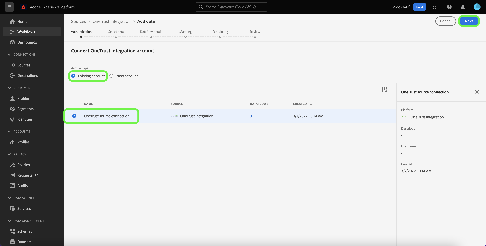

# (Beta) Skapa en [!DNL OneTrust Integration] källanslutning i användargränssnittet

>[!NOTE]
>
>The [!DNL OneTrust Integration] källan är i betaversion. Dess funktioner och dokumentation kan komma att ändras. Mer information om hur du använder betamärkta källor finns i [källöversikt](../../../../home.md#terms-and-conditions).

Den här självstudiekursen innehåller steg för att skapa en [[!DNL OneTrust Integration]](https://my.onetrust.com/s/contactsupport?language=en_US) källanslutning för inmatning av både historiska och schemalagda medgivandedata i Adobe Experience Platform med hjälp av användargränssnittet för plattformen.

## Förutsättningar

>[!IMPORTANT]
>
>The [!DNL OneTrust Integration] källkopplingen och dokumentationen skapades av [!DNL OneTrust Integration] team. Kontakta [[!DNL OneTrust] team](https://my.onetrust.com/s/contactsupport?language=en_US) direkt.

Innan du kan ansluta [!DNL OneTrust Integration] till Platform måste du först hämta din åtkomsttoken. Detaljerade instruktioner om hur du hittar din åtkomsttoken finns i [[!DNL OneTrust Integration] OAuth 2 guide](https://developer.onetrust.com/docs/api-docs-v3/b3A6MjI4OTUyOTc-generate-access-token).

Åtkomsttoken uppdateras inte automatiskt när den har upphört att gälla eftersom uppdateringstoken för system-till-system inte stöds av [!DNL OneTrust]. Därför måste du se till att din åtkomsttoken uppdateras i anslutningen innan den upphör att gälla. Den maximala konfigurerbara livslängden för en åtkomsttoken är ett år. Mer information om hur du uppdaterar din åtkomsttoken finns i [[!DNL OneTrust] dokument om hur du hanterar dina OAuth 2.0-klientautentiseringsuppgifter](https://developer.onetrust.com/docs/documentation/ZG9jOjIyODk1MTUw-managing-o-auth-2-0-client-credentials).

### Samla in nödvändiga inloggningsuppgifter

För att kunna ansluta [!DNL OneTrust Integration] till Platform måste du ange värden för följande autentiseringsuppgifter:

| Autentiseringsuppgifter | Beskrivning | Exempel |
| --- | --- | --- |
| Värdnamn | Den miljö som [!DNL OneTrust Integration] data måste hämtas från. | `https://uat.onetrust.com/` |
| Test-URL för auktorisering | (Valfritt) URL:en för auktoriseringstestet används för att validera autentiseringsuppgifter när en basanslutning skapas. Om inget anges kontrolleras autentiseringsuppgifterna automatiskt när du skapar en källanslutning i stället. |  |
| Åtkomsttoken | Åtkomsttoken som motsvarar din [!DNL OneTrust Integration] konto. | `ZGFkZDMyMjFhMmEyNDQ2ZGFhNTdkZjNkZjFmM2IyOWE6QjlUSERVUTNjOFVsRmpEZTJ6Vk9oRnF3Sk8xNlNtcm4=` |

Mer information om dessa autentiseringsuppgifter finns i [[!DNL OneTrust Integration] autentiseringsdokumentation](https://developer.onetrust.com/docs/api-docs-v3/b3A6MjI4OTUyOTc-generate-access-token).

## Koppla samman [!DNL OneTrust Integration] konto

>[!NOTE]
>
>The [!DNL OneTrust Integration] API-specifikationer delas med Adobe för datainhämtning.

Välj **[!UICONTROL Sources]** från vänster navigering för att komma åt [!UICONTROL Sources] arbetsyta. The [!UICONTROL Catalog] visas en mängd olika källor som du kan använda för att skapa ett konto.

Du kan välja lämplig kategori i katalogen till vänster på skärmen. Du kan också hitta den källa du vill arbeta med med med sökalternativet.

Under *[!UICONTROL Consent & Preferences]* kategori, välj [!DNL OneTrust Integration]och sedan markera **[!UICONTROL Add data]**.

The **[!UICONTROL Connect OneTrust Integration account]** visas. På den här sidan kan du antingen använda nya autentiseringsuppgifter eller befintliga.

### Befintligt konto

Om du vill använda ett befintligt konto väljer du [!DNL OneTrust Integration] konto som du vill skapa ett nytt dataflöde med och sedan välja **[!UICONTROL Next]** för att fortsätta.

### Nytt konto

Om du skapar ett nytt konto väljer du **[!UICONTROL New account]** och ange sedan ett namn, en valfri beskrivning och dina uppgifter. När du är klar väljer du **[!UICONTROL Connect to source]** och tillåt sedan lite tid för att upprätta den nya anslutningen.

## Nästa steg

Genom att följa den här självstudiekursen har du upprättat en anslutning till [!DNL OneTrust Integration] konto. Du kan nu fortsätta med nästa självstudiekurs och [konfigurera ett dataflöde för att hämta data om samtycke till plattformen](../../dataflow/consent-and-preferences.md).
