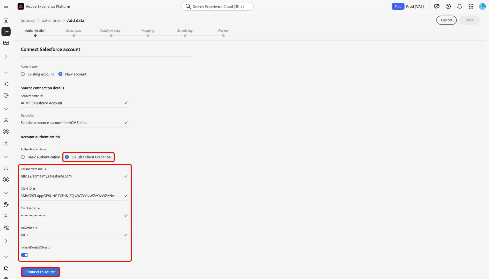

# Anslut ditt [!DNL Salesforce]-konto till Experience Platform med användargränssnittet

Läs den här vägledningen när du vill lära dig hur du ansluter ditt [!DNL Salesforce]-konto och överför dina CRM-data till Adobe Experience Platform med Experience Platform användargränssnitt.

## Komma igång

Den här självstudiekursen kräver en fungerande förståelse av följande komponenter i Experience Platform:

* [[!DNL Experience Data Model (XDM)] System](../../../../../xdm/home.md): Det standardiserade ramverk som Experience Platform använder för att ordna kundupplevelsedata.
   * [Grundläggande om schemakomposition](../../../../../xdm/schema/composition.md): Lär dig mer om grundstenarna i XDM-scheman, inklusive nyckelprinciper och bästa metoder för schemakomposition.
   * [Schemaredigeraren, självstudiekurs](../../../../../xdm/tutorials/create-schema-ui.md): Lär dig hur du skapar anpassade scheman med hjälp av gränssnittet för Schemaredigeraren.
* [[!DNL Real-Time Customer Profile]](../../../../../profile/home.md): Tillhandahåller en enhetlig konsumentprofil i realtid baserad på aggregerade data från flera källor.

Om du redan har ett autentiserat [!DNL Salesforce]-konto kan du hoppa över resten av det här dokumentet och gå vidare till självstudiekursen [Konfigurera ett dataflöde för CRM-data](../../dataflow/crm.md).

### Samla in nödvändiga inloggningsuppgifter {#gather-required-credentials}

>[!WARNING]
>
>Grundläggande autentisering för källan [!DNL Salesforce] kommer att bli inaktuell i januari 2026. Du måste flytta till autentiseringen för OAuth 2-klientautentiseringsuppgifter för att kunna fortsätta använda källan och hämta data från ditt [!DNL Salesforce]-konto till Experience Platform.

Källan [!DNL Salesforce] stöder grundläggande autentisering och autentiseringsuppgifter för OAuth2-klient.

>[!BEGINTABS]

>[!TAB Grundläggande autentisering]

Du måste ange värden för följande autentiseringsuppgifter för att kunna ansluta ditt [!DNL Salesforce]-konto med grundläggande autentisering.

| Autentiseringsuppgifter | Beskrivning |
| --- | --- |
| Miljö-URL | URL:en för [!DNL Salesforce]-källinstansen. Formatet för miljö-URL är `https://[domain].my.salesforce.com`. |
| Användarnamn | Användarnamnet för användarkontot [!DNL Salesforce]. |
| Lösenord | Lösenordet för användarkontot [!DNL Salesforce]. |
| Säkerhetstoken | Säkerhetstoken för användarkontot [!DNL Salesforce]. |
| API-version | (Valfritt) REST API-versionen för den [!DNL Salesforce]-instans som du använder. Värdet för API-versionen måste formateras med ett decimaltecken. Om du till exempel använder API-version `52` måste du ange värdet som `52.0`. Om fältet lämnas tomt kommer Experience Platform automatiskt att använda den senaste tillgängliga versionen. |

Mer information om autentisering finns i [den här [!DNL Salesforce] autentiseringsguiden](https://developer.salesforce.com/docs/atlas.en-us.api_rest.meta/api_rest/quickstart_oauth.htm).

>[!TAB Autentiseringsuppgifter för OAuth2-klient]

Du måste ange värden för följande autentiseringsuppgifter för att kunna ansluta ditt [!DNL Salesforce]-konto med hjälp av OAuth2-klientautentiseringsuppgifter.

| Autentiseringsuppgifter | Beskrivning |
| --- | --- |
| Miljö-URL | URL:en för [!DNL Salesforce]-källinstansen. Formatet för miljö-URL är `https://[domain].my.salesforce.com`. |
| Klient-ID | Klient-ID används tillsammans med klienthemligheten som en del av OAuth2-autentisering. Tillsammans gör klient-ID och klienthemlighet att ditt program kan fungera för ditt kontos räkning genom att identifiera ditt program för [!DNL Salesforce]. |
| Klienthemlighet | Klienthemligheten används tillsammans med klient-ID som en del av OAuth2-autentiseringen. Tillsammans gör klient-ID och klienthemlighet att ditt program kan fungera för ditt kontos räkning genom att identifiera ditt program för [!DNL Salesforce]. |
| API-version | REST API-versionen för den [!DNL Salesforce]-instans som du använder. Värdet för API-versionen måste formateras med ett decimaltecken. Om du till exempel använder API-version `52` måste du ange värdet som `52.0`. Om fältet lämnas tomt kommer Experience Platform automatiskt att använda den senaste tillgängliga versionen. |
| Inkludera borttagna objekt | Ett booleskt värde som används för att avgöra om mjuka borttagna poster ska tas med. Om värdet är true kan poster som tas bort på skärmen tas med i din [!DNL Salesforce]-fråga och hämtas från ditt konto till Experience Platform Om du inte anger din konfiguration används standardvärdet `false`. |

Mer information om hur du använder OAuth för [!DNL Salesforce] finns i [[!DNL Salesforce] handboken om OAuth-auktoriseringsflöden](https://help.salesforce.com/s/articleView?id=sf.remoteaccess_oauth_flows.htm&type=5).

>[!ENDTABS]

När du har samlat in de nödvändiga inloggningsuppgifterna kan du följa stegen nedan för att ansluta ditt [!DNL Salesforce]-konto till Experience Platform.

## Anslut ditt [!DNL Salesforce]-konto

I Experience Platform-gränssnittet går du till **[!UICONTROL Sources]** på den vänstra menyn för att öppna arbetsytan i [!UICONTROL Sources]. Använd katalogen till vänster för att bläddra bland kategorier, eller använd sökfältet för att snabbt hitta källan som du vill ansluta till.

Välj **[!DNL Salesforce]** under kategorin *[!UICONTROL CRM]* och välj sedan **[!UICONTROL Add data]**.

>[!TIP]
>
>I källkatalogen visas **[!UICONTROL Set up]** om inget konto är anslutet, eller **[!UICONTROL Add data]** om ett konto redan är autentiserat.

Sidan **[!UICONTROL Connect to Salesforce]** visas. På den här sidan kan du antingen använda nya autentiseringsuppgifter eller befintliga.

### Använd ett befintligt konto

Om du vill använda ett befintligt konto väljer du **[!UICONTROL Existing account]** och sedan det konto som du vill använda i listan som visas. När du är klar väljer du **[!UICONTROL Next]** för att fortsätta.

### Skapa ett nytt konto

Om du vill skapa ett nytt konto väljer du **[!UICONTROL New account]** och anger ett namn och en beskrivning för det nya [!DNL Salesforce]-kontot.

Välj sedan den autentiseringstyp som du vill använda för ditt nya konto.

>[!BEGINTABS]

>[!TAB Grundläggande autentisering]

Välj **[!UICONTROL Basic authentication]** för grundläggande autentisering och ange sedan värden för följande autentiseringsuppgifter:

* Miljö-URL
* Användarnamn
* Lösenord
* API-version (valfritt)

När du är klar väljer du **[!UICONTROL Connect to source]**.

>[!TAB Autentiseringsuppgifter för OAuth2-klient]

För autentiseringsuppgifter för OAuth 2-klient väljer du **[!UICONTROL OAuth2 Client Credential]** och anger sedan värden för följande autentiseringsuppgifter:

* Miljö-URL
* Klient-ID
* Klienthemlighet
* API-version
* Inkludera borttagningsobjekt

När du är klar väljer du **[!UICONTROL Connect to source]**.

>[!ENDTABS]

### Hoppa över förhandsgranskning av exempeldata {#skip-preview-of-sample-data}

Under dataurvalssteget kan du få en timeout när du importerar stora tabeller eller datafiler. Du kan hoppa över förhandsgranskning av data för att kringgå tidsgränsen och ändå visa ditt schema, om än utan exempeldata. Aktivera alternativet **[!UICONTROL Skip previewing sample data]** om du vill hoppa över förhandsgranskning av data.

Resten av arbetsflödet förblir detsamma. Den enda skillnaden är att om du hoppar över förhandsgranskning av data kan det förhindra att beräknade och obligatoriska fält valideras automatiskt under mappningssteget, och du måste då validera dessa fält manuellt under mappningen.

## Nästa steg

Genom att följa den här självstudiekursen har du upprättat en anslutning till ditt [!DNL Salesforce]-konto. Du kan nu fortsätta till nästa självstudiekurs och [konfigurera ett dataflöde för att hämta data till [!DNL Experience Platform]](../../dataflow/crm.md).
