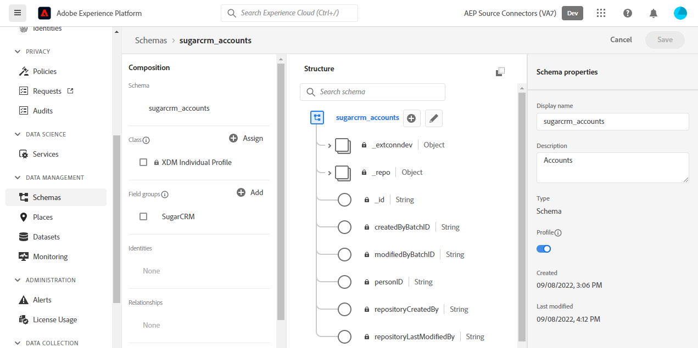

# Skapa en [!DNL SugarCRM Accounts & Contacts]-källanslutning i användargränssnittet

I den här självstudien beskrivs hur du skapar en [!DNL SugarCRM Accounts & Contacts]-källanslutning med Adobe Experience Platform-användargränssnittet.

## Komma igång

Den här självstudiekursen kräver en fungerande förståelse av följande komponenter i Experience Platform:

* [[!DNL Experience Data Model (XDM)] System](../../../../../xdm/home.md): Det standardiserade ramverk som [!DNL Experience Platform] organiserar kundupplevelsedata med.
   * [Grundläggande om schemakomposition](../../../../../xdm/schema/composition.md): Lär dig mer om grundstenarna i XDM-scheman, inklusive nyckelprinciper och bästa metoder för schemakomposition.
   * [Schemaredigeraren, självstudiekurs](../../../../../xdm/tutorials/create-schema-ui.md): Lär dig hur du skapar anpassade scheman med hjälp av gränssnittet för Schemaredigeraren.
* [[!DNL Real-Time Customer Profile]](../../../../../profile/home.md): Tillhandahåller en enhetlig konsumentprofil i realtid baserad på aggregerade data från flera källor.

Om du redan har ett giltigt [!DNL SugarCRM]-konto kan du hoppa över resten av det här dokumentet och gå vidare till självstudiekursen [Konfigurera ett dataflöde](../../dataflow/crm.md).

### Samla in nödvändiga inloggningsuppgifter

För att kunna ansluta [!DNL SugarCRM Accounts & Contacts] till Experience Platform måste du ange värden för följande anslutningsegenskaper:

| Autentiseringsuppgifter | Beskrivning | Exempel |
| --- | --- | --- |
| `Host` | SugarCRM API-slutpunkten som källan ansluter till. | `developer.salesfusion.com` |
| `Username` | Användarnamn för ditt SugarCRM-utvecklarkonto. | `abc.def@example.com@sugarmarketdemo000.com` |
| `Password` | Lösenordet för ditt SugarCRM-utvecklarkonto. | `123456789` |

### Skapa ett Experience Platform-schema

Innan du skapar en [!DNL SugarCRM]-källanslutning måste du också se till att du först skapar ett Experience Platform-schema som kan användas för källan. I självstudiekursen [Skapa ett Experience Platform-schema](../../../../../xdm/schema/composition.md) finns mer information om hur du skapar ett schema.

[!DNL SugarCRM Accounts & Contacts] har stöd för flera API:er. Det innebär att du måste skapa ett separat schema, beroende på vilken objekttyp du använder. Se exemplen nedan för både konton och kontaktkartor:

>[!BEGINTABS]

>[!TAB Konton]

>[!TAB Kontakter]

>[!ENDTABS]

## Anslut ditt [!DNL SugarCRM Accounts & Contacts]-konto

I Experience Platform-gränssnittet väljer du **[!UICONTROL Sources]** i det vänstra navigeringsfältet för att komma åt arbetsytan i [!UICONTROL Sources]. På skärmen [!UICONTROL Catalog] visas en mängd olika källor som du kan använda för att skapa ett konto.

Du kan välja lämplig kategori i katalogen till vänster på skärmen. Du kan också hitta den källa du vill arbeta med med med sökalternativet.

Under kategorin *CRM* väljer du **[!UICONTROL SugarCRM Accounts & Contacts]** och sedan **[!UICONTROL Add data]**.

Sidan **[!UICONTROL Connect SugarCRM Accounts & Contacts account]** visas. På den här sidan kan du antingen använda nya autentiseringsuppgifter eller befintliga.

### Befintligt konto

Om du vill använda ett befintligt konto väljer du det [!DNL SugarCRM Accounts & Contacts]-konto som du vill skapa ett nytt dataflöde med och väljer sedan **[!UICONTROL Next]** för att fortsätta.

### Nytt konto

Om du skapar ett nytt konto väljer du **[!UICONTROL New account]** och anger sedan ett namn, en valfri beskrivning och dina autentiseringsuppgifter. När du är klar väljer du **[!UICONTROL Connect to source]** och tillåt sedan lite tid för att upprätta den nya anslutningen.

### Markera data

Slutligen måste du välja den objekttyp som du vill importera till Experience Platform.

| Objekttyp | Beskrivning |
| --- | --- |
| `Accounts` | De företag som din organisation har en relation med. |
| `Contacts` | De enskilda personer som din organisation har en etablerad relation med. |

>[!BEGINTABS]

>[!TAB Konton]

>[!TAB Kontakter]

>[!ENDTABS]

## Nästa steg

Genom att följa den här självstudiekursen har du upprättat en anslutning till ditt [!DNL SugarCRM Accounts & Contacts]-konto. Du kan nu fortsätta till nästa självstudiekurs och [konfigurera ett dataflöde för att hämta data till Experience Platform](../../dataflow/crm.md).

## Ytterligare resurser

Avsnitten nedan innehåller ytterligare resurser som du kan referera till när du använder källan [!DNL SugarCRM].

### Guardrails {#guardrails}

Begränsningsfrekvensen för [!DNL SugarCRM] API är 90 anrop per minut eller 2 000 anrop per dag, beroende på vilket som inträffar först. Begränsningen har dock kringgåtts genom att en parameter läggs till i anslutningsspecifikationen som fördröjer begärandetiden så att hastighetsgränsen aldrig uppnås.

### Validering {#validation}

Följ stegen nedan för att verifiera att du har konfigurerat källan och att [!DNL SugarCRM Accounts & Contacts] data importeras korrekt:

* I Experience Platform-gränssnittet väljer du **[!UICONTROL View Dataflows]** bredvid kortmenyn [!DNL SugarCRM Accounts & Contacts] i källkatalogen. Välj sedan **[!UICONTROL Preview dataset]** för att verifiera de data som har importerats.

* Beroende på vilken objekttyp du arbetar med kan du verifiera aggregerade data mot antalet som visas på sidorna [!DNL SugarMarket] Konton eller Kontakter nedan:

>[!BEGINTABS]

>[!TAB Konton]

>[!TAB Kontakter]

>[!ENDTABS]

>[!NOTE]
>
>Sidorna [!DNL SugarMarket] innehåller inte antalet borttagna objekt. Data som hämtas via den här källan kommer dock även att innehålla det borttagna antalet, som markeras med en borttagen flagga.
