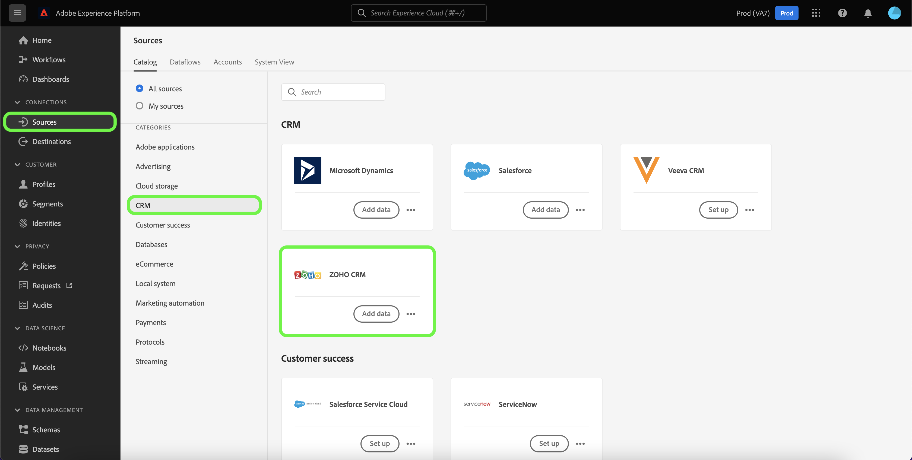

# Skapa en [!DNL Zoho CRM] källanslutning i användargränssnittet

Källkopplingar i Adobe Experience Platform gör det möjligt att importera externt källkodsdata i CRM på schemalagd basis. Den här självstudiekursen innehåller steg för att skapa en [!DNL Zoho CRM] källkoppling med [!DNL Platform] användargränssnitt.

## Komma igång

Den här självstudiekursen kräver en fungerande förståelse av följande komponenter i Adobe Experience Platform:

* [[!DNL Experience Data Model (XDM)] System](../../../../../xdm/home.md): Det standardiserade ramverk som [!DNL Experience Platform] organiserar kundupplevelsedata.
   * [Grunderna för schemakomposition](../../../../../xdm/schema/composition.md): Lär dig mer om de grundläggande byggstenarna i XDM-scheman, inklusive viktiga principer och bästa praxis när det gäller schemakomposition.
   * [Schemaredigeraren, genomgång](../../../../../xdm/tutorials/create-schema-ui.md): Lär dig hur du skapar anpassade scheman med hjälp av gränssnittet för Schemaredigeraren.
* [[!DNL Real-Time Customer Profile]](../../../../../profile/home.md): Ger en enhetlig konsumentprofil i realtid baserad på aggregerade data från flera källor.

Om du redan har en giltig [!DNL Zoho CRM] kan du hoppa över resten av dokumentet och gå vidare till självstudiekursen om [konfigurera ett dataflöde](../../dataflow/crm.md).

### Samla in nödvändiga inloggningsuppgifter

För att kunna ansluta [!DNL Zoho CRM] till Platform måste du ange värden för följande anslutningsegenskaper:

| Autentiseringsuppgifter | Beskrivning |
| --- | --- |
| Slutpunkt | Slutpunkten för [!DNL Zoho CRM] servern som du begär. |
| Konto-URL | Konton-URL:en används för att generera din åtkomst och uppdatera tokens. URL:en måste vara domänspecifik. |
| Klient-ID | Klient-ID som motsvarar ditt [!DNL Zoho CRM] användarkonto. |
| Klienthemlighet | Klienthemligheten som motsvarar din [!DNL Zoho CRM] användarkonto. |
| Åtkomsttoken | Åtkomsttoken ger dig säker och tillfällig åtkomst till din [!DNL Zoho CRM] konto. |
| Uppdatera token | En uppdateringstoken är en token som används för att generera en ny åtkomsttoken när din åtkomsttoken har upphört att gälla. |

Mer information om dessa autentiseringsuppgifter finns i dokumentationen om [[!DNL Zoho CRM] autentisering](https://www.zoho.com/crm/developer/docs/api/v2/oauth-overview.html).

## Koppla samman [!DNL Zoho CRM] konto

När du har samlat in dina inloggningsuppgifter kan du följa stegen nedan för att länka dina [!DNL Zoho CRM] konto till [!DNL Platform].

Välj **[!UICONTROL Sources]** från det vänstra navigeringsfältet för att komma åt [!UICONTROL Sources] arbetsyta. The [!UICONTROL Catalog] visas en mängd olika källor som du kan använda för att skapa ett konto.

Du kan välja lämplig kategori i katalogen till vänster på skärmen. Du kan också hitta den källa du vill arbeta med med med sökalternativet.

Under [!UICONTROL CRM] kategori, välj **[!UICONTROL Zoho CRM]** och sedan markera **[!UICONTROL Add data]**.

The **[!UICONTROL Connect Zoho CRM account]** visas. På den här sidan kan du antingen använda nya autentiseringsuppgifter eller befintliga.

### Befintligt konto

Om du vill använda ett befintligt konto väljer du [!DNL Zoho CRM] konto som du vill skapa ett nytt dataflöde med och sedan välja **[!UICONTROL Next]** för att fortsätta.

### Nytt konto

Om du skapar ett nytt konto väljer du **[!UICONTROL New account]** och ange sedan ett namn, en valfri beskrivning och [!DNL Zoho CRM] autentiseringsuppgifter. När du är klar väljer du **[!UICONTROL Connect to source]** och tillåt sedan lite tid för att upprätta den nya anslutningen.

>[!TIP]
>
>Din konto-URL-domän måste motsvara rätt domänplats. Följande är de olika domänerna och deras motsvarande konto-URL:er:<ul><li>USA: https://accounts.zoho.com</li><li>Australien: https://accounts.zoho.com.au</li><li>Europa: https://accounts.zoho.eu</li><li>Indien: https://accounts.zoho.in</li><li>Kina: https://accounts.zoho.com.cn</li></ul>

## Nästa steg

Genom att följa den här självstudiekursen har du upprättat en anslutning till [!DNL Zoho CRM] konto. Du kan nu fortsätta med nästa självstudiekurs och [konfigurera ett dataflöde för att hämta data till plattformen](../../dataflow/crm.md).
