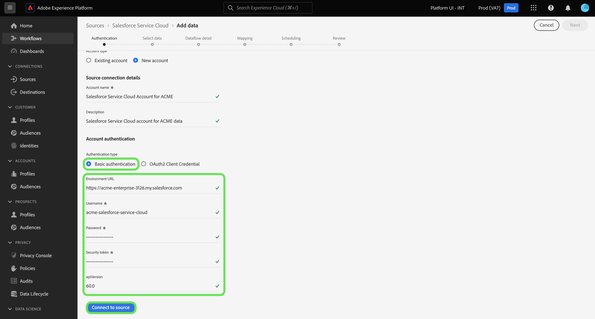

# Koppla samman [!DNL Salesforce Service Cloud] konto till Experience Platform med användargränssnittet

Den här självstudiekursen innehåller steg för hur du ansluter [!DNL Salesforce Service Cloud] ta fram data om kundframgångar för Adobe Experience Platform via användargränssnittet i Experience Platform.

## Komma igång

Den här självstudiekursen kräver en fungerande förståelse av följande komponenter i Experience Platform:

* [[!DNL Experience Data Model (XDM)] System](../../../../../xdm/home.md): Det standardiserade ramverk som Experience Platform använder för att ordna kundupplevelsedata.
   * [Grunderna för schemakomposition](../../../../../xdm/schema/composition.md): Lär dig mer om de grundläggande byggstenarna i XDM-scheman, inklusive viktiga principer och bästa praxis när det gäller schemakomposition.
   * [Schemaredigeraren, genomgång](../../../../../xdm/tutorials/create-schema-ui.md): Lär dig hur du skapar anpassade scheman med hjälp av gränssnittet i Schemaredigeraren.
* [[!DNL Real-Time Customer Profile]](../../../../../profile/home.md): Ger en enhetlig konsumentprofil i realtid baserad på aggregerade data från flera källor.

Om du redan har en giltig [!DNL Salesforce Service Cloud] kan du hoppa över resten av dokumentet och gå vidare till självstudiekursen om [konfigurera ett dataflöde för kunden](../../dataflow/customer-success.md)

### Samla in nödvändiga inloggningsuppgifter

The [!DNL Salesforce Service Cloud] source stöder grundläggande autentisering och OAuth2-klientautentiseringsuppgifter.

>[!BEGINTABS]

>[!TAB Grundläggande autentisering]

Du måste ange värden för följande autentiseringsuppgifter för att kunna ansluta [!DNL Salesforce Service Cloud] konto med grundläggande autentisering.

| Autentiseringsuppgifter | Beskrivning |
| --- | --- |
| Miljö-URL | URL:en för [!DNL Salesforce Service Cloud] källinstans. |
| Användarnamn | Användarnamnet för [!DNL Salesforce Service Cloud] användarkonto. |
| Lösenord | Lösenordet för [!DNL Salesforce Service Cloud] användarkonto. |
| Säkerhetstoken | Säkerhetstoken för [!DNL Salesforce Service Cloud] användarkonto. |
| API-version | (Valfritt) REST API-versionen av [!DNL Salesforce Service Cloud] -instans som du använder. Värdet för API-versionen måste formateras med ett decimaltecken. Om du till exempel använder API-version `52`måste du ange värdet som `52.0`. Om det här fältet lämnas tomt kommer Experience Platform automatiskt att använda den senaste tillgängliga versionen. |

Mer information om autentisering finns i [this [!DNL Salesforce Service Cloud] autentiseringsguide](https://developer.salesforce.com/docs/atlas.en-us.api_rest.meta/api_rest/quickstart_oauth.htm).

>[!TAB Autentiseringsuppgifter för OAuth2-klient]

Du måste ange värden för följande autentiseringsuppgifter för att kunna ansluta [!DNL Salesforce Service Cloud] konto med OAuth2 Client Credential.

| Autentiseringsuppgifter | Beskrivning |
| --- | --- |
| Miljö-URL | URL:en för [!DNL Salesforce Service Cloud] källinstans. |
| Klient-ID | Klient-ID används tillsammans med klienthemligheten som en del av OAuth2-autentisering. Tillsammans möjliggör klient-ID och klienthemlighet att ditt program arbetar för ditt kontos räkning genom att identifiera ditt program för [!DNL Salesforce Service Cloud]. |
| Klienthemlighet | Klienthemligheten används tillsammans med klient-ID som en del av OAuth2-autentiseringen. Tillsammans möjliggör klient-ID och klienthemlighet att ditt program arbetar för ditt kontos räkning genom att identifiera ditt program för [!DNL Salesforce Service Cloud]. |
| API-version | REST API-versionen av [!DNL Salesforce Service Cloud] -instans som du använder. Värdet för API-versionen måste formateras med ett decimaltecken. Om du till exempel använder API-version `52`måste du ange värdet som `52.0`. Om det här fältet lämnas tomt kommer Experience Platform automatiskt att använda den senaste tillgängliga versionen. |

Mer information om OAuth för [!DNL Salesforce Service Cloud], läsa [[!DNL Salesforce Service Cloud] guide om OAuth Authorization Flows](https://help.salesforce.com/s/articleView?id=sf.remoteaccess_oauth_flows.htm&amp;type=5).

>[!ENDTABS]

När du har samlat in dina inloggningsuppgifter kan du följa stegen nedan för att ansluta [!DNL Salesforce Service Cloud] konto till Experience Platform.

## Koppla samman [!DNL Salesforce Service Cloud] konto

Välj **[!UICONTROL Sources]** från vänster navigering för att komma åt [!UICONTROL Sources] arbetsyta. Du kan välja lämplig kategori i katalogen till vänster på skärmen. Du kan också hitta den källa du vill arbeta med med med sökalternativet.

Välj **[!DNL Salesforce Service Cloud]** under *[!UICONTROL Customer success]* och välj **[!UICONTROL Add data]**.

>[!TIP]
>
>Källor i källkatalogen visas **[!UICONTROL Set up]** när en viss källa ännu inte har något autentiserat konto. När det finns ett autentiserat konto ändras det här alternativet till **[!UICONTROL Add data]**.

The **[!UICONTROL Connect to Salesforce Service Cloud]** visas. På den här sidan kan du antingen använda nya autentiseringsuppgifter eller befintliga.

### Använd ett befintligt konto

Om du vill använda ett befintligt konto väljer du **[!UICONTROL Existing account]** och välj sedan önskat konto i listan som visas. När du är klar väljer du **[!UICONTROL Next]** för att fortsätta.

### Skapa ett nytt konto

Om du vill skapa ett nytt konto väljer du **[!UICONTROL New account]** och ange ett namn och en beskrivning av ditt nya [!DNL Salesforce Service Cloud] konto.

Välj sedan den autentiseringstyp som du vill använda för ditt nya konto.

>[!BEGINTABS]

>[!TAB Grundläggande autentisering]

Välj **[!UICONTROL Basic authentication]** och ange sedan värden för följande autentiseringsuppgifter:

* Miljö-URL
* Användarnamn
* Lösenord
* API-version (valfritt)

När du är klar väljer du **[!UICONTROL Connect to source]**.

>[!TAB Autentiseringsuppgifter för OAuth2-klient]

För autentiseringsuppgifter för OAuth 2-klient väljer du **[!UICONTROL OAuth2 Client Credential]** och ange sedan värden för följande autentiseringsuppgifter:

* Miljö-URL
* Klient-ID
* Klienthemlighet
* API-version

När du är klar väljer du **[!UICONTROL Connect to source]**.

>[!ENDTABS]

## Nästa steg

Genom att följa den här självstudien har du upprättat en anslutning till [!DNL Salesforce Service Cloud] konto. Du kan nu fortsätta med nästa självstudiekurs och [konfigurera ett dataflöde för att hämta data från kundframgångar till Experience Platform](../../dataflow/customer-success.md).
