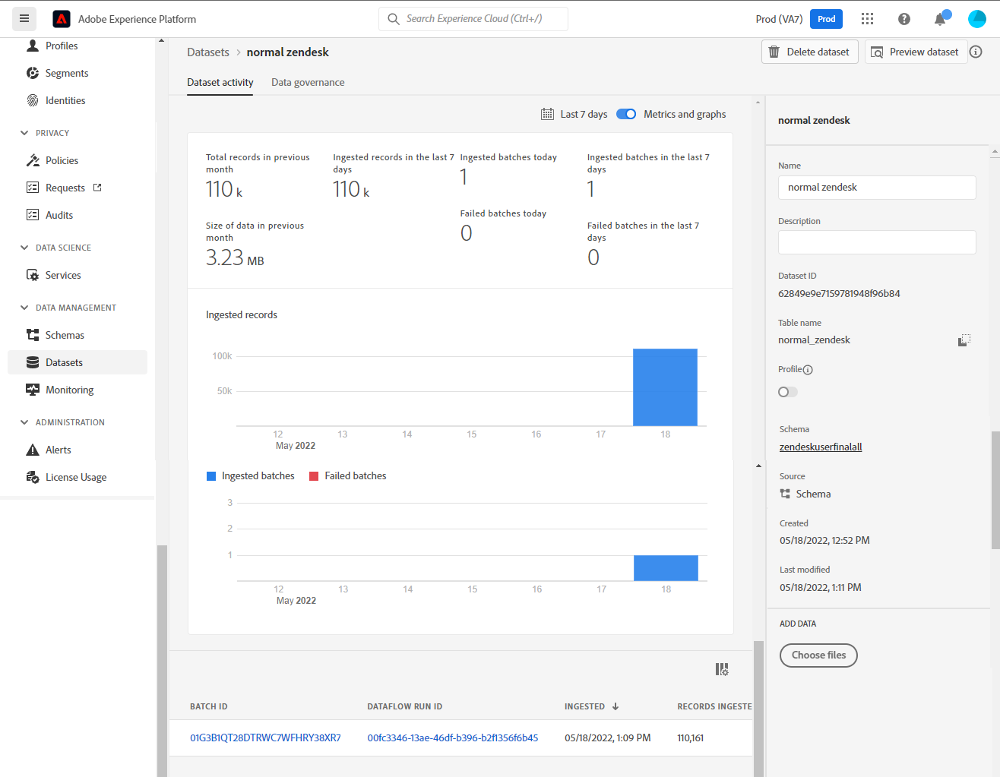

# Skapa en [!DNL Zendesk]-källanslutning i användargränssnittet

I den här självstudien beskrivs hur du skapar en [!DNL Zendesk]-källanslutning med Adobe Experience Platform-användargränssnittet.

## Komma igång

Den här självstudiekursen kräver en fungerande förståelse av följande komponenter i Adobe Experience Platform:

* [[!DNL Experience Data Model (XDM)] System](../../../../../xdm/home.md): Det standardiserade ramverk som [!DNL Experience Platform] organiserar kundupplevelsedata med.
   * [Grundläggande om schemakomposition](../../../../../xdm/schema/composition.md): Lär dig mer om grundstenarna i XDM-scheman, inklusive nyckelprinciper och bästa metoder för schemakomposition.
   * [Schemaredigeraren, självstudiekurs](../../../../../xdm/tutorials/create-schema-ui.md): Lär dig hur du skapar anpassade scheman med hjälp av gränssnittet för Schemaredigeraren.
* [[!DNL Real-Time Customer Profile]](../../../../../profile/home.md): Tillhandahåller en enhetlig konsumentprofil i realtid baserad på aggregerade data från flera källor.

### Samla in nödvändiga inloggningsuppgifter

För att få åtkomst till ditt [!DNL Zendesk]-konto på Experience Platform måste du ange värden för följande autentiseringsuppgifter:

| Autentiseringsuppgifter | Beskrivning | Exempel |
| --- | --- | --- |
| Underdomän | Den unika domän som är specifik för ditt konto och som skapas under registreringsprocessen. | `yoursubdomain` |
| Åtkomsttoken | Zendesk API-token. | `0lZnClEvkJSTQ7olGLl7PMhVq99gu26GTbJtf` |

Mer information om hur du autentiserar [!DNL Zendesk]-källan finns i [[!DNL Zendesk] källöversikten](../../../../connectors/customer-success/zendesk.md).

### Skapa ett Experience Platform-schema för [!DNL Zendesk]

Innan du skapar en [!DNL Zendesk]-källanslutning måste du också se till att du först skapar ett Experience Platform-schema som kan användas för källan. I självstudiekursen [Skapa ett Experience Platform-schema](../../../../../xdm/schema/composition.md) finns mer information om hur du skapar ett schema.

Mer information om ditt [!DNL Zendesk]-schema som krävs för [!DNL Zendesk Search API] finns i avsnittet [limits](#limits) nedan.

## Anslut ditt [!DNL Zendesk]-konto

I Experience Platform-gränssnittet väljer du **[!UICONTROL Sources]** i det vänstra navigeringsfältet för att komma åt arbetsytan i [!UICONTROL Sources]. På skärmen [!UICONTROL Catalog] visas en mängd olika källor som du kan använda för att skapa ett konto.

Du kan välja lämplig kategori i katalogen till vänster på skärmen. Du kan också hitta den källa du vill arbeta med med med sökalternativet.

Under kategorin *Kundens framgång* väljer du **[!UICONTROL Zendesk]** och sedan **[!UICONTROL Add data]**.

Sidan **[!UICONTROL Connect Zendesk account]** visas. På den här sidan kan du antingen använda nya autentiseringsuppgifter eller befintliga.

### Befintligt konto

Om du vill använda ett befintligt konto markerar du det *Zendesk*-konto som du vill skapa ett nytt dataflöde med och väljer sedan **[!UICONTROL Next]** för att fortsätta.

### Nytt konto

Om du skapar ett nytt konto väljer du **[!UICONTROL New account]** och anger sedan ett namn, en valfri beskrivning och dina autentiseringsuppgifter. När du är klar väljer du **[!UICONTROL Connect to source]** och tillåt sedan lite tid för att upprätta den nya anslutningen.

### Markera data

När källan har autentiserats uppdateras sidan till ett interaktivt schematräd där du kan utforska och inspektera datahierarkin. Välj **[!UICONTROL Next]** om du vill fortsätta.

## Nästa steg

Genom att följa den här självstudiekursen har du autentiserat och skapat en källanslutning mellan ditt [!DNL Zendesk]-konto och Experience Platform. Du kan nu fortsätta med nästa självstudiekurs och [skapa ett dataflöde för att överföra data om kundframgångar till Experience Platform](../../dataflow/customer-success.md).

## Ytterligare resurser

Avsnitten nedan innehåller ytterligare resurser som du kan referera till när du använder källan [!DNL Zendesk].

### Validering {#validation}

I följande beskrivs de steg du kan utföra för att verifiera att du har anslutit din [!DNL Zendesk]-källa och att [!DNL Zendesk]-profiler importeras till Experience Platform.

I Experience Platform-gränssnittet väljer du **[!UICONTROL Datasets]** i den vänstra navigeringen för att komma åt arbetsytan i [!UICONTROL Datasets]. Skärmen [!UICONTROL Dataset Activity] visar information om körningar.

Välj sedan det dataflödes-ID för dataflödet som du vill visa för att se specifik information om dataflödeskörningen.

Välj slutligen **[!UICONTROL Preview dataset]** för att visa de data som har importerats.

Du kan även verifiera dina Experience Platform-data mot data på din [!DNL Zendesk] > [!DNL Customers]-sida.

### Zendesk-schema

Tabellen nedan visar vilka mappningar som stöds och som måste konfigureras för Zendesk.

>[!TIP]
>
>Mer information om API:t finns i [Zendesk Search API > Exportera sökresultat](https://developer.zendesk.com/api-reference/ticketing/ticket-management/search/#export-search-results).

| Source | Typ |
|---|---|
| `results.active` | Boolean |
| `results.alias` | Sträng |
| `results.created_at` | Sträng |
| `results.custom_role_id` | Heltal |
| `results.default_group_id` | Heltal |
| `results.details` | Sträng |
| `results.email` | Sträng |
| `results.external_id` | Heltal |
| `results.iana_time_zone` | Sträng |
| `results.id` | Heltal |
| `results.last_login_at` | Sträng |
| `results.locale` | Sträng |
| `results.locale_id` | Heltal |
| `results.moderator` | Boolean |
| `results.name` | Sträng |
| `results.notes` | Sträng |
| `results.only_private_comments` | Boolean |
| `results.organization_id` | Heltal |
| `results.phone` | Sträng |
| `results.photo` | Sträng |
| `results.report_csv` | Boolean |
| `results.restricted_agent` | Boolean |
| `results.result_type` | Sträng |
| `results.role` | Sträng |
| `results.role_type` | Heltal |
| `results.shared` | Boolean |
| `results.shared_agent` | Boolean |
| `results.shared_phone_number` | Boolean |
| `results.signature` | Sträng |
| `results.suspended` | Boolean |
| `results.ticket_restriction` | Sträng |
| `results.time_zone` | Sträng |
| `results.two_factor_auth_enabled` | Boolean |
| `results.updated_at` | Sträng |
| `results.url` | Sträng |
| `results.verified` | Boolean |

{style="table-layout:auto"}

### Gränser {#limits}

* [Zendesk-söknings-API > Exportera sökresultat](https://developer.zendesk.com/api-reference/ticketing/ticket-management/search/#export-search-results) returnerar högst 1 000 poster per sida.
   * Värdet för parametern ``filter[type]`` är inställt på ``user`` och därför returnerar Zendesk-anslutningen bara användare.
   * Antalet resultat per sida hanteras av parametern ``page[size]``. Värdet är ``100``. Detta görs för att minska effekten av begränsningar för hastighetsminskning som Zendesk angett.
   * Se [Gränser](https://developer.zendesk.com/api-reference/ticketing/ticket-management/search/#limits) och [Sidnumrering](https://developer.zendesk.com/api-reference/ticketing/ticket-management/search/#pagination-1).
   * Du kan även referera till [Sidnumrering genom listor med hjälp av sidnumrering från markören](https://developer.zendesk.com/documentation/developer-tools/pagination/paginating-through-lists-using-cursor-pagination/).
