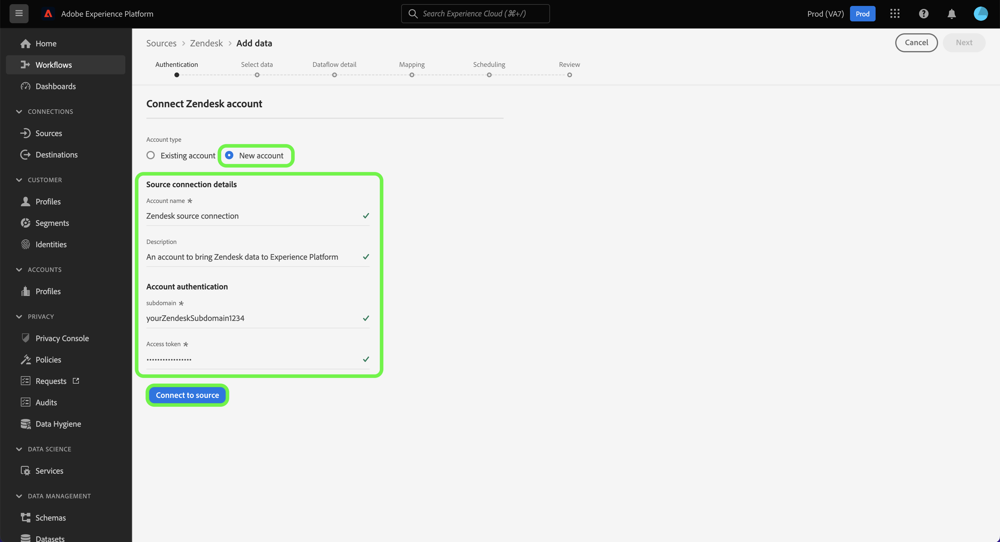

# Skapa en [!DNL Zendesk] källanslutning i användargränssnittet

Den här självstudiekursen innehåller steg för att skapa en [!DNL Zendesk] källanslutning med Adobe Experience Platform användargränssnitt.

## Komma igång

Den här självstudiekursen kräver en fungerande förståelse av följande komponenter i Adobe Experience Platform:

* [[!DNL Experience Data Model (XDM)] System](../../../../../xdm/home.md): Det standardiserade ramverk som [!DNL Experience Platform] organiserar kundupplevelsedata.
   * [Grunderna för schemakomposition](../../../../../xdm/schema/composition.md): Lär dig mer om de grundläggande byggstenarna i XDM-scheman, inklusive viktiga principer och bästa praxis när det gäller schemakomposition.
   * [Schemaredigeraren, genomgång](../../../../../xdm/tutorials/create-schema-ui.md): Lär dig hur du skapar anpassade scheman med hjälp av gränssnittet för Schemaredigeraren.
* [[!DNL Real-Time Customer Profile]](../../../../../profile/home.md): Ger en enhetlig konsumentprofil i realtid baserad på aggregerade data från flera källor.

### Samla in nödvändiga inloggningsuppgifter

För att komma åt [!DNL Zendesk] på Platform måste du ange värden för följande autentiseringsuppgifter:

| Autentiseringsuppgifter | Beskrivning | Exempel |
| --- | --- | --- |
| Underdomän | Den unika domän som är specifik för ditt konto och som skapas under registreringsprocessen. | `yoursubdomain` |
| Åtkomsttoken | Zendesk API-token. | `0lZnClEvkJSTQ7olGLl7PMhVq99gu26GTbJtf` |

Mer information om hur du autentiserar [!DNL Zendesk] -källa, se [[!DNL Zendesk] källöversikt](../../../../connectors/customer-success/zendesk.md).

### Skapa ett plattformsschema för [!DNL Zendesk]

Innan du skapar en [!DNL Zendesk] källanslutning måste du också se till att du först skapar ett plattformsschema som kan användas för källan. Se självstudiekursen om [skapa ett plattformsschema](../../../../../xdm/schema/composition.md) om du vill ha omfattande anvisningar om hur du skapar ett schema.

Om du vill ha mer information om [!DNL Zendesk] schema krävs för [!DNL Zendesk Search API], se [gränser](#limits) nedan.

## Koppla samman [!DNL Zendesk] konto

Välj **[!UICONTROL Sources]** från det vänstra navigeringsfältet för att komma åt [!UICONTROL Sources] arbetsyta. The [!UICONTROL Catalog] visas en mängd olika källor som du kan använda för att skapa ett konto.

Du kan välja lämplig kategori i katalogen till vänster på skärmen. Du kan också hitta den källa du vill arbeta med med med sökalternativet.

Under *Nöjda kunder* kategori, välj **[!UICONTROL Zendesk]** och sedan markera **[!UICONTROL Add data]**.

The **[!UICONTROL Connect Zendesk account]** visas. På den här sidan kan du antingen använda nya autentiseringsuppgifter eller befintliga.

### Befintligt konto

Om du vill använda ett befintligt konto väljer du *Zendesk* konto som du vill skapa ett nytt dataflöde med och sedan välja **[!UICONTROL Next]** för att fortsätta.

### Nytt konto

Om du skapar ett nytt konto väljer du **[!UICONTROL New account]** och ange sedan ett namn, en valfri beskrivning och dina uppgifter. När du är klar väljer du **[!UICONTROL Connect to source]** och tillåt sedan lite tid för att upprätta den nya anslutningen.

### Markera data

När källan har autentiserats uppdateras sidan till ett interaktivt schematräd där du kan utforska och inspektera datahierarkin. Välj **[!UICONTROL Next]** för att fortsätta.

## Nästa steg

I den här självstudiekursen har du autentiserat och skapat en källanslutning mellan [!DNL Zendesk] konto och plattform. Du kan nu fortsätta med nästa självstudiekurs och [skapa ett dataflöde för att överföra data om kundframgångar till plattformen](../../dataflow/customer-success.md).

## Ytterligare resurser

Avsnitten nedan innehåller ytterligare resurser som du kan referera till när du använder [!DNL Zendesk] källa.

### Validering {#validation}

Följande instruktioner kan du utföra för att verifiera att du har anslutit dina [!DNL Zendesk] källa och [!DNL Zendesk] profiler importeras till Platform.

Välj **[!UICONTROL Datasets]** från vänster navigering för att komma åt [!UICONTROL Datasets] arbetsyta. The [!UICONTROL Dataset Activity] visas information om körningar.

Välj sedan det dataflödes-ID för dataflödet som du vill visa för att se specifik information om dataflödeskörningen.

Äntligen väljer du **[!UICONTROL Preview dataset]** för att visa de data som har importerats.

Du kan också verifiera dina plattformsdata mot data på din [!DNL Zendesk] > [!DNL Customers] sida.

### Zendesk-schema

Tabellen nedan visar vilka mappningar som stöds och som måste konfigureras för Zendesk.

>[!TIP]
>
>Se [Zendesk Search API > Exportera sökresultat](https://developer.zendesk.com/api-reference/ticketing/ticket-management/search/#export-search-results) om du vill ha mer information om API:t.

| Källa | Typ |
|---|---|
| `results.active` | Boolean |
| `results.alias` | Sträng |
| `results.created_at` | Sträng |
| `results.custom_role_id` | Heltal |
| `results.default_group_id` | Heltal |
| `results.details` | Sträng |
| `results.email` | Sträng |
| `results.external_id` | Heltal |
| `results.iana_time_zone` | Sträng |
| `results.id` | Heltal |
| `results.last_login_at` | Sträng |
| `results.locale` | Sträng |
| `results.locale_id` | Heltal |
| `results.moderator` | Boolean |
| `results.name` | Sträng |
| `results.notes` | Sträng |
| `results.only_private_comments` | Boolean |
| `results.organization_id` | Heltal |
| `results.phone` | Sträng |
| `results.photo` | Sträng |
| `results.report_csv` | Boolean |
| `results.restricted_agent` | Boolean |
| `results.result_type` | Sträng |
| `results.role` | Sträng |
| `results.role_type` | Heltal |
| `results.shared` | Boolean |
| `results.shared_agent` | Boolean |
| `results.shared_phone_number` | Boolean |
| `results.signature` | Sträng |
| `results.suspended` | Boolean |
| `results.ticket_restriction` | Sträng |
| `results.time_zone` | Sträng |
| `results.two_factor_auth_enabled` | Boolean |
| `results.updated_at` | Sträng |
| `results.url` | Sträng |
| `results.verified` | Boolean |

{style="table-layout:auto"}

### Gränser {#limits}

* The [Zendesk Search API > Exportera sökresultat](https://developer.zendesk.com/api-reference/ticketing/ticket-management/search/#export-search-results) returnerar högst 1 000 poster per sida.
   * Värdet för ``filter[type]`` parametern är inställd på ``user`` och därför returnerar Zendesk-anslutningen bara användare.
   * Antalet resultat per sida hanteras av ``page[size]`` parameter. Värdet är inställt på ``100``. Detta görs för att minska effekten av begränsningar för hastighetsminskning som Zendesk angett.
   * Se [Gränser](https://developer.zendesk.com/api-reference/ticketing/ticket-management/search/#limits) och [Sidnumrering](https://developer.zendesk.com/api-reference/ticketing/ticket-management/search/#pagination-1).
   * Du kan även referera till [Sidindelning genom listor med markörsidindelning](https://developer.zendesk.com/documentation/developer-tools/pagination/paginating-through-lists-using-cursor-pagination/).
