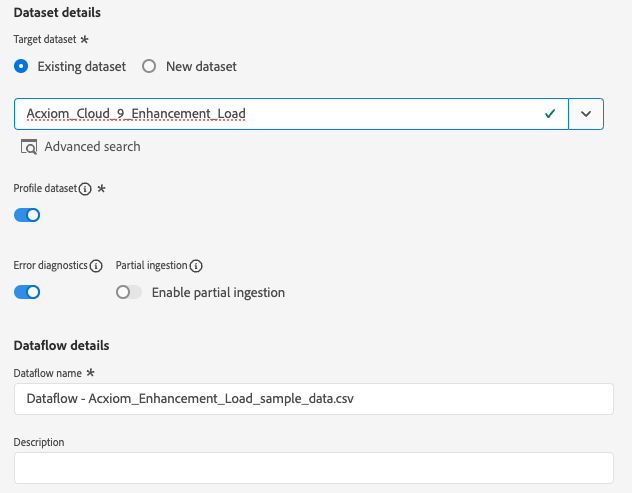

# Skapa en [!DNL Acxiom Data Ingestion] källanslutning och dataflöde i användargränssnittet

>[!NOTE]
>
>The [!DNL Acxiom Data Ingestion] källan är i betaversion. Läs [villkor](../../../../home.md#terms-and-conditions) i källorna - översikt, om du vill ha mer information om hur du använder betamärkta källor.

Använd [!DNL Acxiom Data Ingestion] källa att importera [!DNL Acxiom] till Real-time Customer Data Platform och berika förstahandsprofilerna. Sedan kan du använda [!DNL Acxiom]-berikade förstahandsprofiler för att förbättra målgrupperna och aktivera i alla marknadsföringskanaler.

Läs den här självstudiekursen för att lära dig hur du skapar en [!DNL Acxiom Data Ingestion] källanslutning och dataflöde med Adobe Experience Platform användargränssnitt. The [!DNL Acxiom Data Ingestion] källan används för att hämta och mappa svar från [!DNL Acxiom] Förbättringstjänst med Amazon S3 som släpppunkt.

## Förutsättningar {#prerequisites}

Den här självstudiekursen kräver en fungerande förståelse av följande komponenter i Experience Platform:

* [[!DNL Experience Data Model (XDM)] System](../../../../../xdm/home.md): Det standardiserade ramverk som Experience Platform använder för att ordna kundupplevelsedata.
   * [Grunderna för schemakomposition](../../../../../xdm/schema/composition.md): Lär dig mer om de grundläggande byggstenarna i XDM-scheman, inklusive viktiga principer och bästa praxis när det gäller schemakomposition.
   * [Schemaredigeraren, genomgång](../../../../../xdm/tutorials/create-schema-ui.md): Lär dig hur du skapar anpassade scheman med hjälp av gränssnittet i Schemaredigeraren.
* [[!DNL Real-Time Customer Profile]](../../../../../profile/home.md): Ger en enhetlig konsumentprofil i realtid baserad på aggregerade data från flera källor.

### Samla in nödvändiga inloggningsuppgifter

För att få åtkomst till din bucket på Experience Platform måste du ange giltiga värden för följande autentiseringsuppgifter:

| Autentiseringsuppgifter | Beskrivning |
| --- | --- |
| [!DNL Acxiom] autentiseringsnyckel | Autentiseringsnyckeln. Du kan hämta det här värdet från [!DNL Acxiom] team. |
| [!DNL Amazon S3] åtkomstnyckel | Åtkomstnyckel-ID för din bucket. Du kan hämta det här värdet från [!DNL Acxiom] team. |
| [!DNL Amazon S3] hemlig nyckel | Det hemliga nyckel-ID:t för din bucket. Du kan hämta det här värdet från [!DNL Acxiom] team. |
| Buckennamn | Det här är din bucket där filer delas. Du kan hämta det här värdet från [!DNL Acxiom] team. |

>[!IMPORTANT]
>
>Du måste ha båda **[!UICONTROL View Sources]** och **[!UICONTROL Manage Sources]** behörigheter för ditt konto för att ansluta [!DNL Acxiom] konto till Experience Platform. Kontakta produktadministratören för att få den behörighet som krävs. Mer information finns i [gränssnittsguide för åtkomstkontroll](../../../../../access-control/ui/overview.md).

## Koppla samman [!DNL Acxiom] konto

Välj **[!UICONTROL Sources]** från det vänstra navigeringsfältet för att komma åt [!UICONTROL Sources] arbetsyta. The [!UICONTROL Catalog] I visas en mängd olika källor som du kan skapa ett konto med.

Du kan välja lämplig kategori i katalogen till vänster på skärmen. Du kan också hitta den källa du vill arbeta med med med sökalternativet.

Under **[!UICONTROL Data & Identity Partners]** kategori, välj **[!UICONTROL Acxiom Data Ingestion]** och sedan **[!UICONTROL Set up]**.

>[!TIP]
>
>Ett källkort som visas **[!UICONTROL Add data]** betyder att källan redan har ett autentiserat konto. Å andra sidan ett källkort som visas **[!UICONTROL Set up]** innebär att du måste ange autentiseringsuppgifter och skapa ett nytt konto för att kunna använda den källan.

### Skapa ett nytt konto

Om du använder nya autentiseringsuppgifter väljer du **[!UICONTROL New account]**. Ange ett namn, en valfri beskrivning och din [!DNL Acxiom] autentiseringsuppgifter. När du är klar väljer du **[!UICONTROL Connect to source]** och tillåt sedan lite tid för att upprätta den nya anslutningen.

| Referenser | Beskrivning |
| --- | --- |
| Kontonamn | Namnet på kontot. |
| Beskrivning | (Valfritt) En kort förklaring av syftet med kontot. |
| [!DNL Acxiom] autentiseringsnyckel | The [!DNL Acxiom]-tillhandahållen nyckel krävs för kontogodkännande. Detta måste matcha rätt värde innan det går att ansluta till databasen.  Nyckeln måste innehålla 24 tecken och kan bara innehålla: A-Z, a-z och 0-9. |
| S3-åtkomstnyckel | S3-åtkomstnyckeln refererar till Amazon S3-platsen. Detta tillhandahålls av administratören när rollbehörigheter för S3 definieras. |
| S3 hemlig nyckel | Den hemliga nyckeln för S3 refererar till Amazon S3-platsen. Detta tillhandahålls av administratören när rollbehörigheter för S3 definieras. |
| s3SessionToken | (Valfritt) Värdet för autentiseringstoken vid anslutning till S3. |
| serviceUrl | (Valfritt) Den URL-plats som ska användas vid anslutning till S3 på en plats som inte är standard. |
| Buckennamn | (Valfritt) Namnet på den S3-bucket som är inställd på S3 och som fungerar som en startsökväg i datamarkeringen. |
| Mappsökväg | Om du använder underkataloger i en bucket kan du även ange en sökväg som en startsökväg när du väljer data. |

### Använd ett befintligt konto

Om du vill använda ett befintligt konto väljer du **[!UICONTROL Existing account]**.

Välj ett konto i listan om du vill visa information om det kontot. När du har valt ett konto väljer du **[!UICONTROL Next]** för att fortsätta.

## Välj data

Markera den fil som du vill importera från önskad bucket och underkatalog. Du kan förhandsgranska data när du har definierat avgränsare och komprimeringstyp. När du har valt filen väljer du **[!UICONTROL Next]** för att fortsätta.

>[!NOTE]
>
>JSON- och Parquet-filtyperna visas, men du behöver eller förväntas inte använda dem under [!DNL Acxiom] källarbetsflöde.

## Ange information om datauppsättning och dataflöde

Därefter måste du ange information om datauppsättningen och dataflödet.

### Information om datauppsättning

>[!BEGINTABS]

>[!TAB Använd en ny datauppsättning]

En datauppsättning är en lagrings- och hanteringskonstruktion för en datamängd, vanligtvis en tabell, som innehåller ett schema (kolumner) och fält (rader). Data som har inhämtats till Experience Platform bevaras i sjön som datamängder. Om du vill använda en ny datauppsättning väljer du **[!UICONTROL New dataset]**.

| Ny datauppsättningsinformation | Beskrivning |
| --- | --- |
| Namn på utdatauppsättning | Namnet på den nya datauppsättningen. |
| Beskrivning | (Valfritt) En kort förklaring av syftet med datauppsättningen. |
| Schema | En listruta med scheman som finns i organisationen. Du kan också skapa ett eget schema före källkonfigurationsprocessen. Mer information finns i guiden [skapa schema i användargränssnittet](../../../../../xdm/tutorials/create-schema-ui.md). |

>[!TAB Använd en befintlig datamängd]

Om du vill använda en befintlig datauppsättning väljer du **[!UICONTROL Existing dataset]**.

Du kan välja **[!UICONTROL Advanced search]** för att visa ett fönster med alla datauppsättningar som din organisation har, inklusive deras respektive information, t.ex. om de har aktiverats för konsumtion i realtid.

>[!ENDTABS]

+++Välj om du vill ha steg för att aktivera profilintagning, feldiagnostik och partiell förtäring.

Om din datauppsättning är aktiverad för kundprofil i realtid kan du under det här steget växla **[!UICONTROL Profile dataset]** för att aktivera data för profilinmatning. Du kan även använda det här steget för att aktivera **[!UICONTROL Error diagnostics]** och **[!UICONTROL Partial ingestion]**.

* **[!UICONTROL Error diagnostics]**: Välj **[!UICONTROL Error diagnostics]** för att instruera källan att skapa feldiagnostik som du senare kan referera till när du övervakar datauppsättningsaktiviteten och dataflödesstatusen.
* **[!UICONTROL Partial ingestion]**: Partiell batchimport är möjligheten att importera data som innehåller fel, upp till ett visst konfigurerbart tröskelvärde. Med den här funktionen kan du importera alla korrekta data till Experience Platform, medan alla felaktiga data batchas separat med information om varför de är ogiltiga.

+++

### Information om dataflöde

När datauppsättningen har konfigurerats måste du ange information om dataflödet, inklusive ett namn, en valfri beskrivning och aviseringskonfigurationer.

| Dataflödeskonfigurationer | Beskrivning |
| --- | --- |
| Dataflödesnamn | Dataflödets namn.  Som standard används namnet på filen som importeras. |
| Beskrivning | (Valfritt) En kort beskrivning av dataflödet. |
| Larm | Experience Platform kan skapa händelsebaserade aviseringar som användare kan prenumerera på. Dessa alternativ är alla ett öppet dataflöde som utlöser dessa.  Mer information finns i [varningsöversikt](../../alerts.md) <ul><li>**Start för källdataflöde**: Välj den här varningen om du vill få ett meddelande när dataflödeskörningen börjar.</li><li>**Slutförd körning av källdataflöde**: Välj den här varningen för att få ett meddelande om dataflödet avslutas utan fel.</li><li>**Körningsfel för källdataflöde**: Välj den här varningen för att få ett meddelande om dataflödet avslutas med fel.</li></ul> |

## Mappning

Använd mappningsgränssnittet för att mappa källdata till rätt schemafält innan data hämtas till Experience Platform.  Mer information finns i [mappningsguide i användargränssnittet](../../../../../data-prep/ui/mapping.md)

## Schemalägg inmatning av dataflöde

Använd sedan schemaläggningsgränssnittet för att definiera inmatningsschemat för dataflödet.

| Schemaläggningskonfiguration | Beskrivning |
| --- | --- |
| Frekvens | Konfigurera frekvens för att ange hur ofta dataflödet ska köras. Du kan ange frekvensen till: <ul><li>**En gång**: Ange din frekvens som `once` för att skapa ett engångsintag. Konfigurationer för intervall och bakåtfyllnad är inte tillgängliga när ett dataflöde för engångsinmatning skapas. Som standard är schemaläggningsfrekvensen inställd på en gång.</li><li>**Minut**: Ange din frekvens som `minute` för att schemalägga dataflödet för import av data per minut.</li><li>**Timme**:Ställ in frekvensen på `hour` för att schemalägga ditt dataflöde att importera data per timme.</li><li>**Dag**: Ange din frekvens som `day` för att schemalägga dataflödet för import av data per dag.</li><li>**Vecka**: Ange din frekvens som `week` för att schemalägga dataflödet för import av data per vecka.</li></ul> |
| Intervall | När du har valt en frekvens kan du konfigurera intervallinställningen för att upprätta en tidsram mellan varje intag. Om du t.ex. anger din frekvens som dag och konfigurerar intervallet till 15, kommer dataflödet att köras var 15:e dag. **Anteckning**: Du kan inte ange intervallet till noll. |
| Starttid | Tidsstämpeln för den projicerade körningen visas i UTC-tidszonen. |
| Backfill | Backfill avgör vilka data som hämtas från början. Om bakåtfyllning är aktiverad, kommer alla aktuella filer i den angivna sökvägen att importeras under det första schemalagda intaget. Om underfyllning är inaktiverad importeras endast de filer som läses in mellan den första importkörningen och starttiden. Filer som lästs in före starttiden importeras inte. |

## Granska ditt dataflöde

Använd granskningssidan för att få en sammanfattning av dataflödet före intag. Detaljerna är grupperade i följande kategorier:

* **Anslutning** - Visar källtypen, den relevanta sökvägen till den valda källfilen och antalet kolumner i källfilen.
* **Tilldela datauppsättnings- och kartfält** - Visar vilka data som källdata hämtas till, inklusive det schema som datauppsättningen följer.
* **Schemaläggning** - Visar den aktiva perioden, frekvensen och intervallet för intag.
När du har granskat dataflödet klickar du på Slutför och anger en tid innan dataflödet skapas.

## Nästa steg

Genom att följa den här självstudiekursen har du skapat ett dataflöde för att hämta batchdata från [!DNL Acxiom] källa till Experience Platform. Ytterligare resurser finns i dokumentationen nedan.

### Övervaka dataflödet

När dataflödet har skapats kan du övervaka de data som hämtas genom det för att visa information om hur mycket data som har importerats, hur bra de är och vilka fel som har uppstått. Mer information om hur du övervakar dataflöde finns i självstudiekursen om [övervaka konton och dataflöden i användargränssnittet](../../../../../dataflows/ui/monitor-sources.md).

### Uppdatera ditt dataflöde

Om du vill uppdatera konfigurationerna för schemaläggning, mappning och allmän information för dataflöden går du till självstudiekursen om [uppdatera källornas dataflöden i användargränssnittet](../../update-dataflows.md).

### Ta bort ditt dataflöde

Du kan ta bort dataflöden som inte längre är nödvändiga eller som har skapats felaktigt med **[!UICONTROL Delete]** finns i **[!UICONTROL Dataflows]** arbetsyta. Mer information om hur du tar bort dataflöden finns i självstudiekursen om [ta bort dataflöden i användargränssnittet](../../delete.md).

## Ytterligare resurser {#additional-resources}

Mer information finns i [[!DNL Acxiom] InfoBase](https://www.acxiom.com/wp-content/uploads/2022/02/fs-acxiom-infobase_AC-0268-22.pdf).
