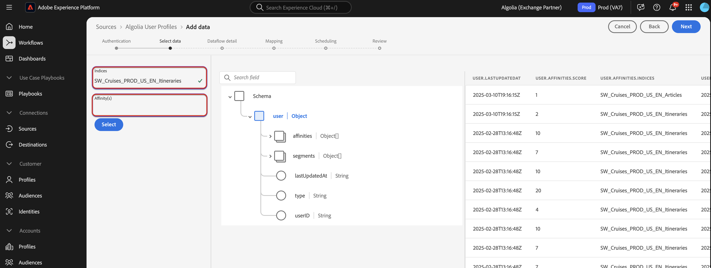

# Infoga [!DNL Algolia User Profiles]-data till Experience Platform med användargränssnittet

I den här självstudiekursen får du lära dig hur du importerar data från ditt [!DNL Algolia User Profiles]-konto till Adobe Experience Platform med användargränssnittet.

## Kom igång

>[!IMPORTANT]
>
>Innan du börjar måste du slutföra de nödvändiga stegen som beskrivs i [[!DNL Algolia User Profiles] översikten](../../../../connectors/data-partners/algolia-user-profiles.md#prerequisites).

Den här självstudiekursen kräver en fungerande förståelse av följande komponenter i Experience Platform:

* [[!DNL Experience Data Model (XDM)] System](../../../../../xdm/home.md): Det standardiserade ramverk som Experience Platform använder för att ordna kundupplevelsedata.
   * [Grundläggande om schemakomposition](../../../../../xdm/schema/composition.md): Lär dig mer om grundstenarna i XDM-scheman, inklusive nyckelprinciper och bästa metoder för schemakomposition.
   * [Schemaredigeraren, självstudiekurs](../../../../../xdm/tutorials/create-schema-ui.md): Lär dig hur du skapar anpassade scheman med hjälp av gränssnittet för Schemaredigeraren.
* [[!DNL Real-Time Customer Profile]](../../../../../profile/home.md): Tillhandahåller en enhetlig konsumentprofil i realtid baserad på aggregerade data från flera källor.
* [Källor](../../../../home.md): Med Experience Platform kan data hämtas från olika källor samtidigt som du kan strukturera, etikettera och förbättra inkommande data med hjälp av Experience Platform tjänster.

### Samla in nödvändiga inloggningsuppgifter

För att kunna ansluta [!DNL Algolia] till Experience Platform måste du ange värden för följande autentiseringsuppgifter:

| Autentiseringsuppgifter | Beskrivning |
| --- | --- |
| Program-ID | Program-ID:t [!DNL Algolia] är en unik identifierare som tilldelats ditt [!DNL Algolia]-konto. |
| API-nyckel | API-nyckeln [!DNL Algolia] är en autentiseringsuppgift som används för att autentisera och auktorisera API-begäranden till [!DNL Algolia]s sök- och indexeringstjänster. |

Mer information om dessa autentiseringsuppgifter finns i [!DNL Algolia] [autentiseringsdokumentationen](https://www.algolia.com/doc/tools/cli/get-started/authentication/).

## Anslut ditt [!DNL Algolia]-konto

I Experience Platform-gränssnittet väljer du **[!UICONTROL Sources]** i den vänstra navigeringen för att komma åt arbetsytan i *[!UICONTROL Sources]*. Du kan välja lämplig kategori på panelen *[!UICONTROL Categories]*. Du kan också använda sökfältet för att navigera till den specifika källa som du vill använda.

Om du vill använda [!DNL Algolia] väljer du **[!UICONTROL Algolia]**-källkortet under *[!UICONTROL Data & Identity Partners]* och sedan **[!UICONTROL Set up]**.

>[!TIP]
>
>Källor i källkatalogen visar alternativet **[!UICONTROL Set up]** när en angiven källa ännu inte har något autentiserat konto. När det finns ett autentiserat konto ändras det här alternativet till **[!UICONTROL Add data]**.

## Autentisering

### Använd ett befintligt konto

Om du vill använda ett befintligt konto väljer du **[!UICONTROL Existing account]** och sedan det [!DNL Algolia User Profiles]-konto som du vill använda. Välj **[!UICONTROL Next]** om du vill fortsätta.

### Skapa ett nytt konto

Om du skapar ett nytt konto väljer du **[!UICONTROL New account]** och anger sedan ett namn, en valfri beskrivning och autentiseringsuppgifter för [!DNL Algolia]. När du är klar väljer du **[!UICONTROL Connect to source]** och tillåt sedan lite tid för att upprätta den nya anslutningen.

## Lägg till data

När du har skapat ditt [!DNL Algolia User Profiles]-konto visas steget **[!UICONTROL Add data]** som ger dig ett gränssnitt där du kan utforska dina [!DNL Algolia]-användarprofiler som du vill ta med till Experience Platform.

* Den vänstra delen av gränssnittet är att du kan ange valfria **[!UICONTROL Indices]**- och **[!UICONTROL Affinity(s)]**-fält.
* I den högra delen av gränssnittet kan du förhandsgranska upp till 100 rader med användarprofiler.

När du är klar med att markera och förhandsgranska dina data för konsumtion väljer du **[!UICONTROL Next]**.

## Ange information om dataflöde

Om du använder en befintlig datauppsättning väljer du en datauppsättning som är associerad med ett schema som använder fältgruppen [!DNL Algolia Profile].

Om du skapar en ny datauppsättning väljer du ett schema som använder fältgruppen [!DNL Algolia Profile] som krävs i mappningssteget.

## Mappa datafält till ett XDM-schema

Använd mappningsgränssnittet för att mappa källdata till rätt schemafält innan data importeras till Experience Platform.  Mer information finns i [mappningsguiden i användargränssnittet](../../../../../data-prep/ui/mapping.md).

## Schemalägg körning av inmatning

Använd sedan schemaläggningsgränssnittet för att definiera inmatningsschemat för dataflödet.

<!-- The Scheduling step allows for configuration of the data/time to execute the [!DNL Algolia Uer Profiles] Source connector. There is configuration to backfill the data from [!DNL Algolia] which will pull all the profiles from the source system.  If the source is scheduled, then it will retrieve modified profiles from the [!DNL Algolia] based on the configured time interval. -->

| Schemaläggningskonfiguration | Beskrivning |
| --- | --- |
| Frekvens | Konfigurera frekvens för att ange hur ofta dataflödet ska köras. Du kan ange frekvensen till: <ul><li>**En gång**: Ställ in din frekvens på `once` för att skapa en engångsinmatning. Konfigurationer för intervall och bakåtfyllnad är inte tillgängliga när ett dataflöde för engångsinmatning skapas. Som standard är schemaläggningsfrekvensen inställd på en gång.</li><li>**Minut**: Ställ in din frekvens på `minute` för att schemalägga ditt dataflöde att importera data per minut.</li><li>**Timme**: Ställ in din frekvens på `hour` för att schemalägga ditt dataflöde att importera data per timme.</li><li>**Dag**: Ställ in din frekvens på `day` för att schemalägga ditt dataflöde att importera data per dag.</li><li>**Vecka**: Ställ in din frekvens på `week` för att schemalägga ditt dataflöde att importera data per vecka.</li></ul> |
| Intervall | När du har valt en frekvens kan du konfigurera intervallinställningen för att upprätta en tidsram mellan varje intag. Om du t.ex. anger din frekvens som dag och konfigurerar intervallet till 15, kommer dataflödet att köras var 15:e dag. Du kan inte ange intervallet till noll. Det minsta tillåtna intervallvärdet för varje frekvens är följande:<ul><li>**En gång**: ingen/a</li><li>**Minut**: 15</li><li>**Timme**: 1</li><li>**Dag**: 1</li><li>**Vecka**: 1</li></ul> |
| Starttid | Tidsstämpeln för den projicerade körningen visas i UTC-tidszonen. |
| Backfill | Backfill avgör vilka data som hämtas från början. Om bakåtfyllning är aktiverad, kommer alla aktuella filer i den angivna sökvägen att importeras under det första schemalagda intaget. Om underfyllning är inaktiverad importeras endast de filer som läses in mellan den första importkörningen och starttiden. Filer som lästs in före starttiden importeras inte. |

## Granska ditt dataflöde

Använd granskningssidan för att få en sammanfattning av dataflödet före intag. Detaljerna är grupperade i följande kategorier:

* **Anslutning** - Visar källtypen, den relevanta sökvägen för den valda källfilen och antalet kolumner i källfilen.
* **Tilldela datauppsättnings- och mappningsfält** - Visar vilka datauppsättningar som källdata importeras till, inklusive det schema som datauppsättningen följer.
* **Schemaläggning** - Visar den aktiva perioden, frekvensen och intervallet för intagsschemat.

När du har granskat dataflödet väljer du **[!UICONTROL Finish]** och tillåt en tid innan dataflödet skapas.

## Nästa steg

Genom att följa den här självstudiekursen har du skapat ett dataflöde för att överföra återgivningsdata från [!DNL Algolia]-källan till Experience Platform. Ytterligare resurser finns i dokumentationen nedan.

### Övervaka dataflödet

När dataflödet har skapats kan du övervaka de data som hämtas genom det för att visa information om hur mycket data som har importerats, hur bra de är och vilka fel som har uppstått. Mer information om hur du övervakar dataflöde finns i självstudiekursen [Övervaka konton och dataflöden i användargränssnittet](../../../../../dataflows/ui/monitor-sources.md).

### Uppdatera ditt dataflöde

Om du vill uppdatera konfigurationer för schemaläggning, mappning och allmän information för dina dataflöden går du till självstudiekursen [Uppdatera källornas dataflöden i användargränssnittet](../../update-dataflows.md).

### Ta bort ditt dataflöde

Du kan ta bort dataflöden som inte längre är nödvändiga eller som har skapats felaktigt med funktionen **[!UICONTROL Delete]** som finns på arbetsytan i **[!UICONTROL Dataflows]**. Mer information om hur du tar bort dataflöden finns i självstudiekursen [Ta bort dataflöden i användargränssnittet](../../delete.md).
