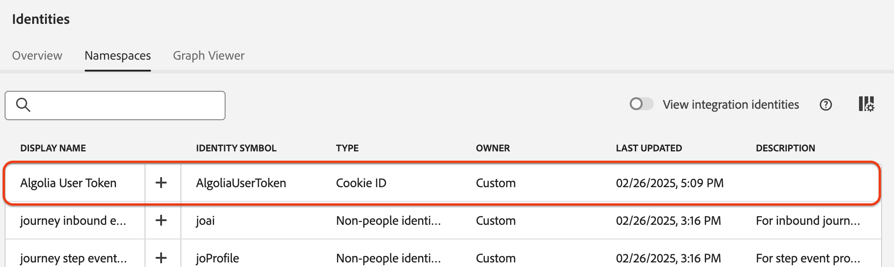

# Infoga [!DNL Algolia User Profiles]-data i Experience Platform med användargränssnittet

I den här självstudiekursen får du hjälp med att importera data från ditt [!DNL Algolia User Profiles]-konto till Adobe Experience Platform via användargränssnittet.

## Kom igång

>[!IMPORTANT]
>
>Innan du börjar kontrollerar du att du har slutfört de krav som beskrivs i [[!DNL Algolia User Profiles] översikten](../../../../connectors/data-partners/algolia-user-profiles.md#prerequisites).

I den här självstudiekursen förutsätts det att du är bekant med följande Experience Platform-komponenter:

* [[!DNL Experience Data Model (XDM)] System](../../../../../xdm/home.md): Det standardiserade ramverk som Experience Platform använder för att organisera kundupplevelsedata.

   * [Grundläggande om schemakomposition](../../../../../xdm/schema/composition.md): Lär dig mer om schemakomposition, inklusive viktiga principer och bästa praxis.
   * [Schemaredigeraren, självstudiekurs](../../../../../xdm/tutorials/create-schema-ui.md): Lär dig hur du skapar anpassade scheman med hjälp av gränssnittet för Schemaredigeraren.
* [[!DNL Real-Time Customer Profile]](../../../../../profile/home.md): En enhetlig kundprofil i realtid baserad på aggregerade data från flera källor.
* [Källor](../../../../home.md): Importera data från olika källor och använd Experience Platform tjänster för att strukturera, etikettera och förbättra data.

### Samla in nödvändiga inloggningsuppgifter

Ange följande autentiseringsuppgifter för att ansluta [!DNL Algolia] till Adobe Experience Platform:

| Autentiseringsuppgifter | Beskrivning |
| -------------- | ----------------------------------------------------------------------------------------- |
| Program-ID | Den unika identifierare som tilldelats ditt [!DNL Algolia]-konto. |
| API-nyckel | Autentiseringsuppgifter för autentisering och auktorisering av API-begäranden till [!DNL Algolia]-tjänster. |

Mer information finns i [!DNL Algolia] [autentiseringsdokumentationen](https://www.algolia.com/doc/tools/cli/get-started/authentication/).

## Anslut ditt [!DNL Algolia]-konto

I Experience Platform-gränssnittet väljer du **[!UICONTROL Sources]** i den vänstra navigeringen för att öppna arbetsytan i *[!UICONTROL Sources]*. Använd panelen *[!UICONTROL Categories]* eller sökfältet för att hitta den källa du vill använda.

Om du vill ansluta [!DNL Algolia] väljer du **[!UICONTROL Algolia]**-källkortet under *[!UICONTROL Data & Identity Partners]* och väljer **[!UICONTROL Set up]**.

>[!TIP]
>
> Om en källa ännu inte har något autentiserat konto visas alternativet **[!UICONTROL Set up]**. När den har autentiserats ändras den till **[!UICONTROL Add data]**.

## Autentisering

### Använd ett befintligt konto

Om du vill använda ett befintligt konto väljer du **[!UICONTROL Existing account]** och väljer det [!DNL Algolia User Profiles]-konto som du vill använda. Välj sedan **[!UICONTROL Next]**.

### Skapa ett nytt konto

Om du vill skapa ett nytt konto väljer du **[!UICONTROL New account]**, anger ett namn, en valfri beskrivning och dina [!DNL Algolia]-inloggningsuppgifter. Välj **[!UICONTROL Connect to source]** och vänta på att anslutningen ska upprättas.

## Lägg till data

När ditt [!DNL Algolia User Profiles]-konto har skapats visas steget **[!UICONTROL Add data]**. Använd den för att välja och förhandsgranska användarprofildata för konsumtion.

* Ange valfria **[!UICONTROL Indices]** och **[!UICONTROL Affinity(s)]** till vänster.
* Till höger kan du förhandsgranska upp till 100 rader med användarprofiler.

Välj **[!UICONTROL Next]** när du är klar.

## Ange information om dataflöde

Om du använder en befintlig datauppsättning väljer du en som är associerad med ett schema som innehåller fältgruppen [!DNL Algolia Profile]. Kontrollera att fältet [!DNL Algolia User Token] använder identitetsnamnrymden [!DNL Algolia User Token].  Om [!DNL Algolia User Token] inte har skapats eller tilldelats för tillfället visas instruktioner nedan.

Om du skapar en ny datauppsättning väljer du ett schema med fältgruppen [!DNL Algolia Profile].

### Skapa [!DNL Algolia User Token]-ID-namnområde

Du måste skapa identitetsnamnrymden [!DNL Algolia User Token] om den inte redan finns i din organisation.

Använd den vänstra navigeringen och välj **[!UICONTROL Identities]** för att komma åt arbetsytan för användargränssnittet i [ identitetstjänsten](../../../../../identity-service/home.md) och välj sedan **[!UICONTROL Create identity namespace]**.

Ange sedan **[!UICONTROL Display Name]** och **[!UICONTROL Identity Symbol]** för ditt anpassade namnutrymme. Under det här steget måste du även konfigurera typen av namnutrymme. När du är klar väljer du **[!UICONTROL Create]**.

| Konfigurera anpassat namnutrymme | Värde |
| --- | --- |
| **[!UICONTROL Display Name]** | [!DNL Algolia User Token] |
| **[!UICONTROL Identity Symbol]** | [!DNL AlgoliaUserToken] |
| **[!UICONTROL Select a type]** | [!DNL Cookie ID] |

När namnutrymmet har lagts till visas det i listan. Du kan nu använda den i ditt schema.

### Använd namnutrymmet i ditt schema

Använd den vänstra navigeringen och välj **[!UICONTROL Schemas]** för att komma åt arbetsytan för användargränssnittet [ Scheman ](../../../../../xdm/ui/overview.md). Använd schemaarbetsytan för att skapa eller uppdatera ett schema med fältgruppen [!DNL Algolia Profile Details]. Navigera sedan till fältet **[!UICONTROL User Token]** och använd högerspåret för att markera rutan **[!UICONTROL Identity]**. Använd dessutom indatarutan för att definiera identitetsnamnrymden [!DNL Algolia User Token]. När du är klar väljer du **[!UICONTROL Save]**.

När fältet **[!UICONTROL User Token]** har tilldelats identitetsnamnutrymmet [!DNL Algolia User Token] visas identiteten i användarprofilen för alla profiler.

## Mappa datafält till ett XDM-schema

Använd mappningsgränssnittet för att mappa källdata till schemafält. Mer information finns i [mappningsguiden](../../../../../data-prep/ui/mapping.md).

## Schemalägg körning av inmatning

Använd sedan schemaläggningsgränssnittet för att definiera inmatningsschemat för dataflödet.

| Schemaläggningskonfiguration | Beskrivning |
| --- | --- |
| Frekvens | Konfigurera frekvens för att ange hur ofta dataflödet ska köras. Du kan ange frekvensen till: <ul><li>**En gång**: Ställ in din frekvens på `once` för att skapa en engångsinmatning. Konfigurationer för intervall och bakåtfyllnad är inte tillgängliga när ett dataflöde för engångsinmatning skapas. Som standard är schemaläggningsfrekvensen inställd på en gång.</li><li>**Minut**: Ställ in din frekvens på `minute` för att schemalägga ditt dataflöde att importera data per minut.</li><li>**Timme**: Ställ in din frekvens på `hour` för att schemalägga ditt dataflöde att importera data per timme.</li><li>**Dag**: Ställ in din frekvens på `day` för att schemalägga ditt dataflöde att importera data per dag.</li><li>**Vecka**: Ställ in din frekvens på `week` för att schemalägga ditt dataflöde att importera data per vecka.</li></ul> |
| Intervall | När du har valt en frekvens kan du konfigurera intervallinställningen för att upprätta en tidsram mellan varje intag. Om du t.ex. anger din frekvens som dag och konfigurerar intervallet till 15, kommer dataflödet att köras var 15:e dag. Du kan inte ange intervallet till noll. Det minsta tillåtna intervallvärdet för varje frekvens är följande:<ul><li>**En gång**: ingen/a</li><li>**Minut**: 15</li><li>**Timme**: 1</li><li>**Dag**: 1</li><li>**Vecka**: 1</li></ul> |
| Starttid | Tidsstämpeln för den projicerade körningen visas i UTC-tidszonen. |
| Backfill | Backfill avgör vilka data som hämtas från början. Om bakåtfyllning är aktiverad, kommer alla aktuella filer i den angivna sökvägen att importeras under det första schemalagda intaget. Om underfyllning är inaktiverad importeras endast de filer som läses in mellan den första importkörningen och starttiden. Filer som lästs in före starttiden importeras inte. |

## Granska ditt dataflöde

Använd granskningssidan för att få en sammanfattning av dataflödet före intag. Detaljerna är grupperade i följande kategorier:

* **Anslutning** - Visar källtypen, den relevanta sökvägen för den valda källfilen och antalet kolumner i källfilen.
* **Tilldela datauppsättnings- och mappningsfält** - Visar vilka datauppsättningar som källdata importeras till, inklusive det schema som datauppsättningen följer.
* **Schemaläggning** - Visar den aktiva perioden, frekvensen och intervallet för intagsschemat.

När du har granskat dataflödet väljer du **[!UICONTROL Finish]** och tillåt en tid innan dataflödet skapas.

## Nästa steg

Genom att följa den här självstudiekursen har du skapat ett dataflöde för att överföra återgivningsdata från [!DNL Algolia]-källan till Experience Platform. Ytterligare resurser finns i dokumentationen nedan.

### Övervaka dataflödet

När dataflödet har skapats kan du övervaka de data som hämtas genom det för att visa information om hur mycket data som har importerats, hur bra de är och vilka fel som har uppstått. Mer information om hur du övervakar dataflöde finns i självstudiekursen [Övervaka konton och dataflöden i användargränssnittet](../../../../../dataflows/ui/monitor-sources.md).

### Uppdatera ditt dataflöde

Om du vill uppdatera konfigurationer för schemaläggning, mappning och allmän information för dina dataflöden går du till självstudiekursen [Uppdatera källornas dataflöden i användargränssnittet](../../update-dataflows.md).

### Ta bort ditt dataflöde

Du kan ta bort dataflöden som inte längre är nödvändiga eller som har skapats felaktigt med funktionen **[!UICONTROL Delete]** som finns på arbetsytan i **[!UICONTROL Dataflows]**. Mer information om hur du tar bort dataflöden finns i självstudiekursen [Ta bort dataflöden i användargränssnittet](../../delete.md).
