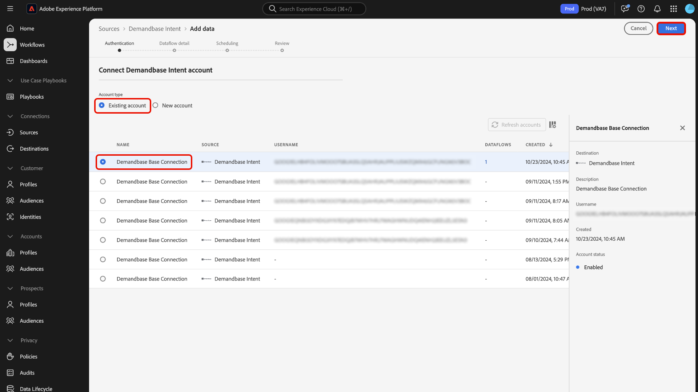
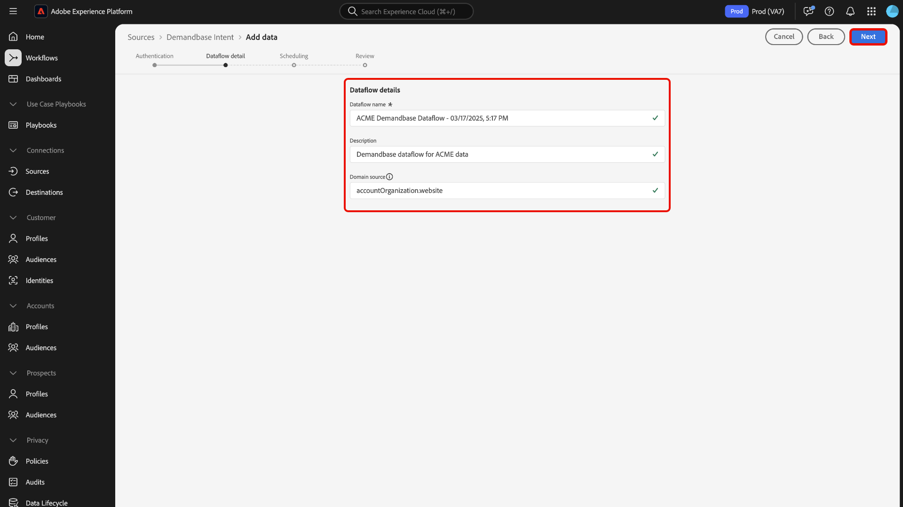
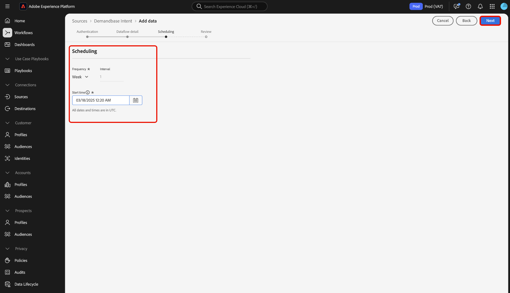

# Anslut [!DNL Demandbase Intent] till Experience Platform med användargränssnittet

Läs den här vägledningen när du vill lära dig hur du ansluter ditt [!DNL Demandbase Intent]-konto till Adobe Experience Platform med användargränssnittet.

## Kom igång

Den här självstudiekursen kräver en fungerande förståelse av följande komponenter i Experience Platform:

* [Real-Time CDP B2B edition](../../../../../rtcdp/b2b-overview.md): Real-Time CDP B2B edition är särskilt utformat för marknadsförare som använder en tjänstmodell som bygger på business-to-business. Den sammanför data från flera källor och kombinerar dem i en enda vy över personer och kontoprofiler. Tack vare dessa enhetliga data kan marknadsförarna inrikta sig exakt på specifika målgrupper och engagera dessa målgrupper i alla tillgängliga kanaler.
* [Källor](../../../../home.md): Med Experience Platform kan data hämtas från olika källor samtidigt som du kan strukturera, etikettera och förbättra inkommande data med hjälp av Experience Platform tjänster.
* [Sandlådor](../../../../../sandboxes/home.md): Experience Platform tillhandahåller virtuella sandlådor som partitionerar en enda Experience Platform-instans till separata virtuella miljöer för att utveckla och utveckla program för digitala upplevelser.

### Förhandskrav

Läs [[!DNL Demandbase Intent] översikten](../../../../connectors/data-partners/demandbase.md) om du vill ha mer information om hur du hämtar autentiseringsuppgifter.

## Navigera i källkatalogen {#navigate}

I Experience Platform-gränssnittet väljer du **[!UICONTROL Sources]** i den vänstra navigeringen för att komma åt arbetsytan i *[!UICONTROL Sources]*. Du kan välja lämplig kategori på panelen *[!UICONTROL Categories]*. Du kan också använda sökfältet för att navigera till den specifika källa som du vill använda.

Om du vill använda [!DNL Demandbase] väljer du **[!UICONTROL Demandbase Intent]**-källkortet under [!UICONTROL Data & Identity Partners] och sedan **[!UICONTROL Add data]**.

>[!TIP]
>
>Källor i källkatalogen visar alternativet **[!UICONTROL Set up]** när en angiven källa ännu inte har något autentiserat konto. När det finns ett autentiserat konto ändras det här alternativet till **[!UICONTROL Add data]**.

## Autentisering {#authentication}

### Använd ett befintligt konto {#existing}

Om du vill använda ett befintligt konto väljer du **[!UICONTROL Existing account]** och sedan det konto som du vill använda i listan över konton i gränssnittet.

När du har valt ditt konto väljer du **[!UICONTROL Next]** för att fortsätta till nästa steg.

### Skapa ett nytt konto {#create}

Om du inte har något befintligt konto måste du skapa ett nytt konto genom att ange de autentiseringsuppgifter som motsvarar källan.

Om du vill skapa ett nytt konto väljer du **[!UICONTROL New account]** och anger sedan ett kontonamn och eventuellt en beskrivning av din kontoinformation. Ange sedan lämpliga autentiseringsvärden för att autentisera källan mot Experience Platform. Om du vill ansluta ditt [!DNL Demandbase Intent]-konto måste du ha följande autentiseringsuppgifter:

* **Åtkomstnyckel-ID**: Ditt [!DNL Demandbase]-ID för åtkomstnyckel. Det här är en 61 tecken lång alfanumerisk sträng som krävs för att autentisera ditt konto för Experience Platform.
* **Hemlig åtkomstnyckel**: Den hemliga [!DNL Demandbase]-åtkomstnyckeln. Detta är en 40-siffrig, base-64-kodad sträng som krävs för att autentisera ditt konto för Experience Platform.
* **Bucket-namn**: Din [!DNL Demandbase]-bucket som data hämtas från.

## Ange information om dataflöde {#provide-dataflow-details}

När ditt konto har autentiserats och anslutits måste du nu ange följande information för ditt dataflöde:

* **Dataflödesnamn**: Namnet på dataflödet. Du kan använda det här namnet för att söka efter dataflödet i användargränssnittet när det har skapats och bearbetats.
* **Beskrivning**: (Valfritt) En kort förklaring eller ytterligare information om dataflödet.
* **Domänkälla**: Domänfältet eller webbplatsfältet som matchar källkontoposterna mot Experience Platform-konton. Detta värde kan bero på dina konfigurationer. Om det inte anges används `accountOrganization.website` som standard.

## Schemalägg dataflöde {#schedule-dataflow}

Använd sedan schemaläggningsgränssnittet för att konfigurera ett intag-schema för dataflödet.

* **Frekvens**: Konfigurera frekvens för att ange hur ofta dataflödet ska köras. Du kan schemalägga ditt [!DNL Demandbase]-dataflöde att importera data varje vecka.
* **Intervall**: Intervall representerar tidsintervallet mellan varje inmatningscykel. Det enda intervall som stöds för ett [!DNL Demandbase]-dataflöde är `1`. Det innebär att dataflödet kommer att importera data en gång i veckan, varje vecka.
* **Starttid**: Starttiden bestämmer när dataflödets första körningstid inträffar. [!DNL Demandbase] släpper data till Adobe en gång i veckan, på måndagar, klockan 12:00 UTC. Därför måste du ange starttiden för ditt intag efter 12:00 UTC. Dessutom måste du bekräfta tiden för inläsning med [!DNL Demandbase] eftersom de kan ändra deras schema när filer släpps till Adobe.
* **Backfill**: Backfill avgör vilka data som hämtas från början. Om bakåtfyllning är aktiverad, kommer alla aktuella filer i den angivna sökvägen att importeras under det första schemalagda intaget. Om underfyllning är inaktiverad importeras endast de filer som läses in mellan den första importkörningen och starttiden. Filer som lästs in före starttiden importeras inte.

Välj **[!UICONTROL Next]** när du har konfigurerat dataflödets schema för inmatning.

## Granska dataflöde {#review-dataflow}

Det sista steget i processen för att skapa dataflöde är att granska dataflödet innan det körs. Använd steget *[!UICONTROL Review]* om du vill granska informationen om det nya dataflödet innan det körs. Detaljerna är grupperade i följande kategorier:

* **Anslutning**: Visar källtypen, den relevanta sökvägen för den valda källfilen och antalet kolumner i källfilen.
* **Schemaläggning**: Visar den aktiva perioden, frekvensen och intervallet för intagsschemat.

## Nästa steg

Genom att följa den här självstudiekursen har du skapat ett dataflöde för att överföra återgivningsdata från [!DNL Demandbase]-källan till Experience Platform. Ytterligare resurser finns i dokumentationen nedan.

### Övervaka dataflödet

När dataflödet har skapats kan du övervaka de data som hämtas genom det för att visa information om hur mycket data som har importerats, hur bra de är och vilka fel som har uppstått. Mer information om hur du övervakar dataflöde finns i självstudiekursen [Övervaka konton och dataflöden i användargränssnittet](../../../../../dataflows/ui/monitor-sources.md).

### Uppdatera ditt dataflöde

Om du vill uppdatera konfigurationer för schemaläggning, mappning och allmän information för dina dataflöden går du till självstudiekursen [Uppdatera källornas dataflöden i användargränssnittet](../../update-dataflows.md).

### Ta bort ditt dataflöde

Du kan ta bort dataflöden som inte längre är nödvändiga eller som har skapats felaktigt med funktionen **[!UICONTROL Delete]** som finns på arbetsytan i **[!UICONTROL Dataflows]**. Mer information om hur du tar bort dataflöden finns i självstudiekursen [Ta bort dataflöden i användargränssnittet](../../delete.md).
