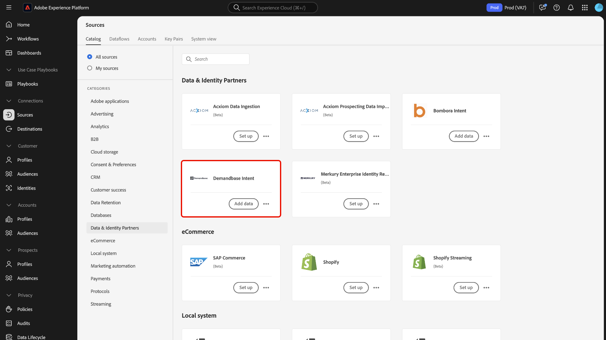

# Anslut [!DNL Demandbase Intent] till Experience Platform med hjälp av användargränssnittet

Läs den här guiden om du vill veta hur du ansluter ditt [!DNL Demandbase Intent] konto till Adobe Experience Platform med hjälp av användargränssnittet.

## Kom igång

Den här självstudiekursen kräver en fungerande förståelse av följande komponenter i Experience Platform:

* [Real-Time CDP B2B Edition: Real-Time CDP B2B Edition](../../../../../rtcdp/b2b-overview.md) är specialbyggd för marknadsförare som arbetar med en business-to-business-servicemodell. Den samlar data från flera källor och kombinerar den till en enda vy över personer och kontoprofiler. Dessa enhetliga data gör det möjligt för marknadsförare att exakt rikta in sig på specifika målgrupper och engagera dessa målgrupper i alla tillgängliga kanaler.
* [Källor](../../../../home.md): Experience Platform gör det möjligt att importera data från olika källor samtidigt som du kan strukturera, märka och förbättra inkommande data med hjälp av Experience Platform-tjänster.
* [Sandlådor](../../../../../sandboxes/home.md): Experience Platform tillhandahåller virtuella sandlådor som partitionerar en enda Experience Platform-instans i separata virtuella miljöer för att hjälpa till att utveckla och utveckla program för digitala upplevelser.

### Förhandskrav

Läs översikten [[!DNL Demandbase Intent] ](../../../../connectors/data-partners/demandbase.md) för information om hur du hämtar dina autentiseringsuppgifter.

## Navigera i källkatalogen {#navigate}

I Experience Platform-gränssnittet väljer du **[!UICONTROL Sources]** i den vänstra navigeringen för att komma åt arbetsytan i *[!UICONTROL Sources]*. Du kan välja lämplig kategori på panelen *[!UICONTROL Categories]*. Du kan också använda sökfältet för att navigera till den specifika källa som du vill använda.

Om du vill använda [!DNL Demandbase]väljer du **[!UICONTROL Demandbase Intent]** källkortet under [!UICONTROL Data & Identity Partners] och väljer **[!UICONTROL Add data]** sedan.

>[!TIP]
>
>Källor i källkatalogen visar alternativet **[!UICONTROL Set up]** när en viss källa ännu inte har ett autentiserat konto. När det finns ett autentiserat konto ändras det här alternativet till **[!UICONTROL Add data]**.

## Autentisering {#authentication}

### Använd ett befintligt konto {#existing}

Om du vill använda ett befintligt konto väljer du **[!UICONTROL Existing account]** och sedan det konto som du vill använda i listan över konton i gränssnittet.

När du har valt ditt konto väljer du **[!UICONTROL Next]** för att fortsätta till nästa steg.

### Skapa ett nytt konto {#create}

Om du inte har ett befintligt konto måste du skapa ett nytt konto genom att ange de autentiseringsuppgifter som krävs och som motsvarar din källa.

Om du vill skapa ett nytt konto väljer du **[!UICONTROL New account]** och anger sedan ett kontonamn och eventuellt en beskrivning av dina kontouppgifter. Ange sedan lämpliga autentiseringsvärden för att autentisera källan mot Experience Platform. För att ansluta ditt [!DNL Demandbase Intent] konto måste du ha följande uppgifter:

* **Åtkomstnyckel-ID:** Ditt [!DNL Demandbase] åtkomstnyckel-ID. Det här är en alfanumerisk sträng på 61 tecken som krävs för att autentisera ditt konto till Experience Platform.
* **Hemlig åtkomstnyckel**: Din [!DNL Demandbase] hemliga åtkomstnyckel. Det här är en 40-teckens, base-64-kodad sträng som krävs för att autentisera ditt konto till Experience Platform.
* **Bucketnamn**: Din [!DNL Demandbase] bucket som data ska hämtas från.

## Ange information om dataflöde {#provide-dataflow-details}

När ditt konto har autentiserats och anslutits måste du nu ange följande information för ditt dataflöde:

* **Dataflödesnamn**: Namnet på dataflödet. Du kan använda det här namnet för att söka efter ditt dataflöde i användargränssnittet när det har skapats och bearbetats.
* **Beskrivning**: (Valfritt) En kort förklaring eller ytterligare information om ditt dataflöde.
* **Domänkälla**: Domän- eller webbplatsfältet som matchar källkontoposterna mot Experience Platform-konton. Det här värdet kan bero på dina konfigurationer. Om det inte anges används `accountOrganization.website`domänen som standard.

## Schemalägg dataflöde {#schedule-dataflow}

Använd sedan schemaläggningsgränssnittet för att konfigurera ett intag-schema för dataflödet.

* **Frekvens**: Konfigurera frekvens för att ange hur ofta dataflödet ska köras. Du kan schemalägga ditt [!DNL Demandbase]-dataflöde att importera data varje vecka.
* **Intervall**: Intervall representerar tidsintervallet mellan varje inmatningscykel. Det enda intervall som stöds för ett [!DNL Demandbase]-dataflöde är `1`. Det innebär att ditt dataflöde matar in data en gång i veckan, varje vecka.
* **Starttid**: Starttiden avgör när den första körningsiterationen av ditt dataflöde kommer att ske. [!DNL Demandbase] släpper data till Adobe en gång i veckan, på måndagar, kl. 12:00 UTC. Därför måste du ange starttiden för inmatningen efter 12:00 UTC. Dessutom måste du bekräfta inmatningstiden med [!DNL Demandbase] eftersom de kan ändra sitt schema när de släpper filer till Adobe.
* **Återfyllnad**: Återfyllnad avgör vilka data som först matas in. Om återfyllning är aktiverat kommer alla aktuella filer i den angivna sökvägen att importeras under den första schemalagda inmatningen. Om återfyllnad är inaktiverat importeras endast de filer som läses in mellan den första körningen av inmatning och starttiden. Filer som lästs in före starttiden kommer inte att matas in.

Välj **[!UICONTROL Next]** när du har konfigurerat dataflödets schema för inmatning.

## Granska dataflöde {#review-dataflow}

Det sista steget i processen för att skapa dataflöde är att granska dataflödet innan det körs. Använd steget *[!UICONTROL Review]* för att granska informationen om ditt nya dataflöde innan det körs. Detaljerna är grupperade i följande kategorier:

* **Anslutning**: Visar källtypen, den relevanta sökvägen till den valda källfilen och antalet kolumner i källfilen.
* **Schemaläggning**: Visar den aktiva perioden, frekvensen och intervallet för inmatningsschemat.

## Nästa steg

Genom att följa den här självstudiekursen har du skapat ett dataflöde för att överföra återgivningsdata från [!DNL Demandbase]-källan till Experience Platform. Ytterligare resurser finns i dokumentationen nedan.

### Övervaka ditt dataflöde

När ditt dataflöde har skapats kan du övervaka de data som matas in genom det för att visa information om inmatningshastigheter, lyckade och fel. Mer information om hur du övervakar dataflöden finns i självstudiekursen om [övervaka konton och dataflöden i användargränssnittet](../../../../../dataflows/ui/monitor-sources.md).

### Uppdatera ditt dataflöde

Om du vill uppdatera konfigurationerna för schemaläggning, mappning och allmän information för dina dataflöden går du till självstudiekursen om [uppdatera källdataflöden i användargränssnittet](../../update-dataflows.md).

### Ta bort ditt dataflöde

Du kan ta bort dataflöden som inte längre behövs eller som har skapats felaktigt med hjälp av funktionen **[!UICONTROL Delete]** som är tillgänglig på **[!UICONTROL Dataflows]** arbetsytan. Mer information om hur du tar bort dataflöden finns i självstudiekursen om [ta bort dataflöden i användargränssnittet](../../delete.md).
