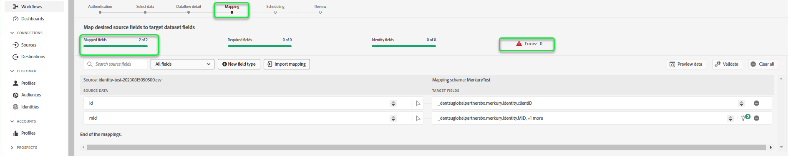

# Skapa en [!DNL Merkury Enterprise Identity Resolution]-källanslutning och ett dataflöde i användargränssnittet

>[!NOTE]
>
>Källan [!DNL Merkury Enterprise Identity Resolution] är i betaversion. Läs [källöversikten](../../../../home.md#terms-and-conditions) om du vill ha mer information om hur du använder betatecknade källor.

I den här självstudiekursen beskrivs hur du skapar en [!DNL Merkury Enterprise Identity Resolution]-källanslutning och ett dataflöde med Adobe Experience Platform-användargränssnittet.

## Kom igång

Den här självstudiekursen kräver en fungerande förståelse av följande komponenter i Experience Platform:

* [[!DNL Experience Data Model (XDM)] System](../../../../../xdm/home.md): Det standardiserade ramverk som Experience Platform använder för att ordna kundupplevelsedata.
   * [Grundläggande om schemakomposition](../../../../../xdm/schema/composition.md): Lär dig mer om grundstenarna i XDM-scheman, inklusive nyckelprinciper och bästa metoder för schemakomposition.
   * [Schemaredigeraren, självstudiekurs](../../../../../xdm/tutorials/create-schema-ui.md): Lär dig hur du skapar anpassade scheman med hjälp av gränssnittet för Schemaredigeraren.
* [[!DNL Real-Time Customer Profile]](../../../../../profile/home.md): Tillhandahåller en enhetlig konsumentprofil i realtid baserad på aggregerade data från flera källor.

### Samla in nödvändiga inloggningsuppgifter

Om du vill komma åt din bucket på Experience Platform måste du ange giltiga värden för följande autentiseringsuppgifter:

| Autentiseringsuppgifter | Beskrivning |
| --- | --- |
| Åtkomstnyckel | Åtkomstnyckel-ID för din bucket. Du kan hämta det här värdet från ditt [!DNL Merkury]-team. |
| Hemlig nyckel | Det hemliga nyckel-ID:t för din bucket. Du kan hämta det här värdet från ditt [!DNL Merkury]-team. |
| Buckennamn | Det här är din Merkury-bucket där filer delas. Du kan hämta det här värdet från ditt [!DNL Merkury]-team. |

Mer information om hur du konfigurerar för [!DNL Merkury] och andra krav finns i [[!DNL Merkury] källöversikten](../../../../connectors/data-partners/merkury.md).

## Anslut ditt Merkury-konto

I Experience Platform-gränssnittet väljer du **[!UICONTROL Sources]** i det vänstra navigeringsfältet för att komma åt arbetsytan i [!UICONTROL Sources]. På skärmen [!UICONTROL Catalog] visas en mängd olika källor som du kan skapa ett konto med.

Du kan välja lämplig kategori i katalogen till vänster på skärmen. Du kan också hitta den källa du vill arbeta med med med sökalternativet.

Under kategorin **[!UICONTROL Data partners]** väljer du **[!UICONTROL Merkury]** och sedan **[!UICONTROL Set up]**.

Sidan **[!UICONTROL Connect to Merkury]** visas. På den här sidan kan du antingen använda nya autentiseringsuppgifter eller befintliga.

### Skapa ett nytt konto

Om du använder nya autentiseringsuppgifter väljer du **[!UICONTROL New account]**. Ange ett namn, en valfri beskrivning och dina [!DNL Merkury]-inloggningsuppgifter på det indataformulär som visas. När du är klar väljer du **[!UICONTROL Connect to source]** och tillåt sedan lite tid för att upprätta den nya anslutningen.

### Använd ett befintligt konto

Om du vill använda ett befintligt konto väljer du **[!UICONTROL Existing account]** och sedan det [!DNL Merkury]-konto som du vill använda. Välj **[!UICONTROL Next]** om du vill fortsätta.

>[!BEGINSHADEBOX]

**Filformat som stöds**

Du kan importera följande filformat med källan [!DNL Merkury]:

* Avgränsaravgränsade värden (DSV): Alla värden med ett tecken kan användas som avgränsare för DSV-formaterade datafiler.
* [!DNL JavaScript Object Notation] (JSON): JSON-formaterade datafiler måste vara XDM-kompatibla.
* [!DNL Apache Parquet]: Parquet-formaterade datafiler måste vara XDM-kompatibla.
* Komprimerade filer: JSON och avgränsade filer kan komprimeras som: `bzip2`, `gzip`, `deflate`, `zipDeflate`, `tarGzip` och `tar`.

>[!ENDSHADEBOX]

## Lägg till data

När du har skapat ditt [!DNL Merkury]-konto visas steget **[!UICONTROL Add data]**, som ger dig ett gränssnitt där du kan utforska din [!DNL Merkury]-filhierarki och välja den mapp eller fil som du vill hämta till Experience Platform.

* Den vänstra delen av gränssnittet är en katalogwebbläsare som visar din [!DNL Merkury]-filhierarki.
* I den högra delen av gränssnittet kan du förhandsgranska upp till 100 rader data från en kompatibel mapp eller fil.

Markera rotmappen för att komma åt mapphierarkin. Härifrån kan du välja en enda mapp att importera alla filer i mappen rekursivt. När du importerar en hel mapp måste du se till att alla filer i den mappen har samma dataformat och schema.

När du har valt en mapp uppdateras det högra gränssnittet till en förhandsvisning av innehållet och strukturen i den första filen i den markerade mappen.

Under det här steget kan du göra flera konfigurationer av dina data innan du fortsätter. Välj först **[!UICONTROL Data format]** och sedan lämpligt dataformat för filen i listrutan som visas.

I följande tabell visas rätt dataformat för de filtyper som stöds:

| Filtyp | Dataformat |
| --- | --- |
| CSV | [!UICONTROL Delimited] |
| JSON | [!UICONTROL JSON] |
| Parquet | [!UICONTROL XDM Parquet] |

### Markera en kolumnavgränsare

+++Välj för att visa steg för hur du anger en avgränsare

När du har konfigurerat dataformatet kan du ange en kolumnavgränsare när du importerar avgränsade filer. Välj alternativet **[!UICONTROL Delimiter]** och välj sedan en avgränsare i listrutan. Menyn innehåller de vanligaste alternativen för avgränsare, inklusive kommatecken (`,`), tabbar (`\t`) och ett rör (`|`).

Om du föredrar att använda en anpassad avgränsare väljer du **[!UICONTROL Custom]** och anger en avgränsare med ett tecken i popup-indatafältet.

+++

### Infoga komprimerade filer

+++ Välj om du vill visa steg för hur du importerar komprimerade filer

Du kan också importera komprimerade JSON-filer eller avgränsade filer genom att ange deras komprimeringstyp.

I steget [!UICONTROL Select data] väljer du en komprimerad fil för inhämtning och sedan lämplig filtyp och om den är XDM-kompatibel eller inte. Välj sedan **[!UICONTROL Compression type]** och välj sedan lämplig komprimerad filtyp för källdata.

Om du vill hämta en viss fil till Experience Platform markerar du en mapp och väljer sedan den fil som du vill importera. Under det här steget kan du även förhandsgranska filinnehåll för andra filer i en viss mapp med hjälp av förhandsgranskningsikonen bredvid ett filnamn.

När du är klar väljer du **[!UICONTROL Next]**.

+++

## Ange information om dataflöde

På sidan [!UICONTROL Dataflow detail] kan du välja om du vill använda en befintlig datauppsättning eller en ny datauppsättning. Under den här processen kan du även konfigurera dina data så att de importeras till profilen och aktivera inställningar som [!UICONTROL Error diagnostics], [!UICONTROL Partial ingestion] och [!UICONTROL Alerts].

### Använd en befintlig datamängd

Om du vill importera data till en befintlig datauppsättning väljer du **[!UICONTROL Existing dataset]**. Du kan antingen hämta en befintlig datauppsättning med alternativet [!UICONTROL Advanced search] eller genom att bläddra igenom listan med befintliga datauppsättningar i listrutan. När du har valt en datauppsättning anger du ett namn och en beskrivning för dataflödet.

### Använd en ny datauppsättning

Om du vill importera till en ny datauppsättning väljer du **[!UICONTROL New dataset]** och anger sedan ett namn på utdatauppsättningen och en valfri beskrivning. Välj sedan ett schema att mappa till med alternativet [!UICONTROL Advanced search] eller genom att bläddra igenom listan med befintliga scheman i listrutan. När du har valt ett schema anger du ett namn och en beskrivning för dataflödet.

### Aktivera profil- och feldiagnostik

+++Välj för att visa steg för att aktivera feldiagnostik och profilinmatning

Välj sedan **[!UICONTROL Profile dataset]** för att aktivera datauppsättningen för kundprofilen i realtid. På så sätt kan du skapa en helhetsbild av en enhets attribut och beteenden. Data från alla profilaktiverade datauppsättningar inkluderas i profilen och ändringarna tillämpas när du sparar dataflödet.

[!UICONTROL Error diagnostics] aktiverar detaljerad generering av felmeddelanden för alla felaktiga poster som inträffar i dataflödet, medan [!UICONTROL Partial ingestion] gör att du kan importera data som innehåller fel, upp till ett visst tröskelvärde som du manuellt anger. Mer information finns i [översikten över partiell gruppöverföring](../../../../../ingestion/batch-ingestion/partial.md).

+++

### Aktivera aviseringar

+++Välj för att visa steg för att aktivera aviseringar

Du kan aktivera varningar för att få meddelanden om status för ditt dataflöde. Välj en avisering i listan om du vill prenumerera och få meddelanden om statusen för ditt dataflöde. Mer information om varningar finns i guiden [prenumerera på källvarningar med användargränssnittet](../../alerts.md).

Välj **[!UICONTROL Next]** när du är klar med informationen om dataflödet.

+++

## Mappa datafält till ett XDM-schema

Steg [!UICONTROL Mapping] visas, och du får ett gränssnitt för att mappa källfälten från källschemat till rätt mål-XDM-fält i målschemat.

Experience Platform ger intelligenta rekommendationer för automatiskt mappade fält baserat på det målschema eller den datamängd som du har valt. Du kan justera mappningsreglerna manuellt så att de passar dina användningsfall. Beroende på dina behov kan du välja att mappa fält direkt eller använda förinställningsfunktioner för data för att omvandla källdata för att härleda beräknade eller beräknade värden. Mer information om hur du använder mappningsgränssnittet och beräkningsfälten finns i [Användargränssnittshandboken för dataförinställningar](../../../../../data-prep/ui/mapping.md).

När källdata har mappats väljer du **[!UICONTROL Next]**.

## Schemalägg körning av inmatning

Steg [!UICONTROL Scheduling] visas, så att du kan konfigurera ett matningsschema så att det automatiskt importerar valda källdata med de konfigurerade mappningarna. Som standard är schemaläggningen inställd på `Once`. Välj **[!UICONTROL Frequency]** och välj sedan ett alternativ i listrutan om du vill justera din inmatningsfrekvens.

>[!TIP]
>
>Intervall och bakåtfyllnad syns inte vid engångsbruk.

Om du ställer in matningsfrekvensen på `Minute`, `Hour`, `Day` eller `Week` måste du ange ett intervall för att skapa en fast tidsram mellan varje intag. En matningsfrekvens som till exempel är inställd på `Day` och ett intervall på `15` innebär att dataflödet är schemalagt att importera data var 15:e dag.

Under det här steget kan du även aktivera **bakgrundsfyllning** och definiera en kolumn för inkrementellt dataintag. Backfill används för att importera historiska data, medan kolumnen som du definierar för inkrementellt intag gör att nya data kan skiljas från befintliga data.

Se tabellen nedan för mer information om schemaläggningskonfigurationer.

| Schemaläggningskonfiguration | Beskrivning |
| --- | --- |
| Frekvens | Konfigurera frekvens för att ange hur ofta dataflödet ska köras. Du kan ange frekvensen till: <ul><li>**En gång**: Ställ in din frekvens på `once` för att skapa en engångsinmatning. Konfigurationer för intervall och bakåtfyllnad är inte tillgängliga när ett dataflöde för engångsinmatning skapas. Som standard är schemaläggningsfrekvensen inställd på en gång.</li><li>**Minut**: Ställ in din frekvens på `minute` för att schemalägga ditt dataflöde att importera data per minut.</li><li>**Timme**: Ställ in din frekvens på `hour` för att schemalägga ditt dataflöde att importera data per timme.</li><li>**Dag**: Ställ in din frekvens på `day` för att schemalägga ditt dataflöde att importera data per dag.</li><li>**Vecka**: Ställ in din frekvens på `week` för att schemalägga ditt dataflöde att importera data per vecka.</li></ul> |
| Intervall | När du har valt en frekvens kan du konfigurera intervallinställningen för att upprätta en tidsram mellan varje intag. Om du t.ex. anger din frekvens som dag och konfigurerar intervallet till 15, kommer dataflödet att köras var 15:e dag. Du kan inte ange intervallet till noll. Det minsta tillåtna intervallvärdet för varje frekvens är följande:<ul><li>**En gång**: ingen/a</li><li>**Minut**: 15</li><li>**Timme**: 1</li><li>**Dag**: 1</li><li>**Vecka**: 1</li></ul> |
| Starttid | Tidsstämpeln för den projicerade körningen visas i UTC-tidszonen. |
| Backfill | Backfill avgör vilka data som hämtas från början. Om bakåtfyllning är aktiverad, kommer alla aktuella filer i den angivna sökvägen att importeras under det första schemalagda intaget. Om underfyllning är inaktiverad importeras endast de filer som läses in mellan den första importkörningen och starttiden. Filer som lästs in före starttiden importeras inte. |

>[!NOTE]
>
>För gruppinmatning väljer varje efterföljande dataflöde filer som ska importeras från källan baserat på deras **senaste ändrade**-tidsstämpel. Detta innebär att gruppdataflödeväljer filer från källan som antingen är nya eller har ändrats sedan den senaste flödeskörningen. Dessutom måste du se till att det finns tillräckligt med tid mellan filöverföring och ett schemalagt flöde eftersom filer som inte överförs helt till ditt molnlagringskonto innan den schemalagda flödeskörningstiden kanske inte plockas upp för förtäring.

Välj **[!UICONTROL Next]** när du är klar med konfigurationen av ditt intag.

## Granska ditt dataflöde

Steg **[!UICONTROL Review]** visas, så att du kan granska det nya dataflödet innan det skapas. Informationen är grupperad i följande kategorier:

* **[!UICONTROL Connection]**: Visar källtypen, den relevanta sökvägen för den valda källfilen och mängden kolumner i källfilen.
* **[!UICONTROL Assign dataset & map fields]**: Visar vilka data som källdata hämtas till, inklusive det schema som datauppsättningen följer.
* **[!UICONTROL Scheduling]**: Visar den aktiva perioden, frekvensen och intervallet för intag-schemat.

När du har granskat dataflödet klickar du på **[!UICONTROL Finish]** och tillåt en tid innan dataflödet skapas.

## Nästa steg

Genom att följa den här självstudiekursen har du skapat ett dataflöde för att hämta batchdata från din [!DNL Merkury]-källa till Experience Platform. Ytterligare resurser finns i dokumentationen nedan.

### Övervaka dataflödet

När dataflödet har skapats kan du övervaka de data som hämtas genom det för att visa information om hur mycket data som har importerats, hur bra de är och vilka fel som har uppstått. Mer information om hur du övervakar dataflöde finns i självstudiekursen [Övervaka konton och dataflöden i användargränssnittet](../../monitor.md).

### Uppdatera ditt dataflöde

Om du vill uppdatera konfigurationer för schemaläggning, mappning och allmän information för dina dataflöden går du till självstudiekursen [Uppdatera källornas dataflöden i användargränssnittet](../../update-dataflows.md)

### Ta bort ditt dataflöde

Du kan ta bort dataflöden som inte längre är nödvändiga eller som har skapats felaktigt med funktionen **[!UICONTROL Delete]** som finns på arbetsytan i **[!UICONTROL Dataflows]**. Mer information om hur du tar bort dataflöden finns i självstudiekursen [Ta bort dataflöden i användargränssnittet](../../delete.md).
