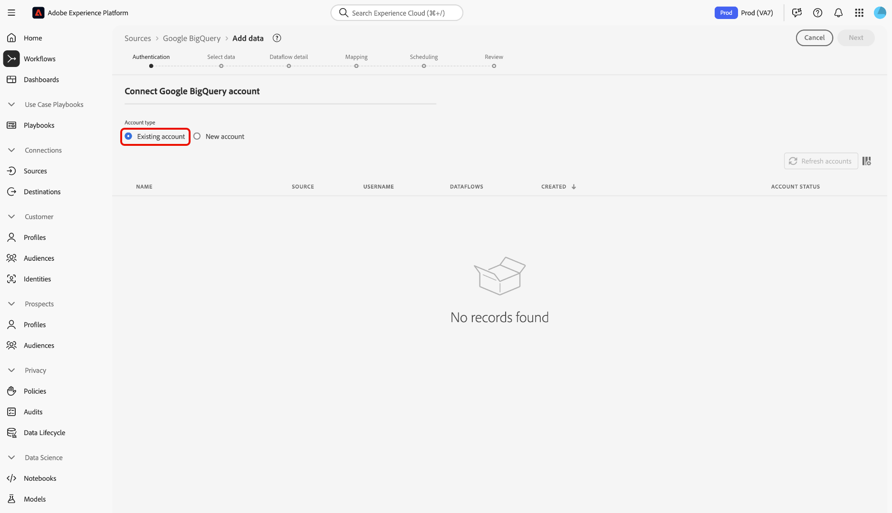

# Anslut [!DNL Google BigQuery] till Experience Platform med användargränssnittet

>[!IMPORTANT]
>
>Källan [!DNL Google BigQuery] är tillgänglig i källkatalogen för användare som har köpt Real-Time Customer Data Platform Ultimate.

I den här självstudiekursen får du lära dig hur du ansluter ditt [!DNL Google BigQuery]-konto till Adobe Experience Platform med användargränssnittet.

## Kom igång

Den här självstudiekursen kräver en fungerande förståelse av följande komponenter i Experience Platform:

* [[!DNL Experience Data Model (XDM)] System](../../../../../xdm/home.md): Det standardiserade ramverk som Experience Platform använder för att ordna kundupplevelsedata.
   * [Grundläggande om schemakomposition](../../../../../xdm/schema/composition.md): Lär dig mer om grundstenarna i XDM-scheman, inklusive nyckelprinciper och bästa metoder för schemakomposition.
   * [Schemaredigeraren, självstudiekurs](../../../../../xdm/tutorials/create-schema-ui.md): Lär dig hur du skapar anpassade scheman med hjälp av gränssnittet för Schemaredigeraren.
* [[!DNL Real-Time Customer Profile]](../../../../../profile/home.md): Tillhandahåller en enhetlig konsumentprofil i realtid baserad på aggregerade data från flera källor.

Om du redan har en giltig [!DNL Google BigQuery]-anslutning kan du hoppa över resten av det här dokumentet och gå vidare till självstudiekursen [Konfigurera ett dataflöde](../../dataflow/databases.md).

### Samla in nödvändiga inloggningsuppgifter

Läs [[!DNL Google BigQuery] autentiseringsguiden](../../../../connectors/databases/bigquery.md#prerequisites) om du vill ha mer information om hur du samlar in dina nödvändiga inloggningsuppgifter.

## Navigera i källkatalogen {#navigate}

I Experience Platform-gränssnittet väljer du **[!UICONTROL Sources]** i den vänstra navigeringen för att komma åt arbetsytan i *[!UICONTROL Sources]*. Du kan välja lämplig kategori på panelen *[!UICONTROL Categories]*. Du kan också använda sökfältet för att navigera till den specifika källa som du vill använda.

Om du vill använda [!DNL Google BigQuery] väljer du **[!UICONTROL Google BigQuery]**-källkortet under *[!UICONTROL Databases]* och sedan **[!UICONTROL Add data]**.

>[!TIP]
>
>Källor i källkatalogen visar alternativet **[!UICONTROL Set up]** när en angiven källa ännu inte har något autentiserat konto. När ett autentiserat konto har skapats ändras alternativet till **[!UICONTROL Add data]**.

## Använd ett befintligt konto {#existing}

Om du vill använda ett befintligt konto markerar du det [!DNL Google BigQuery]-konto du vill ansluta till och väljer sedan **[!UICONTROL Next]** för att fortsätta.

## Skapa ett nytt konto {#create}

Om du inte har något befintligt konto måste du skapa ett nytt konto genom att ange de autentiseringsuppgifter som motsvarar källan.

Om du vill skapa ett nytt konto väljer du **[!UICONTROL New account]** och anger sedan ett namn och kan lägga till en beskrivning för ditt konto.

### Anslut till Experience Platform på Azure {#azure}

Du kan ansluta ditt [!DNL Google BigQuery]-konto till Experience Platform på Azure med grundläggande autentisering eller tjänstautentisering.

>[!BEGINTABS]

>[!TAB Använd grundläggande autentisering]

Om du vill använda grundläggande autentisering markerar du **[!UICONTROL Basic Authentication]** och anger värden för ditt [projekt, klient-ID, klienthemlighet, uppdateringstoken och (valfritt) datamängd-ID för stora resultat ](../../../../connectors/databases/bigquery.md#generate-your-google-bigquery-credentials). När du är klar väljer du **[!UICONTROL Connect to source]** och tillåt en stund så att anslutningen kan upprättas.

>[!TAB Använd tjänstautentisering]

Om du vill använda tjänstautentisering markerar du **[!UICONTROL Service Authentication]** och anger värden för ditt [projekt-ID, nyckelfilsinnehåll och (valfritt) stort resultatdatauppsättnings-ID](../../../../connectors/databases/bigquery.md#generate-your-google-bigquery-credentials). När du är klar väljer du **[!UICONTROL Connect to source]** och tillåt en stund så att anslutningen kan upprättas.

>[!ENDTABS]

### Ansluta till Experience Platform på Amazon Web Services (AWS) {#aws}

>[!AVAILABILITY]
>
>Detta avsnitt gäller implementeringar av Experience Platform som körs på Amazon Web Services (AWS). Experience Platform som körs på AWS är för närvarande tillgängligt för ett begränsat antal kunder. Mer information om den Experience Platform-infrastruktur som stöds finns i [Experience Platform översikt över flera moln](../../../../../landing/multi-cloud.md).

Om du vill skapa ett nytt [!DNL Google BigQuery]-konto och ansluta till Experience Platform på AWS kontrollerar du att du befinner dig i en VA6-sandlåda och anger sedan de nödvändiga autentiseringsuppgifterna för autentisering.

* **Projekt-ID**: Det projekt-ID som motsvarar ditt [!DNL Google BigQuery]-konto.
* **Nyckelfilsinnehåll**: Nyckelfilen som används för att autentisera tjänstkontot. Du kan hämta det här värdet från [[!DNL Google Cloud service accounts] instrumentpanelen](https://console.cloud.google.com). Nyckelfilens innehåll är i JSON-format. Du måste koda detta i [!DNL Base64] när du autentiserar till Experience Platform.
* **Datauppsättnings-ID**: [!DNL Google BigQuery]-datauppsättnings-ID. Detta ID representerar var datatabellerna finns och måste skapas i förväg för att stöd ska kunna användas för stora resultatuppsättningar.

## Hoppa över förhandsgranskning av exempeldata {#skip-preview-of-sample-data}

Under dataurvalssteget kan du få en timeout när du importerar stora tabeller eller datafiler. Du kan hoppa över förhandsgranskning av data för att kringgå tidsgränsen och ändå visa ditt schema, om än utan exempeldata. Aktivera alternativet **[!UICONTROL Skip previewing sample data]** om du vill hoppa över förhandsgranskning av data.

Resten av arbetsflödet förblir detsamma. Den enda skillnaden är att om du hoppar över förhandsgranskning av data kan det förhindra att beräknade och obligatoriska fält valideras automatiskt under mappningssteget, och du måste då validera dessa fält manuellt under mappningen.

## Nästa steg

Genom att följa den här självstudiekursen har du upprättat en anslutning till ditt [!DNL Google BigQuery]-konto. Du kan nu fortsätta till nästa självstudiekurs och [konfigurera ett dataflöde för att hämta data till Experience Platform](../../dataflow/databases.md).
