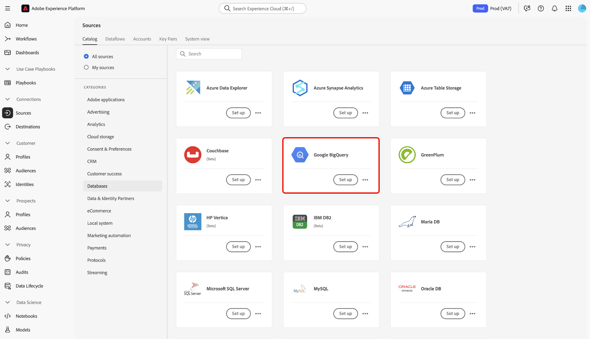

# Skapa en [!DNL Google Big Query]-källanslutning i användargränssnittet

>[!IMPORTANT]
>
>Källan [!DNL Google BigQuery] är tillgänglig i källkatalogen för användare som har köpt Real-time Customer Data Platform Ultimate.

Source-anslutningar i Adobe Experience Platform gör det möjligt att importera externa data på schemalagd basis. I den här självstudiekursen beskrivs hur du skapar en [!DNL Google Big Query]-källanslutning med hjälp av användargränssnittet för plattformen.

## Komma igång

Den här självstudiekursen kräver en fungerande förståelse av följande komponenter i Experience Platform:

* [[!DNL Experience Data Model (XDM)] System](../../../../../xdm/home.md): Det standardiserade ramverk som Experience Platform använder för att ordna kundupplevelsedata.
   * [Grundläggande om schemakomposition](../../../../../xdm/schema/composition.md): Lär dig mer om grundstenarna i XDM-scheman, inklusive nyckelprinciper och bästa metoder för schemakomposition.
   * [Schemaredigeraren, självstudiekurs](../../../../../xdm/tutorials/create-schema-ui.md): Lär dig hur du skapar anpassade scheman med hjälp av gränssnittet för Schemaredigeraren.
* [[!DNL Real-Time Customer Profile]](../../../../../profile/home.md): Tillhandahåller en enhetlig konsumentprofil i realtid baserad på aggregerade data från flera källor.

Om du redan har en giltig [!DNL Google BigQuery]-anslutning kan du hoppa över resten av det här dokumentet och gå vidare till självstudiekursen [Konfigurera ett dataflöde](../../dataflow/databases.md).

### Samla in nödvändiga inloggningsuppgifter

För att få åtkomst till ditt [!DNL Google BigQuery]-konto på plattformen måste du ange följande OAuth 2.0-autentiseringsvärden:

| Autentiseringsuppgifter | Beskrivning |
| ---------- | ----------- |
| `project` | Projekt-ID:t för standardprojektet [!DNL Google BigQuery] att fråga mot. |
| `clientID` | ID-värdet som används för att generera uppdateringstoken. |
| `clientSecret` | Det hemliga värde som används för att generera uppdateringstoken. |
| `refreshToken` | Uppdateringstoken från [!DNL Google] som används för att auktorisera åtkomst till [!DNL Google BigQuery]. |

Mer information om dessa värden finns i [det här [!DNL Google BigQuery] dokumentet](https://cloud.google.com/storage/docs/json_api/v1/how-tos/authorizing).

## Anslut ditt Google BigQuery-konto

I plattformsgränssnittet väljer du **[!UICONTROL Sources]** i den vänstra navigeringen för att komma åt arbetsytan i [!UICONTROL Sources]. På skärmen [!UICONTROL Catalog] visas en mängd olika källor som du kan skapa ett konto med.

Du kan välja lämplig kategori i katalogen till vänster på skärmen. Du kan också använda sökfältet till att hitta den källa du vill arbeta med.

Under kategorin [!UICONTROL Databases] väljer du **[!UICONTROL Google BigQuery]** och sedan **[!UICONTROL Add data]**.

Sidan **[!UICONTROL Connect to Google Big Query]** visas. På den här sidan kan du antingen använda nya autentiseringsuppgifter eller befintliga.

### Befintligt konto

Om du vill ansluta ett befintligt konto markerar du det [!DNL Google BigQuery]-konto du vill ansluta till och väljer sedan **[!UICONTROL Next]** för att fortsätta.

### Nytt konto

Om du använder nya autentiseringsuppgifter väljer du **[!UICONTROL New account]**. Ange ett namn, en valfri beskrivning och dina [!DNL Google BigQuery]-inloggningsuppgifter på det indataformulär som visas. När du är klar väljer du **[!UICONTROL Connect to source]** och tillåt sedan lite tid för att upprätta den nya anslutningen.

## Nästa steg

Genom att följa den här självstudiekursen har du upprättat en anslutning till ditt [!DNL Google BigQuery]-konto. Du kan nu fortsätta till nästa självstudiekurs och [konfigurera ett dataflöde för att hämta data till plattformen](../../dataflow/databases.md).
