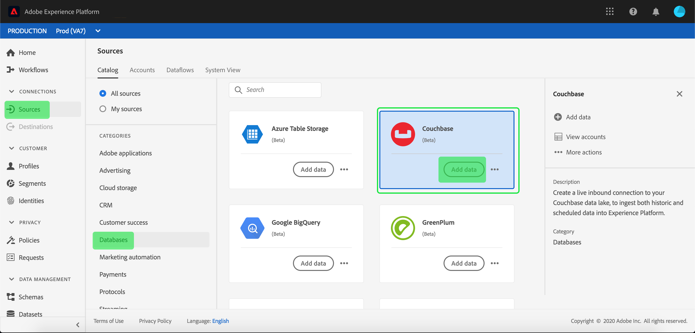

# Skapa en [!DNL Couchbase]-källanslutning i användargränssnittet

>[!NOTE]
>
> [!DNL Couchbase]-kopplingen är i betaversion. Se [Källöversikt](../../../../home.md#terms-and-conditions) om du vill ha mer information om hur du använder betatecknade anslutningar.

Källanslutningar i [!DNL Adobe Experience Platform] ger möjlighet att importera externt källdata på schemalagd basis. I den här självstudien beskrivs stegen för hur du skapar en [!DNL Couchbase]-källkoppling med användargränssnittet i [!DNL Platform].

## Komma igång

Den här självstudien kräver en fungerande förståelse av följande komponenter i [!DNL Platform]:

* [[!DNL Experience Data Model (XDM)] System](../../../../../xdm/home.md): Det standardiserade ramverket som  [!DNL Experience Platform] organiserar kundupplevelsedata.
   * [Grundläggande om schemakomposition](../../../../../xdm/schema/composition.md): Lär dig mer om de grundläggande byggstenarna i XDM-scheman, inklusive viktiga principer och bästa praxis när det gäller schemakomposition.
   * [Schemaredigeraren, genomgång](../../../../../xdm/tutorials/create-schema-ui.md): Lär dig hur du skapar anpassade scheman med hjälp av gränssnittet för Schemaredigeraren.
* [[!DNL Real-time Customer Profile]](../../../../../profile/home.md): Ger en enhetlig konsumentprofil i realtid baserad på aggregerade data från flera källor.

Om du redan har en giltig [!DNL Couchbase]-anslutning kan du hoppa över resten av det här dokumentet och gå vidare till självstudiekursen [konfigurera ett dataflöde](../../dataflow/databases.md).

### Samla in nödvändiga inloggningsuppgifter

För att kunna autentisera din [!DNL Couchbase]-källkoppling måste du ange värden för följande anslutningsegenskap:

| Autentiseringsuppgifter | Beskrivning |
| ---------- | ----------- |
| `connectionString` | Anslutningssträngen som används för att ansluta till din [!DNL Couchbase]-instans. Anslutningssträngsmönstret för [!DNL Couchbase] är `Server={SERVER}; Port={PORT};AuthMech=1;CredString=[{\"user\": \"{USER}\", \"pass\":\"{PASS}\"}];`. Mer information om hur du hämtar en anslutningssträng finns i dokumentationen om [[!DNL Couchbase] anslutning](https://docs.Couchbase.com/c-sdk/2.10/client-settings.html#configuring-overview). |

## Anslut ditt [!DNL Couchbase]-konto

När du har samlat in dina inloggningsuppgifter kan du följa stegen nedan för att länka ditt [!DNL Couchbase]-konto till [!DNL Platform].

Logga in på [Adobe Experience Platform](https://platform.adobe.com) och välj **[!UICONTROL Sources]** i det vänstra navigeringsfältet för att komma åt arbetsytan **[!UICONTROL Sources]**. Skärmen **[!UICONTROL Catalog]** visar en mängd olika källor som du kan skapa ett konto för.

Du kan välja lämplig kategori i katalogen till vänster på skärmen. Du kan också hitta den källa du vill arbeta med med med sökalternativet.

Välj **[!UICONTROL Couchbase]** under kategorin **[!UICONTROL Databases]**. Om det här är första gången du använder den här kopplingen väljer du **[!UICONTROL Configure]**. Annars väljer du **[!UICONTROL Add data]** för att skapa en ny [!DNL Couchbase]-koppling.

Sidan **[!UICONTROL Connect to Couchbase]** visas. På den här sidan kan du antingen använda nya autentiseringsuppgifter eller befintliga.

### Nytt konto

Om du använder nya autentiseringsuppgifter väljer du **[!UICONTROL New account]**. Ange ett namn, en valfri beskrivning och dina inloggningsuppgifter för [!DNL Couchbase] i det indataformulär som visas. När du är klar väljer du **[!UICONTROL Connect to source]** och tillåt sedan lite tid för att upprätta den nya anslutningen.

### Befintligt konto

Om du vill ansluta ett befintligt konto väljer du det [!DNL Couchbase]-konto du vill ansluta till och sedan väljer du **[!UICONTROL Next]** i det övre högra hörnet för att fortsätta.

## Nästa steg

Genom att följa den här självstudiekursen har du upprättat en anslutning till ditt [!DNL Couchbase]-konto. Du kan nu fortsätta till nästa självstudiekurs och [konfigurera ett dataflöde för att hämta data till [!DNL Platform]](../../dataflow/databases.md).