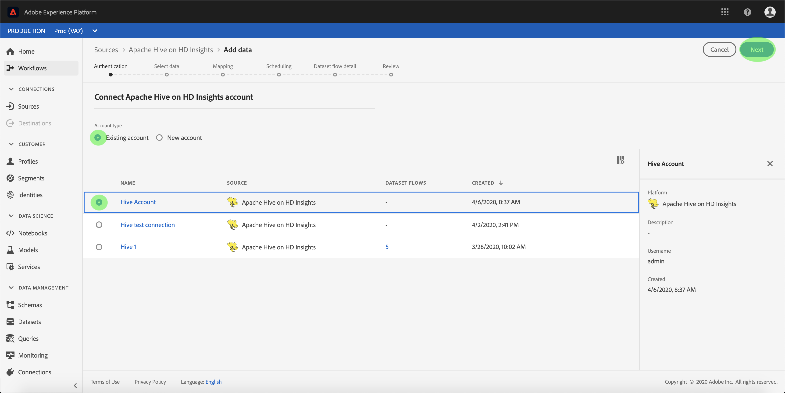

# Skapa en [!DNL Apache Hive] på [!DNL Azure HDInsights] källanslutning i användargränssnittet

>[!NOTE]
>
> The [!DNL Apache Hive] på [!DNL Azure HDInsights] anslutningen är i betaversion. Se [Översikt över källor](../../../../home.md#terms-and-conditions) om du vill ha mer information om hur du använder beta-märkta anslutningar.

Källkopplingar i Adobe Experience Platform gör det möjligt att importera externt källkodsdata på schemalagd basis. Den här självstudiekursen innehåller steg för att skapa en [!DNL Apache Hive] på [!DNL Azure HDInsights] källkoppling med [!DNL Platform] användargränssnitt.

## Komma igång

Den här självstudiekursen kräver en fungerande förståelse av följande komponenter i Adobe Experience Platform:

* [[!DNL Experience Data Model (XDM)] System](../../../../../xdm/home.md): Det standardiserade ramverk som [!DNL Experience Platform] organiserar kundupplevelsedata.
   * [Grunderna för schemakomposition](../../../../../xdm/schema/composition.md): Lär dig mer om de grundläggande byggstenarna i XDM-scheman, inklusive viktiga principer och bästa praxis när det gäller schemakomposition.
   * [Schemaredigeraren, genomgång](../../../../../xdm/tutorials/create-schema-ui.md): Lär dig hur du skapar anpassade scheman med hjälp av gränssnittet i Schemaredigeraren.
* [[!DNL Real-Time Customer Profile]](../../../../../profile/home.md): Ger en enhetlig konsumentprofil i realtid baserad på aggregerade data från flera källor.

Om du redan har en giltig [!DNL Hive] kan du hoppa över resten av dokumentet och gå vidare till självstudiekursen om [konfigurera ett dataflöde](../../dataflow/databases.md)

### Samla in nödvändiga inloggningsuppgifter

För att få åtkomst till [!DNL Hive] konto på [!DNL Platform]måste du ange följande värden:

| Autentiseringsuppgifter | Beskrivning |
| ---------- | ----------- |
| `host` | IP-adressen eller värdnamnet för [!DNL Hive] server. |
| `username` | Användarnamnet som du använder för att få åtkomst till [!DNL Hive] server. |
| `password` | Lösenordet som motsvarar användaren. |

Mer information om hur du kommer igång finns i [this [!DNL Hive] dokument](https://cwiki.apache.org/confluence/display/Hive/Tutorial#Tutorial-GettingStarted).

## Koppla samman [!DNL Hive] konto

När du har samlat in dina inloggningsuppgifter kan du följa stegen nedan för att länka dina [!DNL Hive] konto till [!DNL Platform].

Logga in på [Adobe Experience Platform](https://platform.adobe.com) och sedan **[!UICONTROL Sources]** från det vänstra navigeringsfältet för att komma åt **[!UICONTROL Sources]** arbetsyta. The **[!UICONTROL Catalog]** I visas en mängd olika källor som du kan skapa ett konto med.

Du kan välja lämplig kategori i katalogen till vänster på skärmen. Du kan också hitta den källa du vill arbeta med med med sökalternativet.

Under **[!UICONTROL Databases]** kategori, välj **[!UICONTROL Hive]**. Om det här är första gången du använder den här kopplingen väljer du **[!UICONTROL Configure]**. Annars väljer du **[!UICONTROL Add data]** för att skapa en ny [!DNL Hive] koppling.

The **[!UICONTROL Connect to Hive]** visas. På den här sidan kan du antingen använda nya autentiseringsuppgifter eller befintliga.

### Nytt konto

Om du använder nya autentiseringsuppgifter väljer du **[!UICONTROL New account]**. Ange ett namn, en valfri beskrivning och din [!DNL Hive] autentiseringsuppgifter. När du är klar väljer du **[!UICONTROL Connect]** och tillåt sedan lite tid för att upprätta den nya anslutningen.

### Befintligt konto

Välj [!DNL Hive] konto som du vill ansluta till och välj **[!UICONTROL Next]** för att fortsätta.

## Nästa steg

Genom att följa den här självstudien har du upprättat en anslutning till [!DNL Hive] konto. Du kan nu fortsätta med nästa självstudiekurs och [konfigurera ett dataflöde för att hämta data till [!DNL Platform]](../../dataflow/databases.md).
