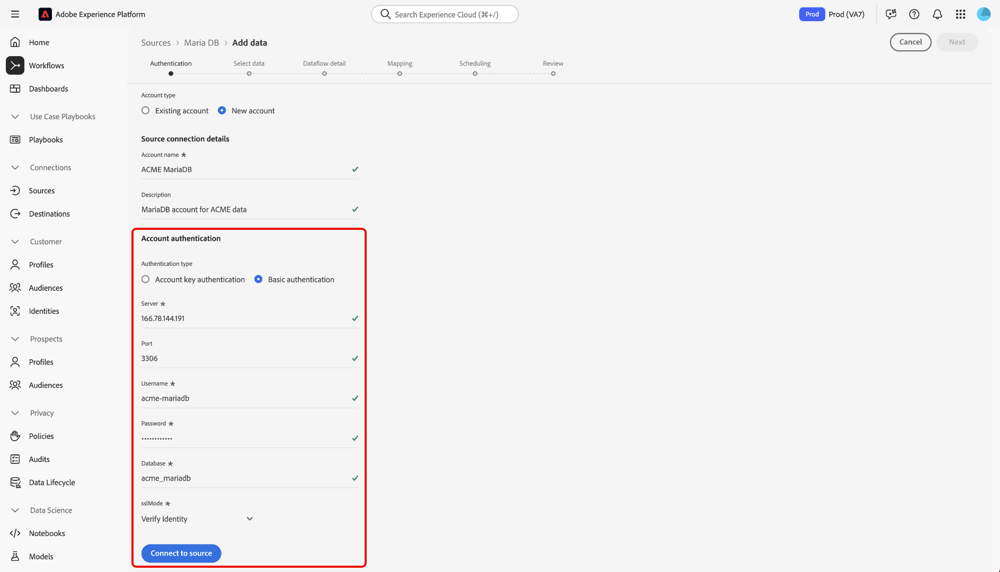

# Anslut [!DNL MariaDB] till Experience Platform med användargränssnittet

Läs den här vägledningen när du vill lära dig hur du ansluter ditt [!DNL MariaDB]-konto till Adobe Experience Platform med hjälp av källarbetsytan i Experience Platform användargränssnitt.

## Kom igång

Den här självstudiekursen kräver en fungerande förståelse av följande komponenter i Experience Platform:

* [[!DNL Experience Data Model (XDM)] System](../../../../../xdm/home.md): Det standardiserade ramverk som Experience Platform använder för att ordna kundupplevelsedata.
   * [Grundläggande om schemakomposition](../../../../../xdm/schema/composition.md): Lär dig mer om grundstenarna i XDM-scheman, inklusive nyckelprinciper och bästa metoder för schemakomposition.
   * [Schemaredigeraren, självstudiekurs](../../../../../xdm/tutorials/create-schema-ui.md): Lär dig hur du skapar anpassade scheman med hjälp av gränssnittet för Schemaredigeraren.
* [Kundprofil i realtid](../../../../../profile/home.md): Tillhandahåller en enhetlig konsumentprofil i realtid baserad på aggregerade data från flera källor.

Om du redan har en [!DNL MariaDB]-anslutning kan du hoppa över resten av det här dokumentet och gå vidare till självstudiekursen [Konfigurera ett dataflöde](../../dataflow/databases.md).

### Samla in nödvändiga inloggningsuppgifter

Läs [[!DNL MariaDB] översikten](../../../../connectors/databases/mariadb.md#prerequisites) om du vill ha information om autentisering.

## Navigera i källkatalogen

I Experience Platform-gränssnittet väljer du **[!UICONTROL Sources]** i den vänstra navigeringen för att komma åt arbetsytan i *[!UICONTROL Sources]*. Välj lämplig kategori på panelen *[!UICONTROL Categories]*. Du kan också använda sökfältet för att navigera till den specifika källa som du vill använda.

Om du vill använda [!DNL MariaDB] väljer du **[!UICONTROL MariaDB]**-källkortet under *[!UICONTROL Databases]* och sedan **[!UICONTROL Set up]**.

>[!TIP]
>
>Källor i källkatalogen visar alternativet **[!UICONTROL Set up]** när en angiven källa ännu inte har något autentiserat konto. När ett autentiserat konto har skapats ändras alternativet till **[!UICONTROL Add data]**.

## Använd ett befintligt konto {#existing}

Om du vill använda ett befintligt konto väljer du **[!UICONTROL Existing account]** och sedan det [!DNL MariaDB]-konto som du vill använda.

## Skapa ett nytt konto {#create}

Om du inte har något befintligt konto måste du skapa ett nytt konto genom att ange de autentiseringsuppgifter som motsvarar källan.

Om du vill skapa ett nytt konto väljer du **[!UICONTROL New account]** och anger sedan ett namn och kan lägga till en beskrivning för ditt konto.

### Anslut till Experience Platform

Du kan ansluta ditt [!DNL MariaDB]-konto till Experience Platform med antingen kontonyckel eller grundläggande autentisering.

>[!BEGINTABS]

>[!TAB Autentisering av kontonyckel]

Om du vill använda kontonyckelautentisering väljer du **[!UICONTROL Account key authentication]**, anger din [anslutningssträng](../../../../connectors/databases/mariadb.md#azure) och väljer sedan **[!UICONTROL Connect to source]**.

>[!TAB Grundläggande autentisering]

Om du vill använda grundläggande autentisering väljer du **[!UICONTROL Basic authentication]**, anger värden för dina [autentiseringsuppgifter](../../../../connectors/databases/mariadb.md#azure) och väljer sedan **[!UICONTROL Connect to source]**.

>[!ENDTABS]

Genom att följa den här självstudiekursen har du upprättat en anslutning till ditt [!DNL MariaDB]-konto. Du kan nu fortsätta till nästa självstudiekurs och [konfigurera ett dataflöde för att hämta data till Experience Platform](../../dataflow/databases.md).
