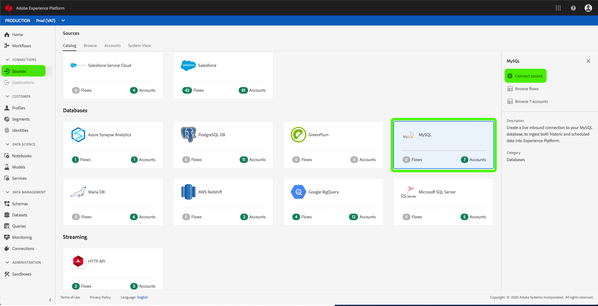

# Skapa en MySQL-källkoppling i användargränssnittet

Källkopplingar i Adobe Experience Platform gör det möjligt att importera externt källdata på schemalagd basis. I den här självstudiekursen beskrivs hur du skapar en MySQL-källkoppling med hjälp av användargränssnittet för plattformen.

## Komma igång

Den här självstudien kräver en fungerande förståelse av följande komponenter i Adobe Experience Platform:

* [Experience Data Model (XDM) System](../../../../../xdm/home.md): Det standardiserade ramverk som Experience Platform använder för att organisera kundupplevelsedata.
   * [Grundläggande om schemakomposition](../../../../../xdm/schema/composition.md): Lär dig mer om de grundläggande byggstenarna i XDM-scheman, inklusive viktiga principer och bästa praxis när det gäller schemakomposition.
   * [Schemaredigeraren, genomgång](../../../../../xdm/tutorials/create-schema-ui.md): Lär dig hur du skapar anpassade scheman med hjälp av gränssnittet för Schemaredigeraren.
* [Kundprofil](../../../../../profile/home.md)i realtid: Ger en enhetlig konsumentprofil i realtid baserad på aggregerade data från flera källor.

Om du redan har en MySQL-basanslutning kan du hoppa över resten av det här dokumentet och gå vidare till självstudiekursen om hur du [konfigurerar ett dataflöde](../../dataflow/databases.md).

### Samla in nödvändiga inloggningsuppgifter

För att få tillgång till ditt MySQL-konto på plattformen måste du ange följande värde:

| Autentiseringsuppgifter | Beskrivning |
| ---------- | ----------- |
| `connectionString` | Den MySQL-anslutningssträng som är associerad med ditt konto. |

Du kan lära dig mer om anslutningssträngar och hur du hämtar dem genom att läsa [MySQL-dokumentet](https://dev.mysql.com/doc/connector-net/en/connector-net-connections-string.html).

## Anslut ditt MySQL-konto

När du har samlat in dina inloggningsuppgifter kan du följa stegen nedan för att skapa en ny inkommande basanslutning som länkar ditt MySQL-konto till plattformen.

Logga in på <a href="https://platform.adobe.com" target="_blank">Adobe Experience Platform</a> och välj sedan **Källor** i det vänstra navigeringsfältet för att komma åt arbetsytan *Källor* . På *katalogskärmen* visas en mängd olika källor som du kan skapa inkommande basanslutningar för, och varje källa visar antalet befintliga basanslutningar som är kopplade till dem.

Under kategorin *Databaser* väljer du **MySQL** för att visa ett informationsfält till höger på skärmen. Informationsfältet innehåller en kort beskrivning av den valda källan samt alternativ för att ansluta till källan eller visa dess dokumentation. Om du vill skapa en ny inkommande basanslutning väljer du **Anslut källa**.

Sidan *Anslut till MySQL* visas. På den här sidan kan du antingen använda nya autentiseringsuppgifter eller befintliga.

### Nytt konto

Om du använder nya autentiseringsuppgifter väljer du **Nytt konto**. På indataformuläret som visas anger du basanslutningen med ett namn, en valfri beskrivning och dina MySQL-autentiseringsuppgifter. När du är klar väljer du **Anslut** och tillåt sedan en tid för att upprätta den nya basanslutningen.

### Befintligt konto

Om du vill ansluta ett befintligt konto väljer du det MySQL-konto som du vill ansluta till och sedan väljer du **Nästa** .

## Nästa steg

Genom att följa den här självstudiekursen har du upprättat en basanslutning till ditt MySQL-konto. Du kan nu fortsätta med nästa självstudiekurs och [konfigurera ett dataflöde för att hämta data till plattformen](../../dataflow/databases.md).