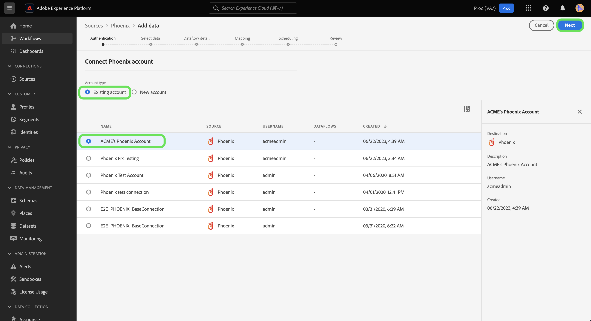

# Skapa en [!DNL Phoenix] källanslutning i användargränssnittet

>[!NOTE]
> Kopplingen [!DNL Phoenix] är i betaversion. Mer information om hur du använder betatecknade anslutningar finns i [Källor-översikten](../../../../home.md#terms-and-conditions) .

Källkopplingar i Adobe Experience Platform ger möjlighet att importera externt källdata på schemalagd basis. I den här självstudiekursen beskrivs hur du skapar en [!DNL Phoenix] källkoppling med [!DNL Platform] användargränssnittet.

## Komma igång

Den här självstudiekursen kräver en fungerande förståelse av följande komponenter i Adobe Experience Platform:

* [Experience Data Model (XDM) System](../../../../../xdm/home.md): Det standardiserade ramverket som [!DNL Experience Platform] organiserar kundupplevelsedata.
   * [Grundläggande om schemakomposition](../../../../../xdm/schema/composition.md): Lär dig mer om de grundläggande byggstenarna i XDM-scheman, inklusive viktiga principer och bästa praxis när det gäller schemakomposition.
   * [Schemaredigeraren, genomgång](../../../../../xdm/tutorials/create-schema-ui.md): Lär dig hur du skapar anpassade scheman med hjälp av gränssnittet för Schemaredigeraren.
* [Kundprofil](../../../../../profile/home.md)i realtid: Ger en enhetlig konsumentprofil i realtid baserad på aggregerade data från flera källor.

Om du redan har en giltig [!DNL Phoenix] anslutning kan du hoppa över resten av det här dokumentet och gå vidare till självstudiekursen om [att konfigurera ett dataflöde](../../dataflow/databases.md)

### Samla in nödvändiga inloggningsuppgifter

För att få åtkomst till ditt [!DNL Phoenix] konto [!DNL Platform]måste du ange följande värden:

| Autentiseringsuppgifter | Beskrivning |
| ---------- | ----------- |
| `host` | IP-adressen eller värdnamnet för [!DNL Phoenix] servern. |
| `port` | Den TCP-port som [!DNL Phoenix] servern använder för att avlyssna klientanslutningar. Om du ansluter till [!DNL Azure HDInsights]anger du porten som 443. |
| `httpPath` | Den del av URL som motsvarar [!DNL Phoenix] servern. Ange /hbasephoenix0 om du använder [!DNL Azure HDInsights] klustret. |
| `username` | Användarnamnet som du använder för att komma åt [!DNL Phoenix] servern. |
| `password` | Lösenordet som motsvarar användaren. |
| `enableSsl` | En växel som anger om anslutningarna till servern är krypterade med SSL. |

Mer information om hur du kommer igång finns i [det här Phoenix-dokumentet](https://python-phoenixdb.readthedocs.io/en/latest/api.html).

## Anslut ditt Phoenix-konto

När du har samlat in dina inloggningsuppgifter kan du följa stegen nedan för att skapa ett nytt [!DNL Phoenix] konto att ansluta till [!DNL Platform].

Logga in på <a href="https://platform.adobe.com" target="_blank">Adobe Experience Platform</a> och välj sedan **[!UICONTROL Sources]** i det vänstra navigeringsfältet för att komma åt *[!UICONTROL Sources]* arbetsytan. På *[!UICONTROL Catalog]* skärmen visas en mängd olika källor som du kan skapa inkommande konto för, och varje källa visar antalet befintliga konton och datauppsättningsflöden som är kopplade till dem.

Du kan välja lämplig kategori i katalogen till vänster på skärmen. Du kan också hitta den källa du vill arbeta med med med sökalternativet.

Under *[!UICONTROL Databases]* kategorin väljer du **[!UICONTROL Phoenix]** att visa ett informationsfält till höger på skärmen. Informationsfältet innehåller en kort beskrivning av den valda källan samt alternativ för att ansluta till källan eller visa dess dokumentation. Om du vill skapa en ny inkommande anslutning väljer du **[!UICONTROL Connect source]**.

Sidan visas *[!UICONTROL Connect to Phoenix]* . På den här sidan kan du antingen använda nya autentiseringsuppgifter eller befintliga.

### Nytt konto

Om du använder nya autentiseringsuppgifter väljer du **[!UICONTROL New account]**. Ange ett namn, en valfri beskrivning och dina [!DNL Phoenix] inloggningsuppgifter på det indataformulär som visas. När du är klar väljer du **[!UICONTROL Connect]** och tillåt sedan en tid för det nya kontot att upprätta.

### Befintligt konto

Om du vill ansluta ett befintligt konto markerar du det [!DNL Phoenix] konto du vill ansluta till och väljer sedan **[!UICONTROL Next]** att fortsätta.

## Nästa steg

Genom att följa den här självstudiekursen har du upprättat en anslutning till ditt [!DNL Phoenix] konto. Du kan nu fortsätta med nästa självstudiekurs och [konfigurera ett dataflöde för att hämta data till Platform](../../dataflow/databases.md).