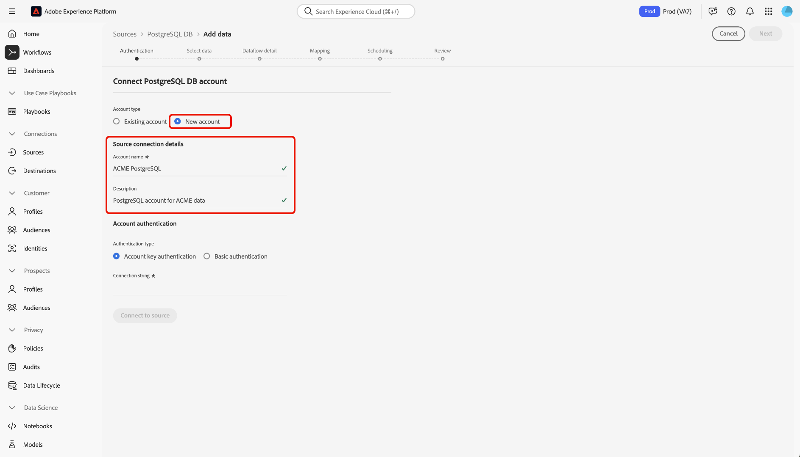

# Anslut [!DNL PostgreSQL] till Experience Platform med användargränssnittet

Läs den här vägledningen när du vill lära dig hur du ansluter din [!DNL PostgreSQL]-databas till Adobe Experience Platform med hjälp av källarbetsytan i Experience Platform användargränssnitt.

## Komma igång

Den här självstudiekursen kräver en fungerande förståelse av följande komponenter i Adobe Experience Platform:

* [[!DNL Experience Data Model (XDM)] System](../../../../../xdm/home.md): Det standardiserade ramverk som Experience Platform använder för att ordna kundupplevelsedata.
   * [Grundläggande om schemakomposition](../../../../../xdm/schema/composition.md): Lär dig mer om grundstenarna i XDM-scheman, inklusive nyckelprinciper och bästa metoder för schemakomposition.
   * [Schemaredigeraren, självstudiekurs](../../../../../xdm/tutorials/create-schema-ui.md): Lär dig hur du skapar anpassade scheman med hjälp av gränssnittet för Schemaredigeraren.
* [[!DNL Real-Time Customer Profile]](../../../../../profile/home.md): Tillhandahåller en enhetlig konsumentprofil i realtid baserad på aggregerade data från flera källor.

Om du redan har en giltig [!DNL PostgreSQL]-anslutning kan du hoppa över resten av det här dokumentet och gå vidare till självstudiekursen [Konfigurera ett dataflöde](../../dataflow/databases.md).

### Samla in nödvändiga inloggningsuppgifter

Läs [[!DNL PostgreSQL] översikten](../../../../connectors/databases/postgres.md) om du vill ha mer information om autentisering.

### Aktivera SSL-kryptering för anslutningssträngen

Du kan aktivera SSL-kryptering för anslutningssträngen [!DNL PostgreSQL] genom att lägga till anslutningssträngen med följande egenskaper:

| Egenskap | Beskrivning | Exempel |
| --- | --- | --- |
| `EncryptionMethod` | Gör att du kan aktivera SSL-kryptering på dina [!DNL PostgreSQL]-data. | <uL><li>`EncryptionMethod=0`(Inaktiverad)</li><li>`EncryptionMethod=1`(Aktiverad)</li><li>`EncryptionMethod=6`(RequestSSL)</li></ul> |
| `ValidateServerCertificate` | Validerar certifikat som skickas av din [!DNL PostgreSQL]-databas när `EncryptionMethod` används. | <uL><li>`ValidationServerCertificate=0`(Inaktiverad)</li><li>`ValidationServerCertificate=1`(Aktiverad)</li></ul> |

Följande är ett exempel på en [!DNL PostgreSQL]-anslutningssträng med SSL-kryptering: `Server={SERVER};Database={DATABASE};Port={PORT};UID={USERNAME};Password={PASSWORD};EncryptionMethod=1;ValidateServerCertificate=1`.

## Navigera i källkatalogen {#navigate}

I Experience Platform-gränssnittet väljer du **[!UICONTROL Sources]** i den vänstra navigeringen för att komma åt arbetsytan i *[!UICONTROL Sources]*. Välj lämplig kategori på panelen *[!UICONTROL Categories]*. Du kan också använda sökfältet för att navigera till den specifika källa som du vill använda.

Om du vill använda [!DNL PostgreSQL] väljer du **[!UICONTROL PostgreSQL DB]**-källkortet under *[!UICONTROL Databases]* och sedan **[!UICONTROL Set up]**.

>[!TIP]
>
>Källor i källkatalogen visar alternativet **[!UICONTROL Set up]** när en angiven källa ännu inte har något autentiserat konto. När ett autentiserat konto har skapats ändras alternativet till **[!UICONTROL Add data]**.

## Använd ett befintligt konto {#existing}

Om du vill använda ett befintligt konto väljer du **[!UICONTROL Existing account]** och sedan det [!DNL PostgreSQL]-konto som du vill använda.

## Skapa ett nytt konto {#create}

Om du inte har något befintligt konto måste du skapa ett nytt konto genom att ange de autentiseringsuppgifter som motsvarar källan.

Om du vill skapa ett nytt konto väljer du **[!UICONTROL New account]** och anger sedan ett namn och kan lägga till en beskrivning för ditt konto.

### Anslut till Experience Platform på Azure {#azure}

Du kan ansluta ditt [!DNL PostgreSQL]-konto till Experience Platform på Azure med antingen kontonyckel eller grundläggande autentisering.

>[!BEGINTABS]

>[!TAB Autentisering av kontonyckel]

Om du vill använda kontonyckelautentisering väljer du **[!UICONTROL Account key authentication]**, anger din [anslutningssträng](../../../../connectors/databases/postgres.md#azure) och väljer sedan **[!UICONTROL Connect to source]**.

>[!TAB Grundläggande autentisering]

Om du vill använda grundläggande autentisering väljer du **[!UICONTROL Basic authentication]**, anger värden för dina [autentiseringsuppgifter](../../../../connectors/databases/postgres.md#azure) och väljer sedan **[!UICONTROL Connect to source]**.

>[!ENDTABS]

### Ansluta till Experience Platform på Amazon Web Services (AWS) {#aws}

>[!AVAILABILITY]
>
>Detta avsnitt gäller implementeringar av Experience Platform som körs på Amazon Web Services (AWS). Experience Platform som körs på AWS är för närvarande tillgängligt för ett begränsat antal kunder. Mer information om den Experience Platform-infrastruktur som stöds finns i [Experience Platform översikt över flera moln](../../../../../landing/multi-cloud.md).

Om du vill skapa ett nytt [!DNL PostgreSQL]-konto och ansluta till Experience Platform på AWS kontrollerar du att du befinner dig i en VA6-sandlåda och anger sedan de [autentiseringsuppgifter som krävs för autentisering](../../../../connectors/databases/postgres.md#aws).

## Skapa ett dataflöde för dina [!DNL PostgreSQL]-data

Genom att följa den här självstudiekursen har du upprättat en anslutning till ditt [!DNL MariaDB]-konto. Du kan nu fortsätta till nästa självstudiekurs och [konfigurera ett dataflöde för att hämta data till Experience Platform](../../dataflow/databases.md).
