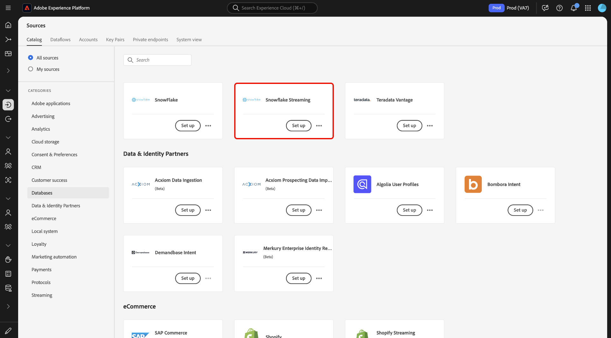
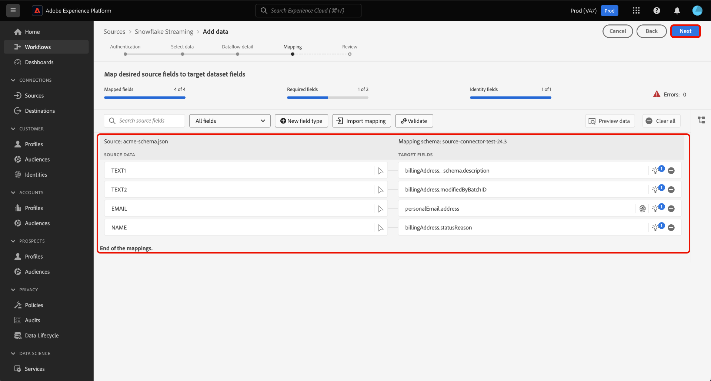

# Strömma data från din [!DNL Snowflake]-databas till Experience Platform med hjälp av användargränssnittet

Lär dig hur du använder användargränssnittet för att strömma data från din [!DNL Snowflake]-databas till Adobe Experience Platform genom att följa den här guiden.

## Kom igång

Den här självstudiekursen kräver en fungerande förståelse av följande komponenter i Experience Platform:

* [[!DNL Experience Data Model (XDM)] System](../../../../../xdm/home.md): Det standardiserade ramverk som [!DNL Experience Platform] organiserar kundupplevelsedata med.
   * [Grundläggande om schemakomposition](../../../../../xdm/schema/composition.md): Lär dig mer om grundstenarna i XDM-scheman, inklusive nyckelprinciper och bästa metoder för schemakomposition.
   * [Schemaredigeraren, självstudiekurs](../../../../../xdm/tutorials/create-schema-ui.md): Lär dig hur du skapar anpassade scheman med hjälp av gränssnittet för Schemaredigeraren.
* [[!DNL Real-Time Customer Profile]](../../../../../profile/home.md): Tillhandahåller en enhetlig konsumentprofil i realtid baserad på aggregerade data från flera källor.

### Autentisering

Läs guiden om [nödvändig konfiguration för [!DNL Snowflake] direktuppspelningsdata](../../../../connectors/databases/snowflake-streaming.md) om du vill ha information om hur du måste slutföra innan du kan importera direktuppspelningsdata från [!DNL Snowflake] till Experience Platform.

## Använd [!DNL Snowflake Streaming]-källan för att strömma [!DNL Snowflake]-data till Experience Platform

I plattformsgränssnittet väljer du **[!UICONTROL Sources]** i den vänstra navigeringen för att komma åt arbetsytan i [!UICONTROL Sources]. Du kan välja lämplig kategori i katalogen till vänster på skärmen. Du kan också hitta den källa du vill arbeta med med med sökalternativet.

Under kategorin *Databaser* väljer du **[!DNL Snowflake Streaming]** och sedan **[!UICONTROL Add data]**.

>[!TIP]
>
>Källor som inte har något autentiserat konto i källkatalogen visar alternativet **[!UICONTROL Set up]**. När det finns ett autentiserat konto ändras det här alternativet till **[!UICONTROL Add data]**.

Sidan **[!UICONTROL Connect Snowflake Streaming account]** visas. På den här sidan kan du antingen använda nya eller befintliga autentiseringsuppgifter.

>[!BEGINTABS]

>[!TAB Skapa ett nytt konto]

Om du vill skapa ett nytt konto väljer du **[!UICONTROL New account]** och anger ett namn, en valfri beskrivning och dina autentiseringsuppgifter.

När du är klar väljer du **[!UICONTROL Connect to source]** och tillåt sedan lite tid för att upprätta den nya anslutningen.

| Autentiseringsuppgifter | Beskrivning |
| --- | --- |
| Konto | Namnet på ditt [!DNL Snowflake]-konto. Mer information om konventioner för kontonamn finns i [[!DNL Snowflake Streaming] autentiseringsguiden](../../../../connectors/databases/snowflake-streaming.md#gather-required-credentials). |
| Lagerställe | Namnet på ditt [!DNL Snowflake]-lagerställe. Lagerställen hanterar körningen av frågor i [!DNL Snowflake]. Varje [!DNL Snowflake]-lagerställe är oberoende av varandra och måste nås individuellt för att data ska kunna hämtas till Experience Platform. |
| Databas | Namnet på din [!DNL Snowflake]-databas. Databasen innehåller de data som du vill ta med till Experience Platform. |
| Schema | (Valfritt) Databasschemat som är associerat med ditt [!DNL Snowflake]-konto. |
| Användarnamn | Användarnamnet för ditt [!DNL Snowflake]-konto. |
| Lösenord | Lösenordet till ditt [!DNL Snowflake]-konto. |
| Roll | (Valfritt) En anpassad definierad roll som kan ges till en användare för en viss anslutning. Om det inte anges används standardvärdet `public`. |

Mer information om att skapa konto finns i avsnittet [konfigurera rollinställningar](../../../../connectors/databases/snowflake-streaming.md#configure-role-settings) i översikten [!DNL Snowflake Streaming].

>[!TAB Använd ett befintligt konto]

Om du vill använda ett befintligt konto väljer du **[!UICONTROL Existing account]** och väljer sedan önskat konto i den befintliga kontokatalogen.

Välj **[!UICONTROL Next]** om du vill fortsätta.

>[!ENDTABS]

## Markera data {#select-data}

>[!IMPORTANT]
>
>* Det måste finnas en tidsstämpelkolumn i källtabellen för att ett direktuppspelat dataflöde ska kunna skapas. Tidsstämpeln krävs för att Experience Platform ska kunna veta när data kommer att importeras och när inkrementella data kommer att direktuppspelas. Du kan lägga till en tidsstämpelkolumn retroaktivt för en befintlig anslutning och skapa ett nytt dataflöde.
>
>* Se till att datafälten i exempelkälldatafilen är i enlighet med [!DNL Snowflake]s riktlinjer för fallupplösning för identifierare. Mer information finns i [[!DNL Snowflake] dokumentet om ID-casing](https://docs.snowflake.com/en/sql-reference/identifiers-syntax#label-identifier-casing).

[!UICONTROL Select data]-steget visas. I det här steget måste du markera de data som du vill importera till Experience Platform, konfigurera tidsstämplar och tidszoner samt tillhandahålla en exempelkälldatafil för inmatning av rådata.

Använd databaskatalogen till vänster på skärmen och markera den tabell som du vill importera till Experience Platform.

Välj sedan kolumntypen för tidsstämpling för tabellen. Du kan välja mellan två typer av tidsstämpelkolumner: `TIMESTAMP_NTZ` eller `TIMESTAMP_LTZ`. Om du väljer kolumntypen `TIMESTAMP_NTZ` måste du också ange en tidszon. Kolumnerna ska ha en begränsning som inte är null. Mer information finns i avsnittet [Begränsningar och vanliga frågor]

Du kan också konfigurera inställningar för bakgrundsfyllning under det här steget. Backfill avgör vilka data som hämtas från början. Om bakåtfyllning är aktiverad, kommer alla aktuella filer i den angivna sökvägen att importeras under det första schemalagda intaget. Om så inte är fallet importeras endast de filer som läses in mellan den första importkörningen och starttiden. Filer som lästs in före starttiden importeras inte.

Markera växlingsknappen **[!UICONTROL Backfill]** om du vill aktivera bakåtfyllning.

Välj slutligen **[!UICONTROL Choose file]** om du vill överföra exempelkälldata för att skapa mappningsuppsättningen, som används i ett senare steg för att mappa originaldata till Experience Data Model (XDM).

När du är klar väljer du **[!UICONTROL Next]** för att fortsätta.

## Ange information om datauppsättning och dataflöde {#provide-dataset-and-dataflow-details}

Därefter måste du ange information om datauppsättningen och dataflödet.

### Information om datauppsättning {#dataset-details}

En datauppsättning är en lagrings- och hanteringskonstruktion för en datamängd, vanligtvis en tabell, som innehåller ett schema (kolumner) och fält (rader). Data som har inhämtats till Experience Platform bevaras i sjön som datamängder. Under det här steget kan du skapa en ny datauppsättning eller använda en befintlig datauppsättning.

>[!BEGINTABS]

>[!TAB Använd en ny datauppsättning]

Om du vill använda en ny datauppsättning väljer du **[!UICONTROL New dataset]** och anger sedan ett namn och en valfri beskrivning för datauppsättningen. Du måste också välja ett XDM-schema (Experience Data Model) som datauppsättningen följer.

| Ny datauppsättningsinformation | Beskrivning |
| --- | --- |
| Namn på utdatauppsättning | Namnet på den nya datauppsättningen. |
| Beskrivning | (Valfritt) En kort översikt över den nya datauppsättningen. |
| Schema | En listruta med scheman som finns i organisationen. Du kan också skapa ett eget schema före källkonfigurationsprocessen. Mer information finns i guiden om att [skapa ett XDM-schema i användargränssnittet](../../../../../xdm/tutorials/create-schema-ui.md). |

>[!TAB Använd en befintlig datamängd]

Om du redan har en befintlig datauppsättning väljer du **[!UICONTROL Existing dataset]** och använder sedan alternativet **[!UICONTROL Advanced search]** för att visa ett fönster med alla datauppsättningar i organisationen, inklusive deras respektive information, t.ex. om de har aktiverats för inmatning i kundprofilen i realtid.

>[!ENDTABS]

+++Välj om du vill ha steg för att aktivera profilintagning, feldiagnostik och partiell förtäring.

Om din datauppsättning är aktiverad för kundprofil i realtid kan du under det här steget växla **[!UICONTROL Profile dataset]** för att aktivera dina data för profilinmatning. Du kan också använda det här steget för att aktivera **[!UICONTROL Error diagnostics]** och **[!UICONTROL Partial ingestion]**.

* **[!UICONTROL Error diagnostics]**: Välj **[!UICONTROL Error diagnostics]** om du vill instruera källan att skapa feldiagnostik som du kan referera till senare när du övervakar datauppsättningsaktiviteten och dataflödesstatusen.
* **[!UICONTROL Partial ingestion]**: Partiell gruppinmatning är möjligheten att importera data som innehåller fel, upp till ett visst konfigurerbart tröskelvärde. Med den här funktionen kan du importera alla korrekta data till Experience Platform, medan alla felaktiga data batchas separat med information om varför de är ogiltiga.

+++

### Information om dataflöde {#dataflow-details}

När datauppsättningen har konfigurerats måste du ange information om dataflödet, inklusive ett namn, en valfri beskrivning och aviseringskonfigurationer.

| Dataflödeskonfigurationer | Beskrivning |
| --- | --- |
| Dataflödesnamn | Dataflödets namn.  Som standard används namnet på filen som importeras. |
| Beskrivning | (Valfritt) En kort beskrivning av dataflödet. |
| Larm | Experience Platform kan skapa händelsebaserade aviseringar som användare kan prenumerera på. Dessa alternativ kräver ett öppet dataflöde för att utlösa dem. Mer information finns i [varningsöversikten](../../alerts.md) <ul><li>**Källdataflödeskörning Start**: Välj den här aviseringen för att få ett meddelande när dataflödeskörningen börjar.</li><li>**Källdataflödet har körts**: Välj den här aviseringen om du vill få ett meddelande om dataflödet slutar utan fel.</li><li>**Körningsfel för källdataflöde**: Välj den här aviseringen för att få ett meddelande om dataflödet avslutas med fel.</li></ul> |

När du är klar väljer du **[!UICONTROL Next]** för att fortsätta.

## Mappa fält till ett XDM-schema {#mapping}

[!UICONTROL Mapping]-steget visas. Använd mappningsgränssnittet för att mappa dina källdata till rätt schemafält innan du importerar dessa data till Experience Platform och välj sedan **[!UICONTROL Next]**. En utförlig guide om hur du använder mappningsgränssnittet finns i [Användargränssnittshandboken för dataförberedelser](../../../../../data-prep/ui/mapping.md) för mer information.

## Granska ditt dataflöde {#review}

Det sista steget i processen för att skapa dataflöde är att granska dataflödet innan det körs. Använd steget **[!UICONTROL Review]** om du vill granska informationen om det nya dataflödet innan det körs. Detaljerna är grupperade i följande kategorier:

* **Anslutning**: Visar källtypen, den relevanta sökvägen för den valda källfilen och antalet kolumner i källfilen.
* **Tilldela datauppsättnings- och mappningsfält**: Visar vilka datauppsättningar som källdata importeras till, inklusive det schema som datauppsättningen följer.

När du har granskat dataflödet väljer du **[!UICONTROL Finish]** och tillåt en tid innan dataflödet skapas.

## Nästa steg

Genom att följa den här självstudiekursen har du skapat ett dataflöde för direktuppspelning för [!DNL Snowflake] data. Mer information finns i dokumentationen nedan.

### Övervaka dataflödet

När dataflödet har skapats kan du övervaka de data som hämtas genom det för att visa information om hur mycket data som har importerats, hur bra de är och vilka fel som har uppstått. Mer information om hur du övervakar direktuppspelade dataflöden finns i självstudiekursen [Övervaka direktuppspelade dataflöden i användargränssnittet](../../monitor-streaming.md).

### Uppdatera ditt dataflöde

Om du vill uppdatera konfigurationer för schemaläggning, mappning och allmän information för dina dataflöden går du till självstudiekursen [Uppdatera källornas dataflöden i användargränssnittet](../../update-dataflows.md).

### Ta bort ditt dataflöde

Du kan ta bort dataflöden som inte längre är nödvändiga eller som har skapats felaktigt med funktionen **[!UICONTROL Delete]** som finns på arbetsytan i **[!UICONTROL Dataflows]**. Mer information om hur du tar bort dataflöden finns i självstudiekursen [Ta bort dataflöden i användargränssnittet](../../delete.md).
