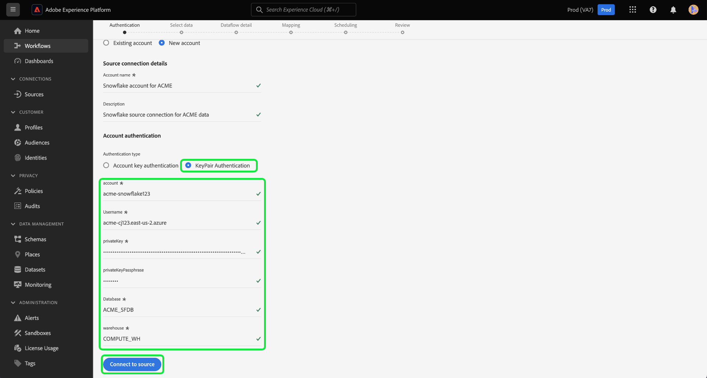

# Skapa en [!DNL Snowflake]-källanslutning i användargränssnittet

>[!IMPORTANT]
>
>Källan [!DNL Snowflake] är tillgänglig i källkatalogen för användare som har köpt Real-time Customer Data Platform Ultimate.

I den här självstudiekursen beskrivs hur du skapar en [!DNL Snowflake]-källanslutning med Adobe Experience Platform-användargränssnittet.

## Komma igång

Den här självstudiekursen kräver en fungerande förståelse av följande komponenter i Experience Platform:

* [Källor](../../../../home.md): [!DNL Experience Platform] tillåter att data kan hämtas från olika källor samtidigt som du kan strukturera, etikettera och förbättra inkommande data med [!DNL Platform]-tjänster.
* [Sandlådor](../../../../../sandboxes/home.md): [!DNL Experience Platform] innehåller virtuella sandlådor som partitionerar en enskild [!DNL Platform]-instans till separata virtuella miljöer för att hjälpa till att utveckla och utveckla program för digitala upplevelser.

### Samla in nödvändiga inloggningsuppgifter

Du måste ange värden för följande autentiseringsegenskaper för att autentisera [!DNL Snowflake]-källan.

>[!BEGINTABS]

>[!TAB Autentisering av kontonyckel]

| Autentiseringsuppgifter | Beskrivning |
| ---------- | ----------- |
| Konto | Ett kontonamn identifierar unikt ett konto inom organisationen. I det här fallet måste du unikt identifiera ett konto i olika [!DNL Snowflake]-organisationer. Om du vill göra det måste du lägga till ditt organisationsnamn i kontonamnet. Till exempel: `orgname-account_name`. Läs guiden om att [hämta din [!DNL Snowflake] kontoidentifierare](../../../../connectors/databases/snowflake.md#retrieve-your-account-identifier) om du vill ha mer information. Mer information finns i [[!DNL Snowflake] dokumentationen](https://docs.snowflake.com/en/user-guide/admin-account-identifier#format-1-preferred-account-name-in-your-organization). |
| Lagerställe | Lagerstället [!DNL Snowflake] hanterar frågekörningsprocessen för programmet. Varje [!DNL Snowflake]-lagerställe är oberoende av varandra och måste nås individuellt när data överförs till plattformen. |
| Databas | Databasen [!DNL Snowflake] innehåller de data som du vill ta med plattformen. |
| Användarnamn | Användarnamnet för kontot [!DNL Snowflake]. |
| Lösenord | Lösenordet för användarkontot [!DNL Snowflake]. |
| Roll | Standardrollen för åtkomstkontroll som ska användas i sessionen [!DNL Snowflake]. Rollen ska vara en befintlig roll som redan har tilldelats den angivna användaren. Standardrollen är `PUBLIC`. |
| Anslutningssträng | Anslutningssträngen som används för att ansluta till din [!DNL Snowflake]-instans. Anslutningssträngsmönstret för [!DNL Snowflake] är `jdbc:snowflake://{ACCOUNT_NAME}.snowflakecomputing.com/?user={USERNAME}&password={PASSWORD}&db={DATABASE}&warehouse={WAREHOUSE}` |

>[!TAB Autentisering med nyckelpar]

Om du vill använda autentisering med nyckelpar måste du generera ett 2 048-bitars RSA-nyckelpar och sedan ange följande värden när du skapar ett konto för [!DNL Snowflake]-källan.

| Autentiseringsuppgifter | Beskrivning |
| --- | --- |
| Konto | Ett kontonamn identifierar unikt ett konto inom organisationen. I det här fallet måste du unikt identifiera ett konto i olika [!DNL Snowflake]-organisationer. Om du vill göra det måste du lägga till ditt organisationsnamn i kontonamnet. Till exempel: `orgname-account_name`. Läs guiden om att [hämta din [!DNL Snowflake] kontoidentifierare](../../../../connectors/databases/snowflake.md#retrieve-your-account-identifier) om du vill ha mer information. Mer information finns i [[!DNL Snowflake] dokumentationen](https://docs.snowflake.com/en/user-guide/admin-account-identifier#format-1-preferred-account-name-in-your-organization). |
| Användarnamn | Användarnamnet för ditt [!DNL Snowflake]-konto. |
| Privat nyckel | Den [!DNL Base64-]kodade privata nyckeln för ditt [!DNL Snowflake]-konto. Du kan generera antingen krypterade eller okrypterade privata nycklar. Om du använder en krypterad privat nyckel måste du även ange en lösenfras för den privata nyckeln vid autentisering mot Experience Platform. Läs guiden om att [hämta din [!DNL Snowflake] privata nyckel](../../../../connectors/databases/snowflake.md) om du vill ha mer information. |
| Lösenfras för privat nyckel | Lösenfrasen för den privata nyckeln är ett extra säkerhetslager som du måste använda när du autentiserar med en krypterad privat nyckel. Du behöver inte ange lösenfrasen om du använder en okrypterad privat nyckel. |
| Databas | Databasen [!DNL Snowflake] som innehåller de data som du vill importera till Experience Platform. |
| Lagerställe | Lagerstället [!DNL Snowflake] hanterar frågekörningsprocessen för programmet. Varje [!DNL Snowflake]-lagerställe är oberoende av varandra och måste nås individuellt när data överförs till plattformen. |

Mer information om dessa värden finns i [det här Snowflake-dokumentet](https://docs.snowflake.com/en/user-guide/key-pair-auth.html).

>[!ENDTABS]

>[!NOTE]
>
>Du måste ange flaggan `PREVENT_UNLOAD_TO_INLINE_URL` till `FALSE` för att tillåta dataradering från din [!DNL Snowflake]-databas till Experience Platform.

## Anslut ditt Snowflake-konto

I plattformsgränssnittet väljer du **[!UICONTROL Sources]** i den vänstra navigeringen för att komma åt arbetsytan i [!UICONTROL Sources].

Du kan välja lämplig kategori i katalogen till vänster på skärmen. Du kan också använda sökfältet till att hitta den källa du vill arbeta med.

Under kategorin [!UICONTROL Databases] väljer du **[!UICONTROL Snowflake]** och sedan **[!UICONTROL Add data]**.

![Källkatalogen med [!DNL Snowflake] markerad.](../../../../images/tutorials/create/snowflake/catalog.png)

Sidan **[!UICONTROL Connect to Snowflake]** visas. På den här sidan kan du antingen använda nya autentiseringsuppgifter eller befintliga.

### Befintligt konto

Om du vill använda ett befintligt konto markerar du det [!DNL Snowflake]-konto du vill ansluta till och väljer sedan **[!UICONTROL Next]** för att fortsätta.

### Nytt konto

Om du vill skapa ett nytt konto väljer du **[!UICONTROL New account]** och anger sedan ett namn och en valfri beskrivning för det nya [!DNL Snowflake]-kontot.

>[!BEGINTABS]

>[!TAB Autentisering av kontonyckel]

Om du vill använda kontonyckelautentisering anger du anslutningssträngen i indataformuläret och väljer sedan **[!UICONTROL Connect to source]**.

>[!TAB Autentisering med nyckelpar]

Om du vill använda nyckelpars-autentisering anger du värden för ditt konto, ditt användarnamn, din privata nyckel, lösenfras för privat nyckel, databas och lagerställe och väljer sedan **[!UICONTROL Connect to source]**.

>[!ENDTABS]

### Hoppa över förhandsgranskning av exempeldata {#skip-preview-of-sample-data}

Under dataurvalssteget kan du få en timeout när du importerar stora tabeller eller datafiler. Du kan hoppa över förhandsgranskning av data för att kringgå tidsgränsen och ändå visa ditt schema, om än utan exempeldata. Aktivera alternativet **[!UICONTROL Skip previewing sample data]** om du vill hoppa över förhandsgranskning av data.

Resten av arbetsflödet förblir detsamma. Den enda skillnaden är att om du hoppar över förhandsgranskning av data kan det förhindra att beräknade och obligatoriska fält valideras automatiskt under mappningssteget, och du måste då validera dessa fält manuellt under mappningen.

## Nästa steg

Genom att följa den här självstudiekursen har du upprättat en anslutning till ditt Snowflake-konto. Du kan nu fortsätta till nästa självstudiekurs och [konfigurera ett dataflöde för att hämta data till [!DNL Platform]](../../dataflow/databases.md).
