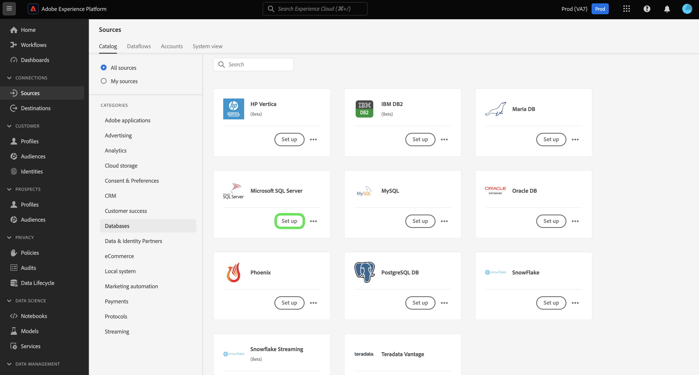
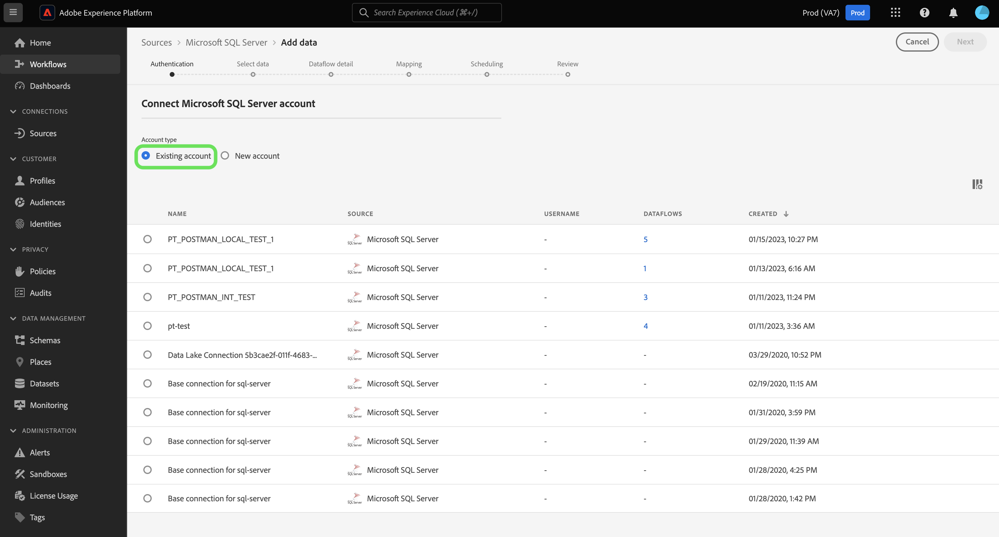

# Skapa en [!DNL Microsoft SQL Server]-källanslutning i användargränssnittet

I den här självstudiekursen får du lära dig hur du ansluter ditt [!DNL Microsoft SQL Server]-konto till Adobe Experience Platform med användargränssnittet.

## Komma igång

Den här självstudiekursen kräver en fungerande förståelse av följande komponenter i Adobe Experience Platform:

* [[!DNL Experience Data Model (XDM)] System](../../../../../xdm/home.md): Det standardiserade ramverk som Experience Platform använder för att ordna kundupplevelsedata.
   * [Grundläggande om schemakomposition](../../../../../xdm/schema/composition.md): Lär dig mer om grundstenarna i XDM-scheman, inklusive nyckelprinciper och bästa metoder för schemakomposition.
   * [Schemaredigeraren, självstudiekurs](../../../../../xdm/tutorials/create-schema-ui.md): Lär dig hur du skapar anpassade scheman med hjälp av gränssnittet för Schemaredigeraren.
* [[!DNL Real-Time Customer Profile]](../../../../../profile/home.md): Tillhandahåller en enhetlig konsumentprofil i realtid baserad på aggregerade data från flera källor.

Om du redan har en giltig [!DNL SQL Server]-anslutning kan du hoppa över resten av det här dokumentet och gå vidare till självstudiekursen [Konfigurera ett dataflöde](../../dataflow/databases.md).

### Samla in nödvändiga inloggningsuppgifter

För att kunna ansluta till [!DNL SQL Server] på [!DNL Platform] måste du ange följande anslutningsegenskap:

| Autentiseringsuppgifter | Beskrivning |
| ---------- | ----------- |
| Anslutningssträng | Anslutningssträngen som är associerad med ditt [!DNL Microsoft SQL Server]-konto. Ditt anslutningssträngsmönster beror på om du använder servernamn eller instansnamn för datakällan:<ul><li>Anslutningssträng med servernamn: `Data Source={SERVER_NAME};Initial Catalog={DATABASE};Integrated Security=False;User ID={USER_ID};Password={PASSWORD};`</li><li>Anslutningssträng med instansnamn:`Data Source={INSTANCE_NAME};Initial Catalog={DATABASE};Integrated Security=False;User ID={USER_ID};Password={PASSWORD};` | `Data Source=mssqlserver.database.windows.net;Initial Catalog=mssqlserver_e2e_db;Integrated Security=False;User ID=mssqluser;Password=mssqlpassword` |

Mer information om hur du kommer igång finns i [det här [!DNL SQL Server] dokumentet](https://docs.microsoft.com/en-us/dotnet/framework/data/adonet/sql/authentication-in-sql-server).

## Anslut ditt [!DNL SQL Server]-konto

I plattformsgränssnittet väljer du **[!UICONTROL Sources]** i den vänstra navigeringen för att komma åt arbetsytan i [!UICONTROL Sources]. Du kan välja lämplig kategori i katalogen till vänster på skärmen. Du kan också hitta den källa du vill arbeta med med med sökalternativet.

Under kategorin *Databaser* väljer du **[!DNL Microsoft SQL Server]** och sedan **[!UICONTROL Set up]**.

>[!TIP]
>
>Källor i källkatalogen visar alternativet **[!UICONTROL Set up]** när en angiven källa ännu inte har något autentiserat konto. När det finns ett autentiserat konto ändras det här alternativet till **[!UICONTROL Add data]**.

Sidan **[!UICONTROL Connect to Microsoft SQL Server]** visas. På den här sidan kan du antingen använda nya autentiseringsuppgifter eller befintliga.

>[!BEGINTABS]

>[!TAB Skapa ett nytt konto]

Om du vill skapa ett nytt konto väljer du **[!UICONTROL New account]** och anger ett namn, en valfri beskrivning och dina autentiseringsuppgifter.

När du är klar väljer du **[!UICONTROL Connect to source]** och tillåt sedan lite tid för att upprätta den nya anslutningen.

>[!TAB Använd ett befintligt konto]

Om du vill använda ett befintligt konto väljer du **[!UICONTROL Existing account]** och sedan det konto som du vill använda i den befintliga kontokatalogen.

Välj **[!UICONTROL Next]** om du vill fortsätta.

>[!ENDTABS]

## Nästa steg

Genom att följa den här självstudiekursen har du upprättat en anslutning till ditt [!DNL SQL Server]-konto. Du kan nu fortsätta till nästa självstudiekurs och [konfigurera ett dataflöde för att hämta data till [!DNL Platform]](../../dataflow/databases.md).
