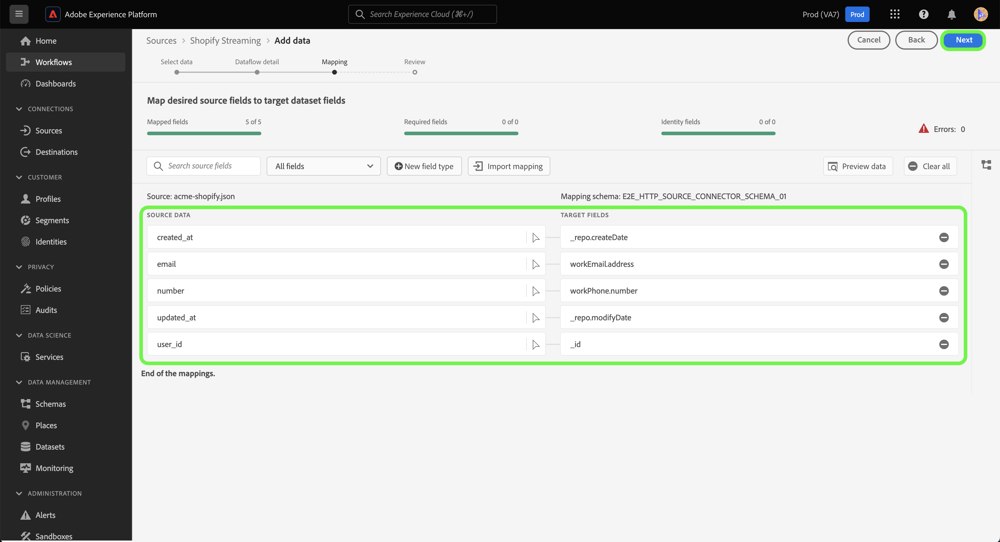

# Skapa en källanslutning och ett dataflöde för [!DNL Shopify Streaming]-data med användargränssnittet

I den här självstudiekursen beskrivs hur du skapar en [!DNL Shopify Streaming]-källanslutning och ett dataflöde med hjälp av användargränssnittet för plattformen.

## Komma igång {#getting-started}

Den här självstudiekursen kräver en fungerande förståelse av följande komponenter i Experience Platform:

* [[!DNL Experience Data Model (XDM)] System](../../../../../xdm/home.md): Det standardiserade ramverk som [!DNL Experience Platform] organiserar kundupplevelsedata med.
   * [Grundläggande om schemakomposition](../../../../../xdm/schema/composition.md): Lär dig mer om grundstenarna i XDM-scheman, inklusive nyckelprinciper och bästa metoder för schemakomposition.
   * [Schemaredigeraren, självstudiekurs](../../../../../xdm/tutorials/create-schema-ui.md): Lär dig hur du skapar anpassade scheman med hjälp av gränssnittet för Schemaredigeraren.
* [[!DNL Real-Time Customer Profile]](../../../../../profile/home.md): Tillhandahåller en enhetlig konsumentprofil i realtid baserad på aggregerade data från flera källor.

>[!IMPORTANT]
>
>Den här självstudien kräver att du har slutfört kravkonfigurationen för ditt [!DNL Shopify Streaming]-konto. Anvisningar om hur du konfigurerar ditt konto finns i [[!DNL Shopify Streaming] översikten](../../../../connectors/ecommerce/shopify-streaming.md).

## Anslut ditt [!DNL Shopify Streaming]-konto

I plattformsgränssnittet väljer du **[!UICONTROL Sources]** i det vänstra navigeringsfältet för att komma åt arbetsytan i [!UICONTROL Sources]. På skärmen [!UICONTROL Catalog] visas en mängd olika källor som du kan använda för att skapa ett konto.

Du kan välja lämplig kategori i katalogen till vänster på skärmen. Du kan också hitta den källa du vill arbeta med med med sökalternativet.

Under kategorin **eCommerce** väljer du [!DNL Shopify Streaming] och sedan **[!UICONTROL Add data]**.

## Markera data

**[!UICONTROL Select data]**-steget visas med ett gränssnitt där du kan välja vilka data du vill hämta till plattformen.

* Den vänstra delen av gränssnittet är en webbläsare som gör att du kan visa tillgängliga dataströmmar på ditt konto;
* Med den högra delen av gränssnittet kan du förhandsgranska upp till 100 rader data från en JSON-fil.

Välj **[!UICONTROL Upload files]** om du vill överföra en JSON-fil från det lokala systemet. Du kan också dra och släppa den JSON-fil som du vill överföra till panelen [!UICONTROL Drag and drop files].

När filen har överförts uppdateras förhandsvisningsgränssnittet för att visa en förhandsgranskning av schemat som du har överfört. I förhandsvisningsgränssnittet kan du inspektera innehållet och strukturen i en fil. Du kan också använda verktyget [!UICONTROL Search field] för att komma åt specifika objekt från schemat.

När du är klar väljer du **[!UICONTROL Next]**.

## Dataflödesdetaljer

**Dataflödesdetaljsteget** visas. Här finns alternativ för att använda en befintlig datauppsättning eller skapa en ny datauppsättning för dataflödet, samt en möjlighet att ange ett namn och en beskrivning för dataflödet. Under det här steget kan du även konfigurera inställningar för profilinmatning, feldiagnostik, partiell inmatning och aviseringar.

När du är klar väljer du **[!UICONTROL Next]**.

## Mappning

Steg [!UICONTROL Mapping] visas, och du får ett gränssnitt för att mappa källfälten från källschemat till rätt mål-XDM-fält i målschemat.

Plattformen ger intelligenta rekommendationer för automatiskt mappade fält baserat på det målschema eller den datamängd som du väljer. Du kan justera mappningsreglerna manuellt så att de passar dina användningsfall. Beroende på dina behov kan du välja att mappa fält direkt eller använda förinställningsfunktioner för data för att omvandla källdata för att härleda beräknade eller beräknade värden. Mer information om hur du använder mappningsgränssnittet och beräkningsfälten finns i [Användargränssnittshandboken för dataförinställningar](https://experienceleague.adobe.com/docs/experience-platform/data-prep/ui/mapping.html).

När källdata har mappats väljer du **[!UICONTROL Next]**.

## Granska

Steg **[!UICONTROL Review]** visas, så att du kan granska det nya dataflödet innan det skapas. Informationen är grupperad i följande kategorier:

* **[!UICONTROL Connection]**: Visar källtypen, den relevanta sökvägen för den valda källfilen och antalet kolumner i källfilen.
* **[!UICONTROL Assign dataset & map fields]**: Visar vilka data som källdata hämtas till, inklusive det schema som datauppsättningen följer.

När du har granskat dataflödet väljer du **[!UICONTROL Finish]** och tillåt en tid innan dataflödet skapas.

## Hämta din URL för direktuppspelningsslutpunkt

När du har skapat ett dataflöde för direktuppspelning kan du nu hämta URL:en för din slutpunkt för direktuppspelning. Den här slutpunkten används för att prenumerera på din webkrok, vilket gör att strömningskällan kan kommunicera med Experience Platform.

Om du vill hämta strömningsslutpunkten går du till sidan [!UICONTROL Dataflow activity] i det dataflöde som du just skapade och kopierar slutpunkten längst ned på panelen [!UICONTROL Properties].

## Nästa steg

Genom att följa den här självstudiekursen har du upprättat en källanslutning och ett dataflöde till ditt [!DNL Shopify Streaming]-konto. Instruktioner om hur du ansluter ditt [!DNL Shopify Streaming]-konto med API:t finns i självstudiekursen [Skapa en källanslutning och ett dataflöde för att strömma [!DNL Shopify] data med API:t för Flow-tjänsten](../../../api/create/ecommerce/shopify-streaming.md).
