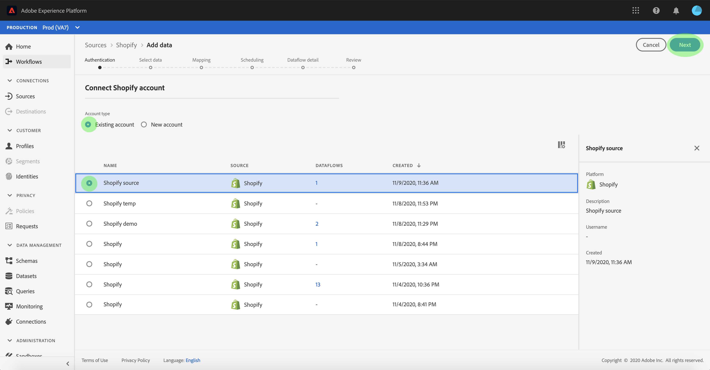

# Skapa en [!DNL Shopify] källanslutning i användargränssnittet

Källkopplingar i Adobe Experience Platform gör det möjligt att importera externt källkodsdata på schemalagd basis. Den här självstudiekursen innehåller steg för att skapa en [!DNL Shopify] källkoppling med [!DNL Platform] användargränssnitt.

## Komma igång

Den här självstudiekursen kräver en fungerande förståelse av följande komponenter i Adobe Experience Platform:

* [Experience Data Model (XDM) System](../../../../../xdm/home.md): Det standardiserade ramverk som [!DNL Experience Platform] organiserar kundupplevelsedata.
   * [Grunderna för schemakomposition](../../../../../xdm/schema/composition.md): Lär dig mer om de grundläggande byggstenarna i XDM-scheman, inklusive viktiga principer och bästa praxis när det gäller schemakomposition.
   * [Schemaredigeraren, genomgång](../../../../../xdm/tutorials/create-schema-ui.md): Lär dig hur du skapar anpassade scheman med hjälp av gränssnittet för Schemaredigeraren.
* [[!DNL Real-Time Customer Profile]](../../../../../profile/home.md): Ger en enhetlig konsumentprofil i realtid baserad på aggregerade data från flera källor.

Om du redan har en [!DNL Shopify] kan du hoppa över resten av dokumentet och gå vidare till självstudiekursen om [konfigurera ett dataflöde för en eCommerce-koppling](../../dataflow/ecommerce.md).

### Samla in nödvändiga inloggningsuppgifter

För att komma åt [!DNL Shopify] konto på [!DNL Platform]måste du ange följande värden:

| Autentiseringsuppgifter | Beskrivning |
| ---------- | ----------- |
| `host` | Slutpunkten för [!DNL Shopify] server. |
| `accessToken` | Åtkomsttoken för din [!DNL Shopify] användarkonto. |

Mer information om hur du kommer igång finns i [[!DNL Shopify] dokument](https://shopify.dev/concepts/about-apis/authentication).

## Koppla samman [!DNL Shopify] konto

När du har samlat in dina inloggningsuppgifter kan du följa stegen nedan för att länka dina [!DNL Shopify] konto till [!DNL Platform].

Logga in på [Adobe Experience Platform](https://platform.adobe.com) och sedan markera **[!UICONTROL Sources]** från det vänstra navigeringsfältet för att komma åt **[!UICONTROL Sources]** arbetsyta. The **[!UICONTROL Catalog]** I visas en mängd olika källor som du kan skapa ett konto med.

Du kan välja lämplig kategori i katalogen till vänster på skärmen. Du kan också hitta den källa du vill arbeta med med med sökalternativet.

Under **[!UICONTROL eCommerce]** kategori, välj **[!UICONTROL Shopify]**. Om det är första gången du använder den här kopplingen väljer du **[!UICONTROL Configure]**. Annars väljer du **[!UICONTROL Add data]** för att skapa en ny [!DNL Shopify] koppling.

The **[!UICONTROL Connect to Shopify]** visas. På den här sidan kan du antingen använda nya autentiseringsuppgifter eller befintliga.

### Nytt konto

Om du använder nya autentiseringsuppgifter väljer du **[!UICONTROL New account]**. Ange ett namn, en valfri beskrivning och din [!DNL Shopify] autentiseringsuppgifter. När du är klar väljer du **[!UICONTROL Connect]** och tillåt sedan lite tid för att upprätta den nya anslutningen.

### Befintligt konto

Om du vill ansluta ett befintligt konto väljer du [!DNL Shopify] konto som du vill ansluta till och välj **[!UICONTROL Next]** för att fortsätta.

## Nästa steg

Genom att följa den här självstudiekursen har du upprättat en anslutning till [!DNL Shopify] konto. Du kan nu fortsätta med nästa självstudiekurs och [konfigurera ett dataflöde för att överföra e-handelsdata till [!DNL Platform]](../../dataflow/ecommerce.md).
