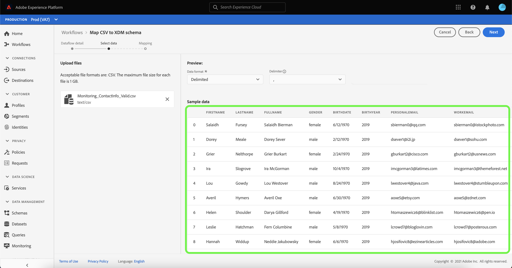
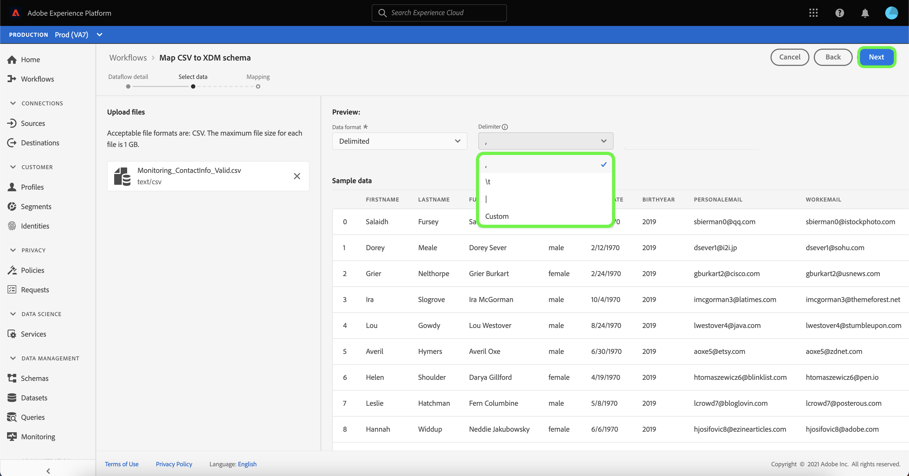

# Skapa en lokal källanslutning för filöverföring i användargränssnittet

I den här självstudiekursen beskrivs hur du skapar en lokal anslutning för filöverföring för att importera lokala filer till plattformen med användargränssnittet.

## Komma igång

Den här självstudiekursen kräver en fungerande förståelse av följande plattformskomponenter:

* [[!DNL Experience Data Model (XDM)] System](../../../../../xdm/home.md): Det standardiserade ramverk som Platform använder för att organisera kundupplevelsedata.
   * [Grunderna för schemakomposition](../../../../../xdm/schema/composition.md): Lär dig mer om de grundläggande byggstenarna i XDM-scheman, inklusive viktiga principer och bästa praxis när det gäller schemakomposition.
   * [Schemaredigeraren, genomgång](../../../../../xdm/tutorials/create-schema-ui.md): Lär dig hur du skapar anpassade scheman med hjälp av gränssnittet för Schemaredigeraren.
* [[!DNL Real-Time Customer Profile]](../../../../../profile/home.md): Ger en enhetlig konsumentprofil i realtid baserad på aggregerade data från flera källor.

## Överför lokala filer till plattformen

Välj **[!UICONTROL Sources]** från det vänstra navigeringsfältet för att komma åt [!UICONTROL Sources] arbetsyta. The [!UICONTROL Catalog] visas en mängd olika källor som du kan skapa ett konto för.

Du kan välja lämplig kategori i katalogen till vänster på skärmen. Du kan också hitta den källa du vill arbeta med med med sökalternativet.

Under [!UICONTROL Local system] kategori, välj **[!UICONTROL Local file upload]** och sedan markera **[!UICONTROL Add data]**.

### Använd en befintlig datauppsättning

The [!UICONTROL Dataflow detail] kan du välja om du vill importera dina CSV-data till en befintlig datamängd eller en ny datamängd.

Om du vill importera dina CSV-data till en befintlig datauppsättning väljer du **[!UICONTROL Existing dataset]**. Du kan antingen hämta en befintlig datauppsättning med [!UICONTROL Advanced search] eller genom att bläddra igenom listan med befintliga datauppsättningar i listrutan.

Ange ett namn för dataflödet och en valfri beskrivning när du har valt en datauppsättning.

Under den här processen kan du även aktivera [!UICONTROL Error diagnostics] och [!UICONTROL Partial ingestion]. [!UICONTROL Error diagnostics] möjliggör detaljerad generering av felmeddelanden för alla felaktiga poster som inträffar i dataflödet, medan [!UICONTROL Partial ingestion] gör att du kan importera data som innehåller fel, upp till ett visst tröskelvärde som du manuellt anger. Se [partiell batchingång - översikt](../../../../../ingestion/batch-ingestion/partial.md) för mer information.

### Använd en ny datauppsättning

Om du vill importera dina CSV-data till en ny datauppsättning väljer du **[!UICONTROL New dataset]** och ange sedan ett namn och en valfri beskrivning för utdatauppsättningen. Välj sedan ett schema att mappa till med [!UICONTROL Advanced search] eller genom att bläddra igenom listan med befintliga scheman i listrutan.

När du har valt ett schema anger du ett namn för dataflödet och en valfri beskrivning och använder sedan [!UICONTROL Error diagnostics] och [!UICONTROL Partial ingestion] inställningar som du vill använda för dataflödet. När du är klar väljer du **[!UICONTROL Next]**.

### Markera data

The [!UICONTROL Select data] visas med ett gränssnitt där du kan överföra dina lokala filer och förhandsgranska deras struktur och innehåll. Välj **[!UICONTROL Choose files]** för att överföra en CSV-fil från ditt lokala system. Du kan också dra och släppa CSV-filen som du vill överföra till [!UICONTROL Drag and drop files] -panelen.

>[!TIP]
>
>Endast CSV-filer stöds för närvarande av lokal filöverföring. Den största filstorleken för varje fil är 1 GB.

När filen har överförts uppdateras förhandsvisningsgränssnittet för att visa filens innehåll och struktur.

Beroende på vilken fil du har kan du välja en kolumnavgränsare, t.ex. tabbar, kommatecken, rör eller en anpassad kolumnavgränsare för källdata. Välj **[!UICONTROL Delimiter]** och välj sedan lämplig avgränsare på menyn.

När du är klar väljer du **[!UICONTROL Next]**.

## Mappning

The [!UICONTROL Mapping] visas med ett gränssnitt för att mappa källfälten från källschemat till rätt mål-XDM-fält i målschemat.

Beroende på dina behov kan du välja att mappa fält direkt eller använda förinställningsfunktioner för data för att omvandla källdata för att härleda beräknade eller beräknade värden. Mer information om hur du använder mappningsgränssnittet finns i [Användargränssnittsguide för dataprep](../../../../../data-prep/ui/mapping.md).

När mappningsuppsättningarna är klara väljer du **[!UICONTROL Finish]** och kan ta en stund innan det nya dataflödet skapas.

## Övervaka datainmatning

När CSV-filen har mappats och skapats kan du övervaka de data som importeras via den via kontrollpanelen. Mer information finns i självstudiekursen om [övervaka källornas dataflöden i användargränssnittet](../../../../../dataflows/ui/monitor-sources.md).

## Nästa steg

I den här självstudiekursen har du mappat en platt CSV-fil till ett XDM-schema och infogat den i Platform. Dessa data kan nu användas av underordnade [!DNL Platform] tjänster som [!DNL Real-Time Customer Profile]. Se översikten för [[!DNL Real-Time Customer Profile]](../../../../../profile/home.md) för mer information.
