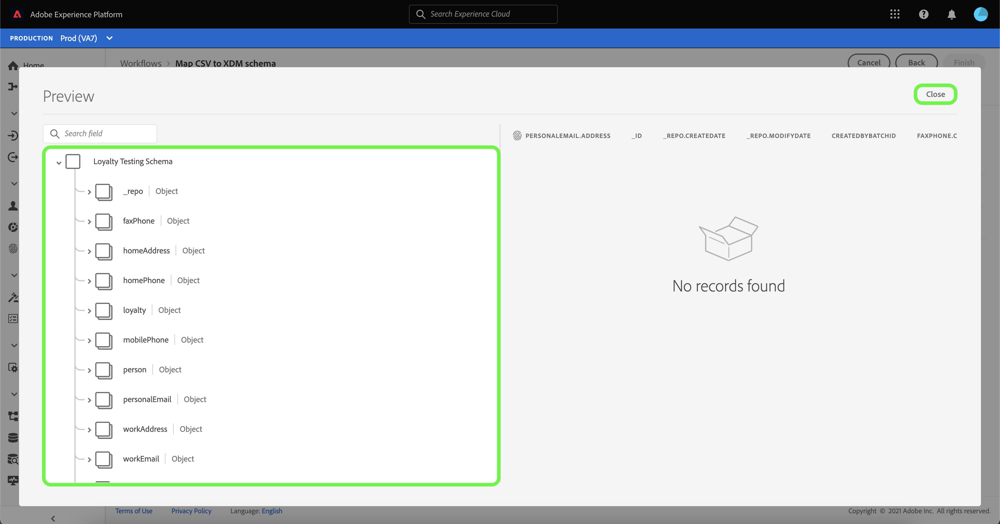
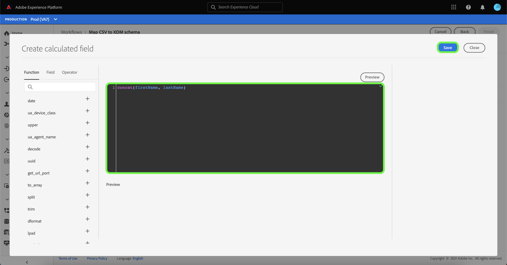

# Skapa en lokal källanslutning för filöverföring i användargränssnittet

I den här självstudiekursen beskrivs hur du skapar en lokal anslutning för filöverföring för att importera lokala filer till plattformen med användargränssnittet.

## Komma igång

Den här självstudiekursen kräver en fungerande förståelse av följande plattformskomponenter:

* [[!DNL Experience Data Model (XDM)] System](../../../../../xdm/home.md): Det standardiserade ramverk som Platform använder för att organisera kundupplevelsedata.
   * [Grundläggande om schemakomposition](../../../../../xdm/schema/composition.md): Lär dig mer om de grundläggande byggstenarna i XDM-scheman, inklusive viktiga principer och bästa praxis när det gäller schemakomposition.
   * [Schemaredigeraren, genomgång](../../../../../xdm/tutorials/create-schema-ui.md): Lär dig hur du skapar anpassade scheman med hjälp av gränssnittet för Schemaredigeraren.
* [[!DNL Real-time Customer Profile]](../../../../../profile/home.md): Ger en enhetlig konsumentprofil i realtid baserad på aggregerade data från flera källor.

## Överför lokala filer till plattformen

Välj **[!UICONTROL Sources]** i det vänstra navigeringsfältet i plattformsgränssnittet för att komma åt arbetsytan [!UICONTROL Sources]. Skärmen [!UICONTROL Catalog] visar en mängd olika källor som du kan skapa ett konto för.

Du kan välja lämplig kategori i katalogen till vänster på skärmen. Du kan också hitta den källa du vill arbeta med med med sökalternativet.

Under kategorin [!UICONTROL Local system] väljer du **[!UICONTROL Local file upload]** och sedan **[!UICONTROL Configure]**.

### Använd en befintlig datauppsättning

På sidan [!UICONTROL Dataflow detail] kan du välja om du vill importera dina CSV-data till en befintlig datamängd eller en ny datamängd.

Om du vill importera dina CSV-data till en befintlig datauppsättning väljer du **[!UICONTROL Existing dataset]**. Du kan antingen hämta en befintlig datauppsättning med alternativet [!UICONTROL Advanced search] eller genom att bläddra igenom listan med befintliga datauppsättningar i listrutan.

Ange ett namn för dataflödet och en valfri beskrivning när du har valt en datauppsättning.

Under den här processen kan du även aktivera [!UICONTROL Error diagnostics] och [!UICONTROL Partial ingestion]. [!UICONTROL Error diagnostics] möjliggör detaljerad generering av felmeddelanden för alla felaktiga poster som inträffar i dataflödet, samtidigt som du  [!UICONTROL Partial ingestion] kan importera data som innehåller fel, upp till ett visst tröskelvärde som du själv anger. Mer information finns i [översikten över partiell gruppöverföring](../../../../../ingestion/batch-ingestion/partial.md).

### Använd en ny datauppsättning

Om du vill importera dina CSV-data till en ny datauppsättning väljer du **[!UICONTROL New dataset]** och anger sedan ett namn på utdatauppsättningen och en valfri beskrivning. Välj sedan ett schema att mappa till med alternativet [!UICONTROL Advanced search] eller genom att bläddra igenom listan med befintliga scheman i listrutan.

När du har valt ett schema anger du ett namn för dataflödet och en valfri beskrivning. Sedan tillämpar du de [!UICONTROL Error diagnostics]- och [!UICONTROL Partial ingestion]-inställningar du vill använda för dataflödet. När du är klar väljer du **[!UICONTROL Next]**.

### Markera data

Steget [!UICONTROL Select data] visas med ett gränssnitt där du kan överföra dina lokala filer och förhandsgranska deras struktur och innehåll. Välj **[!UICONTROL Choose files]** om du vill överföra en CSV-fil från det lokala systemet. Du kan också dra och släppa den CSV-fil som du vill överföra till panelen [!UICONTROL Drag and drop files].

>[!TIP]
>
>Endast CSV-filer stöds för närvarande av lokal filöverföring. Den största filstorleken för varje fil är 1 GB.

När filen har överförts uppdateras förhandsvisningsgränssnittet för att visa filens innehåll och struktur.

Beroende på vilken fil du har kan du välja en kolumnavgränsare, t.ex. tabbar, kommatecken, rör eller en anpassad kolumnavgränsare för källdata. Välj listrutepilen **[!UICONTROL Delimiter]** och välj sedan lämplig avgränsare på menyn.

När du är klar väljer du **[!UICONTROL Next]**.

### Mappning

Steget [!UICONTROL Mapping] visas, vilket ger dig ett gränssnitt för att mappa källfälten från källschemat till rätt mål-XDM-fält i målschemat.

#### Förhandsgranska data

Välj **[!UICONTROL Preview data]** om du vill visa mappningsresultat på upp till 100 rader med exempeldata från den valda datauppsättningen.

Under förhandsgranskningen prioriteras identitetskolumnen som det första fältet, eftersom det är den nyckelinformation som krävs vid validering av mappningsresultat. När du är klar väljer du **[!UICONTROL Close]**.

#### Lägg till beräknat fält

Beräknade fält tillåter att värden skapas baserat på attributen i indatabladet. Dessa värden kan sedan tilldelas attribut i målschemat och ges ett namn och en beskrivning som gör det enklare att referera till.

Klicka på knappen **[!UICONTROL Add calculated field]** för att fortsätta.

Panelen [!UICONTROL Create calculated field] visas. Den vänstra dialogrutan innehåller de fält, funktioner och operatorer som stöds i beräkningsfält. Välj en av flikarna för att börja lägga till funktioner, fält eller operatorer i uttrycksredigeraren.

| Tabb | Beskrivning |
| --------- | ----------- |
|  -funktion | På fliken Funktioner visas de funktioner som är tillgängliga för att omforma data. Om du vill veta mer om de funktioner du kan använda i beräkningsfält kan du läsa guiden på [med hjälp av datapersonfunktioner (Mapper)](../../../../../data-prep/functions.md). |
| Fält | Fliken Fält visar de fält och attribut som är tillgängliga i källschemat. |
| Operatör | På fliken Operatorer visas de operatorer som är tillgängliga för att omforma data. |

Välj uttrycksredigeraren om du vill lägga till fält, funktioner och operatorer manuellt. När du har skapat ett beräkningsfält väljer du **[!UICONTROL Save]** för att fortsätta.

#### Schemamappningsträd för filterkälla

Om du vill filtrera genom källschemat väljer du **[!UICONTROL All source fields]** och väljer sedan det specifika fält som du vill mappa i listrutan.

I följande tabell visas sorteringsalternativen för källschematrädet:

| Källfält | Beskrivning |
| --- | --- |
| [!UICONTROL All source fields] | Det här alternativet visar alla källfält i källschemat. Det här alternativet visas som standard. |
| [!UICONTROL Required fields] | Med det här alternativet filtreras källschemat så att endast de fält som krävs för att slutföra mappningen visas. |
| [!UICONTROL Identity fields] | Med det här alternativet filtreras källschemat så att endast fält som är markerade som Identitet visas. |
| [!UICONTROL Mapped fields] | Med det här alternativet filtreras källschemat så att endast de fält som redan har mappats visas. |
| [!UICONTROL Unmapped fields] | Med det här alternativet filtreras källschemat så att endast de fält som ännu inte har mappats visas. |
| [!UICONTROL Fields with recommendation] | Med det här alternativet filtreras källschemat så att endast de fält som innehåller mappningsrekommendationer visas. |

#### Intelligenta rekommendationer

Plattformen ger automatiskt intelligenta rekommendationer för automatiskt mappade fält baserat på det målschema eller den datamängd du valt. Du kan justera mappningsreglerna manuellt så att de passar dina användningsfall.

Om du vill acceptera alla värden för automatisk generering av mappning väljer du **[!UICONTROL Accept all target fields]**.

Ibland finns det mer än en rekommendation för källschemat. När detta inträffar visas den mest framträdande rekommendationen på mappningskortet, följt av en blå cirkel som innehåller antalet tillgängliga ytterligare rekommendationer. Om du väljer glödlampsikonen visas en lista med ytterligare rekommendationer. Du kan välja en av de alternativa rekommendationerna genom att markera kryssrutan bredvid den rekommendation du vill mappa till i stället.

Du kan också välja att manuellt mappa källschemat till målschemat. Det gör du genom att hålla pekaren över det källschema som du vill mappa och sedan välja plusikonen (`+`).

**[!UICONTROL Map source to target field]**-drivrutinen visas. Här kan du välja vilket fält som du vill mappa, följt av **[!UICONTROL Save]** för att lägga till din nya mappning.

När du är klar väljer du **[!UICONTROL Finished]**.

## Övervaka datainmatning

När CSV-filen har mappats och skapats kan du övervaka de data som importeras via den via kontrollpanelen. Mer information finns i självstudiekursen om [övervakning av källans dataflöden i användargränssnittet](../../../../../dataflows/ui/monitor-sources.md).

## Nästa steg

I den här självstudiekursen har du mappat en platt CSV-fil till ett XDM-schema och infogat den i Platform. Dessa data kan nu användas av underordnade [!DNL Platform]-tjänster som [!DNL Real-time Customer Profile]. Mer information finns i översikten för [[!DNL Real-time Customer Profile]](../../../../../profile/home.md).
