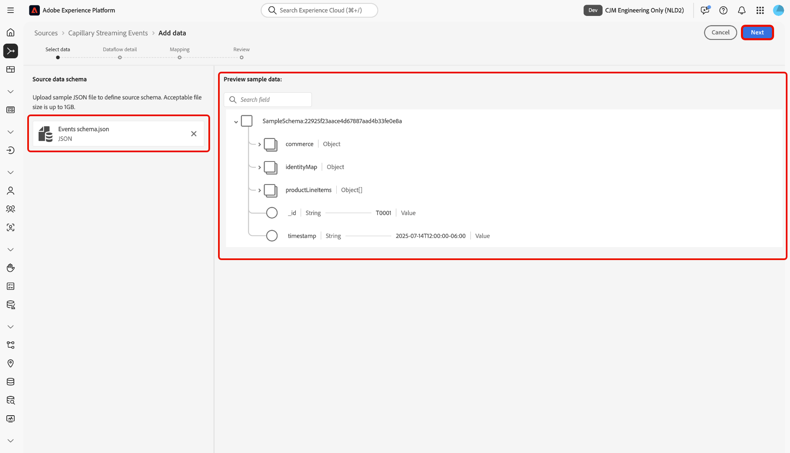
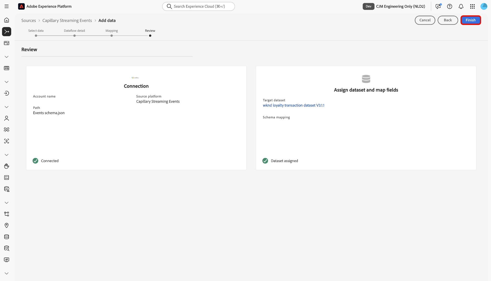

# Anslut [!DNL Capillary] till Experience Platform med användargränssnittet

Läs den här vägledningen när du vill lära dig hur du ansluter din [!DNL Capillary]-databas till Adobe Experience Platform med hjälp av källarbetsytan i Experience Platform användargränssnitt.

## Komma igång

Den här självstudiekursen kräver en fungerande förståelse av följande komponenter i Experience Platform:

* [[!DNL Experience Data Model (XDM)] System](../../../../../xdm/home.md): Det standardiserade ramverk som Experience Platform använder för att ordna kundupplevelsedata.
   * [Grundläggande om schemakomposition](../../../../../xdm/schema/composition.md): Lär dig mer om grundstenarna i XDM-scheman, inklusive nyckelprinciper och bästa metoder för schemakomposition.
   * [Schemaredigeraren, självstudiekurs](../../../../../xdm/tutorials/create-schema-ui.md): Lär dig hur du skapar anpassade scheman med hjälp av gränssnittet för Schemaredigeraren.
* [[!DNL Real-Time Customer Profile]](../../../../../profile/home.md): Tillhandahåller en enhetlig konsumentprofil i realtid baserad på aggregerade data från flera källor.

## Navigera i källkatalogen

I Experience Platform-gränssnittet väljer du **[!UICONTROL Sources]** i den vänstra navigeringen för att komma åt arbetsytan i *[!UICONTROL Sources]*. Välj lämplig kategori på panelen *[!UICONTROL Categories]*. Du kan också använda sökfältet för att navigera till den specifika källa som du vill använda.

Om du vill använda [!DNL Capillary] väljer du **[!UICONTROL Capillary Streaming Events]**-källkortet under *[!UICONTROL Loyalty]* och sedan **[!UICONTROL Add data]**.

>[!TIP]
>
>Källor i källkatalogen visar alternativet **[!UICONTROL Set up]** när en angiven källa ännu inte har något autentiserat konto. När ett autentiserat konto har skapats ändras alternativet till **[!UICONTROL Add data]**.

## Markera data

Använd sedan gränssnittet *[!UICONTROL Select data]* för att överföra en JSON-exempelfil och definiera källschemat. Under det här steget kan du använda förhandsvisningsgränssnittet för att visa nyttolastens filstruktur. När du är klar väljer du **[!UICONTROL Next]**.

## Information om dataflöde

Därefter måste du ange information om datauppsättningen och dataflödet.

### Information om datauppsättning

En datauppsättning är en lagrings- och hanteringskonstruktion för en datamängd, vanligtvis en tabell, som innehåller ett schema (kolumner) och fält (rader). Data som har inhämtats till Experience Platform lagras i datasjön som datauppsättningar.

Under det här steget kan du antingen använda en befintlig datauppsättning eller skapa en ny datauppsättning.

>[!NOTE]
>
>Oavsett om du använder en befintlig datauppsättning eller skapar en ny datauppsättning måste du se till att din datauppsättning är **aktiverad för**-profilinmatning.

+++Välj för steg om du vill aktivera profilinmatning, feldiagnostik och partiell inmatning.

Om din datauppsättning är aktiverad för kundprofil i realtid kan du under det här steget växla **[!UICONTROL Profile dataset]** för att aktivera dina data för profilinmatning. Du kan också använda det här steget för att aktivera **[!UICONTROL Error diagnostics]** och **[!UICONTROL Partial ingestion]**.

* **[!UICONTROL Error diagnostics]**: Välj **[!UICONTROL Error diagnostics]** om du vill instruera källan att skapa feldiagnostik som du kan referera till senare när du övervakar datauppsättningsaktiviteten och dataflödesstatusen.
* **[!UICONTROL Partial ingestion]**: Partiell gruppinmatning är möjligheten att importera data som innehåller fel, upp till ett visst konfigurerbart tröskelvärde. Med den här funktionen kan du importera alla korrekta data till Experience Platform, medan alla felaktiga data batchas separat med information om varför de är ogiltiga.

+++

### Information om dataflöde

När datauppsättningen har konfigurerats måste du ange information om dataflödet, inklusive ett namn, en valfri beskrivning och aviseringskonfigurationer.

| Dataflödeskonfigurationer | Beskrivning |
| --- | --- |
| Dataflödesnamn | Dataflödets namn.  Som standard används namnet på filen som importeras. |
| Beskrivning | (Valfritt) En kort beskrivning av dataflödet. |
| Aviseringar | Experience Platform kan skapa händelsebaserade aviseringar som användare kan prenumerera på. Dessa alternativ är alla ett öppet dataflöde som utlöser dem.  Mer information finns i [varningsöversikten](../../alerts.md) <ul><li>**Källdataflödeskörning Start**: Välj den här aviseringen för att få ett meddelande när dataflödeskörningen börjar.</li><li>**Källdataflödet har körts**: Välj den här aviseringen om du vill få ett meddelande om dataflödet slutar utan fel.</li><li>**Körningsfel för källdataflöde**: Välj den här aviseringen för att få ett meddelande om dataflödet avslutas med fel.</li></ul> |

{style="table-layout:auto"}

## Mappning

Använd mappningsgränssnittet för att mappa källdata till rätt schemafält innan data importeras till Experience Platform.  Mer information finns i [mappningsguiden i användargränssnittet](../../../../../data-prep/ui/mapping.md).

## Granska

Steget *[!UICONTROL Review]* visas så att du kan granska informationen om dataflödet innan det skapas. Informationen är grupperad i följande kategorier:

* **[!UICONTROL Connection]**: Visar kontonamnet, källplattformen och källnamnet.
* **[!UICONTROL Assign dataset and map fields]**: Visar måldatauppsättningen och det schema som datauppsättningen följer.

När du har bekräftat att informationen är korrekt väljer du **[!UICONTROL Finish]**.

## Hämta URL för direktuppspelningsslutpunkt

När anslutningen har skapats visas informationssidan för källor. På den här sidan visas information om din nya anslutning, inklusive tidigare körda dataflöden, ID och URL för direktuppspelningsslutpunkt.

