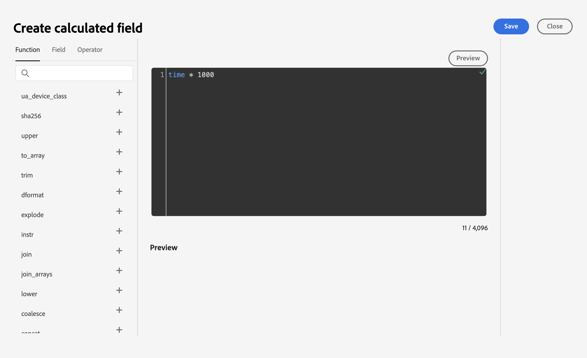

# Skapa en [!DNL Braze] källanslutning i användargränssnittet

>[!NOTE]
>
>The [!DNL Braze] källan är i betaversion. Läs [källöversikt](../../../../home.md#terms-and-conditions) om du vill ha mer information om hur du använder betamärkta källor.

[!DNL Braze] möjliggör kundcentrerad interaktion mellan konsumenter och varumärken i realtid. [!DNL Braze Currents] är ett dataflöde i realtid av engagemangshändelser från Braze-plattformen som är den mest robusta men detaljerade exporten från [!DNL Braze] plattform.

Läs följande självstudiekurs för att lära dig hur du kan hämta interaktionshändelsedata från [!DNL Braze] för Adobe Experience Platform i användargränssnittet.

## Förutsättningar

För att kunna slutföra stegen i den här handboken behöver du:

* En inloggning på [Adobe Experience Platform](https://platform.adobe.com) och behörighet att skapa en ny direktuppspelningskällanslutning.
* En inloggning på [[!DNL Braze] kontrollpanel](https://dashboard.braze.com/sign_in), en oanvänd [Aktuell anslutningslicens](https://www.braze.com/docs/user_guide/data_and_analytics/braze_currents)och behörigheter för att skapa en koppling. Mer information finns i [krav för att ställa in [!DNL Currents]](https://www.braze.com/docs/user_guide/data_and_analytics/braze_currents/setting_up_currents/#requirements).

## Komma igång

Den här självstudiekursen kräver en fungerande förståelse av följande komponenter i Adobe Experience Platform:

* [[!DNL Experience Data Model (XDM)] System](../../../../../xdm/home.md): Det standardiserade ramverk som [!DNL Experience Platform] organiserar kundupplevelsedata.
   * [Grunderna för schemakomposition](../../../../../xdm/schema/composition.md): Lär dig mer om de grundläggande byggstenarna i XDM-scheman, inklusive viktiga principer och bästa praxis när det gäller schemakomposition.
   * [Schemaredigeraren, genomgång](../../../../../xdm/tutorials/create-schema-ui.md): Lär dig hur du skapar anpassade scheman med hjälp av gränssnittet i Schemaredigeraren.
* [[!DNL Real-Time Customer Profile]](../../../../../profile/home.md): Ger en enhetlig konsumentprofil i realtid baserad på aggregerade data från flera källor.

Den här självstudiekursen kräver också en fungerande förståelse för [[!DNL Braze] Aktuella](https://www.braze.com/docs/user_guide/data_and_analytics/braze_currents).

Om du redan har en [!DNL Braze] kan du hoppa över resten av dokumentet och gå vidare till självstudiekursen om [konfigurera ett dataflöde](../../dataflow/marketing-automation.md).

## Koppla samman [!DNL Braze] konto till Experience Platform

Välj **[!UICONTROL Sources]** från vänster navigering för att komma åt [!UICONTROL Sources] arbetsyta. Du kan välja lämplig kategori i katalogen till vänster på skärmen. Du kan också hitta den källa du vill arbeta med med med sökalternativet.

Under *Marknadsföringsautomatisering* kategori, välj **[!UICONTROL Braze]** och sedan markera **[!UICONTROL Add data]**.

Ladda sedan upp [Exempelfil för Braze Currents](https://github.com/Appboy/currents-examples/blob/master/sample-data/Adobe/adobe_examples.json). Den här filen innehåller alla fält som Braze kan skicka som en del av en händelse.

När filen har överförts måste du ange dataflödesinformation, inklusive information om datauppsättningen och det schema som du mappar till.

Konfigurera sedan mappningen för dina data med mappningsgränssnittet.

>[!IMPORTANT]
>
>Hjärntidsstämplar anges inte i millisekunder utan i sekunder. För att tidsstämplarna i Experience Platform ska visas korrekt måste du skapa beräkningsfält i millisekunder. En beräkning av &quot;time * 1000&quot; konverteras korrekt till millisekunder, vilket är lämpligt för mappning till ett tidsstämpelfält i Experience Platform.
>
>

### Samla in nödvändiga inloggningsuppgifter

När anslutningen har skapats måste du samla in följande värden för autentiseringsuppgifter, som du sedan anger i Braze Dashboard för att skicka data till [!DNL Platform]. Mer information finns i [!DNL Braze] [guide för att navigera till valutor](https://www.braze.com/docs/user_guide/data_and_analytics/braze_currents/setting_up_currents/#step-2-navigate-to-currents).

| Fält | Beskrivning |
| ---------- | ----------- |
| `Client ID` | Klient-ID som är kopplat till din [!DNL Platform] källa. |
| `Client Secret` | Klienthemligheten som är kopplad till din [!DNL Platform] källa. |
| `Tenant ID` | Klient-ID som är kopplat till din [!DNL Platform] källa. |
| `Sandbox Name` | Sandlådan som är kopplad till din [!DNL Platform] källa. |
| `Dataflow ID` | Det dataflödes-ID som är kopplat till din [!DNL Platform] källa. |
| `Streaming Endpoint` | Slutpunkten för direktuppspelning som är kopplad till din [!DNL Platform] källa. Observera att Braze automatiskt konverterar detta till batchströmningsslutpunkten. |

### Konfigurera [!DNL Braze Currents] för att strömma data till datakällan

I [!DNL Braze Dashboard], navigera till Partnerintegreringar **->** Dataexport, välj sedan **[!DNL Create New Current]**. Du uppmanas att ange ett namn för kopplingen, kontaktinformation för meddelanden om anslutningen och de autentiseringsuppgifter som anges ovan. Välj de händelser som du vill ta emot, eller konfigurera eventuella önskade fältundantag/omvandlingar och välj sedan **[!DNL Launch Current]**.

## Nästa steg

Genom att följa den här självstudien har du upprättat en anslutning till [!DNL Braze] konto. Du kan nu fortsätta med nästa självstudiekurs och [konfigurera ett dataflöde för att få in data från automatiserade marknadsföringssystem i [!DNL Platform]](../../dataflow/marketing-automation.md).