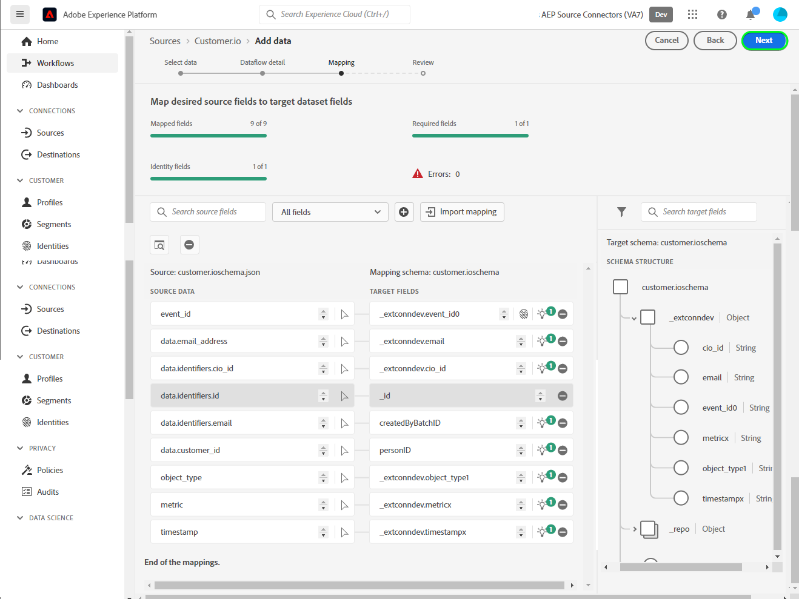
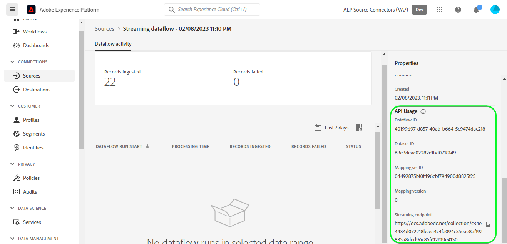

# Skapa en [!DNL Customer.io] källanslutning och dataflöde i användargränssnittet

>[!NOTE]
>
>The [!DNL Customer.io] källan är i betaversion. Läs [källöversikt](../../../../home.md#terms-and-conditions) om du vill ha mer information om hur du använder betamärkta källor.

Den här självstudiekursen innehåller steg för att skapa en [!DNL Customer.io] källanslutning och dataflöde med Adobe Experience Platform användargränssnitt.

## Komma igång {#getting-started}

Den här självstudiekursen kräver en fungerande förståelse av följande komponenter i Experience Platform:

* [[!DNL Experience Data Model (XDM)] System](../../../../../xdm/home.md): Det standardiserade ramverk som [!DNL Experience Platform] organiserar kundupplevelsedata.
   * [Grunderna för schemakomposition](../../../../../xdm/schema/composition.md): Lär dig mer om de grundläggande byggstenarna i XDM-scheman, inklusive viktiga principer och bästa praxis när det gäller schemakomposition.
   * [Schemaredigeraren, genomgång](../../../../../xdm/tutorials/create-schema-ui.md): Lär dig hur du skapar anpassade scheman med hjälp av gränssnittet för Schemaredigeraren.
* [[!DNL Real-Time Customer Profile]](../../../../../profile/home.md): Ger en enhetlig konsumentprofil i realtid baserad på aggregerade data från flera källor.

## Förutsättningar {#prerequisites}

Följande avsnitt innehåller information om krav som måste utföras innan du kan skapa en [!DNL Customer.io] källanslutning.

### Exempel-JSON för att definiera källschemat för [!DNL Customer.io] {#prerequisites-json-schema}

Innan du skapar en [!DNL Customer.io] källanslutning, du måste ange ett källschema. Du kan använda JSON nedan.

```
{
  "event_id": "01E4C4CT6YDC7Y5M7FE1GWWPQJ",
  "object_type": "customer",
  "metric": "subscribed",
  "timestamp": 1613063089,
  "data": {
    "customer_id": "42",
    "email_address": "test@example.com",
    "identifiers": {
      "id": "42",
      "email": "test@example.com",
      "cio_id": "d9c106000001"
    }
  }
}
```

### Skapa ett plattformsschema för [!DNL Customer.io] {#create-platform-schema}

Du måste också se till att du skapar ett plattformsschema som kan användas för källan. Se självstudiekursen om [skapa ett plattformsschema](../../../../../xdm/schema/composition.md) om du vill ha omfattande anvisningar om hur du skapar ett schema.


## Koppla samman [!DNL Customer.io] konto {#connect-account}

Välj **[!UICONTROL Sources]** från vänster navigering för att komma åt [!UICONTROL Sources] och se en katalog med källor i Experience Platform.

Använd *[!UICONTROL Categories]* meny för att filtrera källor efter kategori. Du kan också ange ett källnamn i sökfältet för att hitta en viss källa från katalogen.

Gå till [!UICONTROL Marketing automation] för att se [!DNL Customer.io] källkort. Börja genom att välja **[!UICONTROL Add data]**.


## Markera data {#select-data}

The **[!UICONTROL Select data]** visas, där du får ett gränssnitt där du kan välja vilka data du vill hämta till plattformen.

* Den vänstra delen av gränssnittet är en webbläsare som gör att du kan visa tillgängliga dataströmmar på ditt konto;
* Med den högra delen av gränssnittet kan du förhandsgranska upp till 100 rader data från en JSON-fil.

Välj **[!UICONTROL Upload files]** för att överföra en JSON-fil från ditt lokala system. Du kan också dra och släppa den JSON-fil som du vill överföra till [!UICONTROL Drag and drop files] -panelen.


När filen har överförts uppdateras förhandsvisningsgränssnittet för att visa en förhandsgranskning av schemat som du har överfört. I förhandsvisningsgränssnittet kan du inspektera innehållet och strukturen i en fil. Du kan också använda [!UICONTROL Search field] för att komma åt specifika objekt inifrån schemat.

När du är klar väljer du **[!UICONTROL Next]**.


## Dataflödesdetaljer {#dataflow-detail}

The **Dataflödesdetaljer** visas. Här finns alternativ för att använda en befintlig datauppsättning eller skapa en ny datauppsättning för dataflödet samt en möjlighet att ange ett namn och en beskrivning för dataflödet. Under det här steget kan du även konfigurera inställningar för profilinmatning, feldiagnostik, partiell inmatning och aviseringar.

När du är klar väljer du **[!UICONTROL Next]**.


## Mappning {#mapping}

The [!UICONTROL Mapping] visas med ett gränssnitt för att mappa källfälten från källschemat till rätt mål-XDM-fält i målschemat.

Plattformen ger intelligenta rekommendationer för automatiskt mappade fält baserat på det målschema eller den datamängd du valt. Du kan justera mappningsreglerna manuellt så att de passar dina användningsfall. Beroende på dina behov kan du välja att mappa fält direkt eller använda förinställningsfunktioner för data för att omvandla källdata för att härleda beräknade eller beräknade värden. Mer information om hur du använder mappningsgränssnittet och beräkningsfälten finns i [Användargränssnittsguide för dataprep](../../../../../data-prep/ui/mapping.md).

Alla mappningar som anges nedan är obligatoriska och bör konfigureras innan du fortsätter till [!UICONTROL Review] stage.

| Målfält | Beskrivning |
| --- | --- |
| `object_type` | Objekttypen refererar till [!DNL Customer.io] [händelser](https://customer.io/docs/webhooks/#events) dokumentation för de typer som stöds. |
| `id` | Objektets identifierare. |
| `email` | E-postadressen som är associerad med objektet. |
| `event_id` | Händelsens unika identifierare. |
| `cio_id` | The [!DNL Customer.io] identifierare för händelsen. |
| `metric` | Händelsetypen. Mer information finns i [!DNL Customer.io] [händelser](https://customer.io/docs/webhooks/#events) dokumentation för de typer som stöds. |
| `timestamp` | Tidsstämpeln när händelsen inträffade. |

>[!IMPORTANT]
>
>Mappa inte `cio_id` vid körning [!DNL Customer.io] webbkrok i `test mode` eftersom inga associerade fält skickas från [!DNL Customer.io].

När källdata har mappats väljer du **[!UICONTROL Next]**.



## Granska {#review}

The **[!UICONTROL Review]** visas så att du kan granska det nya dataflödet innan det skapas. Informationen är grupperad i följande kategorier:

* **[!UICONTROL Connection]**: Visar källtypen, den relevanta sökvägen för den valda källfilen och mängden kolumner i källfilen.
* **[!UICONTROL Assign dataset & map fields]**: Visar vilken datauppsättning källdata hämtas till, inklusive det schema som datauppsättningen följer.

När du har granskat dataflödet väljer du **[!UICONTROL Finish]** så att dataflödet kan skapas.


## Hämta din URL för direktuppspelningsslutpunkt {#get-streaming-endpoint}

När du har skapat ett dataflöde för direktuppspelning kan du nu hämta URL:en för din slutpunkt för direktuppspelning. Den här slutpunkten används för att prenumerera på din webkrok, vilket gör att strömningskällan kan kommunicera med Experience Platform.

För att kunna skapa den URL som används för att konfigurera webbhoten på [!DNL Customer.io] du måste hämta följande:

* **[!UICONTROL Dataflow ID]**
* **[!UICONTROL Streaming endpoint]**

Så här hämtar du **[!UICONTROL Dataflow ID]** och **[!UICONTROL Streaming endpoint]**, går till [!UICONTROL Dataflow activity] sidan med dataflödet som du just skapade och kopierar informationen från nederkanten av [!UICONTROL Properties] -panelen.



När du har hämtat ditt slutpunkts- och dataflödes-ID för direktuppspelning skapar du en URL baserat på följande mönster: ```{STREAMING_ENDPOINT}?x-adobe-flow-id={DATAFLOW_ID}```. En webbkrok-URL kan till exempel se ut så här: ``https://dcs.adobedc.net/collection/febc116d22ba0ea2868e9c93b199375302afb8a589617700991bb8f3f0341ad7?x-adobe-flow-id=439b3fc4-3042-4a3a-b5e0-a494898d3fb0``

## Konfigurera webkrok för rapportering i [!DNL Customer.io] {#set-up-webhook}

När webkrok-URL:en har skapats kan du nu konfigurera din rapporteringswebkrok med [!DNL Customer.io] användargränssnitt. Anvisningar om hur du konfigurerar webbhooks för rapportering finns i [[!DNL Customer.io] guide](https://customer.io/docs/webhooks/#setup) om hur du konfigurerar webbhooks.

I [!DNL Customer.io] användargränssnitt, ange [webkroks-URL](#get-streaming-endpoint-url) i [!DNL WEBHOOK ENDPOINT] fält.


>[!TIP]
>
>Du kan prenumerera på en mängd olika händelser för din rapportwebkrok. Varje händelsemeddelande hämtas till Platform när en [!DNL Customer.io] villkor för utlösare av åtgärdshändelser uppfylls. Mer information om de olika händelserna finns i [[!DNL Customer.io] dokumentation](https://customer.io/docs/webhooks/#events).

## Nästa steg {#next-steps}

Genom att följa den här självstudiekursen har du konfigurerat ett dataflöde för direktuppspelning för att [!DNL Customer.io] data till Experience Platform. Om du vill övervaka de data som importeras läser du i guiden på [övervaka strömmande dataflöden med hjälp av plattformsgränssnitt](../../monitor-streaming.md).

## Ytterligare resurser {#additional-resources}

I avsnitten nedan finns ytterligare resurser som du kan använda när du använder [!DNL Customer.io] källa.

### Guardrails {#guardrails}

Information om skyddsräcken finns i [[!DNL Customer.io] sida för timeout och fel](https://customer.io/docs/webhooks/#timeouts-and-failures).

### Validering {#validation}

För att verifiera att du har konfigurerat källan och [!DNL Customer.io] meddelanden importeras, följ stegen nedan:

* Du kan kontrollera [!DNL Customer.io] **[!UICONTROL Activity Logs]** för att identifiera de händelser som spelas in av [!DNL Customer.io].


* Välj **[!UICONTROL View Dataflows]** bredvid [!DNL Customer.io] kortmenyn i källkatalogen. Nästa, välj **[!UICONTROL Preview dataset]** för att verifiera data som har importerats för händelser som du har valt i [!DNL Customer.io].


