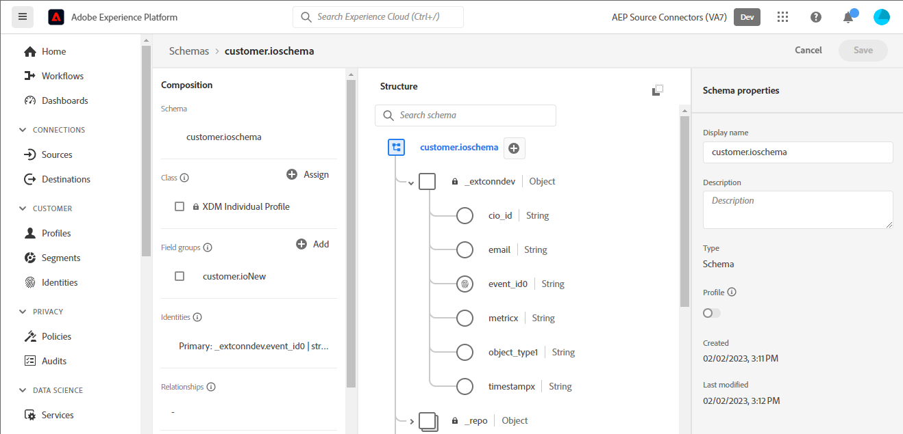

# Skapa en [!DNL Customer.io]-källanslutning och ett dataflöde i användargränssnittet

>[!NOTE]
>
>Källan [!DNL Customer.io] är i betaversion. Läs [källöversikten](../../../../home.md#terms-and-conditions) om du vill ha mer information om hur du använder betatecknade källor.

I den här självstudiekursen beskrivs hur du skapar en [!DNL Customer.io]-källanslutning och ett dataflöde med Adobe Experience Platform-användargränssnittet.

## Komma igång {#getting-started}

Den här självstudiekursen kräver en fungerande förståelse av följande komponenter i Experience Platform:

* [[!DNL Experience Data Model (XDM)] System](../../../../../xdm/home.md): Det standardiserade ramverk som [!DNL Experience Platform] organiserar kundupplevelsedata med.
   * [Grundläggande om schemakomposition](../../../../../xdm/schema/composition.md): Lär dig mer om grundstenarna i XDM-scheman, inklusive nyckelprinciper och bästa metoder för schemakomposition.
   * [Schemaredigeraren, självstudiekurs](../../../../../xdm/tutorials/create-schema-ui.md): Lär dig hur du skapar anpassade scheman med hjälp av gränssnittet för Schemaredigeraren.
* [[!DNL Real-Time Customer Profile]](../../../../../profile/home.md): Tillhandahåller en enhetlig konsumentprofil i realtid baserad på aggregerade data från flera källor.

## Förhandskrav {#prerequisites}

Följande avsnitt innehåller information om krav som måste slutföras innan du kan skapa en [!DNL Customer.io]-källanslutning.

### Exempel-JSON för att definiera källschemat för [!DNL Customer.io] {#prerequisites-json-schema}

Innan du skapar en [!DNL Customer.io]-källanslutning måste du ange ett källschema. Du kan använda JSON nedan.

```
{
  "event_id": "01E4C4CT6YDC7Y5M7FE1GWWPQJ",
  "object_type": "customer",
  "metric": "subscribed",
  "timestamp": 1613063089,
  "data": {
    "customer_id": "42",
    "email_address": "test@example.com",
    "identifiers": {
      "id": "42",
      "email": "test@example.com",
      "cio_id": "d9c106000001"
    }
  }
}
```

### Skapa ett plattformsschema för [!DNL Customer.io] {#create-platform-schema}

Du måste också se till att du skapar ett plattformsschema som kan användas för källan. I självstudiekursen [Skapa ett plattformsschema](../../../../../xdm/schema/composition.md) finns mer information om hur du skapar ett schema.



## Anslut ditt [!DNL Customer.io]-konto {#connect-account}

I plattformsgränssnittet väljer du **[!UICONTROL Sources]** i den vänstra navigeringen för att komma åt arbetsytan i [!UICONTROL Sources] och visa en katalog med tillgängliga källor i Experience Platform.

Använd menyn *[!UICONTROL Categories]* för att filtrera källor efter kategori. Du kan också ange ett källnamn i sökfältet för att hitta en viss källa från katalogen.

Gå till kategorin [!UICONTROL Marketing automation] om du vill se källkortet [!DNL Customer.io]. Börja genom att välja **[!UICONTROL Add data]**.


## Markera data {#select-data}

**[!UICONTROL Select data]**-steget visas med ett gränssnitt där du kan välja vilka data du vill hämta till plattformen.

* Den vänstra delen av gränssnittet är en webbläsare som gör att du kan visa tillgängliga dataströmmar på ditt konto;
* Med den högra delen av gränssnittet kan du förhandsgranska upp till 100 rader data från en JSON-fil.

Välj **[!UICONTROL Upload files]** om du vill överföra en JSON-fil från det lokala systemet. Du kan också dra och släppa den JSON-fil som du vill överföra till panelen [!UICONTROL Drag and drop files].


När filen har överförts uppdateras förhandsvisningsgränssnittet för att visa en förhandsgranskning av schemat som du har överfört. I förhandsvisningsgränssnittet kan du inspektera innehållet och strukturen i en fil. Du kan också använda verktyget [!UICONTROL Search field] för att komma åt specifika objekt från schemat.

När du är klar väljer du **[!UICONTROL Next]**.


## Dataflödesdetaljer {#dataflow-detail}

**Dataflödesdetaljsteget** visas. Här finns alternativ för att använda en befintlig datauppsättning eller skapa en ny datauppsättning för dataflödet, samt en möjlighet att ange ett namn och en beskrivning för dataflödet. Under det här steget kan du även konfigurera inställningar för profilinmatning, feldiagnostik, partiell inmatning och aviseringar.

När du är klar väljer du **[!UICONTROL Next]**.


## Mappning {#mapping}

Steg [!UICONTROL Mapping] visas, och du får ett gränssnitt för att mappa källfälten från källschemat till rätt mål-XDM-fält i målschemat.

Plattformen ger intelligenta rekommendationer för automatiskt mappade fält baserat på det målschema eller den datamängd du valt. Du kan justera mappningsreglerna manuellt så att de passar dina användningsfall. Beroende på dina behov kan du välja att mappa fält direkt eller använda förinställningsfunktioner för data för att omvandla källdata för att härleda beräknade eller beräknade värden. Mer information om hur du använder mappningsgränssnittet och beräkningsfälten finns i [Användargränssnittshandboken för dataförinställningar](../../../../../data-prep/ui/mapping.md).

Alla mappningar som anges nedan är obligatoriska och bör konfigureras innan du fortsätter till [!UICONTROL Review]-steget.

| Målfält | Beskrivning |
| --- | --- |
| `object_type` | Objekttypen finns i [!DNL Customer.io] [events](https://customer.io/docs/webhooks/#events) -dokumentationen för de typer som stöds. |
| `id` | Objektets identifierare. |
| `email` | E-postadressen som är associerad med objektet. |
| `event_id` | Händelsens unika identifierare. |
| `cio_id` | Identifieraren [!DNL Customer.io] för händelsen. |
| `metric` | Händelsetypen. Mer information finns i dokumentationen för [!DNL Customer.io] [events](https://customer.io/docs/webhooks/#events) om vilka typer som stöds. |
| `timestamp` | Tidsstämpeln när händelsen inträffade. |

>[!IMPORTANT]
>
>Mappa inte `cio_id` när [!DNL Customer.io]-webkrok körs i `test mode` eftersom inga associerade fält skickas från [!DNL Customer.io].

När källdata har mappats väljer du **[!UICONTROL Next]**.


## Granska {#review}

Steg **[!UICONTROL Review]** visas, så att du kan granska det nya dataflödet innan det skapas. Informationen är grupperad i följande kategorier:

* **[!UICONTROL Connection]**: Visar källtypen, den relevanta sökvägen för den valda källfilen och mängden kolumner i källfilen.
* **[!UICONTROL Assign dataset & map fields]**: Visar vilka data som källdata hämtas till, inklusive det schema som datauppsättningen följer.

När du har granskat dataflödet väljer du **[!UICONTROL Finish]** och tillåt en tid innan dataflödet skapas.


## Hämta din URL för direktuppspelningsslutpunkt {#get-streaming-endpoint}

När du har skapat ett dataflöde för direktuppspelning kan du nu hämta URL:en för din slutpunkt för direktuppspelning. Den här slutpunkten används för att prenumerera på din webkrok, vilket gör att strömningskällan kan kommunicera med Experience Platform.

För att kunna skapa den URL som används för att konfigurera webkroken på [!DNL Customer.io] måste du hämta följande:

* **[!UICONTROL Dataflow ID]**
* **[!UICONTROL Streaming endpoint]**

Om du vill hämta **[!UICONTROL Dataflow ID]** och **[!UICONTROL Streaming endpoint]** går du till sidan [!UICONTROL Dataflow activity] i det dataflöde som du just skapade och kopierar informationen längst ned på panelen [!UICONTROL Properties].


När du har hämtat ditt ID för direktuppspelningsslutpunkt och dataflöde ska du skapa en URL som baseras på följande mönster: ```{STREAMING_ENDPOINT}?x-adobe-flow-id={DATAFLOW_ID}```. En webbkrok-URL kan till exempel se ut så här: ``https://dcs.adobedc.net/collection/febc116d22ba0ea2868e9c93b199375302afb8a589617700991bb8f3f0341ad7?x-adobe-flow-id=439b3fc4-3042-4a3a-b5e0-a494898d3fb0``

## Konfigurera webkrok för rapportering i [!DNL Customer.io] {#set-up-webhook}

När webkrok-URL:en har skapats kan du nu konfigurera din rapportwebkrok med användargränssnittet [!DNL Customer.io]. Anvisningar om hur du konfigurerar webbhooks för rapportering finns i [[!DNL Customer.io] guiden](https://customer.io/docs/webhooks/#setup) om hur du konfigurerar webbhooks.

I användargränssnittet för [!DNL Customer.io] anger du din [webkrok-URL](#get-streaming-endpoint-url) i fältet [!DNL WEBHOOK ENDPOINT].


>[!TIP]
>
>Du kan prenumerera på en mängd olika händelser för din rapportwebkrok. Varje händelsemeddelande hämtas till plattformen när ett [!DNL Customer.io]-utlösarvillkor för en åtgärdshändelse uppfylls. Mer information om de olika händelserna finns i [[!DNL Customer.io] händelsedokumentationen](https://customer.io/docs/webhooks/#events).

## Nästa steg {#next-steps}

Genom att följa den här självstudiekursen har du konfigurerat ett dataflöde för direktuppspelning så att dina [!DNL Customer.io]-data kommer till Experience Platform. Om du vill övervaka data som importeras läser du i guiden [Övervaka direktuppspelade dataflöden med hjälp av plattformsgränssnittet](../../monitor-streaming.md).

## Ytterligare resurser {#additional-resources}

Avsnitten nedan innehåller ytterligare resurser som du kan referera till när du använder källan [!DNL Customer.io].

### Guardrails {#guardrails}

Mer information om skyddsutkast finns på sidan [[!DNL Customer.io] Timeout and errors](https://customer.io/docs/webhooks/#timeouts-and-failures).

### Validering {#validation}

Följ stegen nedan för att verifiera att du har konfigurerat källan och att [!DNL Customer.io] meddelanden importeras korrekt:

* Du kan kontrollera sidan [!DNL Customer.io] **[!UICONTROL Activity Logs]** för att identifiera de händelser som spelas in av [!DNL Customer.io].


* I plattformsgränssnittet väljer du **[!UICONTROL View Dataflows]** bredvid kortmenyn [!DNL Customer.io] i källkatalogen. Välj sedan **[!UICONTROL Preview dataset]** för att verifiera data som har importerats för händelser som du har valt i [!DNL Customer.io].


