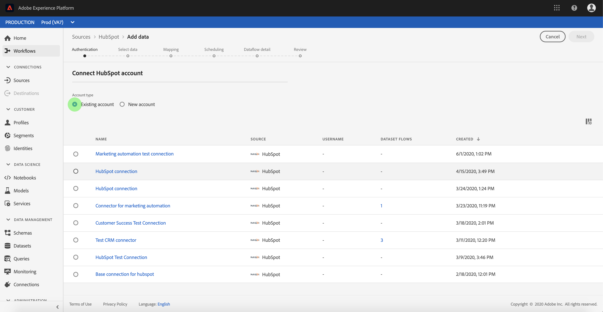

# Skapa en [!DNL HubSpot]-källanslutning i användargränssnittet

>[!NOTE]
>
> [!DNL HubSpot]-kopplingen är i betaversion. Se [Källöversikt](../../../../home.md#terms-and-conditions) om du vill ha mer information om hur du använder betatecknade anslutningar.

Källkopplingar i Adobe Experience Platform gör det möjligt att importera externt källkodsdata på schemalagd basis. I den här självstudien beskrivs stegen för hur du skapar en [!DNL HubSpot]-källkoppling med användargränssnittet i [!DNL Platform].

## Komma igång

Den här självstudiekursen kräver en fungerande förståelse av följande komponenter i Adobe Experience Platform:

* [[!DNL Experience Data Model (XDM)] System](../../../../../xdm/home.md): Det standardiserade ramverket som  [!DNL Experience Platform] organiserar kundupplevelsedata.
   * [Grundläggande om schemakomposition](../../../../../xdm/schema/composition.md): Lär dig mer om de grundläggande byggstenarna i XDM-scheman, inklusive viktiga principer och bästa praxis när det gäller schemakomposition.
   * [Schemaredigeraren, genomgång](../../../../../xdm/tutorials/create-schema-ui.md): Lär dig hur du skapar anpassade scheman med hjälp av gränssnittet för Schemaredigeraren.
* [[!DNL Real-time Customer Profile]](../../../../../profile/home.md): Ger en enhetlig konsumentprofil i realtid baserad på aggregerade data från flera källor.

Om du redan har en [!DNL HubSpot]-anslutning kan du hoppa över resten av det här dokumentet och gå vidare till självstudiekursen [konfigurera ett dataflöde](../../dataflow/marketing-automation.md).

### Samla in nödvändiga inloggningsuppgifter

För att få åtkomst till ditt [!DNL HubSpot]-konto på [!DNL Platform] måste du ange följande värden:

| Autentiseringsuppgifter | Beskrivning |
| ---------- | ----------- |
| `clientId` | Klient-ID som är associerat med ditt [!DNL HubSpot]-program. |
| `clientSecret` | Klienthemligheten som är associerad med ditt [!DNL HubSpot]-program. |
| `accessToken` | Åtkomsttoken som fås när din OAuth-integration autentiseras initialt. |
| `refreshToken` | Den uppdateringstoken som erhölls när OAuth-integreringen autentiserades initialt. |

Mer information om hur du kommer igång finns i det här [[!DNL HubSpot] dokumentet](https://developers.hubspot.com/docs/methods/oauth2/oauth2-overview).

## Anslut ditt [!DNL HubSpot]-konto

När du har samlat in dina inloggningsuppgifter kan du följa stegen nedan för att länka ditt [!DNL HubSpot]-konto till [!DNL Platform].

Logga in på [Adobe Experience Platform](https://platform.adobe.com) och välj **[!UICONTROL Sources]** i det vänstra navigeringsfältet för att komma åt arbetsytan **[!UICONTROL Sources]**. Skärmen **[!UICONTROL Catalog]** visar en mängd olika källor som du kan skapa ett konto för.

Du kan välja lämplig kategori i katalogen till vänster på skärmen. Du kan också hitta den källa du vill arbeta med med med sökalternativet.

Välj **[!UICONTROL HubSpot]** under kategorin **[!UICONTROL Marketing automation]**. Om det här är första gången du använder den här kopplingen väljer du **[!UICONTROL Configure]**. Annars väljer du **[!UICONTROL Add data]** för att skapa en ny [!DNL HubSpot]-koppling.

Sidan **[!UICONTROL Connect to HubSpot]** visas. På den här sidan kan du antingen använda nya autentiseringsuppgifter eller befintliga.

### Nytt konto

Om du använder nya autentiseringsuppgifter väljer du **[!UICONTROL New account]**. Ange ett namn, en valfri beskrivning och dina inloggningsuppgifter för [!DNL HubSpot] i det indataformulär som visas. När du är klar väljer du **[!UICONTROL Connect]** och tillåt sedan lite tid för att upprätta den nya anslutningen.

### Befintligt konto

Om du vill ansluta ett befintligt konto väljer du det [!DNL HubSpot]-konto du vill ansluta till och sedan väljer du **[!UICONTROL Next]** för att fortsätta.

## Nästa steg

Genom att följa den här självstudiekursen har du upprättat en anslutning till ditt [!DNL HubSpot]-konto. Du kan nu fortsätta med nästa självstudiekurs och [konfigurera ett dataflöde för att få in data från automatiseringssystemet för marknadsföring i [!DNL Platform]](../../dataflow/marketing-automation.md).