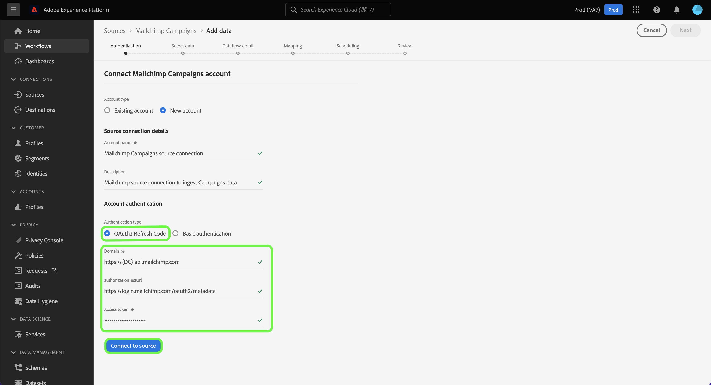

# Skapa en [!DNL Mailchimp Campaigns] källanslutning med plattformsgränssnitt

Den här självstudiekursen innehåller steg för att skapa en [!DNL Mailchimp] källkoppling till import [!DNL Mailchimp Campaigns] data till Adobe Experience Platform via användargränssnittet.

## Komma igång

Handboken kräver en fungerande förståelse av följande komponenter i Adobe Experience Platform:

* [Källor](../../../../home.md): Plattformen gör att data kan hämtas från olika källor samtidigt som du kan strukturera, märka och förbättra inkommande data med [!DNL Platform] tjänster.
* [Sandlådor](../../../../../sandboxes/home.md): Plattformen innehåller virtuella sandlådor som partitionerar en enda plattformsinstans i separata virtuella miljöer för att utveckla och utveckla program för digitala upplevelser.

## Samla in nödvändiga inloggningsuppgifter

För att kunna ta med [!DNL Mailchimp Campaigns] data till plattformen måste du först ange lämpliga autentiseringsuppgifter som motsvarar dina [!DNL Mailchimp] konto.

The [!DNL Mailchimp Campaigns] Källan har stöd för både OAuth 2-uppdateringskod och grundläggande autentisering. Se tabellerna nedan för mer information om dessa autentiseringstyper.

### OAuth 2-uppdateringskod

| Autentiseringsuppgifter | Beskrivning |
| --- | --- |
| Domän | Den rot-URL som används för att ansluta till MailChimp API. Formatet för rot-URL:en är `https://{DC}.api.mailchimp.com`, där `{DC}` representerar det datacenter som motsvarar ditt konto. |
| Verifieringstestets URL | Verifieringstestets URL används för att validera autentiseringsuppgifter vid anslutning [!DNL Mailchimp] till Platform. Om detta inte anges kontrolleras autentiseringsuppgifterna automatiskt när du skapar en källanslutning i stället. |
| Åtkomsttoken | Motsvarande åtkomsttoken som används för att autentisera källan. Detta krävs för OAuth-baserad autentisering. |

Mer information om hur du använder OAuth 2 för att autentisera [!DNL Mailchimp] konto till plattform, se detta [[!DNL Mailchimp] dokument om att använda OAuth 2](https://mailchimp.com/developer/marketing/guides/access-user-data-oauth-2/).

### Grundläggande autentisering

| Autentiseringsuppgifter | Beskrivning |
| --- | --- |
| Domän | Den rot-URL som används för att ansluta till MailChimp API. Formatet för rot-URL:en är `https://{DC}.api.mailchimp.com`, där `{DC}` representerar det datacenter som motsvarar ditt konto. |
| Användarnamn | Användarnamnet som motsvarar ditt MailChimp-konto. Detta krävs för grundläggande autentisering. |
| Lösenord | Lösenordet som motsvarar ditt MailChimp-konto. Detta krävs för grundläggande autentisering. |

## Koppla samman [!DNL Mailchimp Campaigns] konto till plattform

Välj **[!UICONTROL Sources]** från det vänstra navigeringsfältet för att komma åt [!UICONTROL Sources] arbetsyta. The [!UICONTROL Catalog] visas en mängd olika källor som du kan använda för att skapa ett konto.

Du kan välja lämplig kategori i katalogen till vänster på skärmen. Du kan också hitta den källa du vill arbeta med med med sökalternativet.

Under [!UICONTROL Marketing automation] kategori, välj **[!UICONTROL Mailchimp Campaign]** och sedan markera **[!UICONTROL Add data]**.

The **[!UICONTROL Connect Mailchimp Campaigns account]** visas. På den här sidan kan du välja om du ska öppna ett befintligt konto eller välja att skapa ett nytt konto.

### Befintligt konto

Om du vill använda ett befintligt konto väljer du [!DNL Mailchimp Campaigns] konto som du vill skapa ett nytt dataflöde med och sedan välja **[!UICONTROL Next]** för att fortsätta.

### Nytt konto

Om du skapar ett nytt konto väljer du **[!UICONTROL New account]** och ange sedan ett namn och en beskrivning av [!DNL Mailchimp Campaigns] källanslutningsinformation.

#### Autentisera med OAuth 2

Om du vill använda OAuth 2 väljer du [!UICONTROL OAuth 2 Refresh Code], anger värden för din domän, verifieringstest-URL och åtkomsttoken och väljer sedan **[!UICONTROL Connect to source]**. Låt inloggningsuppgifterna valideras under en stund och välj sedan **[!UICONTROL Next]** för att fortsätta.

#### Autentisera med grundläggande autentisering

Om du vill använda grundläggande autentisering väljer du [!UICONTROL Basic authentication], anger värden för din domän, ditt användarnamn och lösenord och väljer sedan **[!UICONTROL Connect to source]**. Låt inloggningsuppgifterna valideras under en stund och välj sedan **[!UICONTROL Next]** för att fortsätta.

### Välj [!DNL Mailchimp Campaigns] data

När källan har autentiserats måste du ange `campaignId` som motsvarar dina [!DNL Mailchimp Campaigns] konto.

På [!UICONTROL Select data] sida, ange `campaignId` och sedan markera **[!UICONTROL Explore]**.

Sidan uppdateras till ett interaktivt schematräd där du kan utforska och inspektera datahierarkin. Välj **[!UICONTROL Next]** för att fortsätta.

## Nästa steg

Med [!DNL Mailchimp] kontot autentiseras och [!DNL Mailchimp Campaigns] markerade data kan du nu börja skapa ett dataflöde för att överföra dina data till plattformen. Detaljerade anvisningar om hur du skapar ett dataflöde finns i dokumentationen om [skapa ett dataflöde för att ta fram automatiserade marknadsföringsdata för plattformen](../../dataflow/marketing-automation.md).
