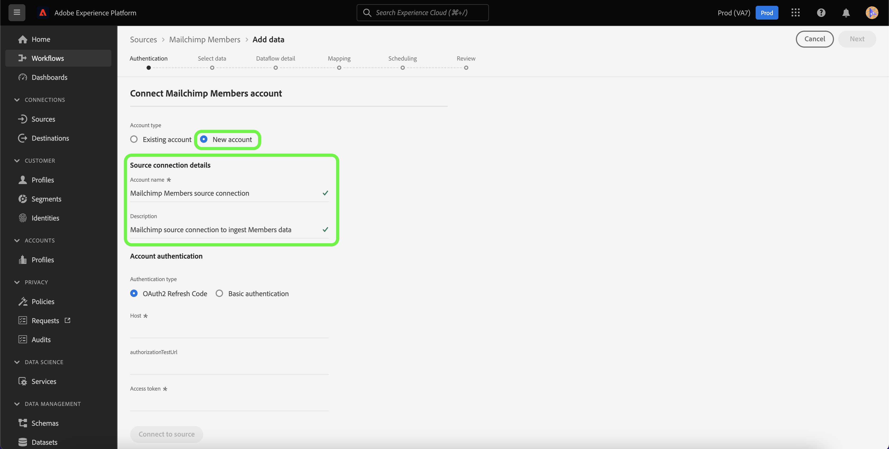

# Skapa en [!DNL Mailchimp Members]-källanslutning med Experience Platform UI

I den här självstudiekursen beskrivs hur du skapar en [!DNL Mailchimp]-källanslutning för import av [!DNL Mailchimp Members]-data till Adobe Experience Platform med användargränssnittet.

## Komma igång

Handboken kräver en fungerande förståelse av följande komponenter i Adobe Experience Platform:

* [Källor](../../../../home.md): Med Experience Platform kan data hämtas från olika källor samtidigt som du kan strukturera, etikettera och förbättra inkommande data med hjälp av [!DNL Experience Platform]-tjänster.
* [Sandlådor](../../../../../sandboxes/home.md): Experience Platform tillhandahåller virtuella sandlådor som partitionerar en enda Experience Platform-instans till separata virtuella miljöer för att utveckla och utveckla program för digitala upplevelser.

## Samla in nödvändiga inloggningsuppgifter

För att kunna överföra dina [!DNL Mailchimp Members]-data till Experience Platform måste du först ange de autentiseringsuppgifter som motsvarar ditt [!DNL Mailchimp]-konto.

Källan [!DNL Mailchimp Members] stöder både OAuth 2-uppdateringskod och grundläggande autentisering. Se tabellerna nedan för mer information om dessa autentiseringstyper.

### OAuth 2-uppdateringskod

| Referenser | Beskrivning |
| --- | --- |
| Domän | Den rot-URL som används för att ansluta till MailChimp API. Formatet för rot-URL:en är `https://{DC}.api.mailchimp.com`, där `{DC}` representerar det datacenter som motsvarar ditt konto. |
| Verifieringstestets URL | Verifieringstestets URL används för att verifiera autentiseringsuppgifter vid anslutning av [!DNL Mailchimp] till Experience Platform. Om detta inte anges kontrolleras autentiseringsuppgifterna automatiskt när källanslutningen skapas. |
| Åtkomsttoken | Motsvarande åtkomsttoken som används för att autentisera källan. Detta krävs för OAuth-baserad autentisering. |

Mer information om hur du använder OAuth 2 för att autentisera ditt [!DNL Mailchimp]-konto för Experience Platform finns i det här [[!DNL Mailchimp] dokumentet om att använda OAuth 2](https://mailchimp.com/developer/marketing/guides/access-user-data-oauth-2/).

### Grundläggande autentisering

| Referenser | Beskrivning |
| --- | --- |
| Domän | Den rot-URL som används för att ansluta till MailChimp API. Formatet för rot-URL:en är `https://{DC}.api.mailchimp.com`, där `{DC}` representerar det datacenter som motsvarar ditt konto. |
| Användarnamn | Användarnamnet som motsvarar ditt MailChimp-konto. Detta krävs för grundläggande autentisering. |
| Lösenord | Lösenordet som motsvarar ditt MailChimp-konto. Detta krävs för grundläggande autentisering. |

## Anslut ditt [!DNL Mailchimp Members]-konto till Experience Platform

I Experience Platform-gränssnittet väljer du **[!UICONTROL Sources]** i det vänstra navigeringsfältet för att komma åt arbetsytan i [!UICONTROL Sources]. På skärmen [!UICONTROL Catalog] visas en mängd olika källor som du kan använda för att skapa ett konto.

Du kan välja lämplig kategori i katalogen till vänster på skärmen. Du kan också hitta den källa du vill arbeta med med med sökalternativet.

Under kategorin [!UICONTROL Marketing automation] väljer du **[!UICONTROL Mailchimp Campaign]** och sedan **[!UICONTROL Add data]**.

Sidan **[!UICONTROL Connect Mailchimp Campaigns account]** visas. På den här sidan kan du välja om du ska öppna ett befintligt konto eller välja att skapa ett nytt konto.

### Befintligt konto

Om du vill använda ett befintligt konto väljer du det [!DNL Mailchimp Members]-konto som du vill skapa ett nytt dataflöde med och väljer sedan **[!UICONTROL Next]** för att fortsätta.

### Nytt konto

Om du skapar ett nytt konto väljer du **[!UICONTROL New account]** och anger sedan ett namn och en beskrivning för din [!DNL Mailchimp Members]-källanslutningsinformation.

#### Autentisera med OAuth 2

Om du vill använda OAuth 2 väljer du [!UICONTROL OAuth 2 Refresh Code], anger värden för din domän, auktoriseringstestets URL och åtkomsttoken och väljer sedan **[!UICONTROL Connect to source]**. Låt autentiseringsuppgifterna valideras under en stund och välj sedan **[!UICONTROL Next]** för att fortsätta.

#### Autentisera med grundläggande autentisering

Om du vill använda grundläggande autentisering väljer du [!UICONTROL Basic authentication], anger värden för din domän, ditt användarnamn och lösenord och väljer sedan **[!UICONTROL Connect to source]**. Låt autentiseringsuppgifterna valideras under en stund och välj sedan **[!UICONTROL Next]** för att fortsätta.

### Välj [!DNL Mailchimp Members] data

När källan har autentiserats måste du ange den `listId` som motsvarar ditt [!DNL Mailchimp Members]-konto.

Ange `listId` på sidan [!UICONTROL Select data] och välj sedan **[!UICONTROL Explore]**.

Sidan uppdateras till ett interaktivt schematräd där du kan utforska och inspektera datahierarkin. Välj **[!UICONTROL Next]** om du vill fortsätta.

## Nästa steg

När ditt [!DNL Mailchimp]-konto är autentiserat och dina [!DNL Mailchimp Members]-data har valts kan du nu börja skapa ett dataflöde för att överföra dina data till Experience Platform. Detaljerade steg om hur du skapar ett dataflöde finns i dokumentationen om [att skapa ett dataflöde för att överföra automatiserade marknadsföringsdata till Experience Platform](../../dataflow/marketing-automation.md).
