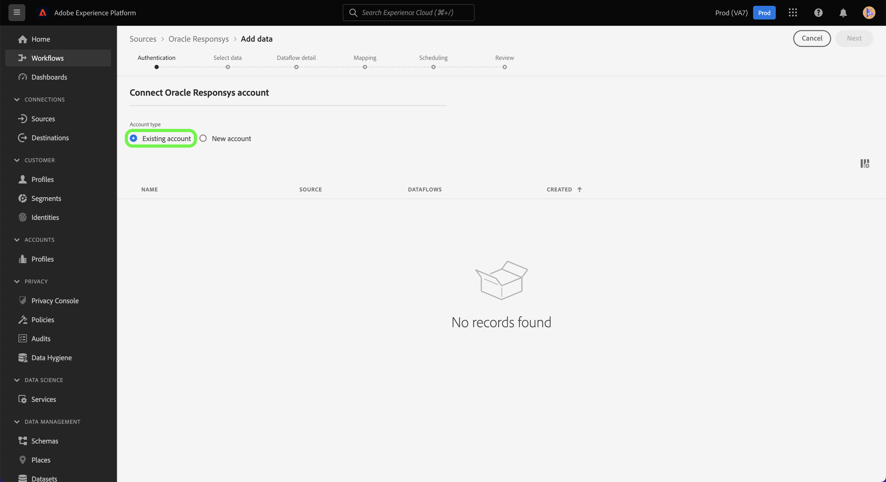
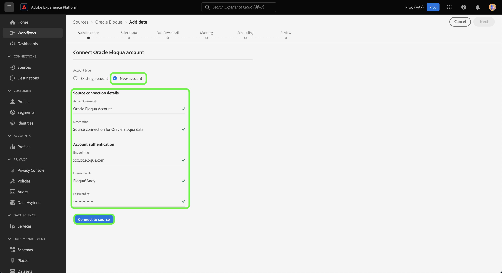

# (Beta) Skapa en [!DNL Oracle Responsys]-källanslutning med hjälp av plattformsgränssnittet

>[!NOTE]
>
>Källan [!DNL Oracle Responsys] är i betaversion. Mer information om hur du använder betatecknade anslutningar finns i [Källöversikt](../../../../home.md#terms-and-conditions).

I den här självstudiekursen får du anvisningar om hur du skapar en [[!DNL Oracle Responsys]](../../../../connectors/marketing-automation/oracle-responsys.md)-källanslutning med Adobe Experience Platform användargränssnitt.

## Komma igång

Handboken kräver en fungerande förståelse av följande plattformskomponenter:

* [Källor](../../../../home.md): Med plattformen kan data hämtas från olika källor samtidigt som du kan strukturera, etikettera och förbättra inkommande data med hjälp av plattformstjänster.
* [Sandlådor](../../../../../sandboxes/home.md): Plattformen innehåller virtuella sandlådor som partitionerar en enda plattformsinstans i separata virtuella miljöer för att utveckla och utveckla program för digitala upplevelser.

Om du redan har ett autentiserat [!DNL Oracle Responsys]-konto på Platform kan du hoppa över resten av det här dokumentet och gå vidare till självstudiekursen om att [skapa ett dataflöde för att få ut data för automatiserad marknadsföring till Platform](../../dataflow/marketing-automation.md).

### Samla in nödvändiga inloggningsuppgifter

För att kunna ansluta [!DNL Oracle Responsys] till plattformen måste du ange värden för följande autentiseringsegenskaper:

| Autentiseringsuppgifter | Beskrivning |
| --- | --- |
| Slutpunkt | URL:en för REST-autentiseringsslutpunkten för din [!DNL Oracle Responsys]-instans. |
| Klient-ID | Klient-ID för din [!DNL Oracle Responsys]-instans. |
| Klienthemlighet | Klienthemligheten för din [!DNL Oracle Responsys]-instans. |

Mer information om autentiseringsuppgifter för [!DNL Oracle Responsys] finns i [[!DNL Oracle Responsys] handboken om autentisering](https://docs.oracle.com/en/cloud/saas/marketing/responsys-develop/API/GetStarted/authentication.htm).

När du har samlat in de nödvändiga inloggningsuppgifterna kan du följa stegen nedan för att länka ditt [!DNL Oracle Responsys]-konto till plattformen.

## Anslut ditt [!DNL Oracle Responsys]-konto

I plattformsgränssnittet väljer du **[!UICONTROL Sources]** i den vänstra navigeringen för att komma åt arbetsytan i [!UICONTROL Sources]. På skärmen [!UICONTROL Catalog] visas en mängd olika källor som du kan använda för att skapa ett konto.

Du kan välja lämplig kategori i katalogen till vänster på skärmen. Du kan också hitta den källa du vill arbeta med med med sökalternativet.

Under kategorin [!UICONTROL Marketing automation] väljer du **[!UICONTROL Oracle Responsys]** och sedan **[!UICONTROL Add data]**.

Sidan **[!UICONTROL Connect Oracle Responsys account]** visas. På den här sidan kan du antingen använda nya autentiseringsuppgifter eller befintliga.

### Befintligt konto

Om du vill använda ett befintligt konto väljer du det [!DNL Oracle Responsys]-konto som du vill skapa ett nytt dataflöde med och väljer sedan **[!UICONTROL Next]** för att fortsätta.

### Nytt konto

Om du vill skapa ett nytt konto väljer du **[!UICONTROL New account]** och anger sedan ett namn, en valfri beskrivning och lämpliga värden för dina [!DNL Oracle Responsys]-autentiseringsuppgifter. När du är klar väljer du **[!UICONTROL Connect to source]** och tillåt sedan lite tid för att upprätta den nya anslutningen.

## Nästa steg

Genom att följa den här självstudiekursen har du autentiserat och skapat en källanslutning mellan ditt [!DNL Oracle Responsys]-konto och din plattform. Du kan nu fortsätta med nästa självstudiekurs och [skapa ett dataflöde för att överföra data för automatiserad marknadsföring till plattformen](../../dataflow/marketing-automation.md).
