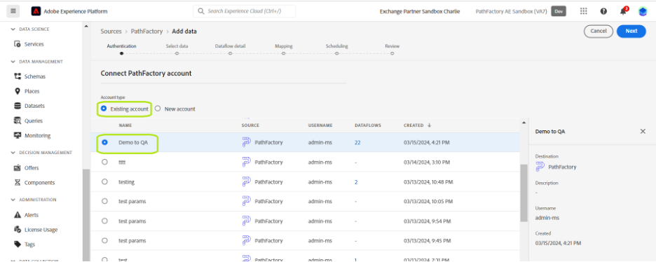

# Anslut ditt [!DNL PathFactory]-konto till Experience Platform via användargränssnittet

I den här självstudiekursen beskrivs hur du ansluter [!DNL PathFactory]-besökare, sessioner och sidvyer till Adobe Experience Platform via användargränssnittet.

## Komma igång

Den här självstudiekursen kräver en fungerande förståelse av följande komponenter i Experience Platform:

* [[!DNL Experience Data Model (XDM)] System](../../../../../xdm/home.md): Det standardiserade ramverk som [!DNL Experience Platform] organiserar kundupplevelsedata med.
   * [Grundläggande om schemakomposition](../../../../../xdm/schema/composition.md): Lär dig mer om grundstenarna i XDM-scheman, inklusive nyckelprinciper och bästa metoder för schemakomposition.
   * [Schemaredigeraren, självstudiekurs](../../../../../xdm/tutorials/create-schema-ui.md): Lär dig hur du skapar anpassade scheman med hjälp av gränssnittet för Schemaredigeraren.
* [[!DNL Real-Time Customer Profile]](../../../../../profile/home.md): Tillhandahåller en enhetlig konsumentprofil i realtid baserad på aggregerade data från flera källor.

Om du redan har ett [!DNL PathFactory]-konto kan du hoppa över resten av det här dokumentet och gå vidare till självstudiekursen om hur du [skickar data för automatiserad marknadsföring till Experience Platform med användargränssnittet](../../dataflow/marketing-automation.md).

### Samla in nödvändiga autentiseringsuppgifter {#gather-credentials}

För att få åtkomst till ditt PathFactory-konto på plattformen måste du ange följande värden:

| Autentiseringsuppgifter | Beskrivning |
| ---------- | ----------- |
| Användarnamn | Ditt användarnamn för PathFactory-kontot. Detta är nödvändigt för att identifiera ditt konto i systemet. |
| Lösenord | Lösenordet som är kopplat till ditt PathFactory-konto. Säkerställ att detta skyddas för att förhindra obehörig åtkomst. |
| Domän | Domänen som är associerad med ditt PathFactory-konto. Detta refererar vanligtvis till den unika identifieraren i din PathFactory-URL. |
| Åtkomsttoken | En unik token som används för API-autentisering för att säkerställa säker kommunikation mellan dina system och PathFactory. |
| API-slutpunkter | Särskilda API-slutpunkter för dataåtkomst: Besökare, sessioner och sidvyer. Varje slutpunkt motsvarar olika datauppsättningar som du kan hämta. **Obs!** Dessa är fördefinierade av [!DNL PathFactory] och är specifika för de data som du vill komma åt: <ul><li>**Slutpunkt för besökare**: `/api/public/v3/data_lake_apis/visitors.json`</li><li>**Sessionsslutpunkt**: `/api/public/v3/data_lake_apis/sessions.json`</li><li>**Slutpunkt för sidvyer**: `/api/public/v3/data_lake_apis/page_views.json`</li></ul> |

Detaljerad vägledning om hur du skyddar och använder dina inloggningsuppgifter och information om hur du hämtar och uppdaterar din åtkomsttoken finns på [PathFactory Support Center](https://support.pathfactory.com/categories/adobe/). Den här resursen innehåller omfattande guider om hur du hanterar dina inloggningsuppgifter och säkerställer effektiv och säker API-integrering.

## Anslut ditt [!DNL PathFactory]-konto

I plattformsgränssnittet väljer du **[!UICONTROL Sources]** i den vänstra navigeringen för att komma åt arbetsytan i [!UICONTROL Sources]. [!UICONTROL Catalog] visar en mängd olika källor som stöds av Experience Platform.

Du kan välja lämplig kategori i listan med kategorier. Du kan också använda sökfältet för att filtrera efter en viss källa.

Under kategorin [!UICONTROL Marketing automation] väljer du **[!UICONTROL PathFactory]** och sedan **[!UICONTROL Set up]**.

Sidan **[!UICONTROL Connect to PathFactory]** visas. På den här sidan kan du antingen skapa ett nytt konto eller använda ett befintligt konto.

### Nytt konto

Om du vill skapa ett nytt konto väljer du **[!UICONTROL New account]** och anger ett namn för ditt konto, en valfri beskrivning och autentiseringsuppgifter som motsvarar ditt [!DNL PathFactory]-konto.

När du är klar väljer du **[!UICONTROL Connect to source]** och tillåt sedan lite tid för att upprätta den nya anslutningen.

### Befintligt konto

Om du redan har ett befintligt konto väljer du **[!UICONTROL Existing account]** och sedan det konto som du vill använda i listan som visas.

## Nästa steg

Genom att följa den här självstudiekursen har du upprättat en anslutning mellan ditt [!DNL PathFactory]-konto och Experience Platform. Du kan nu fortsätta med nästa självstudiekurs och [skapa ett dataflöde för att få in data för automatiserad marknadsföring i Experience Platform](../../dataflow/marketing-automation.md).
